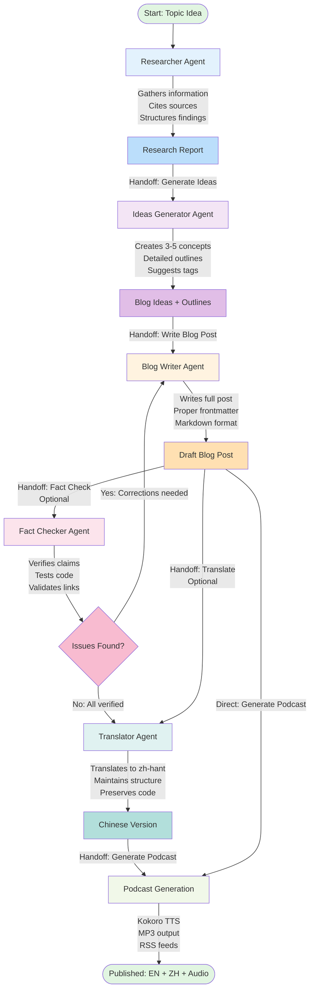
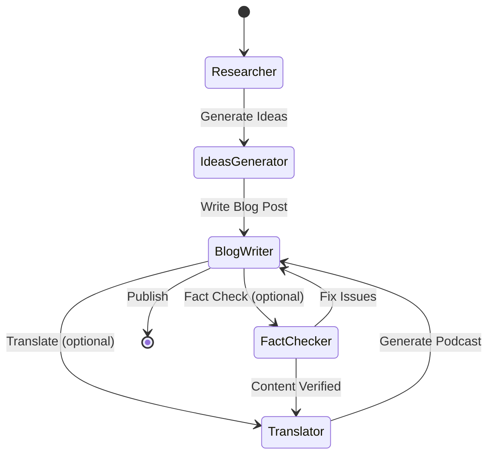
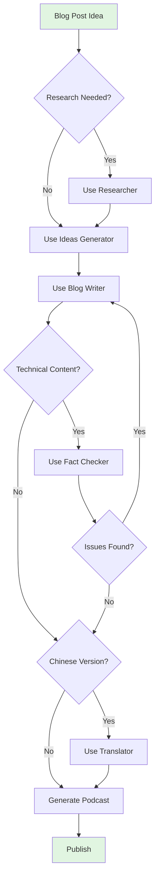

# Agentic Blog Generation Workflow

This document visualizes the custom agents workflow for blog post generation.

## Workflow Diagram



## Agent Roles

| Agent               | Primary Role          | Key Outputs                        | Tools Used                |
| ------------------- | --------------------- | ---------------------------------- | ------------------------- |
| **Researcher**      | Information gathering | Research reports, source citations | fetch, githubRepo, search |
| **Ideas Generator** | Ideation & outlining  | Blog concepts, detailed outlines   | search                    |
| **Blog Writer**     | Content creation      | Complete blog posts, frontmatter   | edit, search, runCommands |
| **Fact Checker**    | Quality assurance     | Accuracy reports, corrections      | fetch, githubRepo, search |
| **Translator**      | Localization          | Chinese versions                   | edit, search, problems    |

## Handoff Flow



## Workflow Variations

### 1. Full Pipeline (Recommended for Technical Posts)

```
Research → Ideas → Write → Fact Check → Translate → Podcast → Publish
```

**Use when**:

- New technical topics
- Code-heavy content
- Need bilingual support
- High accuracy required

### 2. Quick Write (For Opinion/Analysis)

```
Ideas → Write → Translate → Podcast → Publish
```

**Use when**:

- Topic already familiar
- Opinion pieces
- Less technical content
- Faster turnaround needed

### 3. Research-First (For Complex Topics)

```
Research → Research → Research → Ideas → Write → Fact Check → Publish
```

**Use when**:

- Unfamiliar territory
- Need deep understanding
- Multiple aspects to explore
- Building knowledge base

### 4. English-Only (Fast Track)

```
Ideas → Write → Podcast → Publish
```

**Use when**:

- Time-sensitive content
- English-only audience
- Simple updates
- News/announcements

## Decision Points



## Time Estimates

| Workflow Stage            | Estimated Time | Can Be Automated     |
| ------------------------- | -------------- | -------------------- |
| Research                  | 10-20 min      | ✅ Yes (agent)       |
| Idea Generation           | 5-10 min       | ✅ Yes (agent)       |
| Writing                   | 15-30 min      | ✅ Yes (agent)       |
| Fact Checking             | 10-15 min      | ✅ Yes (agent)       |
| Translation               | 10-15 min      | ✅ Yes (agent)       |
| Podcast Generation        | 2-5 min        | ✅ Yes (automated)   |
| **Total (Full Pipeline)** | **52-95 min**  | **Mostly automated** |

_Note: Times vary based on topic complexity and content length_

## Best Practices by Workflow Type

### For Technical Tutorials

✅ Always use: Researcher → Fact Checker
✅ Include: Code examples, version numbers
✅ Verify: All commands and APIs
✅ Translate: Include if Chinese audience

### For Opinion/Analysis Posts

✅ Optional: Researcher (for supporting data)
✅ Always: Fact Checker (verify claims)
✅ Focus: Clear arguments, personal voice
✅ Translate: Great for thought leadership

### For News/Updates

✅ Speed: Skip research if timely
✅ Accuracy: Still fact-check claims
✅ Length: Can be shorter (500+ words)
✅ Podcast: Quick updates work well

### For Deep Dives

✅ Research: Multiple rounds recommended
✅ Structure: Use detailed outlines
✅ Length: 1500+ words acceptable
✅ Quality: Full fact-checking essential

## Error Recovery

If something goes wrong at any stage:

1. **Research Issues**: Re-run with more specific prompts
2. **Writing Problems**: Provide more outline detail
3. **Fact-Check Failures**: Return to writer with corrections
4. **Translation Errors**: Check YAML syntax, verify frontmatter
5. **Podcast Generation**: Run `uv sync`, check models

## Monitoring Progress

Use handoff buttons to:

- ✅ Review output before proceeding
- ✅ Make manual adjustments if needed
- ✅ Choose alternative paths
- ✅ Maintain control over quality

## Next Steps

Ready to start? See [`README.md`](./README.md) for:

- Detailed agent descriptions
- Setup instructions
- Sample prompts
- Customization tips

---

**Pro Tip**: Start with the full pipeline for your first post to understand how each agent works, then optimize for your specific needs! 🚀
