# AstroPaper 📄


[](https://conventionalcommits.org)
[](http://commitizen.github.io/cz-cli/)

---

AstroPaper is a minimal, responsive, accessible and SEO-friendly Astro blog theme. This theme is designed and crafted based on [my personal blog](https://satnaing.dev/blog).

This theme follows best practices and provides accessibility out of the box. Light and dark mode are supported by default. Moreover, additional color schemes can also be configured.

This theme is self-documented \_ which means articles/posts in this theme can also be considered as documentations. Read [the blog posts](https://astro-paper.pages.dev/posts/) or check [the README Documentation Section](#-documentation) for more info.

## 🔥 Features

- [x] type-safe markdown
- [x] super fast performance
- [x] accessible (Keyboard/VoiceOver)
- [x] responsive (mobile ~ desktops)
- [x] SEO-friendly
- [x] light & dark mode
- [x] fuzzy search
- [x] draft posts & pagination
- [x] sitemap & rss feed
- [x] followed best practices
- [x] highly customizable
- [x] dynamic OG image generation for blog posts [#15](https://github.com/satnaing/astro-paper/pull/15) ([Blog Post](https://astro-paper.pages.dev/posts/dynamic-og-image-generation-in-astropaper-blog-posts/))
- [x] **🎙️ podcast editions** - Audio versions and RSS feeds are published from the separate [cmwen/podcasts](https://github.com/cmwen/podcasts) repository
- [x] **📊 Mermaid diagram support** - Create flowcharts, sequence diagrams, and more in markdown ([See guide](docs/MERMAID_GUIDE.md))

_Note: I've tested screen-reader accessibility of AstroPaper using **VoiceOver** on Mac and **TalkBack** on Android. I couldn't test all other screen-readers out there. However, accessibility enhancements in AstroPaper should be working fine on others as well._

## ✅ Lighthouse Score

<p align="center">
  <a href="https://pagespeed.web.dev/report?url=https%3A%2F%2Fastro-paper.pages.dev%2F&form_factor=desktop">
    
  <a>
</p>

## 🚀 Project Structure

Inside of AstroPaper, you'll see the following folders and files:

```bash
/
├── public/
│   ├── assets/
│   │   └── logo.svg
│   │   └── logo.png
│   └── favicon.svg
│   └── astropaper-og.jpg
│   └── robots.txt
│   └── toggle-theme.js
├── src/
│   ├── assets/
│   │   └── socialIcons.ts
│   ├── components/
│   ├── content/
│   │   |  blog/
│   │   |    └── some-blog-posts.md
│   │   └── config.ts
│   ├── layouts/
│   └── pages/
│   └── styles/
│   └── utils/
│   └── config.ts
│   └── types.ts
└── package.json
```

Astro looks for `.astro` or `.md` files in the `src/pages/` directory. Each page is exposed as a route based on its file name.

Any static assets, like images, can be placed in the `public/` directory.

All blog posts are stored in `src/content/blog` directory.

## 📖 Documentation

Documentation can be read in two formats\_ _markdown_ & _blog post_.

- Configuration - [markdown](src/content/blog/how-to-configure-astropaper-theme.md) | [blog post](https://astro-paper.pages.dev/posts/how-to-configure-astropaper-theme/)
- Add Posts - [markdown](src/content/blog/adding-new-post.md) | [blog post](https://astro-paper.pages.dev/posts/adding-new-posts-in-astropaper-theme/)
- Customize Color Schemes - [markdown](src/content/blog/customizing-astropaper-theme-color-schemes.md) | [blog post](https://astro-paper.pages.dev/posts/customizing-astropaper-theme-color-schemes/)
- Predefined Color Schemes - [markdown](src/content/blog/predefined-color-schemes.md) | [blog post](https://astro-paper.pages.dev/posts/predefined-color-schemes/)

> For AstroPaper v1, check out [this branch](https://github.com/satnaing/astro-paper/tree/astro-paper-v1) and this [live URL](https://astro-paper-v1.astro-paper.pages.dev/)

## 💻 Tech Stack

# cmwen.github.io

Personal blog built with AstroPaper (Astro + TypeScript + React + TailwindCSS). Focused on AI-assisted development, agent systems, and practical engineering playbooks.

## Tech

- Astro, React, TypeScript, TailwindCSS
- Content collections with frontmatter validation (`src/content/config.ts`)
- Client search via FuseJS
- Dynamic OG images
- Vendored OG fonts (IBM Plex Mono, Noto Sans TC) under `src/assets/fonts` for reliable multilingual rendering

## Project structure

- Posts: `src/content/blog/`
- Pages: `src/pages/`
- Layouts: `src/layouts/`
- Components: `src/components/`
- Utilities: `src/utils/`

## Local development

Use pnpm for all commands.

```bash
pnpm install
pnpm run dev
# open http://localhost:4321
```

Build and preview:

```bash
pnpm run build
pnpm run preview
```

Formatting and linting:

```bash
pnpm run format:check
pnpm run format
pnpm run lint
```

## Writing a post

Create a Markdown file in `src/content/blog/` with required frontmatter:

```yaml
---
title: Your title
description: One-line description
pubDatetime: 2025-08-26
author: Your name
tags: [ai, agents]
featured: false
draft: false
---
```

Images go in `public/` or reference external URLs. Draft posts are excluded from build.

## CI/CD

GitHub Actions builds and deploys to `gh-pages` and runs basic Playwright smoke tests (see `.github/workflows/`). Use `pnpm run cz` for conventional commit messages.

## Automated dependency updates

Dependabot keeps the project evergreen by regularly checking for new releases:

- **npm (pnpm)** dependencies are reviewed weekly so Astro, AstroPaper, and other direct dependencies stay current.
- **GitHub Actions** workflows are refreshed weekly to pick up the latest CI features and fixes.

When Dependabot raises a pull request, run `pnpm install` locally to verify the lockfile and execute the relevant test suites before merging.

## License

MIT
Made with 🤍 by [Sat Naing](https://satnaing.dev) 👨🏻‍💻 and [contributors](https://github.com/satnaing/astro-paper/graphs/contributors).
