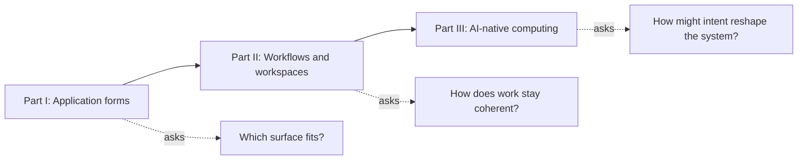

Software has traditionally asked us to begin with an application: open the right tool, locate the right object, then translate an outcome into that product's controls. AI creates another possible starting point. A person can state an intention first and let a system resolve context, choose capabilities, and assemble the next interaction.

This series asks what happens between those two models.

Its central thesis is not that applications disappear. **Applications become less cognitively dominant as their capabilities, authoritative objects, and specialised interfaces participate in workflows organised around human intent.** A command, Web App, visual canvas, contextual AI view, notification, and persistent workspace remain different instruments. AI can help select and coordinate them, but durable identity, permissions, deterministic actions, provenance, and human judgment still make the work trustworthy.

The eight essays move through three levels:

## Part I — Application Forms (01–03)

This part establishes that interface and deployment choices should follow the work, not fashion or internal implementation complexity.

### [01. Choosing the Right Application Interface](/posts/01-choosing-the-right-application-interface/)

The opening framework compares CLI, TUI, Web App, PWA, Desktop App, Browser Extension, and MCP through the user's uncertainty, the duration of the work, whether the task is symbolic or spatial, and whether the actor is human or software. Its practical conclusion is hybrid: one domain capability can honestly need several complementary surfaces.

### [02. Local Web Apps Are Underrated](/posts/02-local-web-apps-are-underrated/)

A browser interface does not imply SaaS. This article develops the Local Web App as a distinct form: a local executable owns data and machine access while serving a rich view over loopback. It covers process ownership, persistence, and security, and explains when shared state—not feature count—justifies graduating to a hosted service.

### [03. MCP Apps and the AI Interface Layer](/posts/03-mcp-apps-and-the-ai-interface-layer/)

Core MCP, MCP Apps, and full Web Apps solve different problems. Core MCP exposes structured AI-facing capabilities; MCP Apps add bounded interactive views inside compatible hosts; full applications remain durable destinations for navigation, collaboration, and sustained work. Reuse the domain model, not every pixel.

## Part II — From Apps to Workflows (04–07)

The second part changes the unit of design. It begins with durable objects, diagnoses the cost of app-centric fragmentation, then proposes workflow and workspace models that preserve specialist authority.

### [04. Why URLs Will Survive AI](/posts/04-why-urls-will-survive-ai/)

AI can make navigation optional without making identity obsolete. URLs remain a thin addressing layer through which people and machines identify, share, authorise, render, and revisit important resources. Consequential AI output should therefore become an addressable artefact rather than remain only prose in a private conversation.

### [05. The Tab Problem and App-Centric Fragmentation](/posts/05-the-tab-problem-and-app-centric-fragmentation/)

Too many tabs are the symptom, not the disease. A software change can be split across Jira, Figma, Confluence, Bitbucket, Bamboo, Teams, and a local terminal. Each system contains a valid partial truth, while the user pays a hidden context-reconstruction tax to reconnect identity, state, intent, action, attention, and authority.

### [06. The Workflow-Centric Workbench](/posts/06-the-workflow-centric-workbench/)

The proposed workbench makes an outcome the primary unit of orientation. It gathers intent, source-owned evidence, typed relationships, multidimensional state, and valid actions without becoming a new universal system of record. AI helps at uncertain semantic seams; deterministic links and source applications retain authority.

### [07. A Framework for Composable Workspaces](/posts/07-framework-for-composable-workspaces/)

Composition needs shared meaning, not just movable panels. This architectural framework defines six contracts—entities, data, actions, views, events, and intents—and four runtime components: workspace shell, context graph, panel runtime, and local daemon. It recommends starting with one workflow instead of attempting a universal operating system.

## Part III — AI-Native Computing (08)

The final essay looks further ahead while extending the earlier constraints rather than discarding them: AI-native does not mean chat-only, and intent-first does not mean interface-free.

### [08. Intent-First Computing Will Need More Than Chat](/posts/08-intent-first-computing-and-future-ui/)

Natural language can be an intent surface, but dense comparison, precise manipulation, proportionate attention, and durable state need other surfaces. The article proposes a flow in which AI resolves context, selects capabilities, and composes a governed interface; agents perform bounded work; humans handle consequential exceptions; and a persistent workspace preserves the result.

## What describes the present, and what explores the future?

Articles 01–05 primarily analyse choices and problems visible today: existing application forms, local deployment, MCP interface layers, durable URLs, and fragmented software workflows. Their technologies will evolve, but their questions are operational now.

Articles 06–07 are design proposals grounded in current primitives. A workflow workbench and the exact six-part workspace contract are not presented as established standards; they are frameworks for building and evaluating real systems without erasing provenance or source authority.

Article 08 deliberately combines present building blocks with author speculation. Mixed-initiative interaction and interactive AI views exist today. A general computer that reliably composes every task surface while preserving authority, accessibility, and recoverable state does not yet exist in the form imagined here.

## How to read the series

For the full argument, read sequentially. The series builds vocabulary in Part I, identifies the coordination problem in Part II, and only then makes the future-facing proposals in Part III.

For a problem-driven route:

- **Choosing a product surface:** read 01, then 02 for local visual tools and 03 for AI-hosted interaction.
- **Testing “AI will replace apps” claims:** read 03, 04, and 08. Together they distinguish capability access, durable destinations, and composed human interfaces.
- **Fixing fragmented delivery work:** begin with 05's diagnosis, continue to 06's workbench, then use 07 as an implementation vocabulary.
- **Designing an AI-native workspace:** read 04 for durable identity, 07 for semantic composition, and 08 for intent, attention, and exception handling.

The series ends without announcing the death of the app. Its more useful conclusion is that software can begin from intent while retaining the places, instruments, and boundaries that make complex work understandable.
