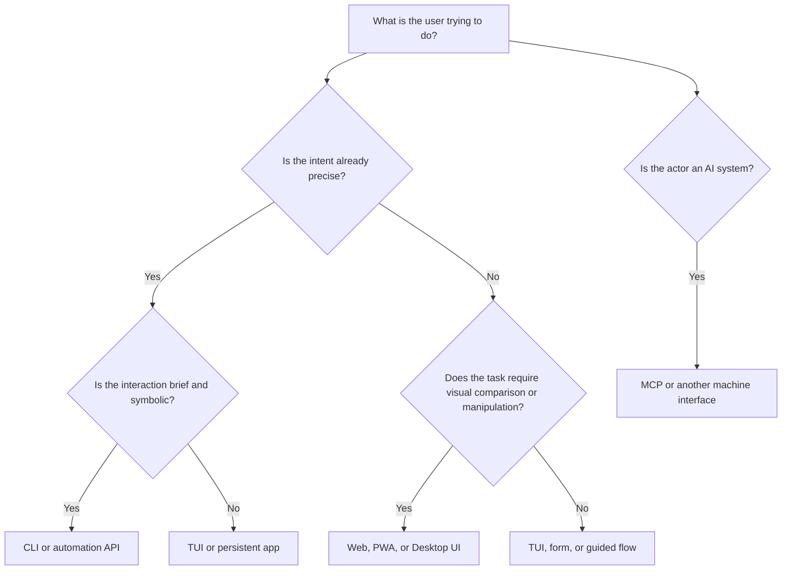

A familiar developer-tool story begins with one command:

```bash
mytool scan ./project
```

The command is useful, so its scope grows. Someone asks for a progress view. Someone else wants to compare previous scans. A team asks for shared access. Soon there is a React frontend, a server, authentication, a database, deployment infrastructure, and a backlog for the settings page.

None of those additions is necessarily wrong. The mistake happens earlier, when “more features” is treated as proof that the tool needs a more elaborate interface.

The internal complexity of an application does not determine its natural user interface. A compiler is extraordinarily complex and still works well as a command. Cropping one image is technically simple but often needs direct visual manipulation. The better question is: **what cognitive work must the user perform?**

My thesis is that interface choice should follow the shape of the user's decision: whether the intent is already known, whether the state must be explored, whether manipulation is visual or symbolic, whether the work is brief or sustained, and whether the actor is a human or software.

That framing makes CLI, TUI, Web App, PWA, Desktop App, Browser Extension, and MCP complementary surfaces rather than competitors in a tournament with one winner.

## Start with the user's uncertainty

The strongest first distinction is not simple versus complex. It is **recall versus recognition**.

When users already know the action and target, they can express an instruction:

```bash
resize photo.jpg --width 1200
deploy payments --environment staging
format src/
```

When users are uncertain, they need to inspect state, discover options, compare alternatives, or manipulate an object while seeing the result. “Resize this image to 1200 pixels” is command-shaped. “Find the crop that keeps the subject balanced in three aspect ratios” is visual and exploratory, even if both operations call the same image library.

Two more axes matter:

- **Momentary versus sustained work.** A short transformation can finish and disappear. Monitoring, editing, and investigation benefit from a persistent surface that preserves state.
- **Symbolic versus spatial work.** Names, flags, paths, and IDs fit text. Layout, colour, timelines, graphs, and side-by-side comparison benefit from visual structure and direct manipulation.

We can turn those distinctions into a small model:



This is a decision aid, not a rigid taxonomy. Real products often need several branches at once.

## When a CLI is the natural interface

A command-line interface is strongest when an operation can be reduced to **verb + target + a limited set of parameters**. It is especially effective when the output can become the input to another program, the operation must be repeated, or the exact invocation should be saved in a script or CI pipeline.

This composability is not an accidental convention. POSIX defines a shell as a command-language interpreter that parses commands, performs expansion and redirection, executes utilities, and returns exit status. Those shared rules let small tools participate in larger programs without agreeing on a graphical shell or application framework ([POSIX Shell Command Language](https://pubs.opengroup.org/onlinepubs/9799919799/utilities/V3_chap02.html)).

CLI is therefore a good default for transformations and automation:

- Create, convert, format, validate, migrate, download, or deploy something.
- Address files, repositories, environments, and other objects by stable identifiers.
- Run the same operation locally, remotely, or in CI.
- Produce structured output and meaningful exit codes.
- Expose an operation to developers who already understand the domain.

CLI becomes weak when users do not know the correct command, need to compare many objects, or must repeatedly reconstruct state from text. A command can expose one hundred flags, but that does not make those flags discoverable. Shell history is useful memory; it is not an information architecture.

The design warning is simple: do not turn a command into a Web App merely because its implementation grew, and do not keep adding flags when the user's work has become exploratory.

## TUI: persistent interaction without leaving the terminal

A terminal user interface is useful when the user wants keyboard efficiency and remote-friendly operation but needs more continuity than a single command provides.

Consider a deployment monitor. The user may need to move between services, inspect logs, filter failures, trigger a retry, and keep the current selection visible. A sequence of commands can perform each action, but a TUI preserves the working set and reduces the need to remember identifiers between invocations.

TUIs naturally fit:

- Log and process viewers.
- Cluster, container, and infrastructure managers.
- Database and queue inspectors.
- Git clients and file managers.
- Long-running agent or job supervisors.

Their limits are also structural. Dense charts, free-form canvases, rich text editing, drag-and-drop, accessibility across diverse assistive technologies, and touch-first interaction are harder. A TUI is not a cheaper Web App; it is a persistent terminal surface with a different interaction vocabulary.

## Web App: exploration, collaboration, and shared state

A Web App is a strong choice when users must explore a domain, manage many entities, collaborate, or reach the same system across organisations and devices. Tables, forms, filters, diagrams, history, comments, and permission-aware views are all natural web material.

The Web also provides more than pixels. A URL can identify a project, build, document, or decision. Authentication and permissions can be applied at a shared destination. A teammate can open the same reference without installing the same native package. Those properties will matter later in this series when we ask why Web Apps are likely to survive AI.

However, a Web App is not synonymous with SaaS. A tool can start a server on `localhost`, keep all data on the user's machine, and use the browser only as its rendering and interaction layer:

```bash
mytool ui

# Opens http://127.0.0.1:4310
```

That pattern can provide charts, searchable history, and forms without immediately introducing accounts, multi-tenancy, or cloud storage. The next article will examine this underrated Local Web App model in detail.

Choose a Web App when the browser's strengths match the work. Do not choose it only because the team already knows React.

## PWA: a Web App with an installable relationship

A Progressive Web App is still a Web application. Its important difference is the relationship it can establish with the device and user: an application manifest can define launch metadata, icons, scope, and display mode, while user agents may present an installable, standalone experience. The current W3C manifest specification explicitly describes a JSON format for startup parameters and a URL scope, including deep-link behaviour ([W3C Web Application Manifest](https://www.w3.org/TR/appmanifest/)).

PWA is a good fit when a service:

- Should work across desktop and mobile from one Web codebase.
- Benefits from installation, an application icon, or a standalone window.
- Needs some offline or resilient behaviour.
- Is used regularly rather than visited once.
- Can tolerate browser- and platform-dependent capability differences.

The last point is essential. “PWA” does not guarantee uniform native integration. Installation flows and available capabilities vary by browser and operating system; even Google's PWA guidance documents platform-specific installation behaviour ([web.dev: PWA installation](https://web.dev/learn/pwa/installation)). If the product depends on deep OS integration, a PWA should be validated against the actual target platforms rather than selected from a generic checklist.

## Desktop App: when the operating system is part of the product

A Desktop App is natural when the application needs a durable local presence and the operating system is part of its functional boundary.

Examples include an IDE, terminal, video editor, password manager, virtualisation tool, or local AI workbench. These products may need filesystem access, multiple windows, global shortcuts, background processes, native menus, hardware acceleration, device integration, or reliable offline operation.

The price is distribution and lifecycle complexity. Installation, updates, code signing, platform differences, security hardening, and native integration all become product responsibilities. Electron, Tauri, and native toolkits change the engineering trade-offs, but they do not change the interface question. “Desktop” describes the application's relationship with the machine; it does not tell us whether the internal UI should be a document, canvas, dashboard, terminal, or chat.

A useful escalation rule is to begin with the lightest surface that satisfies the work, then adopt a desktop shell when concrete OS requirements appear. “It might need native access one day” is not yet a requirement.

## Browser Extension: when the current page is the context

A Browser Extension is strongest when the user's task begins inside another website. Its value is contextual: it can add a control to the browser, inject a content script into a page, react to browser events, or provide a popup or side panel. MDN's extension architecture separates these pieces explicitly—manifest metadata, background scripts, extension pages, and content scripts running in the context of web pages ([MDN: Anatomy of an extension](https://developer.mozilla.org/en-US/docs/Mozilla/Add-ons/WebExtensions/Anatomy_of_a_WebExtension)).

Natural extension use cases include:

- Capturing the current page into a notes or research system.
- Enhancing a specific site's workflow.
- Comparing information across open pages.
- Filling or transforming content with explicit user control.
- Connecting a page to a local developer tool.

An extension is a poor default for an application whose core experience does not depend on browser context. It inherits permission concerns, browser policy, extension-store review, and platform differences. The more permissions it requests, the more carefully its value and trust model must be explained.

## MCP: an interface for AI, not a replacement GUI

MCP belongs in this comparison only if we keep its category clear. A Model Context Protocol server does not, by itself, provide a human user interface. It exposes capabilities and context to an AI application through a client-server protocol.

The official architecture describes tools, resources, and prompts as core server primitives. Tools perform actions, resources supply contextual data, and prompts provide reusable interaction templates. Hosts discover supported capabilities and decide how to make them available to models and users ([MCP architecture overview](https://modelcontextprotocol.io/docs/learn/architecture)).

MCP is appropriate when an AI agent needs a stable, structured way to:

- Query a system without visually operating its UI.
- Perform bounded actions with typed inputs.
- Read contextual resources.
- Discover available capabilities at runtime.
- Work across multiple tools through a consistent host.

This does not mean the same product should lose its CLI or Web App. Humans may need to inspect, compare, edit, and approve through visual or deterministic controls. Automation may need a CLI or API. AI may need MCP. The surfaces can share one domain layer while serving different actors.

MCP Apps add an interactive UI extension to this picture, but they are a distinct topic. The official MCP Apps overview describes views rendered by compatible hosts and notes that host support varies ([MCP Apps overview](https://modelcontextprotocol.io/extensions/apps/overview)). Article 03 will examine when that contextual surface is preferable to chat and when a full application is still necessary. For a related exploration of agent-facing Web tools, see [The Discovery Problem: How Will Agents Find Your WebMCP Tools?](/posts/webmcp-discovery-problem/).

## Most useful products are hybrids

The framework should not end with a forced choice. A well-shaped developer utility might expose:

```text
mytool scan       -> one-shot transformation
mytool status     -> scriptable inspection
mytool ui         -> local visual management
mytool serve-mcp  -> agent-facing capabilities
```

All four surfaces can call the same domain logic. The CLI does not have to start a browser. The Web UI does not have to encode every operation in buttons. The MCP server does not have to pretend that text is the best representation for a chart. Each interface takes responsibility for the work it represents well.

This suggests a practical mapping:

| Shape of work              | Natural starting surface | Why                                               |
| -------------------------- | ------------------------ | ------------------------------------------------- |
| Transformation             | CLI                      | Precise, repeatable, composable                   |
| Terminal inspection        | TUI                      | Persistent state with keyboard efficiency         |
| Visual exploration         | Web App                  | Comparison, discovery, and rich presentation      |
| Cross-device daily use     | PWA                      | Web reach with an installable relationship        |
| Deep local integration     | Desktop App              | Files, processes, devices, and durable presence   |
| Browser-contextual capture | Browser Extension        | The current page is part of the input             |
| Automation                 | CLI + API or daemon      | Deterministic invocation without human navigation |
| AI access                  | MCP                      | Structured capability and context discovery       |

The table identifies a starting point, not an architectural prison. Add another surface when a real user task crosses into another row.

## A decision process that resists fashion

Before choosing a framework, ask these questions in order:

1. **What does the user know at the beginning?** If the action and target are already precise, favour a command or direct action. If not, provide discovery.
2. **What must remain visible?** If users need ongoing state, comparison, or history, provide a persistent surface.
3. **Is the work symbolic or spatial?** Text is efficient for identifiers and parameters; visual interfaces are stronger for layout, relationships, and previews.
4. **Where does the context live?** A terminal, browser page, local machine, shared organisation, or AI host each changes the natural boundary.
5. **Who or what is the actor?** Human-facing and machine-facing interfaces should not be conflated.
6. **What must compose with other work?** Pipes, URLs, APIs, files, and MCP capabilities provide different forms of composition.
7. **What is the smallest surface that remains honest about the task?** Minimise lifecycle cost without hiding necessary complexity from users.

There are counterarguments. Multiple surfaces can fragment documentation and testing. A CLI plus Web App plus MCP server may expose inconsistent behaviour. A familiar Web UI may be more accessible to a broad audience than a “perfectly matched” specialist interface. These are real costs.

The answer is not maximal interface proliferation. It is a shared domain model, clear responsibility for each surface, and evidence that a distinct user task justifies each one. Sometimes one Web App is enough. Sometimes one command is enough. The framework is useful precisely because it allows that conclusion.

## The interface is part of the product model

Choosing an interface is not the final decoration applied after the software is designed. It decides how users express intent, perceive state, recover from mistakes, combine the tool with other systems, and return to unfinished work.

CLI, TUI, Web App, PWA, Desktop App, Browser Extension, and MCP are not stages in an evolutionary ladder. They are different contracts between capability, context, and actor.

The next step in this series is to test that idea against a commonly overlooked hybrid. A Local Web App can keep a tool local-first and command-friendly while adding a rich visual surface. It shows why the most useful answer is often not “Which application type wins?” but “Which small set of interfaces lets this capability meet each user where the work already happens?”

_Series: [Index](/posts/00-from-apps-to-intent-driven-computing/) · Next: [02 — Local Web Apps Are Underrated](/posts/02-local-web-apps-are-underrated/)_

## Sources

- [POSIX.1-2024 Shell Command Language](https://pubs.opengroup.org/onlinepubs/9799919799/utilities/V3_chap02.html)
- [W3C Web Application Manifest](https://www.w3.org/TR/appmanifest/)
- [web.dev: PWA installation](https://web.dev/learn/pwa/installation)
- [MDN: Anatomy of an extension](https://developer.mozilla.org/en-US/docs/Mozilla/Add-ons/WebExtensions/Anatomy_of_a_WebExtension)
- [Model Context Protocol architecture overview](https://modelcontextprotocol.io/docs/learn/architecture)
- [MCP Apps overview](https://modelcontextprotocol.io/extensions/apps/overview)
