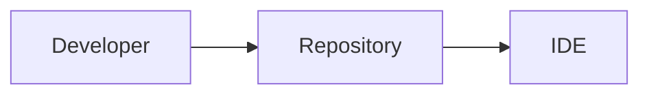
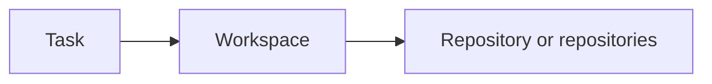
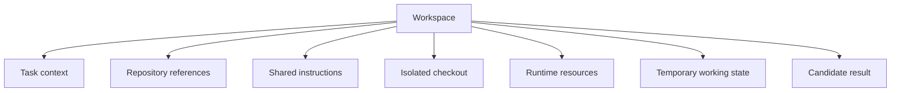

For a long time, my mental model of software development was almost embarrassingly simple:

The repository was where the software lived. The IDE was where I worked on it. If I cloned the repository, installed the dependencies, and opened the folder, I had a development environment.

Then I started using coding agents seriously at work.

At first, nothing seemed to have changed. I still opened the same repository. The agent still edited the same files. The pull request still contained a familiar diff.

But around the repository, a second system quietly began to grow.

I wrote instructions explaining how to build and test the project. I kept notes about an awkward service dependency. I created temporary branches so the agent would not disturb my work. I copied decisions from one session into another. I accumulated prompts, scratch files, handoff notes, reusable skills, and little warnings that only made sense after an agent had failed once.

The repository still contained the code, but it no longer contained the whole working environment.

That was the first lesson: **coding agents did not merely change how I write code. They changed what I need around the code.**

This is the first article in a series about the workspace architecture that grew out of that realization.

## The folder was correct, but the work was incomplete

One of my early agent tasks was ordinary: make a small change, run the tests, and update the documentation.

The agent could read the code. It could find the relevant test. It could even infer most of the local conventions. Yet I kept interrupting it with information that existed only in my head:

- which command represented the real validation path
- which generated file should not be edited directly
- which neighbouring service defined the contract
- which architectural compromise was intentional
- which apparently unused code was still needed during deployment

None of these facts belonged naturally in the prompt. Several were too specific for the main `README`. Some applied to every future task; others applied only to this change.

I began adding more context to the repository. That helped, but it also mixed different kinds of information together. Durable engineering guidance sat beside temporary plans. Project-wide knowledge sat beside task-specific discoveries. The next agent could see everything, but it could not always tell what remained true.

The problem was not that the agent needed a bigger prompt. The problem was that I did not have a model for the environment in which the task was happening.

## The task became the real unit of work

A repository is a durable boundary. A task is temporary.

That difference became much more important once an agent could spend twenty minutes exploring, editing, testing, and revising without continuous supervision.

For each task, I wanted a temporary place that could answer a few basic questions:

- What is the goal?
- Which repositories are relevant?
- Which repository may change?
- What shared engineering guidance applies?
- Where can the agent keep temporary notes?
- Which branch and processes belong to this attempt?
- What result should be handed back for review?

That place was not quite a repository and not quite an IDE project. It was a **workspace organised around a task**.

My mental model changed to this:

The repositories remain the durable homes of the software. The workspace assembles what is needed to perform one piece of work safely.

## A workspace is more than a directory

The word _workspace_ is overloaded. An editor may use it to mean a list of folders. A build tool may use it to mean a monorepo. A cloud platform may use it to mean an account boundary.

What I needed was closer to a small engineering environment:

Some parts are durable. The system map, policies, and reusable skills should survive many tasks.

Some parts are disposable. A branch, scratchpad, port allocation, and running process may exist for only one attempt.

Some parts should be shared. Every agent needs to know the testing standard.

Some parts should remain private to the run. A half-formed plan should not quietly become an architectural fact.

Once I separated these lifecycles, many messy questions became easier. I did not need to decide whether every note belonged in the repository. I needed to decide whether it was task state, workspace knowledge, or repository documentation.

## Disposable does not mean careless

My first instinct was to preserve every agent session because it felt expensive to lose context. In practice, preserving the whole environment made it harder to understand what mattered.

A better workspace is disposable in the same way a build is disposable. Its inputs are known, its outputs are inspectable, and the important result can be promoted somewhere durable.

For a coding task, the disposable workspace might contain:

- a context snapshot
- an isolated Git worktree
- the agent's temporary files
- processes started for the task
- a record of significant events
- a proposed branch or patch

When the work is finished, I should be able to review the candidate change, promote useful knowledge, and remove the rest.

This also changes the emotional relationship with an agent run. A run does not need to become a precious conversation that must continue forever. It is an attempt. If its assumptions become confused, I can start a new run from better inputs.

## This is not a multi-agent problem yet

It is tempting to jump immediately from coding agents to planners, subagents, message buses, and swarms. I think that skips the foundation.

I encountered the workspace problem with one human, one agent, and one repository.

Even a single agent needs:

- a clear task boundary
- the right context
- a safe place to make changes
- a way to return a candidate
- a way to leave durable lessons without preserving all of its temporary reasoning

Concurrency makes these needs more visible, but it does not create them.

This is why I no longer think the first question should be, “How do we orchestrate multiple agents?”

The more useful question is:

> How do we create a durable local engineering workspace where humans and coding agents can work on a software system safely over time?

That question puts the emphasis in the right place. The core problem is not agent intelligence. It is workspace design.

## What I learned

At work, I began by treating a coding agent as another interface to a repository. The agent could read more quickly, type more quickly, and keep going after I stepped away, but the repository remained the centre of the model.

The accumulation of context, instructions, scratchpads, branches, and handoffs showed me that this model was incomplete.

The repository is still essential, but it is an input to the working environment, not always the whole environment. The task creates a temporary boundary around code, context, runtime, and intent. That boundary deserves to be designed explicitly.

My first principle is therefore simple:

> A coding agent should work inside a task-oriented, disposable workspace, not directly inside an undifferentiated developer checkout.

The next problem appeared as soon as a task crossed a repository boundary. The agent could produce code that was perfectly correct in the repository it changed and completely wrong for the system around it.

That is the subject of [Part 2: A Software System Is Bigger Than a Repository](/posts/software-system-is-bigger-than-a-repository/).
