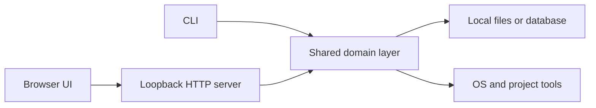

In the [previous article](/posts/01-choosing-the-right-application-interface/), I argued that an interface should follow the user's cognitive work rather than the application's internal complexity. A command is excellent when intent is precise. A visual surface is better when the user must explore, compare, or manipulate state.

That sounds as if a tool must choose between a CLI and a conventional hosted Web App. It does not.

There is a useful middle form that receives far less attention than it deserves: a **Local Web App**. The executable runs on the user's machine, owns the data and operating-system access, and serves a UI to a browser on the loopback interface. The browser is the rendering engine, not evidence that the product has become SaaS.

My thesis is simple: **when a local tool outgrows command output but does not need shared cloud state, a Local Web App is often the most economical honest interface**. It preserves the precision and automation of the CLI while adding visual history, comparison, and inspection. The trick is to keep the runtime contract explicit instead of accidentally building a miniature cloud platform on every laptop.

## Return to `mytool`

Imagine a repository analysis utility that began with one operation:

```bash
mytool scan ./project
```

It walks the project, records dependencies and risks, then returns an exit status. That command remains the right surface for CI and for a developer who wants one answer now.

As the tool becomes useful, two different needs appear. First, users want a compact machine-readable check:

```bash
mytool status --format json
```

Second, they want to understand changes across scans. Which dependency introduced a vulnerable path? Did the architecture improve after a refactor? Why is one directory responsible for most of the warnings? Those are recognition and comparison tasks. Printing more ANSI tables will eventually make the terminal carry a visual job it was not designed to carry.

The natural addition can be small:

```bash
mytool ui

# Listening on http://127.0.0.1:4310
# Press Ctrl-C to stop
```

The browser opens a dashboard backed by the same local executable. No account is created. No project is uploaded. Closing the process closes the application.

These three commands are not three products:

| Surface         | Job                                                       |
| --------------- | --------------------------------------------------------- |
| `mytool scan`   | Perform a deterministic operation                         |
| `mytool status` | Expose concise state to people, scripts, and CI           |
| `mytool ui`     | Explore history, relationships, and detailed explanations |

The important design decision is that all three call the same domain layer. Scan semantics, storage rules, and policy evaluation do not get reimplemented in React.

## The browser can be a view onto a local process

We often collapse three independent choices into the phrase “Web App”:

1. The UI is made with Web technologies.
2. The application communicates over HTTP.
3. The data and computation live on somebody else's servers.

Only the first two are required for a Local Web App. Deployment can remain local.



This separation is valuable because browsers are mature UI runtimes. They are good at typography, responsive layout, tables, charts, forms, keyboard and pointer input, accessibility semantics, and rendering links to specific views. A team can use familiar frontend skills without taking on tenancy, billing, public deployment, or remote data retention.

The local process, meanwhile, can do what a remote site cannot naturally do: read a working tree with the user's permissions, invoke Git or a compiler, watch filesystem changes, connect to a local model, and reuse configuration already present on the machine. The UI asks for domain operations; it should not receive a general-purpose shell endpoint.

This is why “just make it a desktop app” is not always the next step. A desktop wrapper can be useful when the product needs native menus, background lifecycle, global shortcuts, multiple managed windows, or controlled browser-engine versions. But if the concrete need is a rich view over a process that already runs locally, the user's existing browser may be enough.

## Process ownership is part of the UX

A hosted Web App is assumed to be available. A Local Web App has a lifecycle, and users should not need to reverse-engineer it.

For a lightweight developer utility, I prefer **terminal-owned mode** by default:

```text
mytool ui starts server -> opens browser -> streams logs in terminal
Ctrl-C                   -> stops server -> releases port
```

This model is visible, predictable, and friendly to troubleshooting. The terminal shows which project was opened, where data is stored, and why startup failed. It also avoids leaving a fleet of forgotten background daemons.

A frequently used application may justify a background service or tray process. That is not a free upgrade. It introduces startup registration, update behaviour, stale-process recovery, resource limits, and a way to discover which version is running. The interface should escalate only when persistent availability is a real requirement.

Port selection also belongs to the contract. A fixed port produces memorable URLs but can collide. An ephemeral port avoids collision but makes bookmarks unstable. One reasonable compromise is a preferred port with a safe fallback, printed clearly on startup. If multiple projects can be open simultaneously, each session needs an unambiguous project identity rather than a UI that silently changes its root directory.

## Local-first is not security-free

“It only runs on localhost” is a useful constraint, not a security model.

At minimum, the server should bind to a loopback address such as `127.0.0.1` or `::1`, not every network interface. RFC 8252 makes the same boundary explicit for native-app OAuth redirects: a client using a loopback redirect should listen only on the loopback interface, and it recommends loopback IP literals over `localhost` to avoid ambiguous name resolution ([RFC 8252, section 7.3](https://www.rfc-editor.org/rfc/rfc8252.html#section-7.3)). That RFC addresses OAuth rather than local dashboards, but the network-boundary reasoning transfers directly.

Binding correctly still leaves other questions:

- Can another local process call a destructive endpoint?
- Can an unrelated website induce the browser to send a request to the local server?
- Does the API accept arbitrary paths outside the project root?
- Are secrets, source code, or logs exposed in responses and browser storage?
- Does “open file” validate the target before invoking an OS handler?

State-changing requests need deliberate protection: session-specific unguessable tokens, strict origin checks where applicable, narrow accepted content types, and no state mutation through `GET`. File operations should resolve and constrain paths. Commands should be allow-listed domain actions, not strings passed to a shell. The server should return the minimum data the current view needs.

The browser's security model helps, but it does not absolve the local service. The Secure Contexts specification treats loopback origins as potentially trustworthy so local applications can use capabilities otherwise restricted to secure contexts ([W3C Secure Contexts](https://www.w3.org/TR/secure-contexts/#is-origin-trustworthy)). “Potentially trustworthy” does not mean trusted code. Third-party scripts and remote assets enlarge the boundary, so a local UI should generally ship its assets with the executable and use a restrictive Content Security Policy.

There is also a product-level promise to make. “Local” should state what remains local. The application may still check for updates, fetch vulnerability databases, call a remote model, or load documentation. Those behaviours can be legitimate, but they should be visible, configurable where appropriate, and separate from the claim that project content is not uploaded.

## Persistence should fit the tool

A Local Web App does not automatically need a database server. Start from the data's lifecycle.

For `mytool`, scan results could be immutable JSON records under the project, a small SQLite database in the user's application-data directory, or no persistent history unless the user asks for it. Each choice conveys a different product contract.

- Project-local files are portable and can be deleted with the project, but may create repository noise.
- User-level storage keeps the working tree clean, but requires clear project identity and cleanup.
- In-memory state is simple and private, but cannot support comparisons after restart.
- A shared cloud database enables collaboration, but changes the application category and trust model.

The UI should expose where its history lives and offer a precise way to clear or export it. “Local-first” is more credible when a user can inspect and move the data without finding an undocumented cache.

The same restraint applies to a frontend build. A dashboard with a few filters and charts does not require an elaborate micro-frontend architecture. Server-rendered HTML plus small interactive islands may be enough. A larger client application is justified when the state transitions, visualization, or offline interaction actually require it. Local deployment reduces infrastructure; it does not excuse unnecessary complexity.

## Where the pattern is strongest

Local Web Apps work especially well when three conditions overlap:

1. The capability fundamentally belongs on the user's machine.
2. Part of the work is visual or exploratory.
3. Collaboration is optional rather than intrinsic.

That describes many developer tools: repository analysers, local model managers, database inspectors, test-report explorers, profiling tools, API clients, static-site previewers, and media-processing queues. It also describes personal knowledge and data tools where browser rendering is valuable but uploading the corpus is undesirable.

The model is weaker when several people must edit the same state, a process must remain available while the user's computer is off, mobile access is central, or administrators need consistent organisation-wide policy. A loopback dashboard can show the state of this laptop; it cannot honestly pretend to be the team's system of record.

Remote access creates another boundary. Binding the server to `0.0.0.0` for “quick sharing” turns a local service into a network service without adding authentication, TLS, tenancy, auditing, or threat modelling. If remote access matters, design it explicitly—perhaps through a separately authenticated server mode—rather than weakening the local default.

## Know when to graduate—and when not to

The Local Web App should not be treated as a prototype that is waiting to become SaaS. For some tools, local is the final and correct architecture.

Graduation is justified when requirements change:

- A scan must be reviewed by teammates from their own devices.
- Results need organisation-wide retention and policy.
- Jobs must continue when the originating laptop is offline.
- Access needs central identity, roles, and audit history.
- A stable URL must be shared across a team.

At that point, a hosted service may be appropriate. The shared domain layer and explicit storage boundary make the transition easier, but the cloud version is not merely `mytool ui --public`. It needs a new security, operations, and data-governance model.

Conversely, features are not evidence of graduation. Search, charts, history, forms, and even an interactive graph can all remain local. The deciding question is where the authoritative state and users need to meet.

## A small surface can be a complete product

Local Web Apps expose a bias in how we talk about application types. We see a browser and assume remote service; we see a binary and assume terminal. Neither follows.

For `mytool`, the shape can remain deliberately hybrid:

```text
scan   gives automation a precise action
status gives scripts and people a stable answer
ui     gives humans a visual place to understand the answer
```

This is not interface duplication. It is one capability expressed at three levels of uncertainty. The CLI serves known intent. The status command serves inspection and composition. The local UI serves discovery and comparison.

The result can be easier to distribute than a cloud service, easier to trust than an upload-first product, and easier to evolve than a monolithic desktop shell. It still demands disciplined lifecycle, storage, and security decisions. Those constraints are what make it an application architecture rather than a development-server trick.

Local Web Apps will not solve the broader problem of work scattered across many organisational systems. They do, however, establish an important principle for this series: a visual interface does not need to own the capability or move its data elsewhere. Sometimes the best UI is simply a well-designed window onto work that is already local.

_Series: [Index](/posts/00-from-apps-to-intent-driven-computing/) · Previous: [01 — Choosing the Right Application Interface](/posts/01-choosing-the-right-application-interface/) · Next: [03 — MCP Apps and the AI Interface Layer](/posts/03-mcp-apps-and-the-ai-interface-layer/)_

## Sources

- [RFC 8252: OAuth 2.0 for Native Apps, loopback redirect](https://www.rfc-editor.org/rfc/rfc8252.html#section-7.3)
- [W3C Secure Contexts: Is origin potentially trustworthy?](https://www.w3.org/TR/secure-contexts/#is-origin-trustworthy)
- [OWASP Cross-Site Request Forgery Prevention Cheat Sheet](https://cheatsheetseries.owasp.org/cheatsheets/Cross-Site_Request_Forgery_Prevention_Cheat_Sheet.html)
- [OWASP Content Security Policy Cheat Sheet](https://cheatsheetseries.owasp.org/cheatsheets/Content_Security_Policy_Cheat_Sheet.html)
