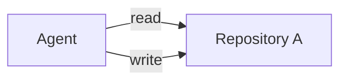
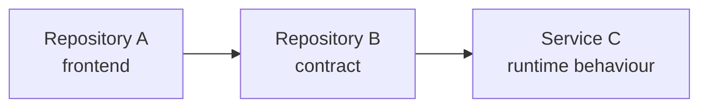
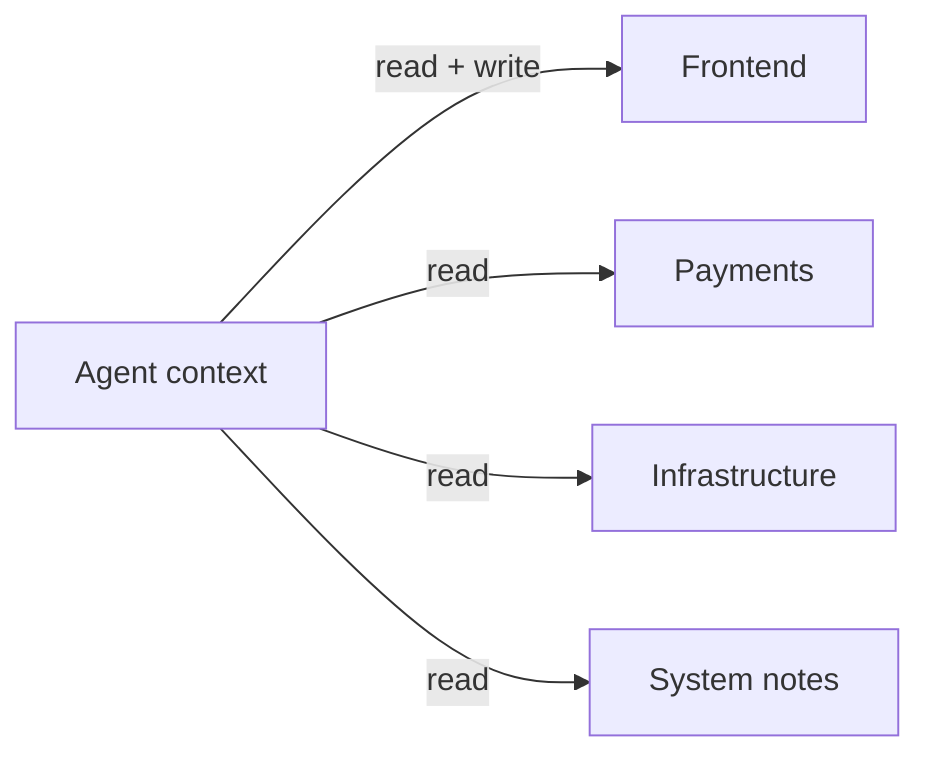
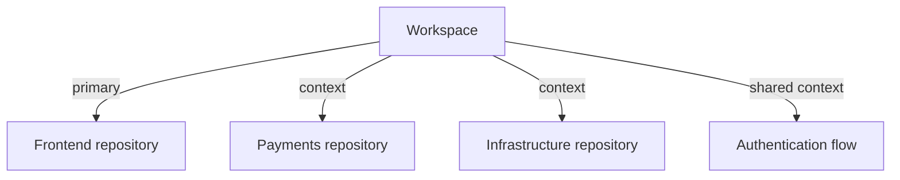
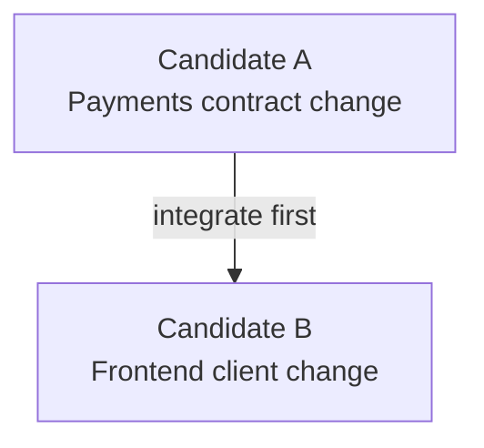

The first version of the change looked correct.

The code compiled. The unit tests passed. The new behaviour matched the ticket as it had been described. If I had reviewed only the repository in front of me, I would have approved it.

But the repository was not the system.

The change affected a client that called another service. That service interpreted one field differently from the way the local types suggested. A third repository contained the deployment configuration that determined which version would actually receive the request.

The coding agent had done a good job with the world it could see. The problem was that I had shown it the wrong world.

That experience gave me one of the most important principles in this series:

> Mutation scope and context scope are different.

An agent may need to read a whole software system while being allowed to change only one small part of it.

## The repository boundary was doing two jobs

In a simple project, the repository can be both the unit of change and the unit of understanding.



Many workplace systems do not look like that. A web application depends on an API. The API depends on shared contracts. A deployment repository supplies environment-specific behaviour. An operations guide contains the failure mode that never made it into code.

The real shape is closer to this:



If I place the agent inside Repository A and describe only the desired local edit, I implicitly tell it that Repository A is the relevant universe.

It may then make a change that is:

- type-correct locally
- well-tested locally
- consistent with local conventions
- incompatible with the wider system

Coding agents make this risk more serious because they can move from assumption to implementation very quickly. A human developer may pause when a contract looks ambiguous. An agent often fills the ambiguity with the most plausible local interpretation and continues.

Speed amplifies the quality of the context boundary, good or bad.

## Read many, write one

The pattern I began using was simple: assemble a workspace with several repositories available for reading, but identify one primary repository as the mutation target.

```yaml
repos:
  frontend:
    path: ../frontend
    primary: true

  payments:
    path: ../payments
    context: true

  infrastructure:
    path: ../infrastructure
    context: true
```

Conceptually, the permissions look like this:



This is the **read-many, write-one** pattern.

It is not a security boundary by itself. A local process may still have broader filesystem access unless stronger isolation is added. But it is an important engineering boundary. The task, instructions, and review process all agree about where change is expected.

That makes the result easier to reason about. The agent can inspect the consumer, provider, configuration, and contract, while producing one candidate branch in one repository.

## Context is not permission

I used to avoid giving an agent neighbouring repositories because I did not want the scope to expand. That response confused visibility with authority.

Giving an agent read access to a service contract does not mean asking it to redesign the service. Letting it inspect infrastructure does not mean allowing it to edit deployment configuration.

In fact, hiding context can make scope creep more likely. When the agent cannot see the real constraint, it may work around the missing information by changing more local code.

A good task should state both boundaries explicitly:

```text
Goal:
  Refresh authentication before the current token expires.

Mutation scope:
  frontend repository only.

Context scope:
  frontend, identity service, deployment configuration,
  and the authentication contract.

Constraint:
  Do not change the server contract as part of this run.
```

Now the agent can investigate broadly and act narrowly.

That distinction also improves human review. If the candidate requires a change outside the declared mutation scope, the agent should report it as a dependency or follow-up, not silently perform it.

## A workspace can describe a system without owning it

Once several repositories enter the picture, it is tempting to create a new super-repository or central control plane that owns them all.

I do not think that is necessary.

Repositories have their own maintainers, histories, release processes, and boundaries for good reasons. A workspace can reference them without absorbing them.



The workspace is an assembly, not a new source of ownership.

This matters organisationally as much as technically. The architecture should not pretend that one task has authority over every system it needs to understand.

## Shared system context fills the gaps between repositories

Even with every relevant repository available, some important facts live between them.

Examples include:

- the order in which services are deployed
- which team owns a contract
- compatibility expectations during a rolling release
- the production path that differs from the local development path
- why two apparently duplicate models cannot yet be unified

These facts do not always belong in one repository. I began thinking of them as **workspace context**: durable engineering knowledge about the assembled system.

The context does not need to be elaborate. A few boring Markdown files can be enough:

```text
.workspace/context/
├── system-map.md
├── authentication-flow.md
├── testing.md
└── ownership.md
```

The important property is not the format. It is that the information has a visible owner, a lifecycle, and a review path. It is shared context, not a transcript copied from an old agent session.

## Why not let one run change every repository?

Sometimes a feature genuinely requires coordinated changes across multiple repositories. A workspace architecture should be able to represent that, but I would not make it the default.

An agent changing several repositories in one run creates difficult questions:

- What is the candidate: one branch or several?
- What happens if one repository passes validation and another fails?
- In which order should the changes be integrated?
- Who reviews each boundary?
- Can the system tolerate partial deployment?

These are real problems, but they are integration problems. Pretending that a local tool can provide an atomic multi-repository transaction would hide rather than solve them.

My safer default is to produce separate candidates with an explicit dependency:



The workspace can preserve the relationship. Each repository can preserve its own review and release boundary.

## What I learned

The agent's first attempt was locally sensible because I had framed the repository as the whole problem. My review initially made the same mistake.

The fix was not a longer prompt. It was a clearer architecture of context and authority.

I now try to ask two questions before a coding-agent run:

1. What must the agent understand?
2. What is the agent expected to change?

If the answers are different, the workspace should say so.

The principle is compact enough to remember:

> Let the agent read at the system boundary and write at the task boundary.

That principle helps the agent make a globally informed change without turning every task into a cross-repository migration.

It also revealed another missing layer. Even when the right code and context were available, I often returned to a change weeks later and could not reconstruct why we had chosen that path. Git showed me the diff. It did not show me the journey that made the diff sensible.

That is the subject of [Part 3: Git Stores What Changed, Not Why We Got There](/posts/git-stores-what-changed-not-why-we-got-there/).
