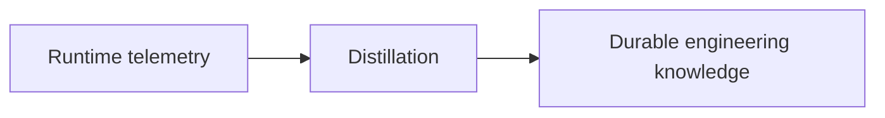
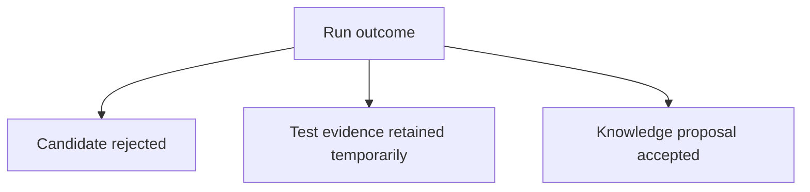
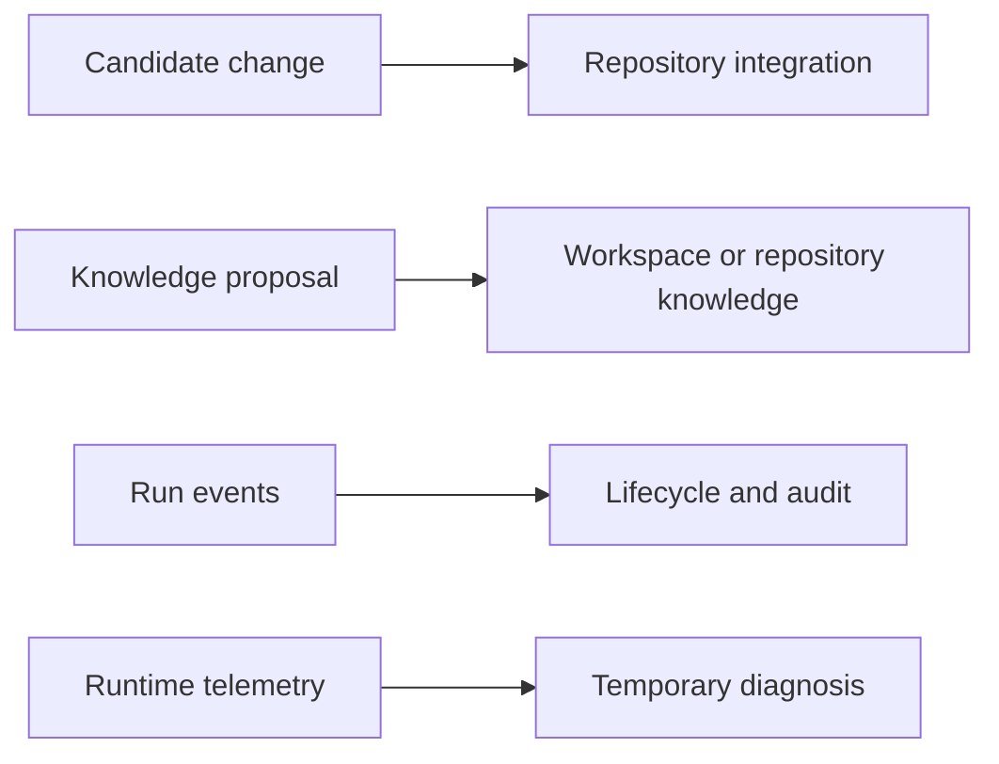

A few weeks after an agent completed a change, I opened the commit and tried to understand why the implementation looked slightly strange.

The code was tidy. The tests were meaningful. The commit message accurately described what had changed.

None of that answered my question.

Why had we kept the older interface instead of simplifying it? Why was a retry performed at this layer rather than the one below it? Had the agent tried the obvious approach and found a failure, or had we never considered it?

I vaguely remembered the session. There had been a constraint in a neighbouring service and an unexpected behaviour in a test environment. I had discussed both with the agent. By the time the change was merged, the reasoning had dissolved into a diff and a short commit message.

Git had preserved the result. It had not preserved enough of the journey to make the result intelligible.

## Coding-agent work produces more than a diff

Traditional Git history gives us a strong set of primitives:

```text
commit
diff
author
timestamp
message
```

Those primitives remain useful. Coding agents do not make commits obsolete.

But an agent run also produces other kinds of information:

- the original goal
- constraints discovered during exploration
- failed approaches
- evidence from tests or logs
- decisions and their alternatives
- warnings for the next person
- reusable knowledge about the system
- improvements to the instructions or skills used by future agents

Some of this information explains the change. Some should influence future work even if the candidate is never merged.

The naive answer is to save the whole conversation.

I tried thinking that way for a while. It felt safe: storage is cheap, and perhaps a future model could search everything. In practice, a complete transcript is a poor engineering artefact.

## The agent's entire brain is not documentation

An agent conversation contains repetition, guesses, corrections, tool output, dead ends, and temporary interpretations. Its value comes partly from being allowed to be messy.

Making all of that durable creates several problems:

- important decisions are buried in thousands of unimportant lines
- secrets or sensitive output may be captured accidentally
- later readers cannot tell which statements were verified
- obsolete plans look authoritative because they remain searchable
- repositories grow with telemetry that nobody wants to review
- the stored format becomes coupled to one agent runtime

The transcript may be useful as short-lived runtime telemetry. It should not automatically become the engineering memory of the project.

That led me to a more deliberate pipeline:



The key operation is **promotion**. A discovery becomes durable only when it is extracted, stated clearly, and placed in an appropriate home.

## Three layers of memory

I began separating run information into three lifecycles.

### 1. Runtime telemetry

This is the detailed operational record: commands, logs, agent messages, token usage, intermediate output, and process state.

It is useful for debugging a live or recently failed run. It may be large. It may have a short retention period. It does not belong in Git by default.

### 2. Run events

These are small, structured facts about what happened:

```text
run.started
context.snapshot.created
worktree.created
tests.failed
candidate.produced
knowledge.proposed
run.completed
```

Events help reconstruct the lifecycle without storing every detail. They are useful for status, crash recovery, and later analysis.

### 3. Durable knowledge

This is the small set of facts worth carrying into future work:

- an architectural decision
- a corrected system diagram
- a testing instruction
- a known compatibility constraint
- a reusable skill improvement
- a warning attached to a repository or service

Durable knowledge should be readable without replaying an agent session.

## Why I prefer boring files

There are elegant ways to store event data in Git. Custom objects, refs, notes, and content-addressed structures can keep operational data out of the visible file tree.

I kept returning to ordinary files.

```text
.workspace/
├── events/
│   └── 2026-08-24.jsonl
├── context/
│   └── authentication.md
└── decisions/
    └── 004-client-retry-boundary.md
```

Boring files have useful properties:

- people can open them without special tooling
- agents can read them with ordinary filesystem tools
- diffs and code review already work
- backups and migrations are straightforward
- another implementation can adopt the architecture without copying a database format

This does not mean every local event must be committed. A local coordinator can keep high-volume runtime state outside Git. The durable subset can be exported or promoted into files when it has engineering value.

The principle matters more than the storage engine:

> Git should store durable engineering history, not the agent's entire brain.

## Events are facts, knowledge is an interpretation

An event can say that a test failed. Durable knowledge can say why the test fails under a particular configuration and what future work should do about it.

Those are different things.

```json
{ "type": "tests.failed", "run": "R42", "suite": "integration", "time": "..." }
```

is a historical fact.

```markdown
The integration suite requires the identity service to use the test issuer.
The default local issuer causes refresh-token cases to fail before the client
code is exercised.
```

is a reusable explanation.

An agent can draft that explanation as a **knowledge proposal**. A human or an integration policy can decide whether it is accurate, durable, and placed at the right scope.

This proposal step prevents temporary reasoning from silently becoming shared truth.

## Failed candidates can still teach the workspace

One surprising consequence of this model is that code does not need to be merged for a run to be useful.

An agent may discover that the requested change is incompatible with an upstream contract. Its candidate branch may be abandoned. The discovery may still deserve to update the system context.



This is difficult to represent if the commit is the only durable output. It becomes natural when candidate code and knowledge promotion are separate integration decisions.

## Immutability and the compaction trap

Events are easiest to reason about when they are append-only. If a run changes state, write another event instead of rewriting the earlier one.

That gives us an auditable history, but it creates an obvious concern: growth.

We can create periodic summaries or compacted snapshots so tools do not need to replay every event. However, committing a smaller summary does not shrink existing Git history. The old objects remain unless history is rewritten, which is disruptive and usually inappropriate for shared repositories.

So compaction has two distinct meanings:

1. **Read compaction**: create a summary that makes current state fast to load.
2. **Storage reduction**: actually remove old data from retained history.

The first is easy. The second requires retention policies, external storage, or deliberate history rewriting.

That is another reason not to commit raw telemetry in the first place. The best way to keep Git small is to promote only what deserves to be there.

## What I learned

When I could not explain the strange-looking implementation, I initially blamed the commit message. A longer message might have helped, but it would not have solved the broader problem.

An agent run creates an operational story. Git records the code at the end of that story. The missing design work is deciding which parts of the story deserve a durable form.

I now think of the outputs separately:



Each output has a different audience and retention period.

The lesson is not to capture everything. It is to create a path by which the useful part can survive.

The next problem was more immediate. Even with good context and memory, an agent working directly in my checkout could collide with me before it ever produced a commit.

That is the subject of [Part 4: One Agent, One Isolated Run](/posts/one-agent-one-isolated-run/).
