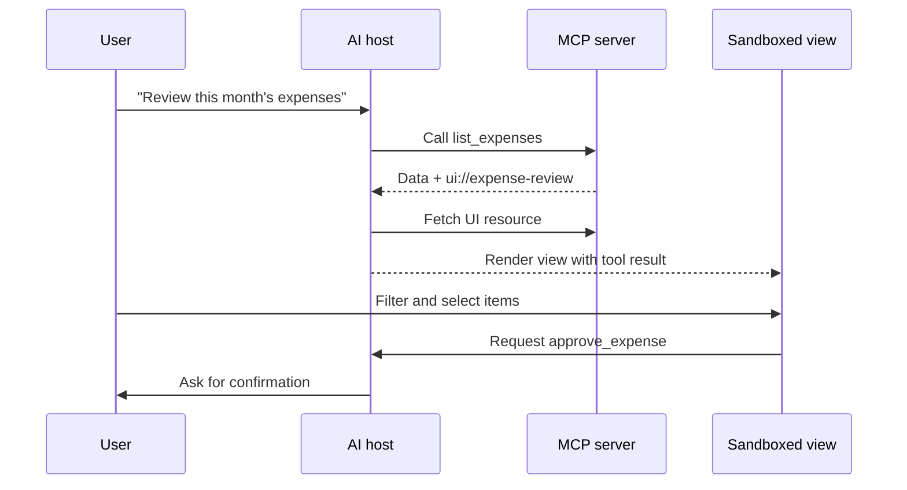

Ask an AI assistant to analyse a sales file and a familiar sequence begins. The model calls a tool, receives structured rows, and writes a useful summary. Then the user asks to compare regions. The assistant prints a table. The user asks to exclude two outliers. The assistant produces another table. Soon the conversation contains five nearly identical snapshots and the user is explaining a visual selection in words:

> Keep the east region, remove the small blue bar, and show the previous quarter beside it.

The problem is no longer access to data. It is the mismatch between a conversational interface and a task that has become spatial, stateful, and interactive.

MCP Apps address that mismatch by allowing an MCP server to supply an interactive view that a compatible host renders in context. That sounds like “a Web App inside chat,” but the phrase hides the more useful architectural distinction.

My thesis is that **MCP defines an AI-facing capability layer, MCP Apps add a contextual human interaction layer, and a full Web App remains the right surface for a durable destination**. These layers overlap, but they are not substitutes. The design decision is about where the user's work begins, where its state should live, and whether the view can remain subordinate to a conversation.

## Three things that should not share one label

The term “MCP app” is sometimes used loosely for anything involving an MCP server, a model, and a screen. It is more precise to separate three layers.

### 1. Core MCP: a protocol between hosts, clients, and servers

Core Model Context Protocol is not a visual framework. It standardises messages and lifecycle between an AI application and servers that expose capabilities. The current specification describes a JSON-RPC base protocol, capability negotiation, transports, authorisation for HTTP-based connections, and optional server and client features ([MCP specification overview](https://modelcontextprotocol.io/specification/2025-11-25/basic)).

The most visible server primitives are:

- **Tools**, which a model can invoke to perform an operation.
- **Resources**, which provide addressable context that an application can read.
- **Prompts**, which provide reusable, user-controlled interaction templates.

The official architecture deliberately assigns different control patterns to them: tools are commonly model-controlled, resources application-controlled, and prompts user-controlled. A host remains responsible for combining servers, permission decisions, model access, and the user experience ([MCP architecture overview](https://modelcontextprotocol.io/docs/learn/architecture)).

An expense system might expose `list_expenses`, `get_receipt`, and `approve_expense`. Core MCP can make those capabilities discoverable and typed. It does not decide whether the user sees a table, a chat transcript, a native confirmation sheet, or nothing at all.

### 2. MCP Apps: interactive UI associated with MCP tools

MCP Apps is an extension to core MCP. A tool can declare a reference to a `ui://` resource. The host fetches the resource and renders its HTML interface, commonly in a sandboxed iframe. The app and host communicate through a JSON-RPC protocol over `postMessage`; the UI can receive tool data, call permitted tools, and send context back to the host ([MCP Apps overview](https://modelcontextprotocol.io/extensions/apps/overview)).

The narrow flow looks like this:



This is more than a decorated tool result. The view gives users recognition instead of recall: rows remain visible, filters have controls, selections have state, and validation can happen before another tool call. It also stays beside the conversation that created it.

### 3. A full Web App: an independently addressable product surface

A full Web App owns its navigation, information architecture, session lifecycle, and usually its identity and sharing model. It can still use the same backend and expose the same actions through MCP, but it is not dependent on an AI host to exist.

An expense product's Web App might have stable pages for an employee, claim, policy, team queue, and audit report. Users may bookmark those pages, open several in tabs, share a link with a colleague, return next week, or operate without involving a model. That is a different product contract from a view whose primary context is one assistant conversation.

## The best use case is a conversational detour that becomes visual

MCP Apps are strongest when the user begins with an intent expressed naturally and needs a bounded interactive surface to complete it.

Consider infrastructure planning:

> Design a low-cost deployment for this service in Australia, with room to handle a three-times traffic spike.

The model can gather requirements and call a pricing tool. But choosing among regions, instance sizes, storage tiers, and availability options is easier when alternatives are simultaneously visible. An MCP App can present a constrained configurator populated from the tool result. The user changes two values, sees the cost and resilience estimate update, and submits the selected configuration through a tool call.

The assistant contributes interpretation and orchestration. The interactive view contributes direct manipulation and stable local state. Neither has to imitate the other.

Other good fits share the same shape:

- Exploring a chart, map, dependency graph, or three-dimensional object returned by a tool.
- Reviewing a small queue of expenses, issues, or code changes in the context of a request.
- Filling a configuration with interdependent options and immediate validation.
- Monitoring a job that the assistant just started.
- Previewing media before accepting, revising, or exporting it.

The key word is **bounded**. The user is completing a legible subtask inside a larger conversation, not moving their entire working life into an embedded panel.

## When chat should stay chat

An interactive view has a lifecycle and security cost. It should not be the default response to every tool call.

Plain tool output is better when the result is short, unambiguous, and primarily linguistic: a package version, a calculation, a concise search result, or a confirmation that a reversible operation finished. Asking users to interpret a custom card for “the build passed” creates more interface than work.

Conversation is also better when ambiguity is the work. If a user is refining a strategy, comparing arguments, or deciding what question matters, a form can prematurely turn uncertainty into fields. The model's ability to ask a contextual follow-up is valuable precisely because the decision has not yet become structured.

The progression should be allowed to move both ways:

```text
conversation -> structured tool call -> interactive inspection -> confirmed action -> conversation
```

The app is a temporary instrument in that loop, not necessarily the centre of the experience.

## When an MCP App is too small

A full application is a better choice when the surface must become a destination in its own right.

### Durable navigation and large information architecture

If users need dozens of routes, cross-cutting search, multiple roles, global settings, help, notifications, and long-lived workspaces, embedding the entire product inside a chat host adds indirection. A conversation is a useful entry point, but it is a poor substitute for a stable map of a complex system.

### Independent collaboration

“Look at the chart in my conversation from Tuesday” is not a robust collaboration model. A team object needs an address, an access policy, an owner, history, and a lifecycle independent of one person's chat thread. An MCP App can offer an “open full report” action; it should not pretend that an embedded instance is automatically a shareable record.

### Sustained creation

Long-form writing, software development, video editing, and complex design require deep keyboard models, dense commands, large canvases, many documents, and careful recovery. An assistant can help through MCP, and a contextual view can handle a review or preview, but the primary editor remains a full application.

### Predictable access without an AI host

Some work must remain available when the model is disabled, the host is offline, a policy blocks tool access, or a customer uses an unsupported client. MCP Apps are an extension, and the official documentation warns that host support varies. A product whose essential UI exists only through the extension inherits that compatibility matrix.

## The host is part of the application boundary

With a normal Web App, the product team controls most of the visible runtime. With MCP Apps, the host owns important parts of the experience: discovery, tool consent, frame placement, theme integration, capability exposure, link handling, and sometimes whether the extension is supported at all.

That can be an advantage. The host already knows the conversation, connected tools, current model, and user. The MCP App can request an outcome without directly integrating every external service. But it also means developers must test the combination rather than only the HTML bundle.

Questions that belong in an MCP Apps release checklist include:

- What happens when a host understands core MCP but not the Apps extension?
- Is the tool result still meaningful without the interactive view?
- Which tool calls may the view request, and which require explicit confirmation?
- Does the UI work in the frame sizes, themes, and accessibility modes hosts provide?
- What state is ephemeral, and what is persisted by the server?
- Can the user open a durable Web destination when the task outgrows the panel?

Progressive enhancement is the safest posture. Return useful text or structured content from the tool, then attach a richer view for compatible hosts. Do not make the protocol response an empty envelope whose only meaning exists in the iframe.

## Sandboxing is a boundary, not a complete trust model

The Apps specification uses familiar Web security primitives. The host typically isolates the UI in a sandboxed iframe; communication crosses a controlled `postMessage` bridge; metadata can declare content security policy and requested permissions. The host decides what capabilities are actually available.

These controls reduce the ability of an embedded app to read the host's DOM, cookies, or local storage. They do not answer every product-security question.

The server still decides what data to return. Tools can still cause side effects. A misleading interface can still ask a user to approve the wrong object. Remote resources can still create privacy concerns if policy is too broad. Authorisation still belongs at the data and action boundary, not only at the rendering boundary.

A sound design therefore uses defence in depth:

1. Give the UI only the tool and host capabilities it needs.
2. Enforce identity and authorisation on every server operation.
3. Show the exact object and consequence before consequential actions.
4. Separate selection in the view from confirmation by the host when risk is high.
5. Treat all tool results and UI messages as untrusted input until validated.

The core MCP security guidance similarly emphasises least-privilege scopes, validation, and explicit consent around sensitive actions ([MCP security best practices](https://modelcontextprotocol.io/docs/2025-11-25/tutorials/security/security_best_practices)).

## Build one domain, then choose projections

The cleanest implementation does not start with “an MCP version” and “a Web version” as separate products. It starts with a shared domain layer:

```text
Domain entities: expense, receipt, policy, approval
Domain queries: list, inspect, compare, audit
Domain commands: submit, approve, reject, annotate

Projections:
- MCP tools and resources for AI access
- MCP App view for contextual review
- Web App routes for durable work and collaboration
- CLI commands for automation
```

Each projection should preserve the same rules. If approving an expense requires a reason above a threshold, the requirement must apply whether the action came from the Web App, an MCP App, or a CLI. Shared business logic prevents interface-specific loopholes and contradictory behaviour.

The projections should not be identical. The MCP tool needs a precise schema and model-readable description. The MCP App needs a compact interaction that fits the host context. The full Web App needs navigation and recovery across longer sessions. Reuse the domain, not every pixel.

This architecture also provides an exit ramp. A contextual view can contain a link to the durable object. The full Web App can invoke an assistant for synthesis. A tool result can include both a concise answer and the identifier of the created resource. Users can move between surfaces without losing the thing they are working on.

## An AI interface layer, not the end of applications

MCP Apps do not prove that chat will absorb all software. They demonstrate something more practical: an AI host can become a compositional shell that calls capabilities and temporarily hosts the interaction best suited to the current step.

Core MCP gives the shell a structured way to discover and invoke capabilities. MCP Apps let a server say, “this result needs a small interactive instrument.” A full Web App gives the resulting work a durable home when it needs independent navigation, collaboration, identity, and time.

The design rule is therefore simple:

- Use **core MCP** when an AI system needs structured context or action.
- Add an **MCP App** when a bounded conversational task becomes visual, stateful, or easier through direct manipulation.
- Keep or build a **full application** when the work needs to be a destination rather than a moment inside another host.

That layered answer is less dramatic than declaring the death of apps. It is also more useful. The future interface is likely not one universal chat window, but a host that can move fluently between language, tools, contextual views, and durable places.

For the adjacent question of how agents discover browser-exposed capabilities in the first place, see [The Discovery Problem: How Will Agents Find Your WebMCP Tools?](/posts/webmcp-discovery-problem/).

_Series: [Index](/posts/00-from-apps-to-intent-driven-computing/) · Previous: [02 — Local Web Apps Are Underrated](/posts/02-local-web-apps-are-underrated/) · Next: [04 — Why URLs Will Survive AI](/posts/04-why-urls-will-survive-ai/)_

## Sources

- [MCP specification overview](https://modelcontextprotocol.io/specification/2025-11-25/basic)
- [MCP architecture overview](https://modelcontextprotocol.io/docs/learn/architecture)
- [MCP server tools specification](https://modelcontextprotocol.io/specification/2025-11-25/server/tools)
- [MCP server resources specification](https://modelcontextprotocol.io/specification/2025-11-25/server/resources)
- [MCP server prompts specification](https://modelcontextprotocol.io/specification/2025-11-25/server/prompts)
- [MCP Apps overview](https://modelcontextprotocol.io/extensions/apps/overview)
- [MCP security best practices](https://modelcontextprotocol.io/docs/2025-11-25/tutorials/security/security_best_practices)
