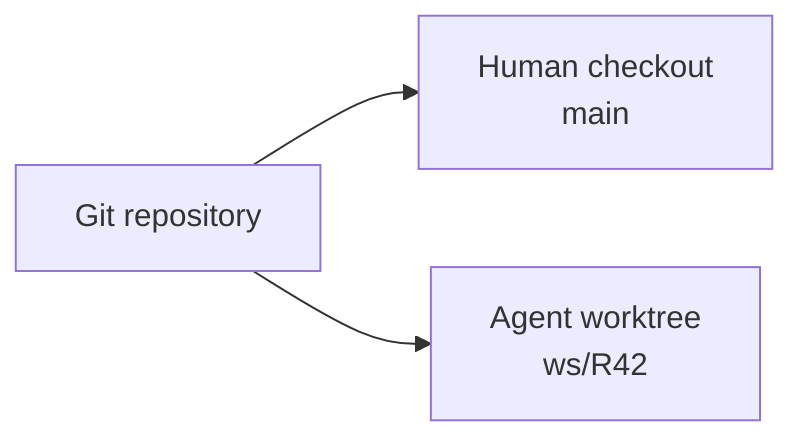
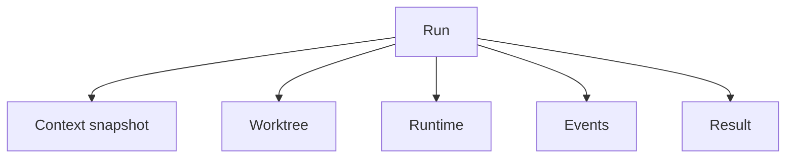
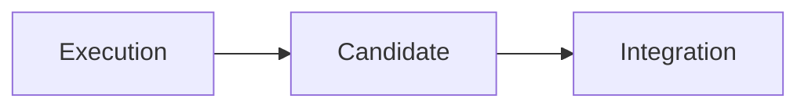
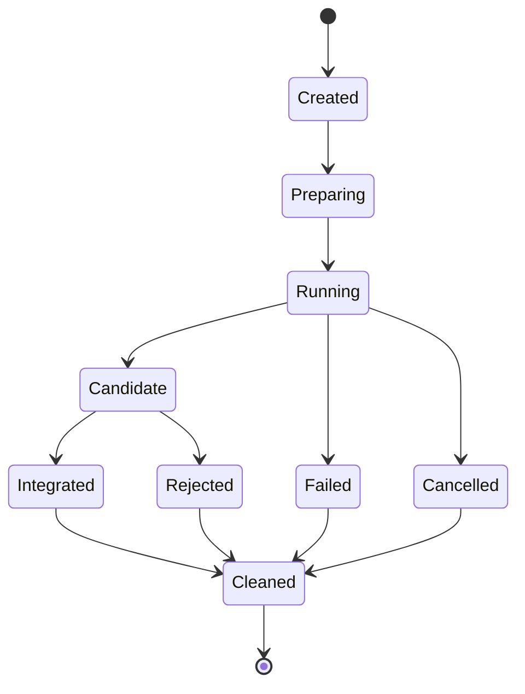

The conflict began before Git reported one.

I had a half-finished change in my working tree. A coding agent was investigating a related task in the same repository. While I was reading one file, the agent reformatted it. While the agent was running tests, I changed a configuration value. Neither of us knew exactly which version the test command had validated.

Git still showed a single working tree. Technically, nothing had gone wrong yet.

But I had lost confidence in the result.

The obvious fix was to coordinate more carefully: tell the agent which files I was editing, wait for it to finish, stash my changes, or use separate clones.

The better fix was to stop sharing the checkout.

That led to a principle that now feels foundational:

> An agent does not modify my workspace. An agent produces a candidate change.

## A branch is not an isolated directory

Creating a branch for an agent helps identify its commits, but a branch alone does not solve the working-tree problem. Only one branch can be checked out in a directory at a time, and uncommitted changes remain part of that directory's state.

Git worktrees provide the missing physical boundary. They allow several branches from the same repository to be checked out in separate directories.



Now I can continue working in the normal checkout while the agent edits, builds, and tests in its own directory.

The agent's worktree is not a backup copy of my folder. It is a separate checkout connected to the same Git repository. Objects are shared, while branch state and uncommitted files remain isolated.

This makes worktrees cheap enough to create per task and explicit enough to inspect when something goes wrong.

## The run became the unit of execution

Once the agent had its own worktree, I needed a name for everything else associated with the attempt.

I call it a **Run**.



A run is bounded. It starts from known inputs and ends with an outcome.

The context snapshot records what the agent was told. The worktree contains its filesystem changes. The runtime includes the agent process and any commands it starts. Events describe the lifecycle. The result may be a candidate branch, a report, a knowledge proposal, or a failure.

This sounds like a small distinction, but it changes the design. “Agent session” centres the conversation. “Run” centres the engineering attempt.

A conversation can be part of a run. It is not the definition of the run.

## Bounded runs are easier to trust

Long-lived agent sessions feel convenient because they retain conversational context. Over time, that context also accumulates stale assumptions, abandoned plans, and unrelated goals.

A bounded run makes a stronger promise:

```text
Given:
  this goal
  this context snapshot
  this repository state
  these permissions

Produce:
  this candidate
  this evidence
  these proposed lessons
```

If the goal changes materially, starting a new run may be healthier than stretching the original one.

This is familiar from other engineering systems. We prefer reproducible builds to immortal build processes. We prefer a CI job with explicit inputs to a shell session that has been alive for three weeks. Agent work benefits from the same discipline.

Boundaries also make failure less dramatic. A confused run can be stopped without corrupting the human checkout. A crashed run can be inspected and cleaned. A useful candidate can survive even if the agent process is gone.

## Execution is not integration

Before using isolated runs, I treated “the agent finished” as roughly equivalent to “the change is now part of my work.” That made completion ambiguous.

An isolated run separates two phases:



During execution, the agent explores and changes its own worktree.

At completion, it produces a candidate: a branch, commit, or patch plus evidence about validation and known risks.

During integration, the candidate is rebased if necessary, reviewed, tested against the current target, and accepted or rejected.

The candidate may be technically complete and still fail integration because the target moved or a conflicting change was accepted first. That is not evidence that isolation failed. It is the normal cost of concurrent or delayed work.

The benefit is that the conflict appears at a deliberate gate instead of emerging unpredictably inside a shared working directory.

## A candidate should carry evidence

A branch name alone does not tell me whether a run is ready to integrate.

I want the candidate to answer:

- What goal did this run address?
- Which commit or patch is proposed?
- Which files or interfaces changed?
- What validation ran, and what passed?
- What did not run?
- Which assumptions or risks remain?
- Did the run propose any durable knowledge?

This can begin as a small result file:

```yaml
run: R42
status: candidate
branch: ws/R42
base: 91c4b7a
validation:
  - command: pnpm test
    result: passed
  - command: pnpm build
    result: passed
risks:
  - "Refresh timing still depends on client clock accuracy."
```

The format is less important than the contract: a run returns an inspectable proposal, not an invisible mutation.

## Lifecycle matters because cleanup matters

Temporary work has a habit of becoming permanent clutter.

An explicit run lifecycle makes ownership clear:



The worktree belongs to the run. The process belongs to the run. Later, when runtime resources such as ports and services are allocated, they will belong to the run too.

Cleanup should not rely on remembering which terminal started what. The run registry should know what can be removed and what must be retained for review.

A crash may leave resources behind. That is why the lifecycle is recorded through events rather than inferred only from whether a process is still running. On restart, the coordinator can reconcile declared state with reality.

## Isolation changes the human relationship

The most important effect was not technical. It was psychological.

When an agent edits my current checkout, I monitor it like someone using my keyboard. I worry about every unexpected file change because it is happening inside my unfinished work.

When the agent works in an isolated run, I can delegate more honestly. I am not granting control of my workspace. I am asking for a candidate I can evaluate.

That makes it easier to stop a bad run, compare two approaches, or let an experiment fail. The cost of exploration falls because the blast radius is visible.

## What I learned

My original conflict was not really about two edits to the same file. It was about two actors sharing hidden state: uncommitted files, checked-out branch, generated output, and the uncertain meaning of a test result.

The worktree gave the agent its own filesystem state. The run gave the attempt an identity and lifecycle. The candidate boundary separated execution from acceptance.

Together they formed a safer default:

> One agent, one isolated run, one candidate result.

This foundation works even if I never run two agents at the same time.

Of course, once isolated runs existed, concurrency became almost irresistible. I could start several tasks without letting the agents overwrite one another. I initially assumed that multiple agents would need a sophisticated communication layer to coordinate.

They usually did not.

That is the subject of [Part 5: Multiple Coding Agents Without a Swarm](/posts/multiple-coding-agents-without-a-swarm/).
