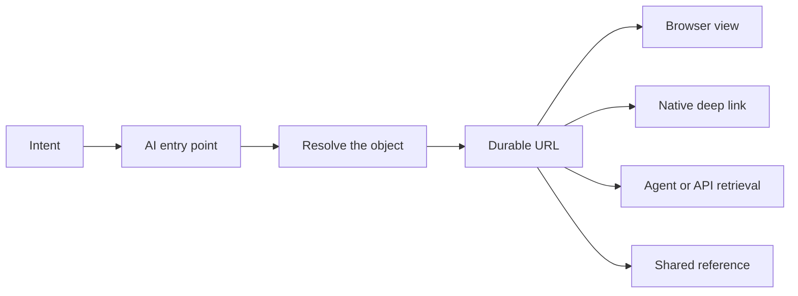

The most compelling version of an AI assistant does not ask users to navigate software. You say, “Compare last quarter's renewal risks, ask the account owners for updates, and prepare tomorrow's review,” and the assistant coordinates the work across several systems.

It is tempting to conclude that the application—and especially the URL—has become obsolete. If intent can replace navigation, why keep routes, pages, and links?

Because entering a system is not the same as having a place inside it.

My thesis is that **AI will change many entry points, but URLs will survive as the durable addressing layer for digital work**. They give people and machines a shared way to identify something, apply authority around it, pass it to another context, open it in an appropriate surface, and return later. An assistant may spare us the journey through five menus; it still needs a stable answer to “which account, report, version, or decision do you mean?”

## Entry points are not destinations

Traditional software often conflates two jobs:

1. Help the user express what they want.
2. Give the resulting object a durable place.

AI is particularly good at the first job. Natural language can collapse a long navigation sequence:

```text
CRM home -> Accounts -> APAC -> At risk -> Contoso -> Renewals -> Q4
```

into:

```text
"Show me the Q4 renewal risk for Contoso in APAC."
```

But after the assistant finds the answer, the work often needs to become a destination:

```text
https://crm.example.com/accounts/contoso/renewals/2026-q4
```

The destination can be opened without replaying the prompt. It can be saved in a meeting agenda, cited in a decision record, sent to an account owner, associated with an audit event, or revisited after the chat scrolls away.

This distinction is the centre of the argument:



The AI entry point improves access. The URL preserves reference. One does not make the other redundant.

## A URL is a name before it is a screen

A URL is commonly treated as text in the browser bar. Architecturally, it is more important as an identifier.

RFC 3986 defines a Uniform Resource Identifier as a compact sequence of characters that identifies an abstract or physical resource. It also distinguishes identification from whatever interaction later occurs with that resource ([RFC 3986](https://www.rfc-editor.org/rfc/rfc3986.html)). The W3C's Web architecture makes the same principle foundational: global identifiers allow independent parties to refer to resources consistently, and representations are obtained through interaction with those resources ([Architecture of the World Wide Web](https://www.w3.org/TR/webarch/)).

That means the useful thing behind this address:

```text
https://work.example.com/projects/atlas/decisions/42
```

is not “a page.” It is decision 42 in the Atlas project. A browser might render a detailed decision record. A mobile app might open a focused native screen. An agent might retrieve structured data. An email client might show a preview. The resource can outlive any one representation.

This is why route design should model domain identity rather than the current component tree. A path such as `/app/v2/pages/left-panel/item?index=7` encodes an implementation accident. `/projects/atlas/decisions/42` names the thing users care about.

AI makes this discipline more valuable. Models need grounding. “That report” is ambiguous once several reports enter the conversation. A stable identifier turns a fuzzy reference into an object that can be fetched, authorised, logged, and cited.

## Identity is not authority—but authority needs identity

A URL does not itself grant permission. Knowing the address of a private payroll report should not be enough to read it. The server must authenticate the requester and authorise access to the identified resource.

This distinction matters because “URLs are insecure” is often shorthand for several different failures:

- A secret was placed in a query string and leaked through logs or history.
- An application treated an unguessable link as its only access check.
- A server checked that the user was signed in but not that they could access this object.
- A shared link carried a bearer token with an excessive lifetime or scope.

These are security-design problems, not arguments against addressability.

A well-designed system separates concerns:

```text
URL       -> Which resource is requested?
Identity  -> Who or what is requesting it?
Policy    -> May that principal perform this action now?
View      -> Which representation is appropriate?
Audit     -> What happened to this resource?
```

The Web's origin model adds another relevant boundary. An origin is derived from scheme, host, and port, and user agents use it when isolating content and privileges ([RFC 6454](https://www.rfc-editor.org/rfc/rfc6454.html)). A path identifies more specific resources inside that authority boundary; application policy can then decide whether the current principal may read, edit, approve, or share each one.

AI agents make object-level authorisation more urgent. A model can resolve and act on many resources faster than a human can click them. Every tool or route must therefore enforce permission at execution time. The assistant's ability to mention a URL is not evidence that it may open or mutate what the URL identifies.

Capability URLs are a legitimate but narrower design: possession of an unguessable URL conveys a specific authority, such as viewing a public share or completing a one-time action. They should be treated like credentials—scoped, revocable when appropriate, excluded from unnecessary logs, and never confused with ordinary public addresses.

## Sharing is the transfer of reference

The simplest collaboration primitive on the Web is still “send me the link.” Its power comes from transferring reference without transferring the entire application state or retelling the path used to get there.

Compare two messages:

> Open the revenue app, choose FY2026, switch to Australia, filter enterprise accounts, then select the third scenario.

and:

> Review `https://finance.example.com/scenarios/fy2026-au-enterprise/base`.

The second message is shorter, but more importantly it is testable. Both people can establish whether the address resolves to the same object. The receiver may see a representation appropriate to their role; if they lack permission, the system can say so at the boundary.

Links also compose with tools that were never part of the original product plan. They fit in calendars, issue trackers, source comments, documents, QR codes, terminals, notifications, citations, and AI messages. The sender does not need an integration for every destination. The URL is a small interoperability contract.

An AI-generated result needs this property as much as a human-created one. Suppose an assistant prepares a pricing scenario. If the result exists only as prose in a private conversation, collaboration requires copying content and losing provenance. If the system persists a scenario resource and returns its URL, the user can share the exact object, while the service preserves inputs, version, owner, and access policy.

This suggests a product rule: consequential AI work should produce addressable artefacts, not only eloquent replies.

## Return is a first-class operation

Conversations are excellent streams. Work is rarely only a stream.

Users leave to gather evidence, wait for an approval, switch devices, handle an interruption, or revisit a decision months later. A durable URL is a return mechanism. Browser history, bookmarks, reading lists, recently opened records, search indexes, and external documents can all preserve it.

The W3C essay “Cool URIs don't change” makes the durability point bluntly: identifiers become valuable through use, so changing them breaks references held by parties the publisher may not even know about ([Cool URIs don't change](https://www.w3.org/Provider/Style/URI)). The implementation behind a URL can change from server-rendered HTML to a single-page application, then to a native client or an AI-generated representation. Good redirection and compatibility policy preserve the public name.

AI raises the stakes because generated output will contain more references. An agent may assemble a research brief from dozens of resources or schedule a workflow that wakes next month. If identifiers expire whenever the UI is redesigned or a conversation ends, the agent's apparent competence produces brittle work.

Durability does not require every query parameter to live forever. Search filters, temporary previews, and authentication callbacks can be ephemeral. The design task is to decide which concepts deserve stable identity: a customer, document, run, dataset, view, decision, comment, or generated artefact.

## Deep links prove that the URL is larger than the browser

Native applications do not eliminate URLs. The strongest mobile linking systems reuse verified Web URLs to reach native content.

Android App Links associate an HTTPS domain with a signed application. Once verified, matching links can open the corresponding native content; if the app is unavailable, the same URL can still resolve on the Web. The current Android documentation describes the domain association and the `assetlinks.json` file used to verify which apps may handle a site's links ([Android App Links](https://developer.android.com/training/app-links/about)).

Apple's Universal Links use the same broad idea: a website and app establish an association, allowing an HTTPS link to open a particular context in the app while retaining a Web destination for users without it ([Supporting universal links](https://developer.apple.com/documentation/xcode/supporting-universal-links-in-your-app)).

This is an important architectural inversion. The URL need not specify the rendering technology. It identifies the destination; the operating system, user preference, installed software, and policy help choose the surface.

Custom schemes such as `myapp://report/42` can be useful for local integration, but they have weaker universal fallback and ownership properties. A verified HTTPS link gives the resource a Web identity first, then permits an authorised native application to handle it.

AI hosts can become another resolver. A link in a conversation might open a compact embedded view, a full browser route, or a desktop application. The address stays constant while the representation follows the context.

## Not every state deserves a URL

The case for durable addresses can be overstated. Encoding all UI state produces unreadable, unstable URLs and accidental data exposure.

A useful distinction is **resource state versus interaction state**.

Resource state belongs to the domain: document 42, version 7, the approved forecast, or a saved comparison. Interaction state belongs to one session: a hovered point, open tooltip, unsaved keystroke, scroll position, or half-completed drag.

Some interaction state is worth promoting. A filter combination that a team discusses repeatedly can become a saved view with its own identifier. An unsaved exploration usually should not.

Likewise, do not place secrets, personal data, or large model prompts into URLs merely to make a screen reproducible. URLs appear in history, logs, analytics, referrer information, screenshots, and copied messages. Persist sensitive state server-side, give the resulting object an opaque identifier, and check authority when it is resolved.

The goal is not “put everything in the address bar.” It is “give important things stable names.”

## Designing URL-addressable AI products

Teams building AI-native products can apply a small set of rules.

### Let intent resolve to objects

When a user asks for “the failed deployment from yesterday,” the assistant should resolve that phrase to an explicit deployment ID. Before a consequential action, show the name and stable reference so ambiguity is visible.

### Persist work that must survive the conversation

If a generated plan, analysis, or configuration will be shared, approved, revised, or audited, create a domain object for it. Return a URL alongside the conversational summary.

### Keep route identity independent of UI structure

Name domain concepts, not panels or framework components. Preserve old identifiers through redirects when products are reorganised. The WHATWG URL Standard documents the parsing model that browsers implement, but syntactic interoperability cannot rescue a route whose product meaning changes arbitrarily ([WHATWG URL Standard](https://url.spec.whatwg.org/)).

### Enforce authority at every representation

The same resource might be available through HTML, JSON, an MCP tool, a native app, and a notification preview. Each path must apply the same underlying access rules. Hiding a button in one representation is not authorisation.

### Make links explainable

Users should know whether a link is public, organisation-only, recipient-specific, or a bearer capability. AI should not silently broaden sharing to make a task succeed.

### Support graceful resolution

If a native app is missing, open the Web representation. If an embedded host cannot render a rich view, provide a standard page. If the object moved, redirect its old address. A durable identifier should survive changes in presentation.

## AI will make navigation optional, not identity

Many application home pages may become less important. Users may begin in an assistant, operating-system search box, notification, command palette, or voice interface. Agents will cross boundaries that once required manual menu traversal.

That is a change in **entry**, not the disappearance of **place**.

Once work matters, it needs identity. Once it involves other people, it needs a transferable reference. Once access differs by person or action, policy needs a specific resource to evaluate. Once the task crosses time, it needs a way back. Once multiple surfaces can render it, they need a common name.

URLs already provide that thin, widely understood layer. They are imperfect: they can be poorly designed, leaked, broken, centralised under domains, or overloaded with session state. But replacing the browser page with an AI conversation does not remove any of the underlying requirements.

The more AI abstracts navigation, the more important durable addresses become. The assistant can choose the route. The URL tells everyone—human, agent, browser, native app, and audit log—where the route arrived.

_Series: [Index](/posts/00-from-apps-to-intent-driven-computing/) · Previous: [03 — MCP Apps and the AI Interface Layer](/posts/03-mcp-apps-and-the-ai-interface-layer/) · Next: [05 — The Tab Problem](/posts/05-the-tab-problem-and-app-centric-fragmentation/)_

## Sources

- [RFC 3986: Uniform Resource Identifier—Generic Syntax](https://www.rfc-editor.org/rfc/rfc3986.html)
- [RFC 6454: The Web Origin Concept](https://www.rfc-editor.org/rfc/rfc6454.html)
- [W3C: Architecture of the World Wide Web](https://www.w3.org/TR/webarch/)
- [W3C: Cool URIs don't change](https://www.w3.org/Provider/Style/URI)
- [WHATWG URL Standard](https://url.spec.whatwg.org/)
- [Android Developers: About App Links](https://developer.android.com/training/app-links/about)
- [Apple Developer: Supporting universal links in your app](https://developer.apple.com/documentation/xcode/supporting-universal-links-in-your-app)
