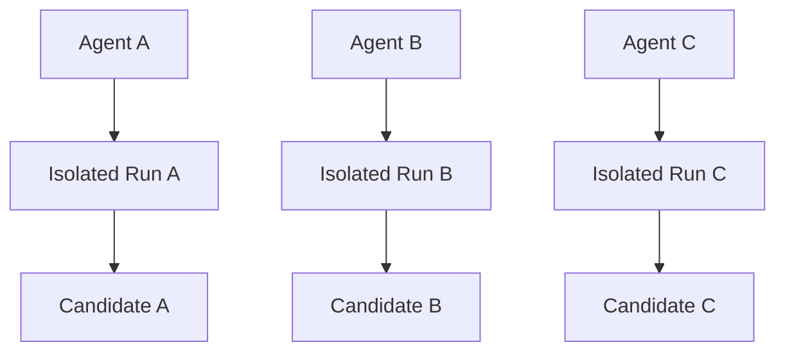
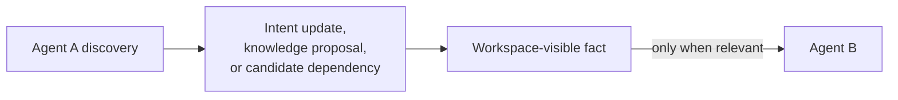
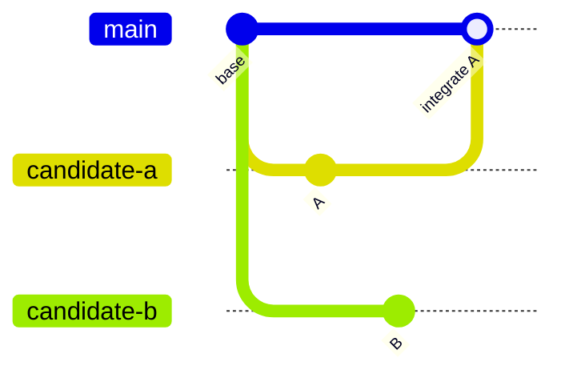
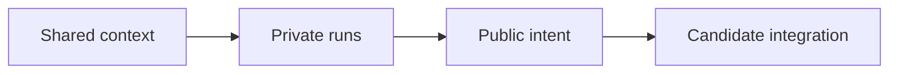

Once I had one coding agent working safely in an isolated Git worktree, starting a second agent felt almost too easy.

I had three tasks waiting at work: a bug in authentication, an improvement to payment error handling, and a flaky integration test. None seemed large enough to block the others. I created a separate run for each task and watched three agents begin exploring in parallel.

The filesystem problem appeared to be solved. Each agent had its own branch and worktree.

My next instinct was to make the agents communicate.

If one agent discovered something important, should it message the others? Should a planner assign work? Did I need a shared scratchpad, a task graph, or a protocol for agent-to-agent handoffs?

I was reaching for a swarm before I had proved that a swarm was necessary.

The agents were not collaborating on one thought. They were performing separate engineering runs. Most of the time, they did not need to talk to one another at all.

## Isolation removed the need for constant coordination

The three runs looked like this:



Each run had its own goal, context snapshot, worktree, temporary plan, and result.

They shared the same engineering environment:

- repository policies
- coding standards
- system context
- reusable skills
- durable knowledge
- integration rules

They did not need to share:

- a live plan
- a scratchpad
- intermediate guesses
- temporary reasoning
- the entire conversation with the human

That separation was healthy. The private state let each run explore without turning every idea into a coordination event. The shared state gave all runs a consistent understanding of the system.

## The shared scratchpad made things worse

I briefly experimented with the opposite approach: one shared task file that multiple sessions could update.

It became ambiguous almost immediately.

One agent wrote that a component should be refactored. Another read the note after the first agent had abandoned that plan, but before the file had been corrected. A temporary hypothesis crossed a run boundary and acquired the appearance of shared truth.

The issue was not simultaneous file editing. Git could detect that. The deeper issue was lifecycle. A private plan was being stored in a public place.

The rule I took from that experiment is:

> Private plan, public intent.

An agent's plan belongs to its run. Its intent should be visible to the workspace.

## Intent is the minimum useful coordination signal

Other runs do not need every step of an agent's plan. They do benefit from knowing what area the run expects to change.

A small intent record can say:

```yaml
run: R42
goal: "Fix authentication refresh timing"
primary_repo: frontend
expected_scope:
  - src/auth/
  - tests/auth/
interfaces:
  - token refresh endpoint
status: running
```

Another run might declare:

```yaml
run: R43
goal: "Improve payment error messages"
primary_repo: frontend
expected_scope:
  - src/payments/
interfaces:
  - notification component
status: running
```

These runs are probably independent. If both declare the same interface or files, the coordinator can warn the human that integration risk is higher.

Intent is not a lock. Agents often discover that the real change lies somewhere unexpected. The record should be updated as the run learns more.

Its purpose is awareness, not a false guarantee.

## Communication through durable facts

What happens when Agent A discovers something Agent B genuinely needs?

The answer still does not have to be a direct message.

If the discovery is durable, Agent A can produce a knowledge proposal. If it changes the public contract of its work, it can update its intent. If it creates a dependency, it can record that dependency in the candidate.



This form of indirect coordination has several advantages:

- the information is inspectable by the human
- a later run can use it too
- temporary reasoning is not broadcast as fact
- agents remain replaceable and independent
- the architecture does not require one vendor's messaging protocol

Direct handoffs can still be useful for tightly coupled tasks. They are an extension, not the foundation.

## Candidates meet at integration, not during execution

Concurrent runs can still conflict. Isolation does not make incompatible changes compatible.

Suppose Run A and Run B both produce candidates based on the same commit:



Candidate B must be rebased or otherwise tested against the new target. If the two changes touch the same behaviour, a human or integration policy must decide how they combine.

This is not a reason to make agents coordinate every edit in real time. Humans working on branches also integrate at a deliberate boundary. The candidate model applies the same discipline to agent work.

The workspace coordinator can help by:

- showing active intents
- detecting overlapping paths or interfaces
- recording candidate dependencies
- choosing an integration order
- rerunning validation after rebase
- preserving evidence when a candidate is rejected

The coordinator manages runs and integration. It does not need to become the brain of a synthetic team.

## Multiple agents are a capacity decision

There is a seductive idea that more agents automatically create more progress. In practice, parallelism helps only when the work can be separated and the human can absorb the results.

I found three common limits:

1. **Task coupling**: two changes depend on the same unresolved design decision.
2. **Integration capacity**: candidates arrive faster than I can review and combine them.
3. **Runtime contention**: isolated files still compete for ports, databases, and other local resources.

The first two are reasons to limit concurrency. The third became the next architectural problem.

The useful metric is not how many agents are running. It is how many trustworthy candidates can move through integration without overwhelming the system or the human.

## What I learned

Running several coding agents at work initially made me imagine a miniature organisation: agents assigning tasks, negotiating ownership, and keeping one another updated.

The practical system was much simpler.

Each agent needed a private, isolated place to work. All agents needed the same durable engineering context. The human needed to see their public intent. Their results needed to meet at an integration boundary.

That produced a model I trust more than a shared agent brain:



Multiple agents can be useful without becoming a swarm. They can work independently, communicate through durable facts when necessary, and remain compatible with Codex, Claude Code, Copilot CLI, or a custom script.

But the first time two isolated runs both started a development server, I learned that separate worktrees solve only one kind of interference.

That is the subject of [Part 6: Worktrees Are Not Enough](/posts/worktrees-are-not-enough/).
