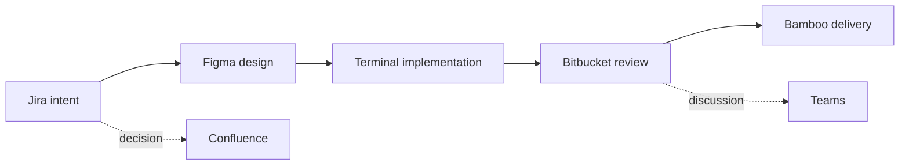

Consider a routine software change: update an account settings flow after a design review.

The ticket is in Jira. The proposed interaction is in Figma. The decision explaining an exception lives in Confluence. The implementation is in a local terminal and editor. The branch and pull request are in Bitbucket. Bamboo owns build and deployment state. A reviewer asks a question in Microsoft Teams.

None of these applications is necessarily bad. In fact, each may be very good at its part. Yet completing one modest change can feel like operating a switchboard.

We normally call this “the tab problem,” as if the main issue were browser chrome. Closing tabs, pinning favourites, or buying a wider monitor may reduce visual clutter, but they do not remove the underlying work.

My thesis is that **tab overload is a visible symptom of app-centric fragmentation: each application models and owns one partial representation of the same workflow, while the user must repeatedly reconstruct how those representations relate**. The cost is not only switching windows. It is recovering intent, identity, sequence, and authority every time the work crosses an application boundary.

This article diagnoses that fragmentation. It deliberately stops short of proposing the complete replacement, because a useful solution must begin by understanding what is actually being lost.

## One change, seven partial truths

Take a fictional change identified as `PAY-241`: add an intermediate confirmation when a user changes the payout account.

The workflow might look like this:

The diagram is simple. The lived experience is not.

Jira may say why the change matters, who requested it, and which acceptance criteria define success. Figma shows exact states and interactions but may not explain why one rejected alternative was rejected. Confluence preserves the security decision, although the page title does not contain `PAY-241`. The Git branch contains the actual implementation. Bitbucket shows commits, comments, and approval status. Bamboo knows whether the artifact reached staging. Teams contains the sentence that changed the review direction.

Each system contains a valid truth, but none contains **the change**.

The developer becomes the integration layer. They remember that `feature/payout-confirmation` corresponds to `PAY-241`; that “Settings flow v3” is the relevant Figma section; that Bamboo result `8127` built commit `4f6d...`; and that the final decision is in a reply beneath a Teams message, not in the ticket.

That memory work is easy to overlook because it rarely appears in a delivery metric. It shows up as hesitation: opening three similar pages, checking timestamps, searching a channel, comparing commit hashes, and asking, “Is this still the current design?”

## Applications organise around nouns, not the user's outcome

The fragmentation is architectural. Each application has a natural primary object:

| Application | Primary objects                          | What the user is actually asking                            |
| ----------- | ---------------------------------------- | ----------------------------------------------------------- |
| Jira        | issue, epic, sprint                      | What outcome and constraints are we committing to?          |
| Figma       | file, page, frame, comment               | Which experience are we implementing?                       |
| Confluence  | space, page, comment                     | What decision or knowledge governs this change?             |
| Bitbucket   | repository, branch, commit, pull request | What changed, and is it ready to merge?                     |
| Bamboo      | plan, build result, deployment result    | Did this exact change pass and reach the right environment? |
| Teams       | team, channel, chat, message             | What did people decide or request?                          |
| Terminal    | directory, process, command, file        | What am I doing right now to move the change forward?       |

Those models are reasonable. Jira should not pretend a design frame is an issue, and Figma should not become a deployment engine. The problem appears at the seams: the user's unit of work is an outcome that traverses all of them, while navigation is organised by the owning application and its nouns.

This is app-centric computing. The first decision is “which application has the next piece?” Only then can the user navigate to the object. The actual workflow—understand, design, implement, review, deliver—exists mostly in the user's head.

## Switching cost is mostly context reconstruction

The popular phrase “context switching” can make the cost sound like a generic human inability to multitask. A more precise description is **context reconstruction**.

When I move from the ticket to the design, I must establish:

- Does this file belong to the same request?
- Which frame is authoritative?
- Was it updated after the acceptance criteria?
- Are comments resolved because the decision was made, or merely because the thread was cleaned up?

Moving from source control to CI requires another reconstruction:

- Which build corresponds to the current pull-request head?
- Did it run before or after the last push?
- Is a green plan sufficient, or is a deployment result also required?
- Does “staging” refer to the environment expected by the ticket?

The interaction cost is not the mouse movement between tabs. It is proving that two objects from different systems refer to the same work at the same moment.

Stable identifiers help. A branch named with `PAY-241`, a pull request linked to the issue, and a build carrying the commit hash reduce ambiguity. Atlassian's Jira Software development-information API explicitly models commits, branches, and pull requests supplied by integrations ([Jira Software Development Information API](https://developer.atlassian.com/cloud/jira/software/rest/api-group-development-information/)). Its broader integration API also models builds and deployments ([Jira Software REST API introduction](https://developer.atlassian.com/cloud/jira/software/rest/intro/)). These integrations are valuable because they move some reconstruction from human memory into data.

But they do not make the workflow whole.

## Why links help but do not solve the problem

Suppose every object links perfectly to every other object. The Jira issue shows the branch and build. The pull request includes Figma and Confluence URLs. A Teams message deep-links back to the exact tab or conversation; Teams officially supports links to applications, chats, messages, teams, channels, and workflows ([Microsoft Teams deep links](https://learn.microsoft.com/en-us/microsoftteams/platform/concepts/build-and-test/deep-links)).

Navigation improves. Meaning remains distributed.

A link can answer **where**. It usually does not answer:

- Why is this destination relevant?
- Which part of it matters?
- Is it current or merely historical?
- What changed since I last viewed it?
- What action is now expected from me?
- Which source wins when two systems disagree?

The difference is easiest to see with design. The Figma REST API can expose files, versions, components, comments, and related resources; its comments endpoints can read and post file comments ([Figma comments endpoints](https://developers.figma.com/docs/rest-api/comments-endpoints/)). An integration can therefore show that a design exists and even mirror a comment count. It cannot infer that frame B is authoritative because a designer and security reviewer reached a nuanced compromise in a meeting.

Links create a graph of references. A workflow also needs typed relationships, freshness, status, and intent. “Related to `PAY-241`” is weaker than “approved design for `PAY-241`, superseding frame A as of Tuesday.”

## The same object can mean different things in each system

Fragmentation becomes dangerous when labels look equivalent but have different semantics.

“Done” in Jira may mean acceptance criteria were implemented. “Merged” in Bitbucket means code entered a target branch. “Successful” in Bamboo may mean a plan completed with no failing jobs. “Deployed” names an environment transition. A resolved Figma comment means a discussion is no longer open; it does not prove the implementation matches the frame. A thumbs-up in Teams may mean acknowledgement, approval, or politeness.

Bamboo's API distinction is instructive. It exposes deployment results tied to environments, versions, lifecycle, and deployment state ([Bamboo REST API](https://developer.atlassian.com/server/bamboo/rest/api-group-api/)). That is richer and more precise than a generic green badge. Yet a ticket UI that imports only the badge can flatten the meaning into “build passed,” leaving the user to discover whether the relevant artifact actually reached staging.

Aggregation can therefore create false coherence. A dashboard full of green icons may look unified while combining states that were never semantically aligned.

The terminal adds another form of mismatch. Local state can be newer than every remote representation. A developer may have uncommitted changes, a different environment file, a failing focused test, or an agent currently rewriting the branch. To Bitbucket, the last pushed commit is current. To the developer, it is already history. Neither representation is wrong; their clocks and scopes differ.

## Conversation is especially difficult to attach

Structured systems at least expose recognisable identifiers. Conversation is less cooperative.

A Teams thread might begin with a link to `PAY-241`, wander into authentication behaviour, settle a copy change, and end with a request to update the design. Which sentence is the decision? Who had authority to make it? Was the decision later superseded in Jira or Confluence?

Copying the thread into the ticket preserves text but not necessarily meaning. Linking it preserves location but not resolution. Summarising it introduces interpretation. Leaving it in Teams makes discovery depend on channel membership, retention, search vocabulary, and personal memory.

Confluence is often used to stabilise knowledge from conversation, but this creates another handoff: someone must turn a temporal discussion into a durable page and keep the link close to the work. Confluence's REST API supports pages, blog posts, spaces, users, groups, and other entities, so programmatic integration is possible ([Confluence Cloud REST API](https://developer.atlassian.com/cloud/confluence/rest/v1/intro/)). The difficult part is not fetching the page. It is deciding which paragraph is a governing decision and whether it remains valid.

AI summarisation can reduce reading time, but it does not eliminate authority questions. A fluent summary can make uncertain discussion sound settled. If an AI extracts “approved” from a conversational reaction without preserving source and speaker, it can make fragmentation more dangerous by hiding ambiguity.

## Search is necessary but reconstructive

Universal search is an attractive response: index everything, type `PAY-241`, and retrieve all matching objects.

That is genuinely useful. It is also still reconstructive. Search returns candidates; the user decides whether they belong together, which is current, and what to do next. Ranking tends to favour lexical match, recency, popularity, or access patterns. Workflow relevance is more specific.

A design may never mention the ticket ID. A Confluence page may govern twenty changes. A build is strongly linked by commit hash but has an unhelpful title. A decisive Teams message may say only “let's use the second option.” Search can find text, metadata, and sometimes semantic similarity. It cannot assume a single cross-system identity where none was recorded.

The underlying requirement is not merely better retrieval. It is preservation of relationships at the moment they are created: this design satisfies this acceptance criterion; this commit implements this decision; this build evaluates this commit; this message blocks this review. Retrofitting those relationships from content is always less certain.

## Why one giant application is the wrong diagnosis

If application boundaries cause pain, one tempting answer is to replace every system with one giant suite. That confuses uniformity with coherence.

Specialist tools exist because their domains are deep. Figma's canvas, Bitbucket's version-control model, Bamboo's execution history, and the terminal's direct relationship with the local machine are not interchangeable widgets. Rebuilding shallow versions of all of them in one shell would sacrifice capability and create a new monolith with its own tabs.

The goal should not be to erase ownership. It should be to stop making ownership the primary way a person locates and understands one outcome.

Nor is the answer to copy every piece of data into a central database. Copies become stale, permissions leak, provenance disappears, and mutation paths become unclear. A useful cross-application layer must respect source authority. Jira can remain authoritative for the issue, Figma for design, Bitbucket for repository state, Bamboo for execution, Confluence for durable knowledge, Teams for conversation, and the local environment for uncommitted work.

The missing layer is about relationship and orientation, not universal ownership.

## The failure modes are now clear

The tab problem contains several distinct failures:

1. **Identity fragmentation:** the same change has ticket IDs, URLs, branch names, commit hashes, build numbers, and informal names.
2. **State fragmentation:** each application exposes a valid but partial status with different timing and semantics.
3. **Intent fragmentation:** goals, constraints, designs, and decisions live in different representational forms.
4. **Action fragmentation:** the next step must be executed wherever its owning object lives.
5. **Attention fragmentation:** notifications arrive by application, not by the priority of the workflow.
6. **Authority fragmentation:** users must know which system or person resolves disagreement.

Tabs make these failures visible, but a desktop full of native windows would contain the same problem. So would a chat assistant that merely opens the same links on request.

This diagnosis also explains why application-level integrations feel simultaneously helpful and insufficient. They bridge two systems at a time. Jira can show a pull request; Teams can open a Jira tab; Bamboo can report a deployment. The user still carries the end-to-end model.

## Before designing the answer

The correct question is no longer “How do we reduce the number of tabs?” It is:

> How can the user's current outcome become the stable unit of orientation while specialist applications remain authoritative for their parts?

Any credible answer will need to preserve several properties:

- Provenance: every summary and state must lead back to its source.
- Freshness: users must know when information was observed.
- Semantics: relationships must mean more than “has a link.”
- Permissions: a unified view must not become an access-control bypass.
- Local context: uncommitted and in-progress work cannot be ignored.
- Human judgment: uncertain decisions must remain visibly uncertain.

The next article proposes a **workflow-centric workbench** as one possible answer. It will not replace Bamboo, Jira, Bitbucket, Figma, Confluence, Teams, or the terminal. Its job is narrower and more ambitious: make the workflow, rather than the application, the first thing the user sees.

_Series: [Index](/posts/00-from-apps-to-intent-driven-computing/) · Previous: [04 — Why URLs Will Survive AI](/posts/04-why-urls-will-survive-ai/) · Next: [06 — The Workflow-Centric Workbench](/posts/06-the-workflow-centric-workbench/)_

## Sources

- [Jira Software Cloud Development Information API](https://developer.atlassian.com/cloud/jira/software/rest/api-group-development-information/)
- [Jira Software REST API introduction](https://developer.atlassian.com/cloud/jira/software/rest/intro/)
- [Bamboo REST API](https://developer.atlassian.com/server/bamboo/rest/api-group-api/)
- [Figma REST API comments endpoints](https://developers.figma.com/docs/rest-api/comments-endpoints/)
- [Confluence Cloud REST API](https://developer.atlassian.com/cloud/confluence/rest/v1/intro/)
- [Microsoft Teams deep links](https://learn.microsoft.com/en-us/microsoftteams/platform/concepts/build-and-test/deep-links)
