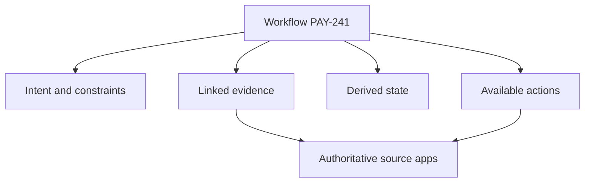

The [previous article](/posts/05-the-tab-problem-and-app-centric-fragmentation/) described a software change scattered across Jira, Figma, Confluence, Bitbucket, Bamboo, Microsoft Teams, and a local terminal. The visible symptom was a crowded tab bar. The deeper problem was that identity, state, intent, action, attention, and authority were divided by application.

We should not respond by rebuilding all seven products inside an eighth.

A better response is a **workflow-centric workbench**: a surface where the primary object is the outcome a person is moving toward, while specialist applications remain authoritative for their own objects. The workbench assembles evidence, relationships, status, and available actions around that outcome. It offers orientation and coordination, not universal ownership.

My thesis is that **the workbench should model a workflow as a temporary, evolving graph of intent, evidence, decisions, and actions—not as a new system of record**. That distinction prevents it from becoming either a shallow dashboard or an invasive replacement platform. It also distinguishes the idea from a conventional developer portal, whose centre of gravity is usually the organisation's relatively stable software catalog.

## Start with the outcome, not the application

Return to `PAY-241`, the fictional change that adds confirmation before a payout account is updated.

In an app-centric environment, the developer begins by choosing Jira, Figma, Bitbucket, or Bamboo. In a workflow-centric workbench, they begin with `PAY-241` or with a natural description such as “payout confirmation change.” The opening view answers four questions:

1. What are we trying to accomplish?
2. What evidence defines the current state?
3. What is blocking or uncertain?
4. What can I do next?

The page might show:

- Intent and acceptance criteria from Jira.
- The approved Figma frame, plus an explicit relationship saying what it approves.
- The governing Confluence decision and its last observed version.
- Local branch state, uncommitted changes, and focused-test results.
- The Bitbucket pull request, current head commit, review threads, and approvals.
- The Bamboo plan and deployment result associated with that commit.
- A Teams discussion flagged as a possible decision, with its source link and participants.

The unit is not a copied “project.” It is a bounded effort with a beginning, changing state, and completion condition.



This diagram is intentionally asymmetric. Evidence flows into the workbench, while actions go back to the owning systems. The workbench does not silently become authoritative merely because it can display everything.

## A workflow object needs more than links

The simplest implementation would be a page of bookmarks grouped under `PAY-241`. That would reduce searching, but it would not address the semantic failures diagnosed earlier.

A useful workflow object needs at least five kinds of information.

### 1. Intent

Intent states why the workflow exists, what outcome matters, which constraints apply, and what is out of scope. This is more than the Jira description. It may include an acceptance criterion, a security constraint from Confluence, and a decision recorded during review.

Intent should be compact, inspectable, and linked to evidence. The workbench may synthesise it, but it should show whether each statement was copied, inferred, or explicitly confirmed. This follows the same principle as [intent-first pull-request review](/posts/pr-review-should-start-with-intent/): implementation is evidence; intent is the contract against which evidence is evaluated.

### 2. Artifacts and evidence

Artifacts are the source-owned objects: issue, frame, page, branch, commit, pull request, build, deployment, message, file, and test run. The workbench stores references and selected observations, not an unqualified replacement copy.

Each observation should carry provenance, observed time, source version or identifier when available, and permission context. “Bamboo is green” is weak. “Deployment result 8127 reported `Successful` for commit `4f6d...` in staging at 14:32, observed at 14:33” is reviewable.

### 3. Typed relationships

Relationships give links meaning:

```text
Figma frame B --approved design for--> PAY-241
commit 4f6d    --implements-----------> PAY-241
Bamboo 8127   --evaluates------------> commit 4f6d
Teams msg 391 --may supersede--------> Confluence decision v4
```

The verbs matter. Some relations can be asserted by source integrations, such as a build carrying a commit hash. Others are human declarations. Still others are AI inferences and should remain visibly provisional until confirmed.

### 4. Derived workflow state

The workbench can derive a higher-level state from evidence, but it must resist flattening everything into one green badge.

For example:

```text
Implementation: pushed; local tree has uncommitted changes
Review:         one unresolved blocking thread
Verification:   head commit passed unit plan
Delivery:       previous commit is on staging; head is not deployed
Decision:       copy approved; security exception still uncertain
```

This is more useful than “In progress” because it preserves the dimensions that demand different actions. It also tells the truth when sources disagree or have different clocks.

### 5. Actions

Orientation without action becomes another reporting dashboard. The workbench should make the next valid actions available near the evidence: open the design at the relevant frame, reply to a review thread, run a focused test locally, request an approval, trigger an authorised Bamboo deployment, or update the Jira state.

An action should be executed by the source system or a narrow connector using the user's authority. The workbench should show target, effect, and permission before mutation. High-impact actions need confirmation and should return source evidence after completion.

## The workbench is a projection, not a warehouse

The architectural temptation is to ingest all tool data into one large database and declare the integration solved. That creates a data warehouse, not necessarily a trustworthy workbench.

The better model is a **materialised projection with links back to authority**. The workbench can cache enough metadata for fast orientation and cross-source relationships. Dynamic or sensitive details can be fetched on demand. Mutations return to the owning application.

A practical architecture has four layers:

1. **Connectors** read source objects and invoke narrowly scoped actions.
2. **Identity resolution** maps ticket IDs, URLs, branch names, commits, and user confirmations into workflow relationships.
3. **Workflow projection** stores intent, typed links, observations, freshness, and user-specific attention state.
4. **Experience surfaces** render the workbench in a Web App, desktop shell, IDE panel, terminal view, or AI host.

The interface can vary without changing the workflow model. A full browser view is useful for visual comparison. A compact terminal command might answer `workbench status PAY-241`. An IDE panel can show only the current branch's workflow. An AI interface can query evidence and propose the next step. As argued in the first article of this series, these surfaces are complements when they share one domain layer.

This design also makes failure visible. If Bamboo is unavailable, the deployment card should say the source could not be refreshed and retain the last observed time. It should not silently treat missing data as a failed or successful deployment. If the user lacks permission to a Figma file, the workbench should show an inaccessible reference rather than leaking cached content.

## Local context changes the design

Many integration dashboards stop at remote APIs. A developer workbench cannot.

The local working tree often contains the newest and most consequential state: edits not yet committed, generated files, a test process still running, a local service, or a coding agent halfway through a task. If the workbench ignores that state, its beautiful cross-system overview is already behind reality.

This is where the [Local Web App pattern](/posts/02-local-web-apps-are-underrated/) becomes useful. A local companion can observe the current repository with explicit permission, run bounded commands, and serve a visual UI. It can then combine remote evidence with local facts without uploading the entire working tree.

The boundary should be deliberate. The local companion can report branch, commit, changed paths, and test outcomes. It should not expose arbitrary filesystem access to remote connectors or send source code to an AI model by default. Users need to see which observations stay local, which metadata synchronises, and which actions invoke external services.

A cloud-only workbench may still suit non-development workflows. For software delivery, however, local and remote state are two halves of the same outcome.

## AI is useful at the uncertain seams

Deterministic integrations should handle deterministic relationships. If a Bamboo result names a commit hash, no language model is needed. If a Bitbucket pull request explicitly references `PAY-241`, ordinary parsing can attach it.

AI becomes useful where the relationship is semantic or conversational:

- Identify a Teams passage that might alter an acceptance criterion.
- Compare a Figma annotation with the implemented UI description.
- Summarise unresolved review threads by decision required.
- Explain why the current deployment does not contain the pull-request head.
- Propose a next action based on blocked dimensions.

The word “might” matters. AI output should enter the workflow graph as a claim with sources, confidence, and confirmation state—not as silent truth. A generated summary needs citations to source objects. A proposed mutation needs a preview. A decision extracted from conversation should identify speaker and surrounding context.

This keeps AI in its strongest role: reducing synthesis cost while making uncertainty legible. It does not grant the model authority simply because the model can read across applications.

## This is not merely a developer portal

The workbench overlaps with developer portals, so the distinction should be explicit.

Backstage describes itself as an open-source framework for building developer portals. Its Software Catalog centres on relatively stable entities such as services, websites, libraries, and data pipelines; it tracks ownership and metadata, makes software discoverable, and lets plugins organise infrastructure tooling around catalog entities ([Backstage Software Catalog](https://backstage.io/docs/features/software-catalog/)). That is a valuable organisational model.

A workflow-centric workbench has a different centre of gravity:

| Developer portal                                        | Workflow-centric workbench                              |
| ------------------------------------------------------- | ------------------------------------------------------- |
| Primary key is a software entity or owned resource      | Primary key is an outcome or bounded effort             |
| Optimises discovery, standards, ownership, self-service | Optimises orientation, coordination, and next action    |
| Mostly durable organisational topology                  | Temporary graph that changes minute by minute           |
| Typical question: “How do I operate this service?”      | Typical question: “What does this change need now?”     |
| Often starts from centrally registered metadata         | Often starts from a ticket, branch, incident, or intent |

The categories can coexist and integrate. A workflow may involve the `payments-api` catalog entity, and the portal can provide ownership, documentation, runbooks, and templates. The workbench can link to that entity rather than recreating it. Conversely, a developer portal plugin could host a workflow view.

The distinction is conceptual, not a claim that they require different products. If a portal makes the active outcome its primary object and models live cross-system evidence, it is acting as a workflow workbench. If the workbench becomes the catalogue of owned services and golden paths, it is taking on portal responsibilities.

Keeping the distinction prevents scope collapse. The workbench does not need to solve software discovery, scaffolding, documentation publishing, and platform governance before it can help one developer finish `PAY-241`.

## A morning with the workbench

Imagine opening the workbench after a reviewer has responded overnight.

At the top, `PAY-241` still says: “Add confirmation before payout-account replacement without changing the existing SSO flow.” That intent was confirmed by the product owner and links to the Jira criteria.

Below it, the workbench reports three changes since the developer last looked:

1. A Bitbucket reviewer marked one thread blocking and requested an error-copy change.
2. A designer linked a new Figma frame and marked it as replacing the previous error state.
3. Bamboo completed a staging deployment, but the deployed commit predates the latest push.

A Teams thread is shown separately as “possible decision: retain 24-hour verification window.” It has not been promoted into confirmed intent because the relevant owner has not acknowledged it.

The suggested next actions are therefore not a generic inbox. They are tied to workflow state:

- Confirm whether the Teams statement changes the acceptance criteria.
- Open the new Figma frame beside the blocking review comment.
- Apply the copy change locally and run the focused test.
- Push, wait for the plan associated with the new head, then deploy that artifact.

Every item links to its source. The local action runs locally. The deployment action remains governed by Bamboo permissions. The user can disagree with the suggested order.

The workbench has not done the work automatically. It has removed the reconstruction tax that obscured the work.

## What the first version should not do

The concept can expand without limit, so a credible first version needs restraint.

It should not:

- Mirror every field from every application.
- Replace source-specific editors, canvases, review UIs, or logs.
- Infer completion from a single status label.
- Execute broad actions with stored superuser credentials.
- Present AI summaries without provenance.
- Become a second notification centre containing every event.
- Require organisation-wide modelling before one workflow is useful.

A narrow first version could support one workflow type—say a Jira-backed code change—and four integrations: local Git, Bitbucket, Bamboo, and links to design or knowledge evidence. It could answer current head, review blockers, build/deployment correspondence, and intent. Teams and Figma semantics can come later when the basic identity and authority model is trustworthy.

Success is not “all tools connected.” Success is that a developer can resume a change after interruption and correctly identify its state and next decision faster, with fewer mistaken assumptions.

## From a collection of apps to a place for work

The workflow-centric workbench changes the first question from “Which app should I open?” to “Which outcome am I advancing?”

That sounds like a navigation improvement, but it reaches deeper. The workbench gives the workflow an identity independent of any one source, while refusing to erase source authority. It preserves intent alongside implementation, distinguishes observations from inferences, connects local and remote state, and places actions beside the evidence that justifies them.

Its value is not fewer tabs as such. Some actions should still open Figma, Bitbucket, Bamboo, or a terminal. The value is that leaving and returning no longer destroys orientation.

This is also why the workbench is not simply a developer portal with a different name. A portal tells me what software exists and how the organisation expects me to operate it. A workbench tells me what this evolving piece of work means now, why it is not finished, and which authorised action could move it forward.

Specialist applications remain. Their boundaries become less cognitively dominant. The workflow finally gains a place of its own.

_Series: [Index](/posts/00-from-apps-to-intent-driven-computing/) · Previous: [05 — The Tab Problem](/posts/05-the-tab-problem-and-app-centric-fragmentation/) · Next: [07 — A Framework for Composable Workspaces](/posts/07-framework-for-composable-workspaces/)_

## Sources

- [Backstage Software Catalog](https://backstage.io/docs/features/software-catalog/)
- [Backstage overview](https://backstage.io/docs/overview/generated-index/)
- [Jira Software Cloud Development Information API](https://developer.atlassian.com/cloud/jira/software/rest/api-group-development-information/)
- [Bamboo REST API](https://developer.atlassian.com/server/bamboo/rest/api-group-api/)
- [Microsoft Teams deep links](https://learn.microsoft.com/en-us/microsoftteams/platform/concepts/build-and-test/deep-links)
