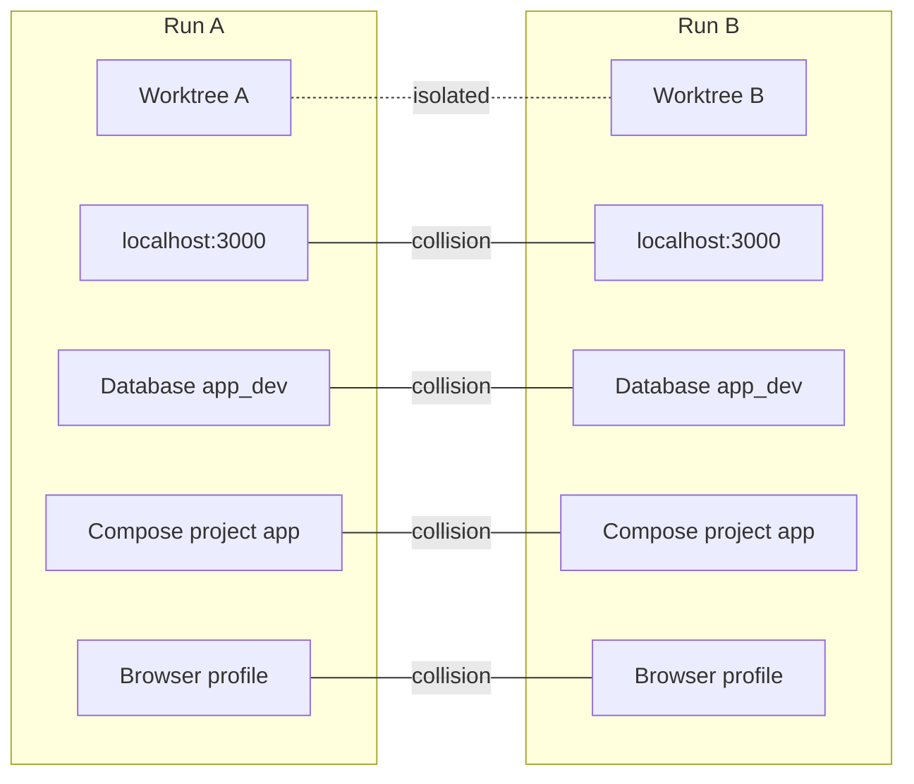
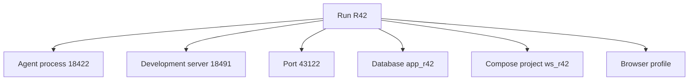

The two coding agents were in different Git worktrees. They were on different branches. They were editing different features.

Then the second agent started the application and received the familiar message:

```text
Error: address already in use 0.0.0.0:3000
```

Its next move was reasonable in isolation: find the process using the port and stop it.

Unfortunately, that process belonged to the first agent.

The worktrees had kept the source files separate. The operating system had not kept the executions separate.

I had solved filesystem concurrency and mistaken it for run isolation.

## The second layer of concurrency

A worktree gives each run its own checked-out files and index. It does not create a new network namespace, process table, database, container runtime, or home directory.

The real picture looked like this:



The first boundary is **filesystem isolation**.

The second is **runtime resource coordination**.

For one agent run, collisions may be rare enough to handle manually. With several runs, scheduled maintenance, and a human development server all active, hidden ownership becomes dangerous.

## A run should own what it starts

The simplest improvement is to make runtime resources part of the run model.



Ownership changes cleanup from a guess into an operation.

If Run R42 is cancelled, the coordinator can stop its processes, release its ports, and remove its temporary resources. It should never kill an arbitrary process just because that process occupies a desired port.

This rule is worth stating explicitly:

> A run may clean up resources it owns. It must treat everything else as external.

That protects human work as well as other agents.

## Port allocation is small but revealing

Ports are the easiest resource to see, so they make a good first example.

Instead of assuming port `3000`, the coordinator can allocate an available port and pass it through the run environment:

```text
APP_PORT=43122
API_PORT=43123
RUN_ID=R42
```

The run registry records the lease:

```yaml
run: R42
resources:
  ports: [43122, 43123]
  processes: [18422, 18491]
```

The application must support configurable ports, which is itself a useful test of twelve-factor discipline. Hard-coded runtime assumptions are inconvenient for agents, CI, preview environments, and human developers alike.

A perfect allocator is not required for a local reference implementation. Reserving from a configured range and reconciling with listening sockets may be enough. The important change is that the allocation is visible and owned.

## Databases and services need names too

The same pattern extends to less obvious resources.

Two runs using the same development database can produce tests that pass or fail depending on timing. One run may migrate the schema while another expects the earlier version. Shared queues and caches create similarly confusing interference.

Possible strategies include:

- a database or schema per run
- unique Docker Compose project names
- namespaced queue topics
- temporary data directories
- test transactions with reliable rollback
- explicitly shared read-only services

Not every project can provision a complete stack per run. The architecture should describe ownership and sharing even when isolation is imperfect.

For example:

```yaml
resources:
  database:
    name: app_r42
    lifecycle: run
  identity_service:
    endpoint: http://localhost:8081
    lifecycle: shared
    access: read-only-test-tenant
```

Now a shared service is a deliberate dependency rather than an invisible assumption.

## Process identity must survive a crash

A coordinator cannot rely only on an in-memory list of child processes. The coordinator itself may stop while agent processes continue running.

Useful process records include:

- process ID
- start time
- command or executable identity
- owning run
- working directory
- allocated ports

On restart, the coordinator can reconcile the registry with the operating system. A matching process can be reattached to the run's status. A missing process can produce a `process.lost` event. A process ID that has been reused must not be mistaken for the original child.

This is one reason local coordinator state does not belong entirely in Git. It changes frequently, contains machine-specific identifiers, and is meaningful only on the current host. SQLite or another simple local store is a more natural default.

Durable engineering events can still be promoted separately.

## Worktrees are isolation by convention, not security

This distinction is essential.

A worktree keeps ordinary Git operations separate. It does not prevent a process from reading or modifying another directory that the operating-system user can access. Environment variables, SSH keys, credentials, and local services may all remain visible.

The run registry also provides coordination, not containment. Recording that an agent owns two ports does not technically prevent it from binding a third.

For trusted local coding agents working under human supervision, convention-based isolation may be an acceptable default. For untrusted code or stronger compliance requirements, the execution layer needs stronger controls.

Possible extensions include:

- Docker containers
- development containers
- virtual machines
- Nix or other reproducible environments
- restricted operating-system users
- network and filesystem sandboxing

These mechanisms should extend the run interface rather than redefine the architecture.

```text
run(prompt, cwd, env, resources)
```

One implementation may use a local process in a worktree. Another may launch a container or remote sandbox. Both can still produce the same candidate and events.

## Isolation has a cost

Perfectly cloning every dependency for every run can consume more CPU, memory, disk, and startup time than the work justifies.

The useful approach is layered:

1. **Default**: worktree plus explicit ports and process ownership.
2. **When needed**: per-run databases, containers, or service namespaces.
3. **For untrusted execution**: a real security boundary such as a sandbox or VM.

The architecture should make it clear which guarantees each layer provides. “Isolated” without a named boundary is too vague to be useful.

## What I learned

When the second agent tried to stop the first agent's server, it was behaving sensibly inside an incomplete model. It saw a port conflict but not resource ownership.

The fix was not another instruction saying, “Be careful with port 3000.” The fix was to represent runtime resources as part of the run.

That produced another principle:

> A run owns its filesystem changes, processes, ports, and temporary services, and it cleans up only what it owns.

Git worktrees remain a powerful default. They are simply not the whole isolation story, and they should never be described as a security sandbox.

Once runs had goals, boundaries, and owned resources, I noticed that the same model could support more than interactive feature work. It could also support the quiet engineering tasks that teams repeatedly postpone.

That is the subject of [Part 7: From Coding Agent to Engineering Team](/posts/from-coding-agent-to-engineering-team/).
