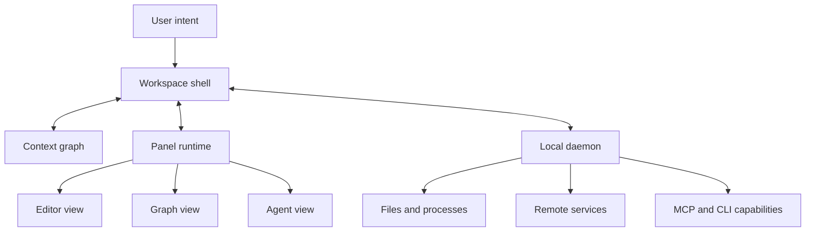

Imagine asking a workspace to investigate a production incident.

It opens the failed deployment beside the relevant pull request, streams logs into a terminal panel, shows a service map, asks an agent to compare the last known-good version, and creates a draft incident timeline. You select an error in the logs; the code view jumps to the likely call site, the map highlights the affected service, and the agent now understands what “this failure” refers to.

Most of those capabilities already exist. The difficult part is making them behave as one workspace rather than six applications arranged on the same screen.

Putting a dashboard, editor, terminal, and chat into movable rectangles is useful, but it is only layout composition. A truly composable workspace must also share meaning: which objects are present, what the current selection represents, which actions are available, what changed, and what the user is trying to accomplish.

My thesis is that **composable workspaces require a small semantic contract—entities, data, actions, views, events, and intents—implemented by a workspace shell, context graph, panel runtime, and local daemon**. Pixels can remain heterogeneous. Meaning cannot.

## Composition has three levels

“Composable” is often applied too early. It helps to separate three levels.

### Layout composition

Users can dock, resize, split, hide, and rearrange panels. Yet two adjacent panels may know nothing about one another.

### Data composition

Panels can exchange identifiers or datasets. Selecting a customer in one view can filter another. A tool result can populate a chart. This is more useful, but still limited if every pair of integrations needs a custom adapter.

### Workflow composition

The workspace understands entities, capabilities, events, and intent well enough to coordinate a multi-step task. It can propose the next useful view, route an action to an appropriate provider, maintain provenance, request permission at the right boundary, and preserve enough context to resume later.

The third level depends on the first two, but cannot be produced by layout alone. An iframe grid is not an operating model.

## The six-part semantic contract

The contract should be small enough for independent tools to adopt and expressive enough for a shell to coordinate them.

### 1. Entities: stable things in the workspace

An entity is a domain object with stable identity and type:

```json
{
  "id": "deploy://payments/prod/2026-08-07.3",
  "type": "deployment",
  "title": "payments prod 2026-08-07.3",
  "source": "deployment-service"
}
```

Examples include a file, repository, pull request, customer, invoice, experiment, deployment, alert, document, or generated plan. Entities let panels refer to the same thing without sharing implementation details.

The identifier need not be a public HTTP URL, but it should be stable within its scope and resolvable by an authorised provider.

### 2. Data: typed representations with provenance

Data is a representation of an entity or query result. It needs a media type or schema, the entity or query it came from, freshness information, and provenance.

A log panel and an agent may consume different representations of the same deployment. The panel needs a stream optimised for reading; the agent may need structured events with timestamps and service IDs. “Same entity” does not imply “same payload.”

Provenance is essential in AI workspaces. A summary should record which source versions supported it. Derived data should not silently masquerade as authoritative source data. The shell does not need to understand every schema, but it must preserve the relationships.

### 3. Actions: bounded capabilities over entities

Actions are typed operations such as `open`, `compare`, `run_tests`, `approve`, `annotate`, or `deploy`. They declare accepted entity types, input schema, possible effects, and the provider that executes them.

This resembles MCP tools, which expose named operations with input schemas to an AI host. MCP's value here is the architectural primitive of discoverable capability, not the claim that every workspace action must use MCP. Human menus, keyboard commands, CLIs, and automation APIs can project the same domain action differently ([MCP tools specification](https://modelcontextprotocol.io/specification/2025-11-25/server/tools)).

Consequential actions should declare whether they mutate state, are reversible, cross a remote boundary, or require confirmation. The provider must still enforce authorisation.

### 4. Views: projections, not owners of truth

A view presents or edits entities and data. It declares what it can render, which actions it supports directly, its preferred size, and whether it can serialise restorable state.

Possible views include a tree, table, editor, terminal, graph, map, media viewer, form, chat, or small MCP App. Multiple views can represent one entity without duplicating its identity. A deployment can appear as a timeline, log stream, topology node, and summary card.

Views should own interaction state such as zoom and cursor position. Durable domain changes should go through actions to the responsible provider. Otherwise closing a panel risks deleting the only copy of meaningful work.

### 5. Events: facts that something changed

Events describe completed facts: `selection.changed`, `entity.updated`, `run.started`, `permission.denied`, or `view.closed`. They include a source, timestamp, subject entity, correlation ID, and payload schema.

Events let the workspace react without hard-wiring every producer to every consumer. When a log selection changes, the context graph can update; interested views may highlight related entities; an agent can be notified if the user has granted that scope.

An event is not a command. `deployment.failed` records a fact; `rollback_deployment` requests an effect. Keeping them separate improves auditability and prevents a notification from being mistaken for permission to act.

### 6. Intents: desired outcomes above individual actions

Intent expresses what the user wants to accomplish: investigate an incident, prepare a customer review, reconcile invoices, publish a release, or compare design alternatives.

Intent is often incomplete. The workspace may need an AI planner or deterministic workflow to decompose it into queries and actions. It should preserve the original wording, resolved entities, constraints, plan, and approval decisions rather than reducing everything to a chat message.

An intent can be entered through language, a command palette, a template, a URL, or a button. This prevents “AI-native” from becoming synonymous with “chat-only.”

## Four runtime components

The semantic contract becomes useful through four cooperating runtime components:



### Workspace shell

The shell owns layout, navigation, commands, focus, notifications, permission prompts, and session restoration. It decides where a view appears and mediates movement between views. It should be opinionated about interaction consistency while remaining neutral about domain-specific rendering.

Visual Studio Code demonstrates shell-owned placement: extension views can appear in existing or custom containers and move between sidebars and panels ([VS Code Views](https://code.visualstudio.com/api/ux-guidelines/views)). It does not, by itself, provide the cross-domain semantic contract proposed here.

### Context graph

The context graph is working memory expressed as relationships, not a transcript dump. Nodes include entities, views, intents, users, tool results, and derived artefacts. Edges include `selected`, `opened-in`, `derived-from`, `blocks`, and `created-for`.

For an incident, the graph may connect the active deployment to a commit, service, alert, log selection, investigation intent, and draft timeline. When the user says “compare this with the previous one,” the assistant can resolve “this” from focus and selection while still showing the resolved entities before acting.

The graph needs scope and decay. Not everything visible should enter model context, and not everything once mentioned should remain active. The shell can expose a compact, inspectable subset based on focus, recency, explicit pinning, sensitivity, and token budget.

### Panel runtime

The panel runtime loads views, gives them a constrained API, routes events, applies themes and accessibility settings, and isolates failures. Views may be native components, Web components, sandboxed iframes, terminal surfaces, or remote streams.

The runtime should prefer narrow contracts for common UI and permit custom Web views when the domain needs them. VS Code's guidance treats Webviews as fully custom but recommends them only when the standard API is insufficient ([VS Code Webviews](https://code.visualstudio.com/api/ux-guidelines/webviews)). The lesson is that unlimited rendering power belongs behind an explicit isolation and lifecycle boundary.

### Local daemon

The local daemon connects the shell to capabilities that cannot or should not run inside a view: filesystem access, child processes, local databases, credential brokers, model runtimes, remote APIs, MCP servers, and long-running jobs.

It also provides continuity. A panel can close while a build continues. The shell can restart and reconnect to the job. A browser-based shell can retain a least-privilege bridge to local resources without giving every embedded view direct machine access.

“Local” describes placement near the user's machine and trust boundary, not a requirement that all data stay offline. The daemon may broker remote services while centralising capability, policy, and lifecycle.

## Lessons from existing systems, without searching for one winner

No current system needs to be declared the finished composable workspace. Several provide proven primitives.

### POSIX shells: action and stream composition

POSIX shells show how a shared invocation and stream convention lets independent programs compose. Commands do not need to understand each other's UI. Redirection, pipelines, environment, and exit status form a small contract ([POSIX Shell Command Language](https://pubs.opengroup.org/onlinepubs/9799919799/utilities/V3_chap02.html)).

The limitation is also instructive: byte streams and process status carry little domain meaning. Our workspace contract should keep the small-contract spirit while adding typed entities, effects, provenance, and user intent.

### The Web: identity and isolation

The Web contributes global resource identifiers, links, independent representations, and origin-based isolation. Those primitives let a workspace refer to durable objects and safely host content from different authorities. The W3C Web architecture emphasises the value of global identifiers and interaction with identified resources ([Architecture of the World Wide Web](https://www.w3.org/TR/webarch/)).

The limitation is that ordinary links do not define a shared command, event, or selection model. Embedding two Web Apps does not make their domain state interoperable.

### IDE workbenches: extensible views and commands

IDE workbenches demonstrate contribution points, command registries, movable views, active selections, and extension lifecycles. VS Code also centralises Workspace Trust and Restricted Mode so extensions can gate code-executing behaviour when a folder is untrusted ([VS Code Workspace Trust](https://code.visualstudio.com/api/extension-guides/workspace-trust)).

The transferable primitive is shell-mediated contribution and trust. The limitation is domain scope: an IDE naturally organises around files, repositories, and development actions. A general workspace must support other entity systems without pretending they are files.

### MCP hosts: discoverable AI-facing capabilities

MCP hosts demonstrate capability negotiation and discovery across independently developed servers. Tools, resources, and prompts provide different control surfaces for models, applications, and users ([MCP architecture overview](https://modelcontextprotocol.io/docs/learn/architecture)).

The limitation is that MCP is not a complete workspace UI, persistence model, or universal event bus. MCP Apps can supply contextual views, but the host still needs layout, identity, state, policy, and lifecycle rules.

These systems are reference libraries of architectural ideas. The goal is not to place a browser, IDE, terminal, and chat in a feature comparison table. It is to extract the smallest contracts that already enable independent components to cooperate.

## A concrete incident workflow

Return to the production incident. A user enters:

> Investigate why the latest payments deployment is timing out. Do not change production.

The workspace can process this without granting an agent unrestricted control:

1. The shell records an `investigate-incident` intent with a read-only constraint.
2. Entity providers resolve “latest payments deployment” and show the exact deployment for confirmation.
3. The context graph connects that deployment to its commit, service, alerts, and runbook.
4. The panel runtime opens logs, topology, code, and agent views with only the relevant entities.
5. The daemon streams logs and invokes read-only diagnostics.
6. Events update the graph as the user selects an error and the agent produces hypotheses.
7. The agent proposes a rollback, but the action metadata conflicts with the read-only intent, so the shell does not execute it.
8. The workspace persists a timeline entity with sources and a durable address.

The useful behaviour comes from shared semantics. Without entities, “latest” may resolve differently in each panel. Without action effects, “do not change production” is merely prose. Without provenance, the timeline cannot be audited. Without a graph, every view must rediscover context independently.

## Boundaries that keep composition safe

Composability expands the blast radius of mistakes. A few boundaries are non-negotiable.

### Least privilege per view and capability

A chart that displays metrics should not inherit filesystem or deployment access. Views request narrow capabilities; the shell and daemon enforce them. Providers re-check identity and authorisation.

### Trust is scoped, visible, and revocable

Trusting a workspace, server, or extension should not mean trusting every future action. The UI should distinguish source trust, data access, code execution, and consequential remote changes.

### Intent constrains planning

The original user constraint must remain machine-readable throughout orchestration. Plans and actions can narrow authority but cannot silently broaden it. A new permission request must return to the user.

### Events carry provenance

Every event and derived artefact should identify its source and correlation chain. This supports debugging, audit, and recovery when several agents and tools act concurrently.

### Views fail independently

A broken third-party panel should not corrupt the context graph or crash long-running jobs. Isolation, quotas, cancellation, and versioned contracts are part of the panel runtime, not optional polish.

## Start with one workflow, not a universal shell

The framework is intentionally broad, but implementation should be narrow.

Choose one workflow where users already juggle several surfaces: incident response, research synthesis, release preparation, customer review, or content production. Identify the five to ten entities that matter. Define a handful of actions and events. Implement two complementary views. Persist one intent and enough context to resume it.

Only generalise after observing repeated integration pressure. A practical contract grows from real hand-offs: “when this selection changes, that view needs this identifier and provenance.”

A thin first version might include:

```text
Entities: file, deployment, alert, investigation
Actions: open, query_logs, compare, create_timeline
Events: selection.changed, query.completed, entity.updated
Views: editor, logs, timeline, agent
Intent: investigate_incident with constraints
```

That is enough to test semantic composition without building a new operating system.

## The workspace is a coordination model

The future workspace will not succeed because every application has been squeezed into one window. It will succeed when different capabilities can cooperate without giving up their best interfaces.

An editor can remain an editor. A terminal can remain a terminal. A graph can remain visual. An agent can remain conversational. The shared layer supplies entity identity, typed data, bounded action, view contracts, factual events, and explicit intent.

The shell coordinates attention. The context graph maintains working relationships. The panel runtime provides visual composition and isolation. The local daemon supplies privileged capabilities and continuity.

Together they create something more useful than an app launcher and more honest than a universal chat box: a workspace that understands enough meaning to assemble the right instruments around the work at hand.

_Series: [Index](/posts/00-from-apps-to-intent-driven-computing/) · Previous: [06 — The Workflow-Centric Workbench](/posts/06-the-workflow-centric-workbench/) · Next: [08 — Intent-First Computing](/posts/08-intent-first-computing-and-future-ui/)_

## Sources

- [POSIX.1-2024 Shell Command Language](https://pubs.opengroup.org/onlinepubs/9799919799/utilities/V3_chap02.html)
- [W3C: Architecture of the World Wide Web](https://www.w3.org/TR/webarch/)
- [Visual Studio Code: Views](https://code.visualstudio.com/api/ux-guidelines/views)
- [Visual Studio Code: Webviews](https://code.visualstudio.com/api/ux-guidelines/webviews)
- [Visual Studio Code: Workspace Trust Extension Guide](https://code.visualstudio.com/api/extension-guides/workspace-trust)
- [MCP architecture overview](https://modelcontextprotocol.io/docs/learn/architecture)
- [MCP tools specification](https://modelcontextprotocol.io/specification/2025-11-25/server/tools)
