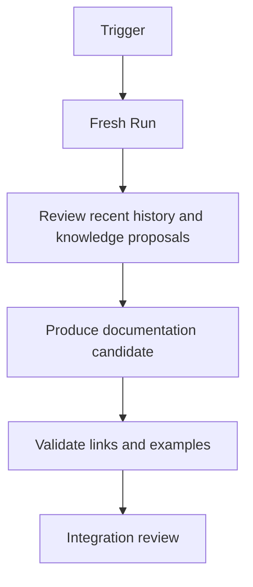
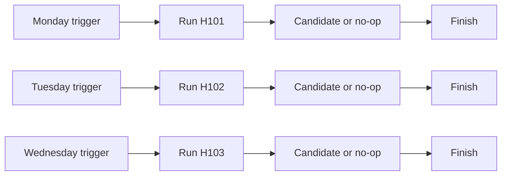
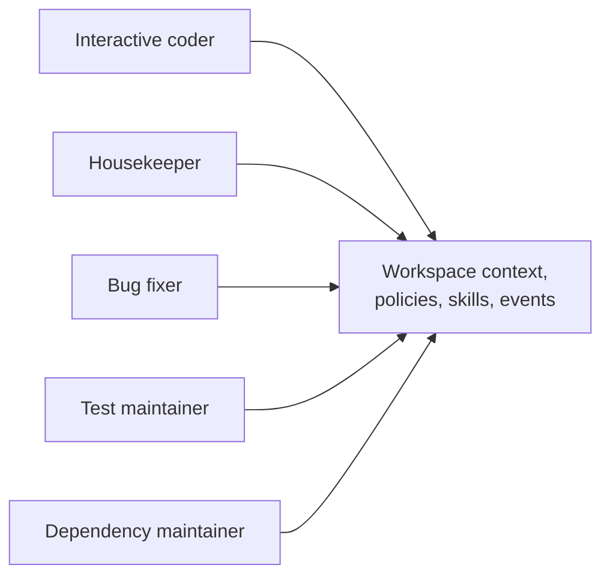

The most important work in a software system is not always attached to a feature request.

At work, I kept noticing a trail of small engineering problems that everybody understood and nobody quite owned. Documentation drifted after refactors. A test became flaky but not broken enough to stop development. Dependencies aged quietly. An architectural decision remained in a chat thread instead of the repository. A warning appeared in logs for months because it did not yet justify interrupting feature work.

A coding agent could help with all of these tasks. The obstacle was not capability. It was how to let the work happen repeatedly without creating an immortal agent with permanent access and a constantly growing memory.

The run model suggested a simpler answer: define engineering roles, then trigger fresh bounded runs for them.

## A role is a profile, not a person

I use names such as _housekeeper_, _bug fixer_, and \*test maintainer because they communicate intent. I do not mean that the agent becomes a synthetic employee with its own long-lived consciousness.

An engineering role is a reusable profile:

```yaml
name: housekeeper
purpose: "Keep shared engineering context accurate and useful."
mutation_scope:
  - .workspace/context/
  - docs/
allowed_actions:
  - inspect recent repository history
  - compare documentation with current code
  - propose focused corrections
integration:
  requires_review: true
```

The profile can define:

- instructions
- tools and permissions
- repository scope
- validation expectations
- resource limits
- output contract
- integration policy

When triggered, the profile creates a normal run. The run gets a current context snapshot, an isolated worktree, owned runtime resources, and a bounded goal.

The role is durable. The run is disposable.

## The housekeeper was the first role I wanted

Feature work naturally produces candidates because someone asks for a change. Knowledge maintenance is easier to neglect.

A housekeeper can review recent activity and ask:

- Did a merged change invalidate workspace documentation?
- Did several runs rediscover the same constraint?
- Is a knowledge proposal still waiting for review?
- Are instructions duplicated or contradictory?
- Did a repository acquire a new build or test path?
- Which temporary lessons should be promoted, and which should expire?

Its workflow remains deliberately conservative:



The housekeeper should not rewrite architecture because an agent once speculated about it. It should turn evidence into focused proposals that can be reviewed like any other change.

## Scheduled does not mean unbounded

The obvious implementation is a long-running agent that wakes up every day and remembers everything it has seen.

That design concentrates too much stale state and authority in one session. If the agent forms a bad assumption on Monday, the assumption may quietly shape its work for weeks.

I prefer repeated bounded runs:



Each run begins from current durable context and recent events. Each run can be inspected independently. Changing the agent, model, or instructions does not require migrating an opaque internal memory.

A “loop agent” can use exactly the same model. The loop is an external decision to trigger another bounded run, not a reason to keep one process and conversation alive forever.

## Do not build a scheduler too early

When I started imagining scheduled engineering, I also started imagining a daemon, a dashboard, a queue, retries, calendars, and distributed workers.

Most of that infrastructure was unnecessary for the local problem.

Operating systems already know how to trigger commands:

- `cron`
- `systemd` timers
- `launchd`
- Windows Task Scheduler
- CI schedules for repositories that prefer them

A reference workspace tool can expose a command such as:

```bash
ws run housekeeper
```

and generate an example timer configuration. The scheduler invokes the same run lifecycle used for interactive work.

This keeps the architecture composable. A future daemon can be added if there is evidence that local operating-system scheduling is insufficient.

## Engineering roles share a workspace, not a mind

Different roles can work from the same durable engineering context:



They work independently and return candidates.

The test maintainer does not need to chat continuously with the dependency maintainer. It needs to see current dependencies, current test policy, active intents, and already integrated results.

When roles overlap, the coordinator can serialize them, declare a dependency, or let both produce alternatives for integration. The same “private plan, public intent” rule continues to apply.

This is why I prefer the language of **engineering roles** to a swarm. It describes responsibility without requiring a theatrical simulation of an office.

## A team still needs integration policy

An automated role can create more maintenance burden if every run opens a noisy, low-value candidate.

The role's output contract should allow several outcomes:

```text
completed.no_change
completed.report
candidate.produced
knowledge.proposed
blocked.needs_human
failed
```

“No change” is a successful result when the system is healthy.

Integration policy can vary by role and risk. A documentation typo may be eligible for automatic integration after validation. A dependency update may require CI and human review. A bug fix that changes behaviour should follow the normal product review path.

The role does not remove accountability. It packages recurring work into inspectable attempts.

## This is continuous engineering

Continuous integration checks changes that someone has already proposed. Scheduled engineering roles can also look for work that has not yet been proposed.

Examples include:

- compare documentation examples with current command output
- inspect recent failures for a repeated pattern
- find dependencies approaching end of support
- detect tests that are repeatedly retried
- review accepted knowledge proposals for duplication
- check whether system context still matches repository contracts

The aim is not endless autonomous modification. It is to make small forms of stewardship regular, bounded, and reviewable.

That is the shift from using a coding agent as an interactive tool to building an engineering environment where several kinds of useful work can continue over time.

## What I learned

At first, I used coding agents only when I was present to describe a feature or bug. The neglected work around those tasks showed me a broader possibility.

A durable workspace can support a small set of engineering roles. Each role works through fresh isolated runs, shares verified context, publishes intent, and leaves a candidate or useful knowledge.

The important architecture is still not the agent hierarchy. It is the discipline around the work:

> Durable role, bounded run, explicit output, deliberate integration.

With that pattern, scheduled housekeeping is not a special species of agent. It is the same safe execution model triggered by time instead of a human prompt.

By this point, the pieces had accumulated: workspaces, repositories, context, runs, intents, candidates, events, resources, roles, and integration. The temptation was to start writing a large orchestration CLI.

I think that would have been the wrong next step.

The final article assembles the architecture and explains why the design should remain independent of any one implementation: [Part 8: An Open Workspace for Agentic Engineering](/posts/open-workspace-for-agentic-engineering/).
