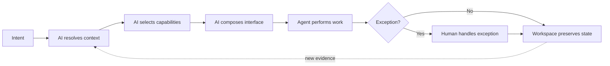

Imagine asking a computer, “Prepare me for tomorrow’s customer meeting.” A useful system would not merely return a paragraph.

It would identify the meeting, find the participants and previous decisions, collect the latest project state, surface a conflict in the contract, create a compact briefing, and preserve the evidence behind every claim. It might show a timeline for exploration, place the contract exception in an approval queue, and send one quiet reminder before the meeting. If you corrected a customer name, the correction would remain attached to the workspace rather than disappear into an old chat transcript.

That experience is intent-first: the person expresses the outcome, while the computer helps resolve context, select capabilities, and arrange the interaction needed to finish the work.

It is tempting to call this the future of chat. I think that is a category error. **Intent-first computing will make natural language an important entry point, but it will not make chat the universal interface.** Conversation is good for ambiguity, negotiation, and explanation. It is weak at dense comparison, precise manipulation, continuous monitoring, spatial work, and durable state. The future UI is therefore not one clever chatbot. It is a system that can move between several surfaces without losing the task.

This extends the argument in [Choosing the Right Application Interface](/posts/01-choosing-the-right-application-interface/): interface choice should follow the user’s cognitive work. AI changes who can choose and compose the surface; it does not repeal the reasons different surfaces exist.

## Intent is an outcome, not an underspecified command

An intent describes a desired change in the world. “Resize this image to 1200 pixels” is nearly a command because the operation and target are explicit. “Make these photos ready for the campaign” is an intent because “ready” depends on channel requirements, brand rules, rights, image quality, and approval status.

An intent-first system must progressively turn that ambiguity into a bounded plan. It needs to answer at least four questions:

1. What outcome does the user mean in this context?
2. Which data and capabilities are relevant and permitted?
3. Which parts can be performed automatically, and which require human judgment?
4. What representation will help the person understand and control the remaining work?

This is not a new HCI problem. Eric Horvitz’s work on mixed-initiative interfaces argued for coupling automated reasoning with direct manipulation, explicitly accounting for uncertainty, the cost of mistakes, and the user’s attention ([Principles of Mixed-Initiative User Interfaces](https://www.microsoft.com/en-us/research/publication/principles-mixed-initiative-user-interfaces/)). The models are newer, but the control problem is familiar: automation is useful only when initiative can pass sensibly between person and machine.

Natural language helps because it lets a person begin before translating the goal into menus, object types, and commands. Yet the system should treat the first utterance as evidence, not as a complete specification. “Book the usual trip to Melbourne” may resolve to a stable travel policy—or conceal ambiguity about dates, budget, companions, accessibility, and whether “book” authorises payment.

The more consequential the action, the less acceptable it is to hide those unresolved details behind fluent prose.

## Four surfaces, four different jobs

An intent-first environment needs at least four kinds of human-facing surface. They can appear in one host, across devices, or as parts of an existing application, but they should not be confused.

### 1. The intent surface

This is where the user states or refines the desired outcome. It may be text, speech, a command palette, a selected object plus an action, or a shortcut such as “summarise and compare.” Conversation belongs here because goals often begin incomplete.

The intent surface should be quick to enter and easy to correct. It should expose the system’s interpretation when ambiguity matters: “I found two meetings named Quarterly Review; did you mean the customer session at 10:00?” It should not demand a long interview for details the system can safely infer from visible context and established preferences.

### 2. The interactive surface

This is for recognition, comparison, configuration, and direct manipulation. A table is better than five conversational turns for selecting invoices. A map is better for choosing a neighbourhood. A diff is better for reviewing a code change. A canvas is better for arranging a presentation.

Interactive UI inside AI hosts is already technically real. MCP Apps, for example, lets a tool declare an interactive HTML resource that a compatible host renders in a sandboxed iframe; the view can receive structured tool results and call tools through the host ([MCP Apps overview](https://modelcontextprotocol.io/extensions/apps/overview)). The important lesson is not that every interface should become an MCP App. It is that even conversational systems are adding forms, dashboards, viewers, and multi-step controls because text responses cannot represent every task well.

The interactive surface must remain semantically stable. Users need to know that the red cell still means “over budget,” that a selected checkbox will remain selected, and that “Approve” has the same consequence tomorrow. AI may choose and populate components, but it should not improvise safety-critical interaction rules on every render.

### 3. The attention surface

This surface answers a narrower question: what deserves notice now? It includes notifications, badges, live status, ambient indicators, lock-screen activities, and reminders.

Attention is not a miniature workspace. Apple’s current Live Activities guidance, for example, describes a glanceable surface for tracking bounded events and recommends showing only important information, using alerts only for essential updates, and deep-linking to the relevant detail ([Live Activities](https://developer.apple.com/design/human-interface-guidelines/live-activities)). That is a useful general pattern: compress state, respect interruption cost, and provide a path to the full context.

An agent that reports every intermediate tool call has failed to design attention. Routine progress should be available, not interruptive. The attention surface should escalate changes that require a decision, conditions that threaten the outcome, and milestones the user explicitly asked to follow.

### 4. The persistent workspace surface

This is where the work survives. It holds artefacts, sources, decisions, pending exceptions, versions, permissions, and the state needed to resume. It may look like a document, project board, code repository, research notebook, case file, or domain application.

A transcript records what was said. A workspace records what is true about the work now. The distinction matters. If an agent produces three draft budgets across fifty messages, the user should not have to search the conversation to discover which one was approved. The approved budget needs a durable identity, provenance, access rules, and an address that other people and tools can reference.

Conversation history can contribute evidence to a workspace, but it is not a substitute for one.

## The future flow is composition, not replacement

The useful architecture is a hand-off loop. AI participates in interpretation and orchestration, while deterministic software and human judgment retain important roles.

“Composes interface” does not have to mean generating arbitrary frontend code. In many products it should mean selecting from a governed component library: a comparison table, parameter form, map, diff viewer, approval card, progress surface, or document editor. The agent binds current data and permitted actions to the component; the component supplies tested semantics, accessibility, and predictable behaviour.

“Agent performs work” also needs boundaries. Deterministic code should continue to calculate totals, enforce schemas, verify signatures, process transactions, and apply permissions. A model may decide that a currency conversion is needed, but an audited function should perform the conversion. A model may propose access, but an identity and policy system should decide whether access is granted.

The human should not approve every low-risk step. That would turn automation into bureaucracy. Human attention is most valuable at exceptions: conflicting evidence, irreversible actions, policy violations, uncertain identity, high-cost choices, and subjective decisions for which the system lacks authority.

## An example: responding to a production incident

Suppose the user says, “Stabilise checkout and keep the team informed.”

The intent surface captures the goal and asks only the necessary clarification: is the agent authorised to roll back the latest release? The system resolves the affected service, recent deployment, on-call policy, dashboards, and incident channel. It selects read-only observability tools, a deployment controller, and communication capabilities.

The interactive surface becomes an incident timeline with service metrics, correlated deploys, proposed actions, and a diff of the rollback. The agent gathers logs and tests a hypothesis in a safe environment. A compact attention surface reports “error rate falling” without sending twenty updates. If rollback is within policy, deterministic deployment software executes it. If customer data may be inconsistent, the issue enters the human exception queue.

The persistent workspace keeps the incident identifier, evidence, actions, approvals, owner, and later review. Tomorrow, “What did we learn?” begins from that state rather than asking a model to reconstruct truth from chat.

Chat still matters. An engineer can ask why the agent correlated a database timeout with the release, challenge the hypothesis, or describe a symptom the telemetry missed. But chat is one instrument in the incident room, not the incident room itself.

## Why chat cannot replace everything

The “chat replaces apps” claim usually assumes that applications are mostly menus hiding functions. Some are. If a task is simply “convert this file,” natural language or a direct command can remove navigation.

But applications also provide structures that language does not replace:

- **Information density.** A schedule, waveform, spreadsheet, or topology can reveal relationships at a glance.
- **Precise control.** Dragging a crop boundary or selecting twelve rows is often faster and less ambiguous than describing each change.
- **Stable affordances.** Visible controls teach users what is possible and make repeated actions predictable.
- **Continuous state.** Monitors and editors stay current without requiring another question.
- **Shared reference.** Durable URLs, documents, versions, and selections let several people coordinate.
- **Accessible alternatives.** Speech and text can improve access for some people, but a single conversational modality cannot satisfy every sensory, motor, or cognitive need.

WCAG 2.2’s requirements for status messages are a reminder that even dynamic updates must be exposed in ways assistive technologies can detect without unexpectedly moving focus ([WCAG 2.2](https://www.w3.org/TR/WCAG22/)). A generated UI does not receive an accessibility exemption because it was assembled by an AI.

The better future is multimodal and redundant: say the outcome, inspect the objects, manipulate the details, receive proportionate alerts, and return to a persistent workspace.

## The trade-offs are not small

Intent-first systems introduce new failure modes.

First, **interpretation can be wrong**. A confident interface may conceal that the system selected the wrong account or misunderstood “archive.” Systems need visible scope, previews, undo, and confirmation proportional to consequence.

Second, **composed UI can become inconsistent**. If every request creates a novel layout, users lose learned behaviour and testing becomes combinatorial. Governed components, stable action semantics, and deterministic validation are safer than unconstrained generation.

Third, **context can become surveillance**. Resolving intent is easier when the system can read calendars, messages, files, location, and history. That does not justify ambient access. Context must remain permissioned, purpose-limited, inspectable, and revocable.

Fourth, **automation can consume attention instead of saving it**. Agents that ask too many questions, stream every step, or repeatedly request approval shift orchestration work back to the user. Good systems batch low-risk work and surface exceptions with enough evidence to decide.

Finally, **workspace persistence creates governance obligations**. Durable memory needs retention rules, ownership, correction, deletion, provenance, and safe sharing. “The AI remembers” is not a data model.

## What is real today, and what is speculation?

Several building blocks are real today:

- Language models can interpret imperfect requests and call typed tools.
- Protocols such as MCP let hosts discover tools and resources, while MCP Apps can add interactive views in supported clients.
- Operating systems already distinguish full applications, notifications, widgets, live activities, and other attention-aware surfaces.
- Existing applications already preserve durable project state, identity, permissions, links, and audit history.
- Mixed-initiative design has decades of research behind it.

What remains an author interpretation is the four-surface model—intent, interactive, attention, and persistent workspace—and the claim that future general-purpose environments should compose them around a task. It is a design framework, not an announced platform standard.

More speculative is a trustworthy general system that can resolve context across many applications, choose the right capabilities, generate or select an accessible interface, act under granular authority, and preserve coherent state without forcing each vendor to surrender its domain model. Current agents can demonstrate pieces of this loop. They do not reliably solve the whole governance, interoperability, evaluation, and recovery problem.

The time-sensitive details are the supported hosts, extension specifications, model capabilities, and platform UI APIs. They will change. The durable test is whether a system gives each task an appropriate surface while keeping action and state understandable to the person responsible.

## From application launcher to work environment

Intent-first computing could change the computer’s starting point. Instead of opening an application and navigating toward a capability, a user could begin with an outcome. The system would gather context, offer the right objects and controls, perform authorised work, and preserve the result in a durable place.

Applications would not vanish. Their domain models, deterministic logic, editors, data stores, permissions, and shared addresses would become ingredients in a broader work environment. Some familiar windows may recede; others will become richer because AI removes setup and connects them to context.

The measure of progress is not how much UI the model can delete. It is how rarely the user must translate between intention, tools, and state—and how clearly they can still see, correct, and own the result.

_Series: [Index](/posts/00-from-apps-to-intent-driven-computing/) · Previous: [07 — A Framework for Composable Workspaces](/posts/07-framework-for-composable-workspaces/)_

## Sources

- [Eric Horvitz: Principles of Mixed-Initiative User Interfaces](https://www.microsoft.com/en-us/research/publication/principles-mixed-initiative-user-interfaces/)
- [Model Context Protocol: MCP Apps overview](https://modelcontextprotocol.io/extensions/apps/overview)
- [Apple Human Interface Guidelines: Live Activities](https://developer.apple.com/design/human-interface-guidelines/live-activities)
- [W3C: Web Content Accessibility Guidelines 2.2](https://www.w3.org/TR/WCAG22/)
