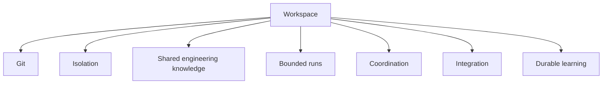
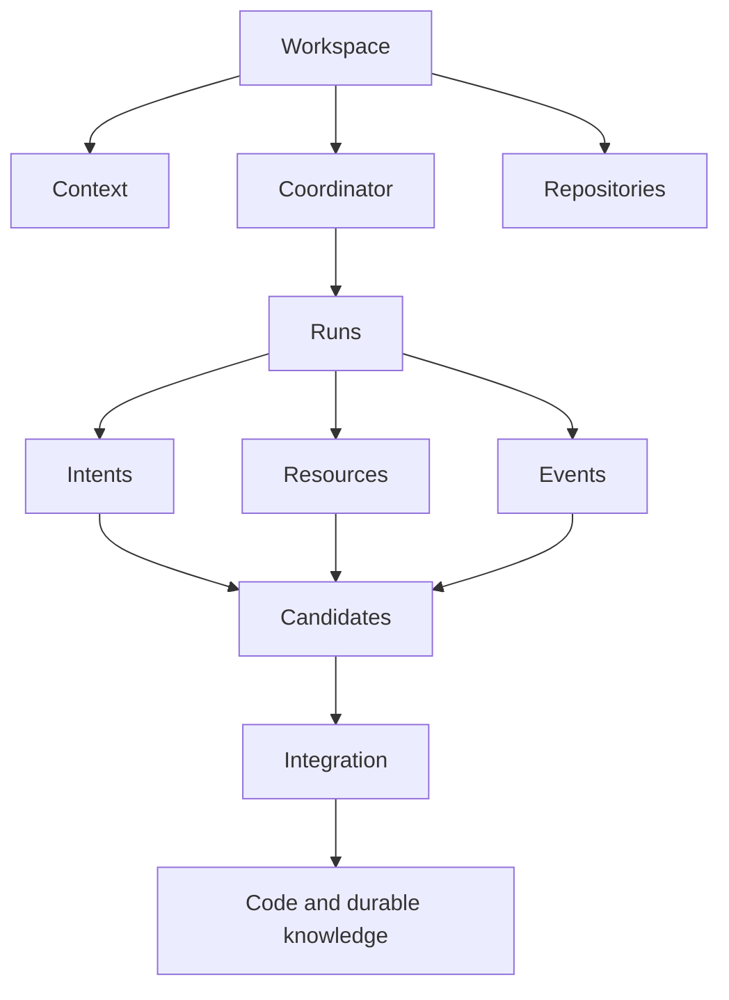
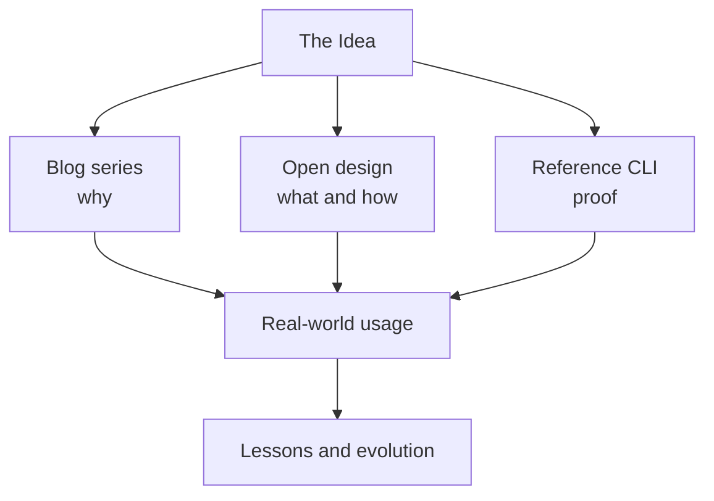
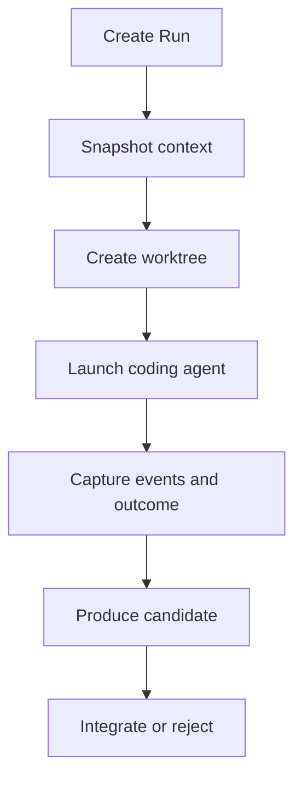
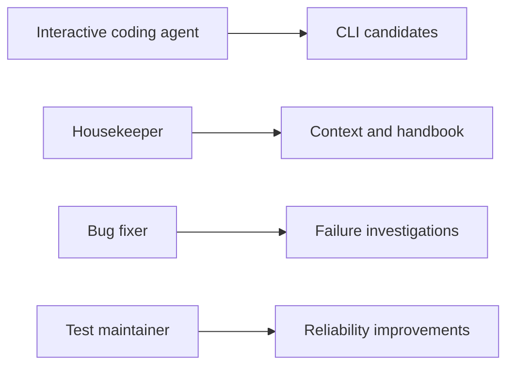

After several months of building small tools and working with coding agents at work, I reached the point where the next step seemed obvious: write a CLI.

I could already imagine the commands. One would create Git worktrees. Another would launch Codex or Claude Code. A status command would list running agents and allocated ports. Later I could add a scheduler, a dashboard, containers, and perhaps a knowledge database.

It would have been satisfying to start coding.

It also would have frozen the idea too early around the first implementation I happened to build.

The useful thing I had learned was not a command-line interface. It was a set of patterns for making coding-agent work safer and more durable.

That changed the project I wanted to create.

> The architecture is the product. The CLI is one reference implementation.

This final article assembles the model that emerged through the previous seven stories and describes how I think it should be published.

## I am not building a multi-agent framework

The phrase _multi-agent framework_ creates a familiar set of expectations:

- a planner agent
- subagents
- a message bus
- task delegation
- a swarm
- agent-to-agent protocols

Those may be useful in some systems. They are not the centre of this one.

The question I am trying to answer is more grounded:

> How do we create a durable local engineering workspace where humans and coding agents can work on a software system safely over time?

The important ingredients are not primarily model intelligence:



One agent can use this architecture. Several agents can use it. A human can use the same workspace without an agent running at all.

## The architecture that emerged

The complete picture now looks like this:



Each concept exists because of a failure from real work.

**Workspace** appeared when a repository no longer contained all of the context and temporary state required for a task.

**Context scope** separated what an agent must understand from what it may change.

**Run** gave each attempt explicit inputs, an isolated worktree, a lifecycle, and a result.

**Intent** let concurrent work remain visible without sharing private plans.

**Resource ownership** extended isolation beyond files to processes, ports, and services.

**Candidate** separated agent execution from acceptance into the software system.

**Events and knowledge proposals** preserved useful learning without committing the agent's entire transcript.

**Integration** provided the gate where candidates are rebased, tested, reviewed, accepted, or rejected.

None of these concepts requires agents to speak directly to one another.

## Principles before products

The architecture can be summarised as a small set of principles:

1. **The task creates the workspace boundary.** Repositories remain durable inputs and ownership boundaries.
2. **Context scope and mutation scope are separate.** Let an agent understand broadly and change narrowly.
3. **One agent attempt is one bounded run.** A run has explicit inputs, owned resources, events, and an outcome.
4. **Agents produce candidates.** They do not silently modify the human's working environment or integrate their own work by default.
5. **Plans are private; intent is public.** Share coordination facts, not every temporary thought.
6. **Execution and integration are separate.** A completed run is not automatically an accepted change.
7. **Telemetry is distilled into knowledge.** Preserve verified lessons, not an indiscriminate conversation dump.
8. **Defaults are replaceable.** Worktrees, local processes, files, and SQLite are implementation choices behind stable concepts.

These principles are the part I want other people to be able to adopt without using my software.

## Three outputs, one idea

I now see the work as three views of the same idea:



The blog tells the story of the problems and the reasoning that followed.

The open design should become a living architecture handbook, not a mirror of the blog. It can define concepts, patterns, decisions, extensions, and limitations precisely.

The reference CLI should prove that the design can support daily work. It is executable documentation, not the only valid implementation.

Together, these outputs keep motivation, specification, and proof connected without collapsing them into one codebase.

## A handbook of concepts, patterns, and decisions

The technical handbook should let a reader answer questions that a narrative article intentionally leaves open.

For every concept, it should explain:

- What is it?
- Why does it exist?
- Who owns it?
- Is it durable?
- Is it shared?
- What is its lifecycle?

For every pattern, it should use a consistent structure:

```text
Problem
Context
Default pattern
Diagram
Trade-offs
Failure modes
Extension points
When not to use it
```

Patterns might include one agent with one repository, read-many/write-one context, concurrent agents in one repository, runtime port allocation, scheduled housekeeping, crash recovery, knowledge promotion, and candidate integration.

Architecture decisions deserve their own durable history: why worktrees are the default, why raw telemetry stays out of Git, why plans are not shared, why integration is separate from execution, and why the CLI is only a reference implementation.

If a decision changes, its record can be superseded instead of rewritten. The project should practise the kind of durable reasoning it advocates.

## Defaults and extensions

An open architecture must distinguish principles from implementation choices.

The default execution isolation may be a Git worktree. Another implementation can use Docker, a development container, Nix, or a virtual machine.

The default local coordinator state may be SQLite. Another can use Redis, a daemon, or an external scheduler.

The default agent interface may be little more than:

```text
run(prompt, cwd, env)
```

Codex CLI, Claude Code, Copilot CLI, Gemini CLI, OpenCode, or a custom script can implement it.

The default integration path may be rebase, test, and merge. A team can substitute pull requests, CI gates, mandatory human review, or custom policy.

The default durable knowledge store may be Markdown and structured files. A larger installation can add a database, search index, knowledge graph, or external knowledge base.

Portability comes from keeping the concepts stable while allowing these mechanisms to vary.

## What the architecture intentionally does not solve

A boundary is useful only if it also says what lies outside it.

The first version should focus on:

- local workspaces
- one or several repositories
- one or several coding agents
- worktree-based filesystem isolation
- local runtime coordination
- scheduled engineering roles
- durable knowledge proposals
- candidate integration

It should not claim to solve:

- remote or distributed agents
- coordination across several machines
- global locking
- atomic multi-repository transactions
- production orchestration
- sandboxing of untrusted agents
- a universal agent communication protocol

These are possible extension paths, not hidden promises.

## A deliberately small reference CLI

The first CLI should prove the lifecycle, not demonstrate every feature I can imagine.

```bash
ws init
ws repo add ../frontend
ws run codex "Fix authentication refresh"
ws status
ws integrate R42
ws clean R42
```

That is enough to test the essential path:



Concurrency, port allocation, and active intents can follow once one run works reliably. Scheduled engineering can follow after that, initially using operating-system timers rather than a custom daemon.

Schemas for Workspace, Run, Event, Candidate, and Agent Profile can keep the design separate from the CLI. Another implementation should be able to understand the same artefacts without copying the command structure or programming language.

## The proof should maintain itself

The most honest test is to use the architecture to build the reference implementation.

The CLI repository can itself become a workspace:



That creates evidence rather than marketing claims.

How often do concurrent runs conflict? Which context proves useful? Which knowledge proposals are accepted? How much cleanup fails after crashes? Does the candidate model make review easier? Which concepts are unnecessary?

After ninety days of real use, some principles will probably survive and some will need to change. That evolution should be published too.

## What I learned

Working with coding agents at work began as a search for better tools. I wanted safer branches, more context, easier concurrency, and a way to retain what the agents discovered.

The deeper lesson was that these were not independent features. They were symptoms of a missing workspace model.

I do not want to build the best multi-agent coding orchestrator. That goal would pull the project toward more agents, more messaging, more infrastructure, and more claims of autonomy.

The goal I want is quieter and, I think, more durable:

> Publish an open set of patterns for building self-managed agentic engineering workspaces, and provide one deliberately simple reference implementation that proves those patterns can be used for real software work.

Someone should be able to take only “one agent, one worktree.” Another person might add Docker. A team might use its own scheduler and knowledge store. Someone else might ignore the CLI entirely and implement the architecture around a different coding agent.

That is not fragmentation. It is the point.

The intellectual value is the set of composable primitives, boundaries, trade-offs, and failure modes. The CLI is proof that the ideas can run.

The architecture is the product.

The story began in [Part 1: Coding Agents Changed What a Workspace Means](/posts/coding-agents-changed-what-a-workspace-means/).
