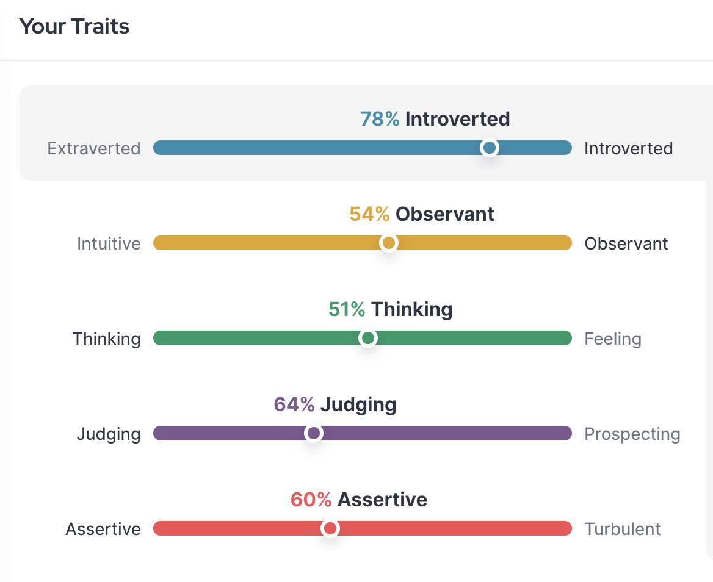

## I'm an ISTJ-A: The Reliable Rock (But Maybe a Little Set in My Ways)

They call me the rock, the dependable one. Maybe it's the way I always follow through, never missing a deadline or forgetting a commitment. Or perhaps it's my love of lists and meticulously planned schedules. If you recognize yourself in this description, there's a good chance you, like me, are an ISTJ-A personality according to the Myers-Briggs Type Indicator (MBTI).

**ISTJ stands for Introverted (I), Sensing (S), Thinking (T), and Judging (J).** The "A" at the end means Assertive, so while I'm definitely on the introverted side, I can still hold my own in a conversation.

**They call us ISTJ-As "Logisticians" or "Duty Fulfillers" for a reason.** We thrive on organization, logic, and getting things done right. Facts and figures are my jam, and I can analyze a situation with a cool head, prioritizing the most practical solution.

Here are some things you might find familiar if you're an ISTJ-A like me:

- **Reliability is my middle name.** Deadlines? Met. Commitments? Kept. I take my responsibilities seriously and pride myself on following through.
- **Logic is my guiding light.** Emotions can cloud judgment, and I prefer a clear, fact-based approach to life. This makes me a great problem solver, always looking for the most efficient solution.
- **Order is my happy place.** Chaos? No thanks. I thrive on structure and meticulously planned schedules. My to-do lists are legendary, and I find comfort in knowing exactly what needs to be done and when.
- **Loyalty runs deep.** The people I care about know they can always count on me. I value commitment and build strong, dependable relationships.

But let's be honest, being an ISTJ-A isn't all sunshine and rainbows. Here are some areas where I, and maybe you too, could stand some improvement:

- **Change? Not my favorite word.** I value tradition and established procedures. New ideas can be unsettling, and I might resist change even if it's ultimately for the better.
- **Emotions? A bit of a mystery.** While I care deeply, expressing those feelings can be a challenge. This can sometimes lead to misunderstandings with loved ones.
- **A perfectionist in disguise.** My focus on detail and adherence to rules can make me overly critical of myself and others. Learning to delegate and embrace different viewpoints is an ongoing process.
- **Workaholic tendencies? Guilty.** Sometimes my dedication to work can overshadow my personal life. Finding a healthy work-life balance is a constant battle.

**Being an ISTJ-A is a unique way of experiencing the world.** We bring a sense of reliability, practicality, and dedication to everything we do. By acknowledging our areas for growth, we can become even more well-rounded individuals and continue to thrive in all aspects of life.

**Do you identify with the ISTJ-A personality type? Share your experiences and thoughts in the comments below!**
