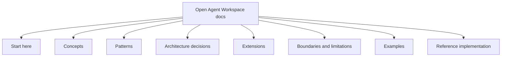
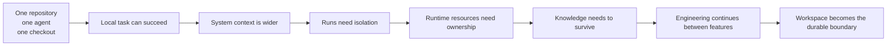
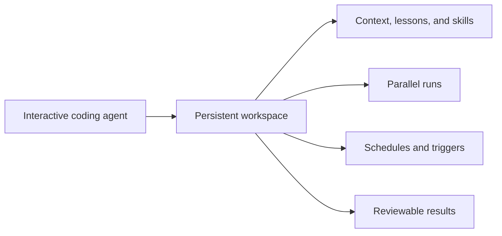
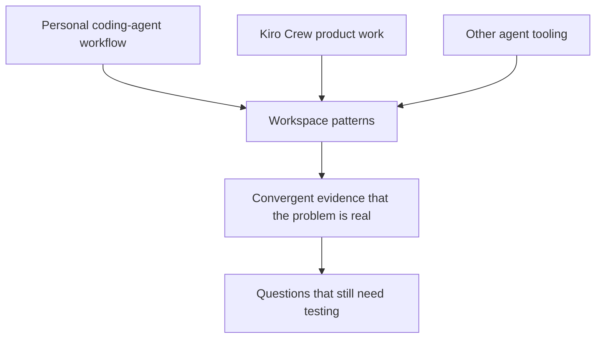
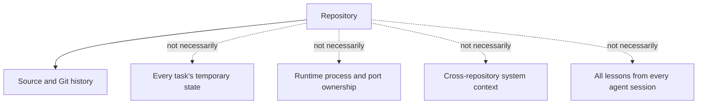
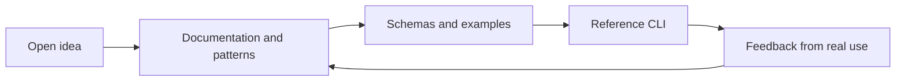

In the last article, I wrote that the architecture was the product and the CLI was only a reference implementation.

Writing that sentence was easy.

Doing something that made it true was harder.

I had been carrying the idea around as a set of notes, diagrams, and conversations: a coding agent needs more than a repository; a task needs a workspace; a run should be isolated; context can be shared without sharing private plans; candidates should be integrated deliberately; useful lessons should survive the run.

It would have been very easy to keep refining the idea privately until it felt complete.

Instead, I opened a new home for it: the [Open Agent Workspace GitHub organization](https://github.com/open-agent-workspace). The organization now contains the [documentation and field guide](https://open-agent-workspace.github.io/doc-pages/), a [reference implementation](https://github.com/open-agent-workspace/reference-implmentation), and an [example workspace](https://github.com/open-agent-workspace/example-workspace).

The work became visible before it became finished.

That was the point.

## Publishing the idea changed the idea

There is a difference between having an architecture in a notebook and putting it in a public repository.

In a notebook, a concept can be inspiring while remaining vague. “Workspace” can mean a folder, a dashboard, a monorepo, a cloud account, or an agent's memory. “Isolation” can mean a worktree, a container, or simply a convention that everyone agrees to follow.

Once other people might read the design, those words need edges.

The documentation site became a useful forcing function. It is organised as a field guide rather than a CLI manual:



That structure makes a distinction I care about:

- **Concepts** describe the things the architecture needs to name.
- **Patterns** describe repeatable ways to combine those concepts.
- **Decisions** preserve the reasoning and alternatives.
- **Extensions** show where an implementation can go beyond the defaults.
- **Boundaries** say what the first version does not promise.
- **Examples** make the patterns concrete.

The site is intentionally not a mirror of the blog series. The blog explains why I arrived here. The field guide tries to make the ideas usable by someone who did not share the original sequence of failures.

## The smallest useful claim

The claim is not that every developer needs an elaborate multi-agent platform.

It is smaller:

> A coding agent working on one repository in one undifferentiated checkout is often not enough for real system work.

The limitation appears in several ways.

The agent may need to understand neighbouring repositories, deployment configuration, service contracts, and operational notes while being allowed to modify only one primary repository.

The agent may need an isolated worktree so it does not overwrite a human's unfinished changes.

Two agents may have separate files but still fight over `localhost:3000`, a development database, a Docker Compose project, or a browser profile.

The conversation may contain a useful discovery, but the next run has no reliable way to inherit it without copying an entire transcript.

And once the obvious feature work is done, the system still needs documentation maintenance, test repair, dependency updates, and investigation of recurring failures.

These are not separate product features. They are signs that the repository is no longer the complete unit of engineering work.



The architecture is an attempt to name that wider boundary without pretending that one tool must own every repository, agent, scheduler, or database.

## Then I found Kiro Crew

After publishing the first version of the docs, I came across [Kiro Crew](https://kiro.dev/crew/).

My reaction was immediate: I recognised the shape.

Kiro Crew describes itself as a persistent, open-source development workspace that remembers context, learns how a team works, and coordinates across tools and workflows. Its product page describes memory and lessons that carry across sessions, scheduled jobs and triggers, parallel agent work, extensible Apps, and a defence-in-depth security model.

Those are not superficial similarities. They overlap with the problems that led me to define Workspace, Run, Context, Intent, Candidate, Event, Resource, and Integration.

The overlap is especially clear in the transition from a single interactive agent to a continuing engineering environment:



Kiro Crew is a real product with its own runtime, interfaces, defaults, and implementation choices. The Open Agent Workspace project is an open architecture and deliberately small reference implementation. We are not building the same thing, and I am not trying to compete with Kiro Crew.

But we are looking in the same direction.

## Similarity is evidence, not a victory lap

Finding a similar system can trigger an awkward reaction when you have just made your own idea public.

One response is defensiveness: “They copied me.”

Another is dismissal: “They are solving a different problem.”

Neither response is very useful here.

The healthier interpretation is convergent design. Different people, starting from different products and workflows, encounter the same pressure points and begin naming similar boundaries.



This does not prove that every proposed pattern is correct. It does not prove that persistent memory is always better, that parallel runs should be the default, or that a particular security layer is sufficient for a particular threat model.

It does show that “just put an agent in a repository” is becoming an incomplete mental model.

That is valuable confirmation.

## What the repository model leaves out

A repository is excellent at storing source code, history, and the artifacts that a team chooses to make durable. It is not designed to be all of these things at once:



The temptation is to solve each omission by adding another file or another prompt. That helps until the repository becomes a scrapbook of active tasks, stale assumptions, local machine state, and conversations with no clear lifecycle.

The workspace architecture draws a line between durable and temporary things:

- the repository keeps its own boundary and history
- the workspace assembles context across repositories
- a Run owns one bounded attempt
- a worktree keeps candidate changes away from the human checkout
- the coordinator records intent and resource ownership
- events describe what happened
- knowledge proposals promote only verified lessons
- integration decides what becomes part of the system

Kiro Crew approaches the same broad challenge with a more complete product surface: persistent memory, skills, routines, apps, dashboards, and multiple interfaces. The Open Agent Workspace project is intentionally less complete. Its job is to make the underlying design language available for inspection and alternative implementations.

## Open source made the distinction clearer

If I had kept the project private, it would have been easy to describe the CLI as the main achievement.

The public organization makes the layers visible:



The organization is not a claim that the reference implementation is the canonical implementation. It is a place where the design can be discussed, challenged, forked, and reimplemented.

That portability is important. Someone may prefer Codex CLI. Someone else may use Claude Code, Kiro, Copilot CLI, OpenCode, or a custom runtime. One team may use worktrees and local processes; another may require containers or virtual machines. The architecture should survive those choices.

The most useful test for an open design is whether people can adopt its concepts without adopting its exact code.

## What I am building next

The next step is not to chase feature parity with a larger product. It is to make the reference path credible through use.

The first CLI slice remains deliberately small:

```bash
ws init
ws repo add ../frontend
ws run codex "Fix authentication refresh"
ws status
ws integrate R42
ws clean R42
```

The documentation can evolve around the implementation while the implementation tests the documentation. The project itself should use its own workspace patterns: coding runs produce candidates, housekeeping runs maintain context, and failures become evidence for the next design decision.

That gives the architecture somewhere to learn from.

## The lesson I am taking from the comparison

Kiro Crew did not make the Open Agent Workspace idea unnecessary. It made the problem easier to see.

When two projects arrive at similar conclusions independently, I do not need to pretend one of them is the winner. I can ask the more useful questions:

- Which boundaries did we both find necessary?
- Where do our trade-offs differ?
- Which parts are principles, and which are product decisions?
- What does real usage reveal that diagrams cannot?
- Can another implementation adopt the pattern without inheriting the original assumptions?

The answer to the first question is already becoming clear. Coding agents need a place to work that is larger than a checkout and more structured than a prompt.

They need context, isolation, runtime coordination, integration, and memory that can be inspected and changed over time.

That place does not have to be one product.

It can be an open pattern language.

I am glad the idea now has a public home. I am even more glad to find that other builders are working toward the same horizon. The goal is not to win a category. It is to help make the next category legible.

Start with the [Open Agent Workspace field guide](https://open-agent-workspace.github.io/doc-pages/), then compare it with [Kiro Crew](https://kiro.dev/crew/). The conversation is more interesting when both the principles and the implementations are visible.
