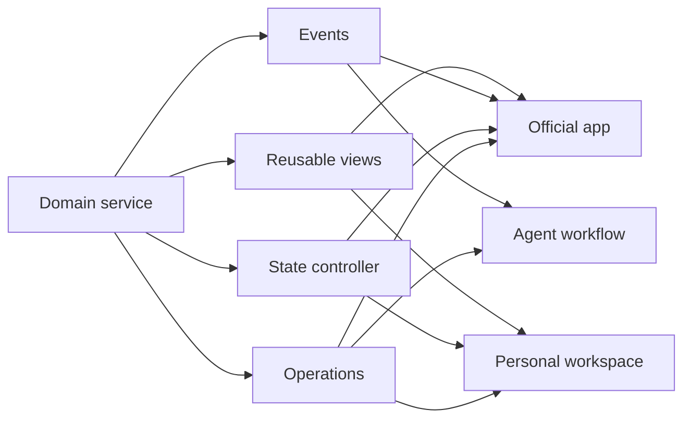

Software is usually delivered as a complete application.

```text
Application
├── User interface
├── Business logic
├── Data
├── Integrations
└── Runtime
```

The vendor decides how these pieces fit together. Users consume the resulting product, perhaps with a few extensions or preferences, but the application remains the primary boundary.

That boundary is convenient for building, selling, securing, and supporting software. It is much less natural for the way people think about work.

People rarely begin their day with goals such as “use Gmail,” “use Calendar,” or “use GitHub.” They want to prepare for a meeting, plan a trip, research a topic, review a software change, or understand what needs attention. The applications are instruments inside those activities.

Yet our computers still ask users to translate every goal into a tour of vendor-defined products.

The next major change in software architecture may be to make products not only internally modular, but **externally composable**. Important capabilities, state, semantics, and views would become supported composition boundaries. The official application would remain, but it would become a reference composition rather than the only legitimate experience.

The future of software may therefore be no single canonical application.

## Applications reflect supply more than intent

Today's application boundaries mostly follow organisations and product histories.

```text
Chrome
Gmail
Calendar
Slack
GitHub
```

Each product owns a coherent domain, which is valuable. Gmail understands messages, threads, labels, delivery, and spam. Calendar understands events, recurrence, attendance, and availability. GitHub understands repositories, commits, pull requests, checks, and reviews.

But a user's goal cuts across those domains:

```text
Prepare for a meeting
├── Read the calendar event
├── Find the relevant email thread
├── Review the linked document
├── Check the project's open decisions
└── Summarise recent team discussion
```

No one of those applications is the natural owner of “prepare for this meeting.” The unit of intent is larger than each product and smaller than the user's entire computer.

The current model makes the user perform the integration. They locate the same project under different names, rebuild context in each tool, copy information between screens, and remember which system is authoritative for which fact.

An intent-oriented environment could preserve the strengths of specialist services while composing their capabilities around the work:

```text
My Workspace
├── Email capability
├── Calendar capability
├── Browser capability
├── Team communication capability
├── Source control capability
└── AI capability
```

This changes the product relationship from:

```text
Service = Product = Application = UI
```

to:

```text
Service
  ↓
Capabilities and semantic models
  ↓
Reusable state and views
  ↓
Multiple possible applications
```

The service still exists. The application still exists. They are no longer required to be the same boundary.

## The browser reveals the missing layer

Imagine wanting a radically different browser experience.

Instead of tabs, perhaps you want projects. Each project should collect pages, PDFs, email, notes, and research questions. An AI should keep the useful browsing context, discard incidental navigation, and surface unresolved claims. History should become a research trail rather than a chronological list of URLs.

You want to redesign how browsing work is organised. You do not want to reimplement:

- HTML and CSS rendering.
- JavaScript execution.
- Networking and TLS.
- Media decoding.
- Sandboxing and site isolation.
- Permissions and identity.
- Accessibility infrastructure.
- Years of browser security hardening.

Today, the practical choices are limited. A browser extension can modify part of the experience but must live inside the host's model. An alternative shell can embed an existing engine but inherits a large integration and distribution burden. A full fork provides control at an enormous maintenance cost.

The desired product boundary and the available technical boundary do not match. The person wants to replace the browser experience, but the platform often makes them replace or work around the browser application.

A more composable browser might expose stable capabilities such as:

```text
navigation
page rendering
history
sessions
downloads
permissions
identity
DOM access
media
```

Different providers could implement those capabilities. Different shells could arrange them. The official browser would remain the most complete and broadly tested composition, while research workspaces, accessibility-first browsers, child-safe browsers, and specialised enterprise clients could reuse the difficult engine rather than reconstruct it.

The same missing layer appears in email, calendars, document editors, collaboration tools, media applications, and operating systems. We can often access their data, but cannot reuse enough of their behaviour to create a first-class alternative experience.

## APIs expose operations, not applications

The usual answer to composability is: provide an API.

A conventional API may expose operations like:

```text
listEmails()
sendEmail()
getEvents()
createEvent()
```

That is necessary, but it is far from sufficient.

A useful email or calendar experience also needs authentication, synchronisation, caches, optimistic updates, pagination, search behaviour, draft state, conflict handling, validation, permissions, offline behaviour, notifications, error recovery, and accessible interaction patterns.

An API gives a developer ingredients. It does not reduce enough of the cost of building the kitchen.

Externally composable software may need to expose a ladder of reusable layers:

```text
Level 1 — Raw data API
Level 2 — Semantic operations
Level 3 — Headless controller and state
Level 4 — Embeddable UI components
Level 5 — Full reference application
```

Each layer supports a different degree of control.

At Level 1, a developer gets maximum flexibility and assumes most product responsibility. At Level 2, operations reflect domain concepts and effects rather than database-shaped endpoints. At Level 3, the provider supplies lifecycle and state without prescribing pixels. At Level 4, difficult interactions can be reused safely. At Level 5, most users get a complete, coherent product.

The ladder is not a maturity score. Some capabilities should never expose all five levels. A security-sensitive confirmation flow may deliberately require a provider-owned component. A local text transformation may need only a function. The point is to stop assuming that a raw endpoint and a finished application are the only useful choices.

## What a headless application would provide

We already use “headless” to describe content management and commerce systems that separate backend capability from a fixed storefront or website. The same idea can extend to everyday applications.

A headless calendar would not merely return event records. It could provide:

- An event and attendee domain model.
- Search, availability, recurrence, and scheduling operations.
- A synchronised state controller with caching and conflict handling.
- Permission and confirmation metadata.
- Reusable agenda, event editor, and availability views.
- Events that report authoritative changes.
- A full calendar application as the reference composition.

A headless email service might expose thread state, drafts, search, delivery lifecycle, attachments, identity, spam decisions, and trusted compose or recipient components. A headless collaboration service might expose channels, conversations, presence, mentions, and notification policy without requiring every interaction to occur in its official client.

The word “headless” can be misleading because the provider may still offer plenty of UI. The important property is that the product has a supported seam between capability and experience.



The official application proves the layers can produce a complete experience. Other compositions can reuse as much or as little as their needs justify.

## External composability needs explicit contracts

Internal software modularity is about helping a development team change implementation. External composability is about letting another party build a different experience without depending on private code and accidental behaviour.

That requires stronger contracts than most internal modules need.

### Capability contracts

Operations need stable names, typed inputs, declared outputs, and meaningful errors. More importantly, they should describe effects: whether an action reads or mutates state, crosses a network or organisational boundary, is reversible, costs money, or requires confirmation.

### Semantic contracts

Data needs meaning beyond syntax. Units, relationships, sensitivity, authority, freshness, and provenance help humans, agents, and interfaces interpret the same information consistently.

### State contracts

Composable clients need snapshots, subscriptions, optimistic updates, conflict semantics, and restoration. Without them, every client invents a subtly different version of reality.

### View contracts

Reusable components need declared inputs, outputs, supported actions, accessibility behaviour, sizing constraints, theming boundaries, and serialisable state. A widget is not reusable merely because it can be placed in an iframe.

### Trust contracts

The service must enforce identity and authorisation regardless of which interface requests an action. The host must show which provider supplies a capability or view. Permissions should be narrow, visible, and revocable.

### Lifecycle contracts

Versions change. Jobs outlive windows. Connections fail. Providers disappear. A composition platform needs cancellation, retries, compatibility negotiation, migration, and graceful degradation.

These contracts are the difference between an ecosystem and a collection of demos. External users cannot rely on the design conversations, internal deployment coordination, and shared assumptions that hold one product codebase together.

## AI changes the economics of integration

Composable software is not a new technical possibility. The Web, command-line pipelines, plugins, automation platforms, component systems, and service APIs have enabled forms of composition for decades.

The limiting factor has often been economics.

Someone still needed to understand several systems, manage credentials, map schemas, write adapters, coordinate state, build UI, handle errors, and maintain the result. That work could be justified for a popular commercial integration. It was rarely justified for one person's preferred workspace.

Coding agents can reduce that cost.

A user might ask:

> Build a workspace where the left side shows today's meetings, the middle shows related email, and the right side shows relevant team discussions.

An agent could perform much of the mechanical composition:

```text
Discover capabilities
↓
Inspect semantic contracts
↓
Select trusted components
↓
Generate adapters and glue code
↓
Test the composed workflow
↓
Package a personal application
```

This is a more consequential role for AI than placing a chatbot over existing products. The agent is not only another interface. It lowers the cost of creating interfaces and workflows that previously could not be economically built.

The result could be personal software: applications narrow enough to fit one person or team, assembled from maintained services rather than built entirely from scratch.

AI does not remove the need for contracts. It increases it. Generated glue code is easier to produce than to trust. An agent needs machine-readable effects, permissions, test fixtures, compatibility rules, and provenance if it is to compose services safely.

## Why vendors may resist this future

The largest barriers may not be technical.

A canonical application gives a vendor control over branding, monetisation, discovery, telemetry, support, and product differentiation. If customers can move the experience elsewhere, the service risks becoming an interchangeable backend.

Composable products also expand support questions. Which party is responsible when a third-party interface misrepresents state? How should usage be priced when a user brings their own client? Who can render a trademarked workflow? How are unsafe or low-quality components identified? What happens when a provider changes a contract used by thousands of generated personal tools?

There are legitimate reasons to preserve tight boundaries as well. Fraud prevention, regulated disclosures, privacy, content integrity, and high-consequence operations may require provider-controlled interactions. Not every seam should be public.

The realistic future is therefore unlikely to be total unbundling. It will be selective composability:

- Services expose low-risk reading and organisation capabilities broadly.
- Consequential actions carry stronger effect and confirmation contracts.
- Some workflows use provider-owned trusted components.
- The official application remains the support baseline.
- Business models charge for valuable capabilities rather than only access to a screen.

Vendors that treat composability as a product surface—not a reluctantly maintained API—may find that their capabilities appear in more user workflows even when their full application is not open.

## A practical path from application to capability platform

Most products should not begin by publishing their entire internal architecture. A smaller path is possible.

Start with one workflow that clearly crosses an application boundary. Meeting preparation, incident response, customer review, travel planning, and research synthesis are good candidates because the user already performs manual integration.

Then identify a narrow set of domain capabilities and entities. Give them stable identities. Describe action effects and permission requirements. Publish change events or subscriptions where freshness matters.

Next, extract one headless controller used by the official application itself. This creates a real supported boundary for state, loading, caching, and errors instead of leaving every client to rediscover them.

Offer one or two reusable views for the hardest interactions. Keep them bounded and semantically rich. A full design system is unnecessary at first.

Finally, build a second composition. It can be a small embedded widget, command interface, accessibility-first client, or agent workflow. A second honest consumer reveals which contracts are reusable and which merely mirror assumptions from the official application.

The architecture should generalise in response to real composition pressure, not a speculative ambition to become the operating system for everything.

## Make software easy to recompose

Traditional software engineering values modularity because it makes a codebase easier for its developers to change:

```text
Internal modularity
→ the development team can change the product
```

The next step is to extend that quality beyond the codebase:

```text
External composability
→ users and other software can change the experience
```

A system can have beautiful internal boundaries and still appear to the outside world as an indivisible application. External composability requires choosing which internal concepts deserve to become stable public capabilities—and accepting the engineering and product responsibility that follows.

This does not make the application obsolete. A great reference application remains essential. It gives most users a designed experience, demonstrates the intended semantics, provides a recovery path, and combines the service's capabilities into a coherent whole.

But the provider can offer more than one take-it-or-leave-it product:

> Here are our capabilities, semantic models, reusable components, and reference application. Use our experience, embed parts elsewhere, let an agent operate them, or compose your own.

That is a deeper change than customization. It shifts who owns the final experience.

Today, vendors largely own the application and therefore the user's interaction with it. In a more composable software world, services preserve trustworthy capabilities while users increasingly own how those capabilities come together.

The future of software is not no applications. It is no single canonical application.

_Two-part series: Part 2 of 2 · Previous: [The Future of UI Is No Single Canonical UI](/posts/the-future-of-ui-is-no-single-canonical-ui/)_

## Related reading

- [The Tab Problem and App-Centric Fragmentation](/posts/05-the-tab-problem-and-app-centric-fragmentation/)
- [The Workflow-Centric Workbench](/posts/06-the-workflow-centric-workbench/)
- [A Framework for Composable Workspaces](/posts/07-framework-for-composable-workspaces/)
