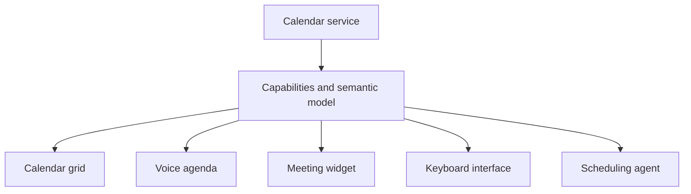

Most software begins with a quiet assumption: there is one correct interface.

The product team chooses the navigation, information density, interaction model, and visual hierarchy. Users may be allowed to change a theme, rearrange a dashboard, or hide a sidebar, but the basic experience remains fixed. The application has a canonical UI, and everyone is expected to adapt to it.

That has always been a compromise.

A blind user may prefer structured audio navigation with concise summaries. A power user may want a keyboard-driven command surface. An analyst may need dense tables and linked charts. A field worker may need large touch targets and a narrow workflow that functions on an unreliable connection. A manager may want exceptions and trends rather than every operational detail.

It is extraordinarily difficult for one interface to serve all of them well.

AI creates another possibility. Instead of treating the official screen as the product, a service could expose capabilities, semantic information, and trusted interaction components. Different interfaces could then be composed around the same underlying service.

My thesis is not that UI disappears. It is that **the future of UI is no single canonical UI**.

## One product does not imply one experience

Consider a calendar. Its conventional interface is a grid because time is spatial and comparison matters. The grid is excellent when someone wants to see whether Tuesday afternoon is crowded or move an event by thirty minutes.

But the same calendar can support other useful experiences:

- A voice interface that reads the next appointment and travel time.
- A compact agenda embedded beside meeting notes.
- A command palette for creating an event without leaving the keyboard.
- A wall display that shows only room availability.
- An agent that negotiates a time across several participants.
- An accessible linear view that avoids a visually dense weekly grid.

None of these is the universally correct calendar UI. Each is a projection of the same underlying entities, actions, permissions, and state.

Today, we often treat those projections as secondary integrations. The official application is considered the product; everything else is an API client, widget, automation, or accessibility accommodation.

A composable model reverses that hierarchy. The calendar service remains authoritative, but its official application becomes one excellent reference experience among several supported experiences.



The service owns calendar truth. It does not need to own every way a person encounters that truth.

## Accessibility and personalization are converging

Accessibility is often implemented as a set of adaptations to a default visual interface: add labels for a screen reader, support keyboard navigation, preserve focus, provide sufficient contrast, and expose status changes without relying on colour alone.

Those practices remain essential. A composable future does not excuse an official application from being accessible.

But there is a broader principle underneath them: **the information and actions of a service should not be trapped inside one presentation modality**.

A screen reader already demonstrates this separation. It converts semantic structure into another sensory experience. Voice control converts spoken intent into interaction. Switch devices, braille displays, magnification, captions, reduced-motion settings, and simplified layouts all adapt software to the person rather than demanding that the person conform to the default.

Once software exposes richer semantic structure, the boundary between accessibility and personalization begins to blur.

The same capability that lets a blind user navigate an invoice as structured audio might let a driver hear only urgent exceptions. The same semantic headings that support assistive technology might let an AI generate a concise mobile view. The same command descriptions that enable voice control might power a keyboard palette or an automation.

This does not mean every preference is an accessibility need. It means both are instances of a larger architectural idea:

> The service provides meaning and capability; the user chooses an appropriate interaction modality.

Accessibility then becomes more than retrofitting one interface. It becomes part of the reason to design software that can support several honest interfaces from the beginning.

## GUI will survive AI

The rise of conversational AI has encouraged a simple prediction: perhaps chat will replace applications.

Chat is powerful when intent is easier to describe than a sequence of controls. “Move tomorrow's project review to the first time everyone is available next week” is a natural request. A conversational system can resolve ambiguity, gather context, and coordinate several operations.

But language is not the best representation for every kind of thinking.

A table can expose twenty comparable values at once. A chart can reveal a trend before the user knows what question to ask. A map preserves spatial relationships. A timeline makes sequence and duration visible. A canvas supports direct arrangement. A diff makes precise change inspectable. A form shows available choices and constraints before submission.

Turning all of these into prose would reduce information density and increase memory load. The user would need to ask successive questions to reconstruct relationships that a visual layout communicates at a glance.

The future is therefore unlikely to be “no UI.” It is more likely to be a conversation between modalities:

```text
Describe an outcome
↓
Inspect the relevant objects
↓
Manipulate details directly
↓
Ask for an explanation
↓
Approve or revise the result
```

AI can make the transition between these surfaces fluid. It can choose a starting view, populate it with relevant context, explain what changed, and offer another representation when the current one is a poor fit.

The graphical interface survives because human cognition remains visual, spatial, comparative, and embodied—not only linguistic.

## Bring Your Own Interface

If services stop assuming one canonical presentation, a new product model becomes possible: **Bring Your Own Interface**.

A user could choose an official application, install a third-party client, embed a small view in another workspace, use an assistive interface, or ask an agent to assemble a private experience. One person might use several of these at different moments.

The smaller version is Bring Your Own Widget. Instead of replacing an entire application, users compose bounded views around a goal:

```text
Morning Workspace
├── Today's meetings
├── Important email
├── Pull requests waiting for review
├── Relevant team discussions
├── Financial summary
└── News about active projects
```

No single vendor naturally owns this workspace because the user's morning does not fit inside one vendor boundary. Email, calendars, source control, messaging, finance, and news remain separate services, but their views can participate in one experience.

This is more meaningful than a dashboard made of isolated rectangles. When the user selects a meeting, the email and discussion widgets should understand the relevant participants and project. When a pull request becomes urgent, the attention model should change. When an action is taken, the responsible source service should remain authoritative.

The workspace belongs to the user, while each service continues to own the integrity of its domain.

## Generative UI should compose meaning, not improvise pixels

AI makes it tempting to generate an entirely new interface for every request. That is impressive in a demo and exhausting in daily use.

If the location, wording, and consequence of controls change constantly, users cannot build reliable habits. Accessibility testing becomes uncertain. Security-sensitive actions may appear without appropriate warnings. A generated button may look familiar while doing something unexpectedly consequential.

The safer and more useful form of generative UI is usually **composition from governed primitives**.

A service or trusted component library might provide:

- A data table with declared columns, selection behaviour, and accessible navigation.
- A money field that understands currency, formatting, sensitivity, and validation.
- An approval card that consistently shows scope, consequence, and reversibility.
- A timeline that preserves event provenance.
- A map, editor, diff viewer, or chart with stable interaction semantics.

The AI chooses and arranges components, binds data to them, and adapts density to the task. The components retain tested behaviour and communicate the meaning of their data and actions.

This is the difference between generating HTML and composing an experience. HTML describes elements. A semantic component describes what those elements mean, what state they hold, which actions they can request, and what risks those actions carry.

## The interface needs a semantic contract

For multiple interfaces to remain trustworthy, a service must expose more than field names and endpoints.

Consider a numeric value called `amount`. Its syntax says little. An interface may also need to know that it represents Australian dollars, contains financial information, accepts two decimal places, and requires confirmation before a transfer changes it.

```json
{
  "name": "amount",
  "type": "number",
  "semanticType": "money",
  "currency": "AUD",
  "sensitivity": "financial",
  "confirmationRequired": true
}
```

The exact schema is not the point. The principle is that composition needs shared meaning across several actors:

```text
Human ↔ GUI ↔ Voice ↔ Agent ↔ Automation
```

That contract may include entity identity, labels, units, relationships, available actions, mutation effects, permission requirements, validation, provenance, and presentation hints. Some information is mandatory for correctness; some merely helps a host choose a useful representation.

An AI agent can then understand that “transfer the full amount” is financially consequential. A visual interface can format the number correctly. A voice interface can say the currency aloud. An automation can enforce the same validation. Different surfaces, shared meaning.

## User-owned interfaces create new risks

Moving experience ownership toward users is not automatically liberating. It creates difficult product and governance questions.

**Consistency can fragment.** A person who assembles every workspace differently may lose familiar navigation and support documentation. Shared component conventions and recoverable defaults still matter.

**Malicious interfaces can deceive.** A third-party widget could mislabel an action, hide relevant context, or request excessive permissions. Services must enforce authorisation themselves, while hosts make provenance and requested capability visible.

**Generated experiences can exclude people.** Personalization that has not been tested may produce poor keyboard order, confusing announcements, insufficient contrast, or cognitively overwhelming layouts. Semantic input helps, but quality still needs evaluation.

**Portability can expose sensitive context.** A workspace that joins email, calendars, code, and finance can reveal more than any individual application. Access should be purpose-limited, revocable, and isolated per component.

**Vendors still need a coherent default.** Most users will not design their own interface. The official application remains important as an accessible, dependable reference composition and as a recovery path when a custom experience fails.

“No canonical UI” therefore does not mean “no design.” It requires stronger design contracts because many experiences must safely project the same service.

## Design for plurality

Software teams can move toward this future without attempting a universal interface platform.

First, separate domain meaning from presentation. Give important entities stable identities. Describe actions in domain language. Keep permissions and validation below the UI layer.

Second, make the official interface consume the same capabilities where practical. This reveals whether the composition boundary is real or merely a limited public API surrounding a privileged internal product.

Third, expose a small number of reusable views for the interactions that are difficult to reproduce safely. A payment provider may supply a trusted confirmation component. A calendar may supply an event editor. A code host may supply a diff viewer.

Fourth, test at least two genuinely different modalities. If a capability can support a visual workspace and a keyboard or voice flow without inventing separate business rules, the semantic boundary is probably becoming useful.

Finally, let users change the experience without letting an interface silently change the truth. Source services should preserve identity, policy, provenance, and authoritative state.

## From vendor-owned screens to user-owned experiences

For decades, delivering software usually meant delivering an interface and asking users to organise their work inside it. Customization existed within boundaries chosen by the vendor.

Composable UI changes the ownership model. A provider offers a dependable application, but also exposes enough capability and meaning for other experiences to exist. A user can choose dense or calm, visual or spoken, persistent or momentary, official or personal—often moving between them during the same task.

The result is not an infinite collection of arbitrary screens. It is a plurality of trustworthy projections over shared capabilities.

The future of UI is not no UI. It is no single canonical UI.

_Two-part series: Part 1 of 2 · Next: [The Future of Software Is No Single Canonical Application](/posts/the-future-of-software-is-no-single-canonical-application/)_

## Related reading

- [Choosing the Right Application Interface](/posts/01-choosing-the-right-application-interface/)
- [MCP Apps and the AI Interface Layer](/posts/03-mcp-apps-and-the-ai-interface-layer/)
- [Intent-First Computing Will Need More Than Chat](/posts/08-intent-first-computing-and-future-ui/)
