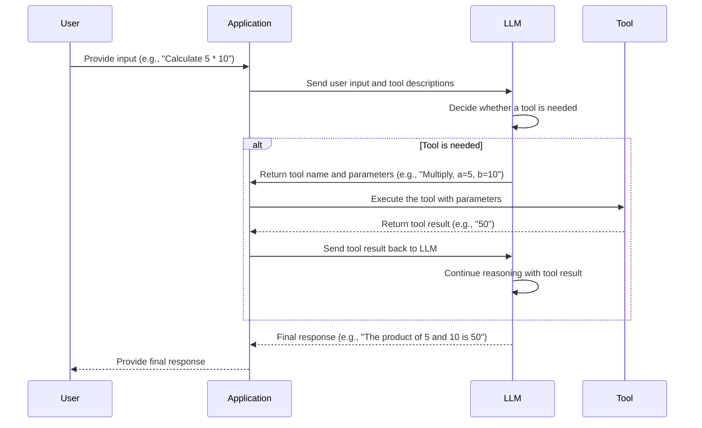

## Introduction

LangChain provides a powerful framework for integrating tools with Language Learning Models (LLMs). This feature simplifies complex workflows by enabling LLMs to interact with external tools dynamically. In this post, we’ll explore the step-by-step flow of how tool calling works in LangChain.

---

## How Does Tool Calling Work?

### Step-by-Step Workflow

1. **User Input**:
   - The user provides a query or instruction (e.g., "What is the product of 5 and 10?").

2. **Tool Collection**:
   - The application collects all available tools and their descriptions, including schemas for input parameters.

3. **Sending to LLM**:
   - The user input and tool descriptions are sent to the LLM, allowing it to decide whether a tool is necessary for processing the request.

4. **LLM Decision**:
   - The LLM determines whether a tool is needed based on the query.
   - If a tool is required:
     - It returns a structured response specifying the tool name and parameters.
   - If no tool is needed:
     - The LLM directly provides a response to the user.

5. **Tool Execution**:
   - If a tool is called, the application executes the tool with the specified parameters and retrieves the result.

6. **Feedback to LLM**:
   - The application sends the tool's output back to the LLM for further reasoning or finalizing the response.

7. **Final Response**:
   - The LLM uses the tool result to generate a final response, which is returned to the user.

---

## Sequence Diagram

Here’s a sequence diagram illustrating the interactions between the **User**, **Application**, **LLM**, and **Tool**:

---

## Why Use LangChain’s Tool Calling?

### Key Benefits

- **Dynamic Integration**: Tools can be dynamically invoked based on the query’s requirements.
- **Scalability**: Supports a wide range of tools, from calculators to API integrations.
- **Streamlined Workflow**: Reduces the complexity of connecting LLMs with external systems.

---

## Conclusion

LangChain’s tool-calling feature bridges the gap between LLM reasoning and external tool execution, creating a seamless flow for complex AI-driven applications. Whether you’re building an interactive assistant or a data processing pipeline, this framework offers flexibility and scalability.

Want to dive deeper? Check out the [LangChain documentation](https://docs.langchain.com/) for more details!
