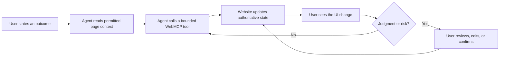

The first way I thought about [WebMCP](https://webmachinelearning.github.io/webmcp/) was as a faster alternative to browser automation. Instead of asking an agent to inspect a page, locate a button, fill a form, and hope that a visual change means success, a website could expose structured tools that an agent can call directly.

That is still valuable. But it is not the most interesting idea.

The more important possibility is that **WebMCP makes the browser a shared workspace for a person and an AI assistant**. The assistant can understand the page's state and perform bounded operations. The user can continue to see the same interface, correct the assistant, and take over when judgment is required. The assistant does not need to replace the website, and the website does not need to become a private backend integration for every model vendor.

This is a different future from “AI hides the web.” It is closer to a human and an agent co-working in the same application, with the browser preserving the visible context and the user's existing identity.

## WebMCP is not simply MCP with a new transport

The shared name is understandable, but it also creates confusion. MCP and WebMCP are related ideas, yet their centre of gravity is different.

|                         | MCP                                        | WebMCP                                                           |
| ----------------------- | ------------------------------------------ | ---------------------------------------------------------------- |
| Primary boundary        | An AI host, client, and server             | A browser page, website, and browser-enabled agent               |
| Where capabilities live | Usually a service or server process        | The active web application and its current page state            |
| Main context            | The host's connected systems and policy    | The user's browser session, UI state, and site permissions       |
| Typical strength        | Reusable backend capabilities across hosts | Agent access to capabilities already present in a web experience |
| Human surface           | Chosen by the MCP host                     | The site's existing UI remains available beside the agent        |

[MCP](https://modelcontextprotocol.io/) is primarily a protocol for connecting an AI application to external servers that provide tools, resources, and prompts. A host can connect to a calendar server, a database service, or an internal platform without opening the corresponding website. The server is the integration boundary.

WebMCP starts from the opposite direction. The user is already on a website. If the browser supports WebMCP and the site registers tools, an agent can interact with capabilities exposed by that page. The website remains the authority for its own application state, session, and business rules.

This distinction matters architecturally. A backend MCP server might expose `create_invoice` as a general service operation. A WebMCP-enabled invoice page might expose actions such as `filter_invoices`, `select_invoice`, or `prepare_payment` in the context of the account and view the user has already opened. One is designed for a host-to-service connection; the other is designed for an agent entering an existing web context.

They can share domain logic, but they should not be treated as interchangeable packaging. The [MCP Apps and AI interface layer](/posts/03-mcp-apps-and-the-ai-interface-layer/) describes a related distinction: a capability protocol, an interactive view inside a compatible AI host, and a full Web App each have different jobs.

## The browser becomes a place for hand-offs

Imagine an online banking user saying:

> Find the three subscriptions that increased this year, prepare cancellation options, and leave anything uncertain for me.

An agent working only through a text API might return a list and ask the user to navigate elsewhere. An agent using the bank's WebMCP tools could inspect the currently authenticated account, identify the relevant transactions, group them, and prepare a review state in the page.

The user still sees the account, the selected subscriptions, the cancellation consequences, and the bank's own warnings. They can deselect one item, ask why a merchant was grouped, or complete the final confirmation themselves. The agent handles the repetitive comparison; the user retains situational awareness and control.

The loop looks something like this:



The UI is important in this loop because it provides recognition rather than recall. The user does not have to trust a paragraph claiming that the right account, order, or policy was selected. They can inspect the objects in the same application they already know.

This connects directly to [why the future of UI is no single canonical UI](/posts/the-future-of-ui-is-no-single-canonical-ui/). The future is not one interface replacing every other interface. It is a service supporting several ways of working: direct manipulation, conversation, automation, accessibility surfaces, and persistent views. WebMCP is one way to let an agent participate without making the visual application disappear.

## Identity is what makes the shared context useful

One of WebMCP's strongest ideas is not that a model receives a secret credential. It is that the browser already has a user's session and the site already knows which account, organisation, role, and data are in scope.

That can remove a large amount of integration friction. A user does not necessarily need to create a separate API token, copy it into an agent, or configure a new connector for every site. The agent can request an operation through the browser, while the site evaluates it against the same identity and policy that govern the visible application.

This is also why identity must not be described as “the agent gets to use the user's identity” without qualification. The browser session identifies a principal; it should not turn every agent request into an invisible superuser action. The site still needs to authenticate the session, authorise each operation, limit what the exposed capability can do, and make consequential actions visible.

The useful model is:

```text
User identity -> Browser session -> Website policy -> WebMCP capability -> Visible result
```

The agent proposes or invokes. The site remains responsible for deciding what that identity may do. The browser remains a useful trust boundary because the user can see which site is active, which account is selected, and which result the page presents.

This is another reason [URLs survive AI](/posts/04-why-urls-will-survive-ai/). A visible route gives the agent and the user a shared reference to the resource being discussed. “The invoice on the screen” can resolve to an addressable object with an owner, permissions, history, and a representation that a person can reopen.

## Site owners have a real incentive—but not an automatic one

The adoption question is difficult. If a site exposes WebMCP tools, an agent may help a user complete a task with fewer page views, fewer promotional impressions, and less time inside the site's carefully designed funnel. Why should the site owner invest?

There are plausible incentives:

- **Lower interaction friction.** Customers can complete complex workflows without fighting navigation, especially on mobile or in unfamiliar parts of the product.
- **Higher completion rates.** An agent can gather details, validate a form, and recover from ordinary mistakes before the user abandons the task.
- **Better accessibility.** Structured capabilities can give assistive agents a reliable way to help users who struggle with a dense or specialised interface.
- **Reduced support cost.** An agent can guide a customer through account, billing, or configuration workflows using the site's own rules rather than an inaccurate external script.
- **A durable agent channel.** The site can define the operations it is willing to support instead of allowing uncontrolled screen scraping and brittle automation.
- **User trust and preference.** A site that works with the agent a customer already trusts may be chosen over a site that forces the customer through a rigid funnel.

But these benefits are not guaranteed. A retailer may worry that agents will compare prices without displaying brand context. A financial service may worry about liability. A SaaS vendor may worry that an agent captures the relationship while the vendor supplies only execution. Analytics, advertising, and conversion models may also be built around the assumption that every meaningful action passes through a human-operated page.

WebMCP therefore needs a business case, not only a technical specification. The early adopters are likely to be sites where completion quality matters more than page-view volume: complex enterprise workflows, travel planning, administration, accessibility-heavy services, support operations, and products whose users already bring their own tools.

The strongest pitch to a site owner is not “let agents control your whole site.” It is “publish a small, reliable set of capabilities that makes your most frustrating workflows easier while your application remains the source of truth.”

## Capability design is the product decision

Once the basic plumbing is available, the hard question becomes: what should a site expose?

The answer should not be every function behind every button. A WebMCP tool is a public interaction contract. Its name, input schema, description, output, side effects, and failure modes all influence what an agent will attempt.

A useful capability catalogue might separate operations into levels:

1. **Read:** search, inspect, compare, and summarise visible or permitted data.
2. **Prepare:** draft a change, populate a form, calculate an option, or assemble a review state without committing it.
3. **Request:** submit an action for user confirmation or a site's normal approval flow.
4. **Commit:** perform a consequential operation only when identity, policy, and confirmation requirements are satisfied.

This separation lets an agent do substantial work without making every tool call irreversible. `prepare_transfer` is a safer first capability than `transfer_money`. `draft_reply` is easier to trust than `send_reply`. `preview_subscription_change` gives the user a chance to inspect the exact consequence.

Access control should be designed alongside the tools:

- Authorise on the server for every call; do not rely on the browser UI hiding a control.
- Scope tools to the current account, tenant, resource, and role.
- Make side effects explicit in the tool description and the visible UI.
- Use idempotency keys and safe retry behaviour for operations an agent may repeat.
- Require confirmation proportional to financial, legal, privacy, or reputational risk.
- Record an audit event that distinguishes the user, browser session, agent, and resulting action.
- Return enough structured context for the user to understand what changed.

The [intent-first computing](/posts/08-intent-first-computing-and-future-ui/) argument applies here: automation should handle routine work, while people handle consequential exceptions. WebMCP can make that division practical only when capabilities are designed around authority and recovery rather than around convenience alone.

## Bring your own agent, keep the site's authority

WebMCP also suggests a healthier relationship between users, agents, and websites. The user can bring an agent that fits their preferences, privacy requirements, model provider, or accessibility needs. The site does not have to own the assistant in order to participate.

At the same time, “bring your own agent” does not mean “bring your own rules.” The site still owns its records, validation, permissions, transaction boundaries, and canonical UI. The agent is a participant in the workflow, not a replacement system of record.

That division avoids two extremes. A closed assistant ecosystem forces users to use the vendor's agent and gives the vendor control over every interaction. Uncontrolled browser automation gives agents freedom but leaves sites defending against unpredictable, fragile behaviour. WebMCP offers a middle path: user-selected automation operating through site-defined capabilities.

The [workflow-centric workbench](/posts/06-the-workflow-centric-workbench/) points toward the same arrangement. A workflow can gather context from several services, but each source should retain authority over its own state. WebMCP makes one of those source applications more legible to an agent without pretending that the agent owns the domain.

## UI remains the place where trust becomes visible

There will be tasks where the agent can finish without the user looking at the page. That is fine. Efficiency is one of the reasons to expose a structured capability.

But for complex or consequential work, the UI is not wasted ceremony. It is where the user can see scope, compare alternatives, catch a mistaken assumption, and understand the current state. A chart, table, map, diff, timeline, or form can communicate relationships that a chat transcript would force the user to reconstruct.

The right future is therefore not “WebMCP instead of UI.” It is **WebMCP with UI**:

- The agent finds and carries out the routine steps.
- The application renders authoritative state.
- The user inspects, edits, and interrupts when necessary.
- The site applies identity, policy, and business rules.
- The resulting work remains addressable and recoverable.

This is why WebMCP feels more promising as a co-working layer than as an automation shortcut. It lets software act at machine speed while preserving the human advantages of a visible, spatial, persistent interface.

## Adoption should start with progressive enhancement

A site does not need to redesign itself around agents on day one. It can begin with a few high-value workflows and treat WebMCP as progressive enhancement:

1. Make the ordinary UI semantic, accessible, and reliable for people.
2. Identify repetitive workflows where users already need assistance.
3. Expose read and prepare capabilities before irreversible commands.
4. Return structured results that remain useful when no agent is present.
5. Keep every operation valid through the normal UI and server policy.
6. Measure completion, support burden, errors, and user trust—not only tool-call volume.

This approach also leaves room for the unresolved questions raised in [the WebMCP discovery problem](/posts/webmcp-discovery-problem/). Discovery, host support, and capability trust still need better conventions. A site should not assume that registering tools makes it automatically visible to every agent. But discovery is only one part of adoption. A site with a small set of trustworthy, useful tools gives directories, browsers, and agents something worth discovering.

## A small experiment on this site

This blog now follows that progressive-enhancement model. When a browser exposes the WebMCP API, the site registers three read-only capabilities:

- `search_site` searches posts, notebooks, mind maps, tools, and prompt agents.
- `read_content` exposes metadata, the outline, and bounded sections only when a post or notebook is open.
- `explore_mindmap` exposes a bounded branch only when a mind map is open.

The tools do not create a second authentication path or perform mutations. If WebMCP is unavailable in the browser, nothing changes for the reader. This is intentionally a modest implementation: it provides useful semantics to an agent while keeping the normal UI as the complete experience.

## The browser is not disappearing; it is becoming collaborative

The browser has always been a place where a person meets a service. WebMCP adds another participant to that meeting.

The agent can bring speed, memory, and cross-step coordination. The website can bring authoritative data, business rules, identity, and a tested interface. The user can bring judgment, context, and the right to see and correct what is happening.

The incentive problem for site owners is real. The security and capability-design problems are real too. But the direction is compelling: websites can become easier for users to operate with assistance without surrendering their authority or throwing away the UI that makes complex work understandable.

In that future, the user does not leave the web to use an agent. The user brings an agent into the web experience—and remains present in the work.
