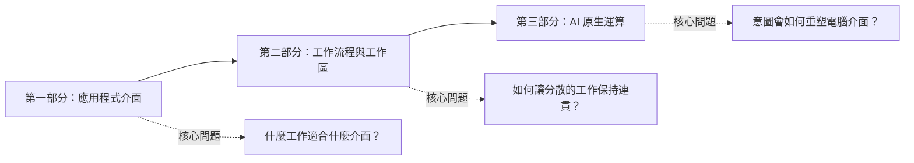

我們使用電腦時，通常先想「要開哪個 App」。要寫文件就開文件工具，要查專案進度就進 Jira，要改程式就回到編輯器。即使心裡想的是「把這個功能交付出去」，仍得自己把工作拆開，再逐一搬到不同工具裡完成。

AI 提供了另一種起點：先說出想完成什麼，再由系統找出相關資料、選擇合適工具，並組合下一步操作。

這不代表 App 會消失。比較可能發生的變化是：**App 不再是使用者理解工作的唯一中心，而會成為工作流程裡各自負責一件事的專業工具。** AI 可以幫忙串起它們，但權限、資料來源、可預期的操作，以及人的判斷，仍然決定結果能不能信任。

這個系列分成三部分：

## 第一部分：介面要配合工作（01–03）

這三篇先處理眼前最實際的問題：同一套功能，什麼時候該做成指令、網頁、桌面程式，或提供給 AI 使用？答案不在技術流行度，而在使用者當下要怎麼思考與操作。

### [01. 如何選擇合適的應用程式介面](/zh-hant/posts/01-choosing-the-right-application-interface/)

從使用者是否已知道答案、工作會持續多久、需要文字還是視覺操作，以及執行者是人或軟體，重新比較 CLI、TUI、Web App、PWA、桌面程式、瀏覽器擴充功能與 MCP。重點不是選出唯一贏家，而是知道何時該讓多種介面共用同一套核心能力。

### [02. 為什麼本機 Web App 值得重新認識](/zh-hant/posts/02-local-web-apps-are-underrated/)

畫面開在瀏覽器，不等於資料就得送上雲端。本機程式可以保管資料與系統權限，只把操作畫面放在瀏覽器。這篇會談程式生命週期、資料保存與安全邊界，也會說明：真正需要改成雲端服務的理由是多人共享，不是功能變多。

### [03. MCP Apps 與 AI 介面層](/zh-hant/posts/03-mcp-apps-and-the-ai-interface-layer/)

核心 MCP、MCP Apps 與完整 Web App 各自解決不同問題。MCP 讓 AI 能以結構化方式使用工具；MCP Apps 把小型互動畫面放進相容的 AI 主程式；完整 Web App 則提供可以長期回來、分享與協作的工作場所。該共用的是領域規則，不是每個畫面都做成一模一樣。

## 第二部分：把工作流程放回中心（04–07）

接下來不再以 App 為設計單位，而是從「一件工作如何完成」出發。不同系統仍保有各自的權威資料，但使用者不必一直靠記憶，把散落各處的脈絡重新拼起來。

### [04. 為什麼 URL 在 AI 時代仍然重要](/zh-hant/posts/04-why-urls-will-survive-ai/)

AI 可以減少手動導覽，卻不能取代穩定的身分。重要文件、決策與結果仍需要能辨識、分享、授權和再次開啟的位址。會影響後續工作的 AI 產出，也不該只留在某個人的對話紀錄裡。

### [05. 分頁太多，只是工作碎片化的表面症狀](/zh-hant/posts/05-the-tab-problem-and-app-centric-fragmentation/)

一項軟體變更可能同時散落在 Jira、Figma、Confluence、Bitbucket、Bamboo、Teams 與本機終端機。每套系統都保存了一部分正確資訊，使用者卻得反覆確認「我現在處理的是哪一件事、進度到哪裡、下一步由誰負責」。這篇會拆解那筆常被忽略的脈絡重建成本。

### [06. 以工作流程為中心的工作台](/zh-hant/posts/06-the-workflow-centric-workbench/)

這篇提出一個工作台模型：以成果為主軸，集合原始系統保存的證據、彼此關係、不同面向的狀態與目前可做的操作。它不是另一套企圖取代所有工具的總管系統；AI 負責處理語意不明的接縫，原始系統仍保有最終權威。

### [07. 可組合工作區的架構框架](/zh-hant/posts/07-framework-for-composable-workspaces/)

把幾個面板排在一起，不代表它們真的能合作。這篇用實體、資料、操作、畫面、事件與意圖六種契約，說明元件之間需要共享哪些意義；並介紹工作區外殼、脈絡圖、面板執行環境與本機常駐服務四個主要元件。實作時應先做好一條真實工作流程，而不是一開始就打造萬用作業系統。

## 第三部分：AI 原生電腦不會只有聊天框（08）

最後一篇把視角拉遠，但不假裝目前的限制已經消失。AI 原生不等於所有操作都改用聊天；意圖優先也不等於完全不需要介面。

### [08. 意圖優先的電腦，為什麼不能只有對話介面](/zh-hant/posts/08-intent-first-computing-and-future-ui/)

自然語言很適合說明意圖，卻不適合所有工作。密集比較、精準調整、重要提醒與長期狀態，都需要其他形式的介面。這篇提出一個可能流程：AI 理解脈絡並組合介面，代理程式處理範圍清楚的工作，人負責高風險例外，最後由持久工作區保存結果。

## 哪些是現在，哪些是推測？

01–05 談的是今天就遇得到的選擇：介面形式、本機部署、MCP 介面層、URL 與跨系統工作。技術規格會變，但問題已經存在。

06–07 是建立在現有技術上的設計提案。工作流程工作台，以及文中六種契約，並不是業界既定標準，而是用來設計與檢查系統的一套框架。

08 則刻意把現有基礎和作者推測放在一起。混合主導互動與互動式 AI 畫面都已存在；能可靠為每一項工作即時組合介面，同時保留權責、無障礙與可復原狀態的通用電腦，則仍是尚未完成的想像。

## 建議怎麼讀

想看完整論證，可以照編號讀。若只想解決手上的問題，也可以這樣選：

- 正在決定產品要做成哪種介面：讀 01，再用 02 判斷是否適合做成本機視覺工具，用 03 判斷是否需要 AI 內嵌互動。
- 想檢查「AI 會取代 App」這類說法：讀 03、04、08，分別看工具能力、持久位址與人機介面的角色。
- 工作散落在太多系統：從 05 的問題診斷開始，接著讀 06 的工作台，再用 07 的架構詞彙評估實作。
- 正在設計 AI 工作區：用 04 處理穩定身分，07 處理組合契約，08 處理意圖、注意力與例外。

這個系列不會宣布 App 已死。更務實的結論是：軟體可以先從人的意圖出發，再選擇合適工具；而那些讓複雜工作看得懂、找得回來、可以信任的場所與邊界，仍然不可少。
