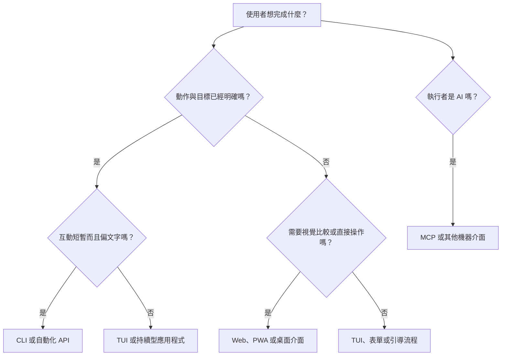

不少開發工具都從一行指令開始：

```bash
mytool scan ./project
```

工具愈來愈好用之後，有人想看執行進度，有人要比較前後兩次掃描結果，團隊則希望大家都能查看。於是專案加入 React 前端、伺服器、登入、資料庫與部署流程，連設定頁都排進待辦清單。

這些功能未必多餘。問題在於，我們很容易把「功能變多」直接解讀成「介面也應該升級得更複雜」。

程式內部多複雜，和它適合什麼介面，其實是兩回事。編譯器極其複雜，仍然很適合用指令操作；裁切一張照片的演算法沒那麼複雜，使用者卻需要看著畫面調整。真正該問的是：**使用者要完成這件事時，腦中正在做哪一種判斷？**

如果動作與目標都已經確定，指令通常最直接；如果要從許多選項中找答案，就需要能瀏覽、比較和試作的畫面。工作會不會持續很久、操作偏文字還是空間、執行者是人還是軟體，也都會改變答案。

因此 CLI、TUI、Web App、PWA、桌面程式、瀏覽器擴充功能與 MCP，不是從簡陋到高級的一條階梯。它們是為不同工作形狀準備的工具。

## 先問：使用者已經知道答案了嗎？

挑選介面時，最有用的第一條界線不是「簡單或複雜」，而是使用者要靠**回想**還是**辨認**。

已經知道動作和對象時，使用者可以直接下指令：

```bash
resize photo.jpg --width 1200
deploy payments --environment staging
format src/
```

還不知道答案時，情況就不一樣了。使用者可能得先查看現況、找出可選項目、並排比較，或一邊操作一邊看結果。「把照片縮成 1200 像素」很適合指令；「替這張照片找出三種比例都不會破壞構圖的裁切方式」就明顯是視覺探索。兩者底層甚至可能呼叫同一套影像函式庫。

還可以再問兩件事：

- **工作是做完即走，還是會持續一段時間？** 格式轉換跑完就能結束；監控、編輯與除錯則需要保留目前狀態。
- **工作偏符號，還是偏空間？** 檔名、參數、路徑與識別碼適合文字；版面、顏色、時間軸、關係圖與並排比較更適合視覺介面。

把這些問題整理起來，可以得到一個簡單的判斷圖：



這是幫助思考的起點，不是硬性分類。真實產品往往會同時需要其中幾條路徑。

## CLI：動作已經很清楚時，別讓使用者繞路

當一項操作可以說成「動詞 + 對象 + 少量參數」，命令列介面（CLI）通常最合適。尤其是操作需要重複執行、要存進腳本或 CI，或輸出還要交給下一個程式處理時，CLI 的價值很難取代。

這種組合能力有共同規則支撐。POSIX 對 shell 的定義涵蓋指令解析、參數展開、輸入輸出重新導向、工具執行與結束狀態。小工具因此不必共用圖形框架，也能彼此串接（[POSIX Shell Command Language](https://pubs.opengroup.org/onlinepubs/9799919799/utilities/V3_chap02.html)）。

CLI 特別適合：

- 建立、轉換、格式化、驗證、搬移、下載或部署。
- 用穩定名稱指向檔案、程式庫、環境或其他物件。
- 在本機、遠端與 CI 重複同一個動作。
- 輸出 JSON 等結構化結果，並回傳有意義的結束碼。
- 讓已熟悉領域的開發者快速操作。

但當使用者不知道正確指令、需要比較大量物件，或每次都得從文字輸出重新拼湊狀態，CLI 就開始吃力。一個指令支援一百個參數，不等於大家找得到該用哪一個。指令歷史可以幫忙回憶，卻無法取代良好的資訊架構。

所以不要因為程式碼變多，就急著把 CLI 改成 Web App；也不要在工作明明已經變成探索時，仍只是不斷加參數。

## TUI：保留終端機效率，也保留工作現場

終端機使用者介面（TUI）適合需要鍵盤效率、遠端操作，又不能每執行一個指令就把狀態丟掉的工作。

以部署監控為例。使用者會在不同服務之間切換、查看紀錄、篩選錯誤、重試工作，並希望目前選取的項目一直留在畫面上。這些動作都能拆成指令，但 TUI 可以保留這次工作的範圍，免得使用者一直複製貼上識別碼。

常見用途包括程序與紀錄檢視器、容器和基礎設施管理工具、資料庫與佇列檢查工具、Git 用戶端，以及長時間工作的代理程式監控台。

它也有明確限制。密集圖表、自由畫布、富文字編輯、拖放、觸控操作，以及多樣的輔助科技支援，都比較難在終端機做好。TUI 不是便宜版 Web App，而是一套以終端機為前提的持續互動方式。

## Web App：適合探索，也適合一起工作

當使用者要管理許多物件、查看歷史、比較資料、留言協作，或從不同裝置進入同一套系統時，Web App 很自然。表格、表單、篩選、圖表、權限化畫面與多人協作，都是 Web 擅長的內容。

Web 的價值也不只在畫面。URL 能指向特定專案、建置結果、文件或決策；權限可以套用在共同位址上；同事收到連結就能打開，不必先安裝同一套桌面軟體。本系列後面討論 AI 時代的 URL 時，會再回到這些特性。

不過，Web App 不等於 SaaS。工具也可以在使用者電腦啟動本機服務，把資料留在本機，只用瀏覽器負責顯示與操作：

```bash
mytool ui

# Opens http://127.0.0.1:4310
```

這樣一樣能做圖表、搜尋紀錄與表單，卻不必立刻導入帳號、多租戶和雲端儲存。[下一篇](/zh-hant/posts/02-local-web-apps-are-underrated/)會完整討論這種常被低估的本機 Web App。

選 Web App 的理由應該是瀏覽器真的適合這份工作，不是團隊剛好熟悉 React。

## PWA：當網站需要成為日常使用的程式

漸進式 Web 應用程式（PWA）本質上仍是 Web App。差別在於它能和裝置建立較固定的關係。Web App Manifest 可以定義啟動資訊、圖示、網址範圍與顯示模式；瀏覽器也可能讓使用者把它安裝成獨立視窗。W3C 規格詳細定義了這些啟動參數與深層連結行為（[W3C Web Application Manifest](https://www.w3.org/TR/appmanifest/)）。

如果產品希望用同一套 Web 程式碼服務桌機與手機、使用頻率高、需要安裝圖示或部分離線能力，而且可以接受不同瀏覽器與作業系統的差異，就值得考慮 PWA。

最後一點很重要。PWA 並不保證每個平台都有相同的原生整合能力，安裝方式也會隨瀏覽器和作業系統而變。Google 的指南就分別說明了各平台行為（[web.dev：PWA installation](https://web.dev/learn/pwa/installation)）。如果產品仰賴深度系統整合，必須在真正要支援的平台上驗證，不能只看功能檢查表。

## 桌面程式：當作業系統本身就是產品邊界

IDE、終端機、影片剪輯器、密碼管理器、虛擬化工具與本機 AI 工作台，都需要長期存在於電腦，也經常要使用檔案系統、多視窗、全域快捷鍵、背景程序、原生選單、硬體加速或裝置整合。這時桌面程式才是自然選擇。

代價是安裝、更新、程式簽章、跨平台差異與安全維護都會成為產品責任。Electron、Tauri 與原生工具組會改變工程成本，卻不會自動回答介面該長什麼樣子。「桌面」只說明程式和電腦的關係；內部仍可能是文件、畫布、儀表板、終端機或對話。

實務上可以先從能滿足需求的最輕形式開始，等到具體的作業系統需求出現，再加入桌面外殼。「以後也許會用到原生功能」還不算需求。

## 瀏覽器擴充功能：當眼前網頁就是工作脈絡

如果工作從某個網站裡開始，瀏覽器擴充功能往往比獨立 App 更順手。它可以在瀏覽器加上按鈕、把內容腳本放進頁面、回應瀏覽器事件，或顯示彈出視窗和側邊欄。MDN 也清楚區分資訊清單、背景腳本、擴充功能頁面與在網頁環境中執行的內容腳本（[MDN：Anatomy of an extension](https://developer.mozilla.org/en-US/docs/Mozilla/Add-ons/WebExtensions/Anatomy_of_a_WebExtension)）。

例如把目前頁面收進研究筆記、替特定網站補上工作流程、比較多個已開啟頁面的內容、在使用者同意下填寫資料，或把網頁連到本機開發工具，都很適合擴充功能。

如果主要工作和目前網頁無關，就不該預設走這條路。擴充功能得處理權限、瀏覽器政策、商店審查與平台差異；要求的權限愈大，產品就愈有責任說清楚用途與信任邊界。

## MCP：這是 AI 的介面，不是另一種 GUI

模型情境協定（Model Context Protocol，MCP）可以一起比較，但它屬於不同類別。MCP 伺服器本身不是給人操作的圖形介面，而是讓 AI 應用程式取得工具與情境資料的協定。

官方架構列出三種主要伺服器能力：工具（tools）執行動作，資源（resources）提供可讀取的情境，提示（prompts）則提供可重複使用的互動範本。主程式會確認雙方支援哪些能力，再決定如何交給模型與使用者（[MCP architecture overview](https://modelcontextprotocol.io/docs/learn/architecture)）。

當 AI 需要查詢系統、用有型別的參數執行範圍清楚的動作、讀取背景資料，或在執行時發現可用工具，MCP 很合適。

這並不表示產品可以拿掉 CLI 或 Web App。人可能需要視覺比較與明確確認，自動化程式需要 API 或 CLI，AI 則需要 MCP。這些介面可以共用同一套領域邏輯，分別服務不同執行者。

MCP Apps 又多了一層互動畫面，但它和核心 MCP 不是同一件事。官方文件說明相容主程式如何顯示這些畫面，也提醒各家主程式的支援程度不同（[MCP Apps overview](https://modelcontextprotocol.io/extensions/apps/overview)）。第 03 篇會專門討論它何時比純對話好用，以及何時仍需要完整應用程式。若想先了解代理程式如何發現網頁提供的工具，也可以讀[發現問題：AI 代理如何找到你的 WebMCP 工具？](/zh-hant/posts/webmcp-discovery-problem/)。

## 好產品不一定只提供一種介面

一個設計合理的開發工具，可能同時提供：

```text
mytool scan       -> 執行一次明確的轉換
mytool status     -> 讓腳本取得狀態
mytool ui         -> 在本機以視覺方式查看
mytool serve-mcp  -> 把能力提供給 AI 代理程式
```

四種介面共用同一套領域邏輯。CLI 不必為了執行一個動作而打開瀏覽器；Web UI 不必把所有操作都塞成按鈕；MCP 也不必用文字假裝圖表很好理解。每一層只負責自己擅長的工作。

| 工作形狀               | 適合先考慮的介面    | 原因                         |
| ---------------------- | ------------------- | ---------------------------- |
| 一次轉換               | CLI                 | 精確、可重複、容易組合       |
| 終端機內持續查看       | TUI                 | 保留狀態與鍵盤效率           |
| 視覺探索               | Web App             | 方便比較、發現與呈現         |
| 跨裝置日常使用         | PWA                 | 保留 Web 觸及範圍，也可安裝  |
| 深度本機整合           | 桌面程式            | 能處理檔案、程序與裝置       |
| 依賴目前網頁的資料擷取 | 瀏覽器擴充功能      | 頁面本身就是輸入             |
| 自動化                 | CLI、API 或常駐服務 | 不需要人工導覽，可預期地呼叫 |
| AI 存取                | MCP                 | 結構化能力與情境探索         |

這張表提供起點，不是限制。只有當真實工作跨到另一列時，才值得增加新的介面。

## 選框架之前，先回答七個問題

1. **使用者一開始已經知道什麼？** 動作和目標都明確，就給直接操作；還不明確，就幫助探索。
2. **哪些資訊必須一直看得到？** 需要持續狀態、比較或歷史，就要有能保留現場的介面。
3. **工作偏文字還是空間？** 名稱和參數適合文字；版面、關係與預覽適合視覺。
4. **脈絡在哪裡？** 終端機、目前網頁、本機電腦、組織共用系統或 AI 主程式，會形成不同邊界。
5. **誰要操作？** 給人用和給機器用的介面，不該混為一談。
6. **要如何接上其他工作？** Pipe、URL、API、檔案與 MCP 各有不同組合方式。
7. **最小但不會隱藏必要複雜度的介面是什麼？** 從這裡開始，才能控制產品生命週期成本。

多介面當然也有代價。文件與測試可能分散；CLI、Web App 和 MCP 的行為可能不一致；對一般使用者而言，熟悉的 Web UI 有時比高度專門化的介面更容易上手。

解法不是讓每個產品無限增加介面，而是共用核心規則、明確劃分各介面的責任，並要求每一個新介面都要有真實工作需求作為理由。有些產品只需要一個 Web App，有些只需要一行指令，這兩種答案都完全合理。

## 介面不是包裝，而是產品的一部分

介面決定使用者如何說出需求、看見狀態、從錯誤恢復、接上其他工具，以及下次回到還沒做完的工作。它不是程式完成後再補上的外觀。

CLI、TUI、Web App、PWA、桌面程式、瀏覽器擴充功能與 MCP，分別定義了能力、工作脈絡與執行者之間的關係。

下一篇會用本機 Web App 進一步驗證這個觀點：工具可以保有適合自動化的指令，也能提供豐富視覺畫面，而且資料不必離開電腦。真正值得問的從來不是「哪一種 App 會贏」，而是「哪幾個介面能讓同一套能力，在工作原本發生的地方，服務真正需要它的人」。

_系列導覽：[索引](/zh-hant/posts/00-from-apps-to-intent-driven-computing/) · 下一篇：[02 — 為什麼本機 Web App 值得重新認識](/zh-hant/posts/02-local-web-apps-are-underrated/)_

## 資料來源

- [POSIX.1-2024 Shell Command Language](https://pubs.opengroup.org/onlinepubs/9799919799/utilities/V3_chap02.html)
- [W3C Web Application Manifest](https://www.w3.org/TR/appmanifest/)
- [web.dev：PWA installation](https://web.dev/learn/pwa/installation)
- [MDN：Anatomy of an extension](https://developer.mozilla.org/en-US/docs/Mozilla/Add-ons/WebExtensions/Anatomy_of_a_WebExtension)
- [Model Context Protocol architecture overview](https://modelcontextprotocol.io/docs/learn/architecture)
- [MCP Apps overview](https://modelcontextprotocol.io/extensions/apps/overview)
