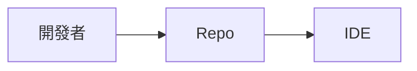
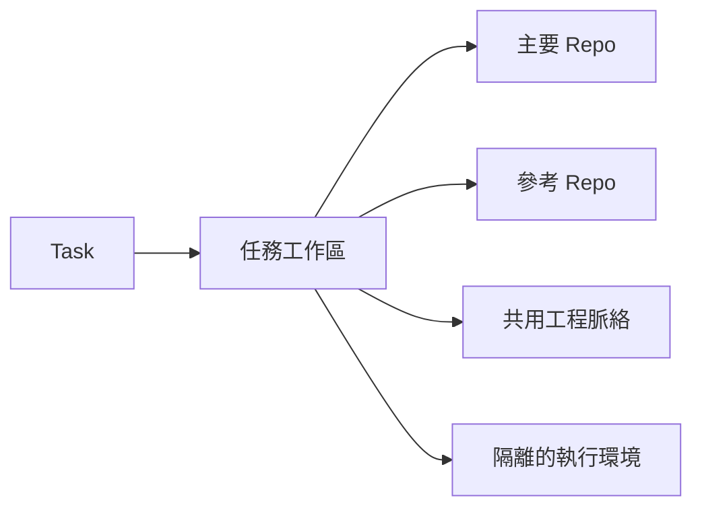
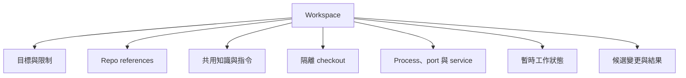

以前我準備開始一項開發工作，動作通常很固定：把 Repo 拉下來、裝好相依套件、用 VS Code 開啟資料夾，然後開始改程式。

在那個年代，「開發環境」和「Repo」幾乎可以畫上等號。

開始在工作上認真使用 coding agent 之後，這個模型慢慢失效了。

真正讓我察覺的，不是某次很炫的程式碼生成，而是一個下班前交出去的小任務。我請 agent 修掉一個測試問題，希望隔天回來就能 review。結果 agent 的修改不算差，但它漏掉了公司專案裡幾個「大家都知道」的規則：哪一組測試才算正式驗證、哪個檔案由工具產生不能直接改，以及某個看似多餘的設定其實是為了相容舊環境。

Repo 裡有程式碼，卻沒有足夠的工程脈絡。

## Repo 周圍開始長出另一套東西

為了讓下一次任務順利，我開始補資料：`AGENTS.md`、測試指令、架構筆記、常見陷阱、跨 Repo 的服務關係。接著又出現暫存 branch、agent 的 scratchpad、handoff、可重用的 skill，以及「上次已經踩過，這次不要再踩」的決策。

很快地，我發現自己其實在維護兩個系統：

- Repo 保存軟體本身。
- Repo 周圍的工作區，保存這次工作需要的脈絡、隔離與執行狀態。

問題不是文件寫得不夠多，而是我們過去沒有替這些東西安排清楚的生命週期。

有些資訊應該長期保留，例如正式測試方式與系統邊界。有些只適用這次任務，例如 agent 正在嘗試的方案。有些需要讓所有 agent 都知道，有些則不該離開當次 Run。

全部塞進 README，只會把暫時想法和長期規則混在一起。

## 工作單位從 Repo 變成 Task

後來我把模型反過來看：不是先開 Repo 再想要做什麼，而是先有一項 Task，再由它組合出需要的工作區。

一個工作區至少要能回答：

- 這次想完成什麼？
- Agent 可以改哪個 Repo？
- 為了理解系統，它還需要看哪些 Repo 或文件？
- 這次使用哪個 branch、worktree 與執行環境？
- Agent 啟動了哪些 process 或 service？
- 完成後要交回什麼，哪些東西可以清掉？

這裡的 Workspace 不是 IDE 裡「同時開幾個資料夾」的功能，而是一個圍繞工程任務形成的暫時邊界。

## 「用完可丟」反而比較安全

一開始我很捨不得結束 agent session，總覺得對話裡累積了很多 context，關掉就浪費了。

但工作上的任務很少永遠不變。需求會修正，main branch 會前進，前一個方案也可能已經證明行不通。把 session 養得越久，裡面未必是更多知識，也可能只是更多過期假設。

我現在更喜歡把一次 agent 工作視為可拋棄的工程執行：輸入清楚、過程可觀察、結果可檢查。真正有價值的程式碼與知識，再被提升到長期保存的位置。

「可拋棄」不代表隨便。它比較像 CI job：環境本身可以重建，重要輸出必須留下，而且誰建立、誰負責清理都說得清楚。

## 還不用急著談 multi-agent

很多產品一談 coding agent，就立刻跳到 planner、subagent、swarm 和 agent-to-agent protocol。

可是我第一次遇到這些問題時，場景只有一個人、一個 agent、一個 Repo。

光是單一 agent，就已經需要任務邊界、正確 context、隔離的修改空間、可 review 的結果，以及把有用發現留下來的方式。多 agent 只會把問題放大，不會替我們補上這層基礎。

## 我在工作上學到的事

我原本把 coding agent 當成另一種操作 Repo 的介面，就像更主動的 IDE。實際使用一段時間後，我才明白 Repo 並不是完整的工作單位。

Agent 真正需要的是一個任務導向的 Workspace：它組合程式碼、工程脈絡、隔離環境、執行資源與交付結果；任務結束後，只留下值得留下的部分。

所以這個系列的第一個原則是：

> 不要讓 coding agent 直接住進開發者那個狀態混雜的 checkout；替每項任務建立一個可重建、可檢查、用完可清理的工作區。

下一個問題很快就出現了：公司裡的系統往往橫跨多個 Repo。如果 agent 只看得到其中一個，它很可能寫出「在本機完全正確、放進整體系統卻是錯的」程式碼。

下一篇：[軟體系統比一個 Repo 更大](/zh-hant/posts/software-system-is-bigger-than-a-repository/)。
