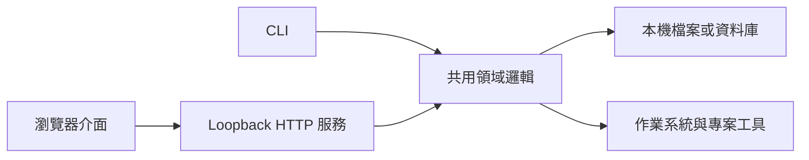

[上一篇](/zh-hant/posts/01-choosing-the-right-application-interface/)談到：介面該配合使用者正在進行的思考。動作已經很明確時，指令快速又精準；需要探索、比較或直接操作資料時，視覺介面通常更好。

這不表示工具只能在 CLI 和雲端 Web App 之間二選一。

還有一種很實用的做法：程式跑在使用者自己的電腦，資料和系統權限也都留在本機，只把操作畫面送到瀏覽器。這就是**本機 Web App（Local Web App）**。瀏覽器只是顯示與互動工具，不代表產品已經變成 SaaS。

我的主張是：**當本機工具需要比指令輸出更完整的視覺呈現，卻沒有多人共用雲端資料的需求時，本機 Web App 往往是最省力也最合理的選擇。** 它保留 CLI 的自動化優勢，也能加入歷史紀錄、前後比較與圖形化檢查。難點不在畫面，而是要把程式何時啟動、資料放哪裡，以及誰能呼叫它說清楚。

## 從一個掃描工具說起

想像有個程式庫分析工具，最初只有一個指令：

```bash
mytool scan ./project
```

它會走訪專案、記錄相依套件與風險，最後回傳結束狀態。對 CI 或只想立刻知道「有沒有問題」的開發者而言，這個介面已經很好。

使用一段時間後，需求開始分成兩類。第一類要的是簡短而且機器讀得懂的狀態：

```bash
mytool status --format json
```

第二類則想理解結果。是哪個套件帶進有漏洞的相依路徑？重構之後架構有沒有改善？警告為什麼集中在某個資料夾？這些問題需要辨認關係與前後比較。再塞更多彩色終端機表格，只是勉強讓文字介面承擔不擅長的工作。

下一步其實可以很小：

```bash
mytool ui

# Listening on http://127.0.0.1:4310
# Press Ctrl-C to stop
```

指令啟動本機服務，再用瀏覽器開啟儀表板。使用者不用註冊帳號，專案內容不會上傳，關掉程序後服務也停止。

這不是三套產品，而是同一套能力的三個入口：

| 介面            | 負責的工作                       |
| --------------- | -------------------------------- |
| `mytool scan`   | 執行結果可預期的掃描             |
| `mytool status` | 提供人、腳本與 CI 都能使用的狀態 |
| `mytool ui`     | 探索歷史、相依關係與詳細原因     |

三者最重要的共通點，是呼叫同一套領域邏輯。掃描規則、資料保存與風險判斷，不應該在 React 裡另外重寫一份。

## 瀏覽器可以只是一扇本機視窗

大家說「Web App」時，常把三件不同的事綁在一起：

1. 畫面使用 Web 技術製作。
2. 前後端透過 HTTP 溝通。
3. 資料與運算放在遠端伺服器。

本機 Web App 只需要前兩項，整套程式仍可完全在使用者電腦上執行。



這種分工之所以值得考慮，是因為瀏覽器早就是成熟的介面執行環境。排版、響應式版面、表格、圖表、表單、鍵盤與滑鼠操作、無障礙語意和頁面連結，都有現成基礎。團隊可以沿用熟悉的前端技術，卻不必同時處理多租戶、帳務、公網部署與遠端資料保存。

本機程序則能做遠端網站不容易做的事：以使用者權限讀取工作目錄、呼叫 Git 或編譯器、監看檔案變動、連接本機模型，以及沿用電腦上的既有設定。瀏覽器介面只能要求它執行定義好的領域操作，不能拿到一個可以隨意下 shell 指令的端點。

這也解釋了為什麼不一定要直接包成桌面程式。若產品需要原生選單、背景常駐、全域快捷鍵、多視窗管理或固定版本的瀏覽器引擎，桌面外殼確實有價值。但如果需求只是替既有本機程序補上一個好用畫面，電腦裡原本的瀏覽器通常已經足夠。

## 程式由誰啟動，也是使用體驗的一部分

雲端網站通常一直都在；本機 Web App 則有明確的開始與結束。這件事不能丟給使用者自己猜。

對輕量開發工具，我偏好讓終端機直接管理程序：

```text
mytool ui 啟動服務 -> 開啟瀏覽器 -> 終端機持續顯示紀錄
Ctrl-C              -> 停止服務 -> 釋放連接埠
```

這種方式看得見，也容易除錯。終端機可以清楚顯示目前開啟哪個專案、資料存在哪裡，以及啟動為何失敗；使用者也不會在背景留下許多早已忘記的常駐程序。

經常使用的工具可能真的需要背景服務或選單列程式，但代價包括開機啟動、更新行為、程序卡死後的復原、資源限制，以及判斷目前跑的是哪個版本。只有「隨時可用」已經是實際需求時，才值得承擔這些成本。

連接埠也要有規則。固定連接埠的網址好記，但可能和其他程式衝突；隨機連接埠不容易衝突，書籤卻無法固定。合理做法是先嘗試偏好的連接埠，失敗時安全地換一個，並在啟動訊息清楚顯示。若能同時開多個專案，每個工作階段都必須標示專案身分，不能讓畫面在背後悄悄改指向另一個根目錄。

## 「只跑在 localhost」不是完整安全保證

本機執行確實縮小了風險範圍，但不能因此省略安全設計。

服務至少應只綁定 `127.0.0.1` 或 `::1` 等 loopback 位址，不能預設監聽所有網路介面。RFC 8252 在規範原生應用程式的 OAuth 重新導向時也採用相同原則：用 loopback 接收回呼的程式只能監聽 loopback，並建議使用明確 IP，而不是可能有名稱解析差異的 `localhost`（[RFC 8252，第 7.3 節](https://www.rfc-editor.org/rfc/rfc8252.html#section-7.3)）。這份 RFC 談的是 OAuth，但網路邊界的推理同樣適用於本機儀表板。

即使綁定正確，還是要回答：

- 電腦上的其他程序能不能直接呼叫會刪除或修改資料的端點？
- 使用者開啟的陌生網站，能不能透過瀏覽器對本機服務送出要求？
- API 會不會接受專案根目錄以外的任意路徑？
- 原始碼、密鑰與執行紀錄會不會出現在回應或瀏覽器儲存空間？
- 「開啟檔案」交給作業系統之前，有沒有檢查真正的目標？

會改變狀態的請求應使用每次工作階段都不同、無法猜出的權杖，搭配嚴格的來源檢查與限定的內容類型；`GET` 絕不能拿來修改資料。檔案路徑要先正規化，再限制於允許範圍。指令只能是事先列出的領域操作，不能直接把字串交給 shell。伺服器也只應回傳目前畫面需要的最少資訊。

瀏覽器安全機制能幫忙，但不能代替服務本身的檢查。Secure Contexts 規格把 loopback 來源視為「可能可信」，所以本機網頁可以使用部分只開放給安全情境的能力（[W3C Secure Contexts](https://www.w3.org/TR/secure-contexts/#is-origin-trustworthy)）。「可能可信」並不表示其中程式碼天然安全。第三方腳本與遠端素材都會擴大攻擊面，因此本機介面最好把素材一起打包，並採用嚴格的內容安全政策（CSP）。

產品也要清楚說明「留在本機」到底涵蓋哪些資料。程式可能仍會檢查更新、下載漏洞資料庫、呼叫遠端模型或載入說明文件。這些行為未必不合理，但應讓使用者看得見，必要時能關閉，而且要和「專案內容不會上傳」分開說明。

## 資料要不要留下，取決於工具用途

使用瀏覽器不表示一定得安裝資料庫伺服器。`mytool` 的掃描結果可以存成專案內不可修改的 JSON、放進使用者應用程式資料夾裡的小型 SQLite，也可以預設完全不保存歷史。每種方式代表不同承諾：

- 專案內檔案容易攜帶，也會隨專案一起刪除，但可能讓版本庫多出不必要內容。
- 使用者層級儲存不會弄髒工作目錄，卻需要穩定辨識專案，也得提供清理方法。
- 記憶體內狀態簡單而私密，但程式重開後就無法前後比較。
- 共用雲端資料庫適合協作，卻也改變了產品類型與信任模型。

畫面應標出歷史資料存放位置，並提供清楚的清除與匯出功能。使用者不必到處找沒有文件的快取，才比較能相信「本機優先」這項承諾。

前端架構也該保持節制。只有幾個篩選條件和圖表的儀表板，不一定需要龐大的單頁應用程式；伺服器端產生 HTML，再搭配少量互動元件，可能就夠了。只有複雜狀態切換、視覺化或離線操作真的需要時，才值得做成大型前端。少了雲端基礎設施，不代表就可以忽略用戶端的複雜度。

## 哪些工具最適合這種模式？

以下三個條件同時成立時，本機 Web App 特別有價值：

1. 核心能力本來就屬於使用者的電腦。
2. 至少一部分工作需要視覺探索。
3. 多人協作是可選功能，不是產品成立的前提。

程式庫分析器、本機模型管理器、資料庫檢查工具、測試報告瀏覽器、效能分析工具、API 用戶端、靜態網站預覽器與媒體處理佇列，都很符合。個人知識與資料工具也常需要瀏覽器的呈現能力，卻不適合把整份資料上傳。

反過來，如果多人必須同時編輯同一份狀態、使用者電腦關機後工作仍要繼續、手機存取是核心需求，或組織管理者需要統一政策，本機 Web App 就不夠。它能呈現這台電腦的狀態，不能假裝自己是整個團隊的權威系統。

遠端存取更是一條新的安全邊界。為了「臨時分享」把服務綁到 `0.0.0.0`，等於在沒有身分驗證、TLS、多租戶隔離、稽核與威脅分析的情況下，把本機服務直接變成網路服務。如果真的需要遠端模式，就應另行設計具備驗證的入口，不能只是放寬本機預設。

## 什麼時候才需要搬到雲端？

本機 Web App 不是等待長成 SaaS 的半成品。對某些工具而言，本機就是最終而且正確的架構。

只有需求改變時，才有升級理由：

- 隊友必須從自己的裝置查看掃描結果。
- 結果需要符合組織層級的保存政策。
- 原本的筆電關機後，工作仍要繼續執行。
- 存取需要中央身分、角色與稽核紀錄。
- 團隊需要能長期分享的固定網址。

這時雲端服務可能比較適合。共用領域邏輯與清楚的儲存邊界能降低搬移成本，但雲端版不能只是 `mytool ui --public`，而要重新設計安全、維運與資料治理。

反過來說，搜尋、圖表、歷史、表單甚至互動關係圖，都不是「一定要上雲」的證據。真正的判斷標準是：權威資料和需要使用它的人，必須在哪裡碰面？

## 小而完整，不等於只是過渡方案

我們常看見瀏覽器就以為背後一定是遠端服務，看見執行檔就以為只能使用終端機。這兩個聯想都不是必然。

`mytool` 可以一直維持這種混合形態：

```text
scan   讓自動化流程執行精確動作
status 讓腳本與人取得穩定答案
ui     讓人用視覺方式理解答案
```

這不是重複做三套介面，而是讓同一項能力服務三種不同程度的不確定性。指令處理已知意圖，狀態輸出負責檢查與串接，本機畫面則協助探索與比較。

它可能比雲端服務更容易散布，比「先上傳再使用」的產品更容易取得信任，也比大型桌面外殼更容易演進。前提是團隊認真處理程序生命週期、儲存與安全。正是這些明確限制，讓本機 Web App 成為完整架構，而不只是開發伺服器的小技巧。

它無法解決工作散落在組織各套系統的問題，卻先證明一件重要的事：視覺介面不必擁有底層能力，也不必把資料搬走。有時最好的 UI，只是替原本就在本機進行的工作，開一扇設計良好的窗。

_系列導覽：[索引](/zh-hant/posts/00-from-apps-to-intent-driven-computing/) · 上一篇：[01 — 如何選擇合適的應用程式介面](/zh-hant/posts/01-choosing-the-right-application-interface/) · 下一篇：[03 — MCP Apps 與 AI 介面層](/zh-hant/posts/03-mcp-apps-and-the-ai-interface-layer/)_

## 資料來源

- [RFC 8252：OAuth 2.0 for Native Apps 的 loopback redirect](https://www.rfc-editor.org/rfc/rfc8252.html#section-7.3)
- [W3C Secure Contexts：Is origin potentially trustworthy?](https://www.w3.org/TR/secure-contexts/#is-origin-trustworthy)
- [OWASP Cross-Site Request Forgery Prevention Cheat Sheet](https://cheatsheetseries.owasp.org/cheatsheets/Cross-Site_Request_Forgery_Prevention_Cheat_Sheet.html)
- [OWASP Content Security Policy Cheat Sheet](https://cheatsheetseries.owasp.org/cheatsheets/Content_Security_Policy_Cheat_Sheet.html)
