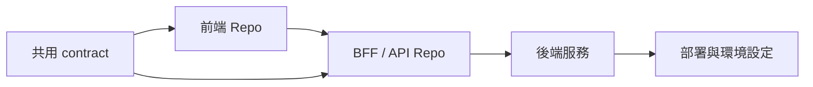
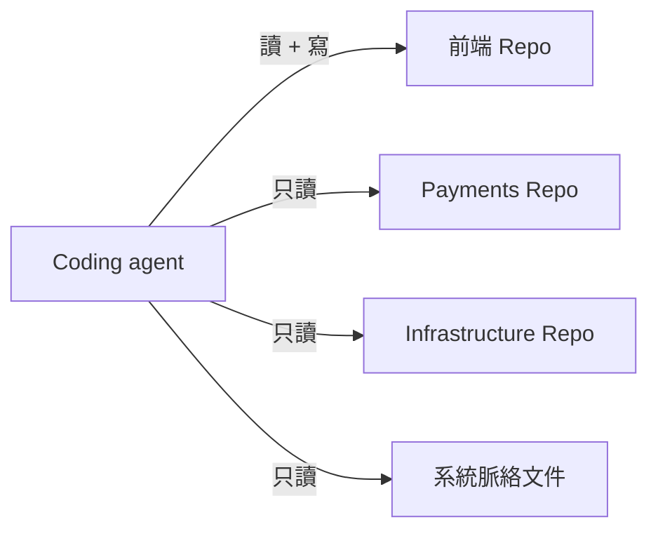
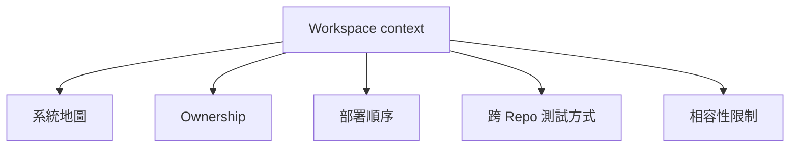
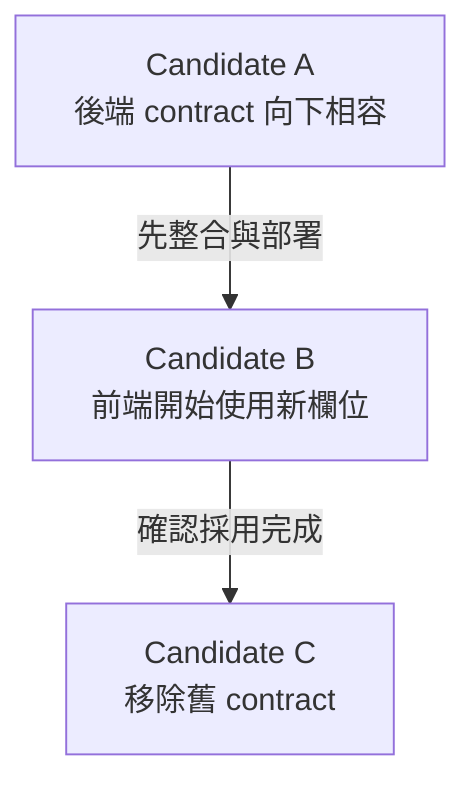

有一次 agent 改完前端，TypeScript 沒有錯，unit test 全過，連畫面操作看起來都正常。

到了整合環境，API 卻直接拒絕請求。

問題不在 agent 的程式碼品質，而在我給它的世界太小。前端 Repo 裡的型別，看起來允許一個欄位不填；後端實際使用的 contract 卻有額外限制。更麻煩的是，Helm 設定又決定了整合環境會走另一條 service path。

Agent 只看前端 Repo，自然會得到一個合理、但不完整的答案。

這次經驗讓我記住一個很重要的區分：

> 可以修改的範圍，和必須理解的範圍，不是同一件事。

## 公司系統很少剛好只在一個 Repo 裡

小專案常常可以把 Repo 當成整個世界。公司裡的實際服務通常不是這樣：



Ticket 可能只說「調整登入 refresh flow」，真正需要理解的卻包含瀏覽器端狀態、identity service 的 contract、gateway timeout，以及測試環境的 issuer 設定。

如果 agent 的 context 只等於目前目錄，它會很快把模糊處補成自己認為最合理的解釋。Coding agent 的速度，在這裡反而會放大錯誤：錯的 context boundary，會更快產生一個完成度很高的錯誤實作。

## Read many, write one

我後來採用的預設模式是：讓 agent 可以讀多個 Repo，但一次 Run 只指定一個主要修改目標。



對應的 manifest 可以很單純：

```yaml
repos:
  frontend:
    path: ../frontend
    primary: true

  payments:
    path: ../payments
    context: true

  infrastructure:
    path: ../infrastructure
    context: true
```

這個 pattern 的價值不是提供真正的 OS 權限隔離，而是把工程責任講清楚：你可以廣泛調查，但這次預期只在 `frontend` 產生候選變更。

如果 agent 發現後端 contract 必須先改，它應該把那件事列成 dependency 或下一個 candidate，而不是順手跨進另一個 Repo 一起修改。

## 看得到，不代表可以動

我以前會擔心：給 agent 多看幾個 Repo，scope 會不會失控？

其實隱藏資訊不會縮小問題，只會讓 agent 在資訊不足時猜測。真正要限制的是 mutation，而不是 understanding。

任務描述可以把兩個邊界分開寫：

```text
目標：修正前端 token refresh 時機。

修改範圍：frontend Repo。

脈絡範圍：frontend、identity service、部署設定與 auth contract。

限制：這次 Run 不修改 server contract；若發現需要修改，請列為 dependency。
```

這種寫法對人也有幫助。Reviewer 一眼就知道這次候選變更承諾了什麼，也知道哪些跨系統問題刻意留到下一步處理。

## 有些知識本來就落在 Repo 之間

即使把所有相關 Repo 都提供給 agent，仍有一些資訊找不到自然的歸屬：

- rolling deployment 時誰必須向下相容
- staging 和 production 哪裡不一樣
- 哪個 team 擁有某段 contract
- 為什麼兩個重複 model 暫時不能合併
- 哪一組整合測試才代表完整 user journey

這些不是某個 Repo 的實作細節，而是 Workspace 層級的系統知識。



它們不一定需要 knowledge graph。幾份有人維護、可以 review 的 Markdown，往往比藏在某次 agent 對話裡可靠得多。

## 不假裝有 multi-repo 原子交易

有些 feature 確實需要同時改前端、後端與 deployment Repo。但「同一項需求」不代表所有變更要塞進同一次 Run。

多 Repo 同時修改會碰到實際的整合問題：誰先 merge、哪個版本先上線、部分成功怎麼回復、每個 Repo 由誰 review。這些不會因為 CLI 提供一個漂亮指令就消失。

我比較信任有依賴關係的多個 candidate：



Workspace 保存它們的關係，各 Repo 仍保有自己的 review 與 release 邊界。

## 我在工作上學到的事

那次前端修改在本機看起來完全正確，是因為我們用 Repo 邊界代替了系統邊界。

現在每次交任務給 agent，我會先問兩個問題：

1. 它要理解這項工作，必須看到哪些東西？
2. 這次我真正希望它修改哪些東西？

答案不同很正常，而且應該被明確寫進 Workspace。

> 讓 agent 在系統邊界閱讀，在任務邊界修改。

做到這一步之後，agent 的實作比較不容易只在單一 Repo 裡自洽。可是幾週後回頭看，我又遇到另一個問題：Git 清楚保存了 diff，卻沒有替我保存「當時為什麼決定這樣做」。

下一篇：[Git 記得改了什麼，卻不記得我們為什麼走到這裡](/zh-hant/posts/git-stores-what-changed-not-why-we-got-there/)。
