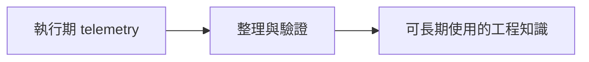
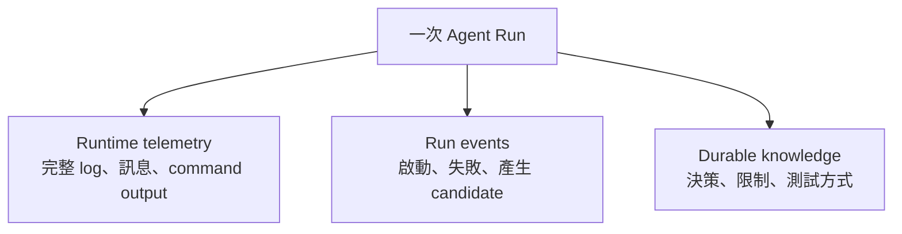
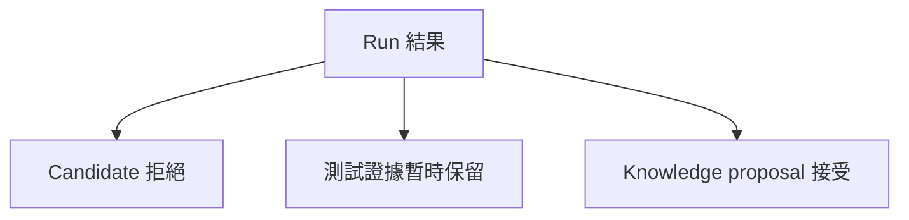
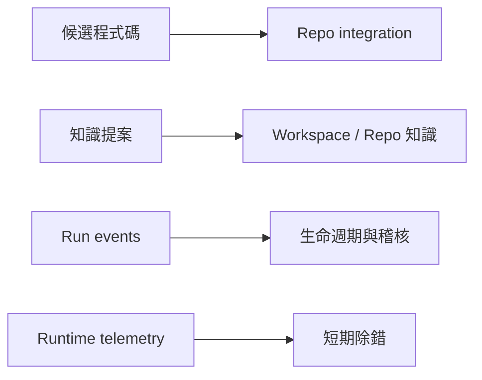

在工作上最讓人挫折的時刻，不一定是程式壞掉，而是程式明明能跑，卻沒有人能解釋它為什麼長這樣。

我曾經在幾週後回頭看一個 agent 協助完成的 commit。測試有寫，commit message 也沒亂寫，但某段 retry logic 放在很奇怪的位置。我只記得當時討論過相容性問題，卻找不到最後做決定的依據。

Jira 只留下需求；Teams 裡的討論已經沉下去；agent session 有大量 command output 和來回修正。Git 忠實告訴我哪幾行被改掉，卻回答不了「為什麼不是另一種寫法」。

## Agent 做完一次任務，留下的不只 diff

傳統 Git history 很擅長保存：

- commit
- diff
- author
- timestamp
- message

Coding agent 的工作過程，還會產生另一批有價值的資訊：

- 最初目標與限制
- 探索時發現的系統行為
- 已經試過但失敗的路
- 測試、log 與實驗證據
- 最後採用某方案的理由
- 下次不該再踩的坑
- 可重用的指令或 skill 改進

問題是：這些東西不適合全部塞進 commit message，也不該把整段對話原封不動 commit 進 Repo。

## 完整對話不是工程文件

Agent 對話允許混亂，這正是它能探索的原因。裡面會有猜測、推翻、重複、工具輸出、暫時方案，甚至不小心出現敏感資訊。

如果全部長期保存，未來搜尋的人反而很難分辨：哪一句是已驗證的結論，哪一句只是 agent 十分鐘前的猜測？

我後來把流程改成三段：



關鍵不是 recording，而是 promotion：只有當一項發現被整理成清楚、可 review、放在正確 scope 的內容，它才進入長期記憶。

## 三種記憶，不同保存期限

我會把資料分成三層。



### Runtime telemetry

用來 debug 當下或剛失敗的 Run。它可能很大、與特定機器有關，也可能只保留幾天。預設不進 Git。

### Run events

保存重要生命週期事實，例如 `run.started`、`tests.failed`、`candidate.produced`、`run.completed`。它讓 coordinator 可以做狀態重建與 crash recovery，不必重播完整對話。

### Durable knowledge

這才是未來的人與 agent 都值得讀的內容：架構決策、相容性限制、正式測試方式、系統地圖修正，或一條會反覆影響任務的注意事項。

## Boring files 往往最耐用

我們當然可以把知識放進特殊 Git object、向量資料庫或 knowledge graph。第一版我反而偏好普通檔案：

```text
.workspace/
├── context/
│   └── authentication.md
├── decisions/
│   └── 004-client-retry-boundary.md
└── events/
    └── 2026-08-24.jsonl
```

原因很務實：工程師可以直接開、pull request 可以 review、任何 coding agent 都能讀，也不會把架構綁死在某個 vendor 或 database format。

高頻率、本機專屬的 coordinator state 仍然可以放 SQLite。真正需要跨時間、跨工具分享的少量知識，再被提升成檔案。

> Git 應該保存耐久的工程歷史，不是 agent 的整顆腦袋。

## Event 是事實，Knowledge 是解釋

`tests.failed` 只是說測試失敗。真正有用的知識可能是：「整合測試必須使用 test issuer，否則 token refresh case 會在進入 client logic 前失敗。」

前者適合 event，後者才是可以幫助下一次工作的說明。

Agent 可以在 Run 結束時提出 knowledge proposal，但不應直接宣布它是真理。Proposal 需要被確認：這是穩定限制，還是只發生在當時那台機器？應該放在 Repo 文件、Workspace context，還是根本不值得保留？

這個 review gate，避免暫時推理默默升格成團隊規則。

## 沒有 merge 的 Run 也可能有價值

有一次 agent 證明需求在目前 contract 下不可行，candidate 最後沒有採用。但它找出了一個過去沒寫下來的相容性限制。



如果 commit 是唯一成果，這次工作看起來像失敗。把程式碼整合和知識提升分開後，我們可以丟掉不適合的實作，同時保留真正重要的發現。

## Compaction 不會讓 Git 歷史自動變小

Event 採 append-only 很容易稽核，也方便重建狀態。但資料累積後，常有人提出 compaction。

要注意兩件事不同：建立 snapshot 可以讓讀取更快，卻不會讓已經 commit 的舊 Git object 消失。真的要縮小歷史，得依賴 retention policy、外部 storage 或重寫 history。

所以最有效的空間策略，不是事後壓縮所有 agent telemetry，而是一開始就不要把不需要長期保存的資料放進 Git。

## 我在工作上學到的事

我原本以為問題只是 commit message 太短。後來才發現，一次 agent 工作會產生好幾種成果，而且各自有不同生命週期：



我們不必保存完整過程，只需要提供一條路，讓值得留下的部分變成未來看得懂的工程知識。

下一個教訓更直接：就算 context 和知識都準備好了，只要 agent 和我共用同一個 checkout，它仍然可能在產生 commit 之前就破壞我的工作狀態。

下一篇：[一個 Agent，一次隔離的 Run](/zh-hant/posts/one-agent-one-isolated-run/)。
