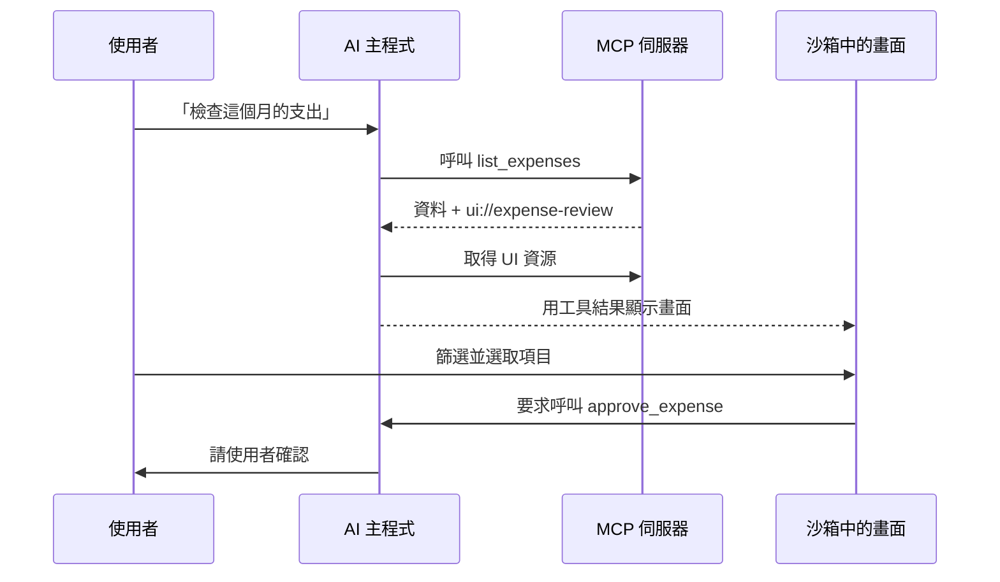

請 AI 助理分析一份銷售資料，常會出現這種過程：模型先呼叫工具，取得結構化資料，再整理成摘要。接著你要它比較不同地區，它貼出一張表；你再要求排除兩個異常值，它又貼出另一張。幾輪之後，對話裡堆了五份幾乎相同的結果，你只能用文字描述畫面上的選擇：

> 保留東區，拿掉比較短的那根藍色長條，再把上一季放到旁邊。

問題已經不是 AI 拿不到資料，而是工作從問答變成了需要空間、狀態與直接操作的任務。用對話完成這件事，就像隔著電話請別人幫你調試算表。

MCP Apps 讓 MCP 伺服器附上一個互動畫面，再由相容的 AI 主程式在當下顯示。把它說成「聊天裡的 Web App」不算錯，但容易忽略三種介面各自負責什麼。

本文的主張是：**核心 MCP 是提供給 AI 的能力層，MCP Apps 是依附在當下脈絡中的人機互動層；當一項工作需要長期存在、獨立導覽與分享時，完整 Web App 仍然是更好的工作場所。** 三者可以共用同一套後端與規則，卻不能互相取代。

## 先分清楚三件事

「MCP app」有時泛指任何同時有 MCP 伺服器、模型和畫面的產品。要做架構判斷，最好拆成三層來看。

### 1. 核心 MCP：讓 AI 主程式與伺服器溝通

模型情境協定（Model Context Protocol，MCP）的核心不是視覺框架。它規範 AI 應用程式與能力伺服器之間如何傳遞訊息、確認支援功能並管理連線。現行規格包含 JSON-RPC 基礎協定、能力協商、傳輸方式、HTTP 連線授權，以及可選的用戶端與伺服器功能（[MCP specification overview](https://modelcontextprotocol.io/specification/2025-11-25/basic)）。

伺服器最常提供三種能力：

- **工具（tools）**：讓模型執行某項操作。
- **資源（resources）**：提供應用程式可讀取、具有位址的背景資料。
- **提示（prompts）**：提供由使用者選擇的可重用互動範本。

官方架構刻意讓三者有不同控制方式：工具通常由模型決定是否呼叫，資源由應用程式管理，提示則由使用者選擇。主程式仍負責組合不同伺服器、處理權限、管理模型存取並呈現整體體驗（[MCP architecture overview](https://modelcontextprotocol.io/docs/learn/architecture)）。

例如報帳系統可以提供 `list_expenses`、`get_receipt` 和 `approve_expense`。核心 MCP 能讓 AI 找得到這些功能，也知道輸入輸出的資料型別；它不會決定使用者最後看到表格、對話文字、作業系統確認視窗，或根本不需要畫面。

### 2. MCP Apps：跟著工具結果出現的互動畫面

MCP Apps 是核心 MCP 的擴充。工具可以宣告一個 `ui://` 資源，主程式取得後顯示其中的 HTML 介面，通常會放進隔離的 iframe。畫面和主程式透過 `postMessage` 上的 JSON-RPC 通訊；介面可以接收工具資料、要求呼叫被允許的工具，也能把使用者目前選擇送回主程式（[MCP Apps overview](https://modelcontextprotocol.io/extensions/apps/overview)）。

大致流程如下：



它不只是把工具結果加上漂亮外觀。資料列會一直留在畫面，篩選條件有清楚控制項，使用者看得到目前選了哪些項目，也能在送出下一次工具呼叫前完成驗證。更重要的是，這些操作仍留在發起任務的對話旁邊。

### 3. 完整 Web App：可以獨立存在的產品

完整 Web App 有自己的導覽、資訊架構、工作階段，通常也有獨立的登入與分享方式。它可以使用同一套後端，也能把操作透過 MCP 提供給 AI，但不需要依附 AI 主程式才存在。

報帳系統可能為員工、申請單、政策、團隊待辦與稽核報告各自提供固定頁面。使用者能把頁面加入書籤、同時開啟多個分頁、把連結傳給同事，隔一週再回來，或完全不使用 AI。這和依附某一段對話的互動畫面，是不同的產品承諾。

## 最適合的時機：對話走到一半，需要用畫面完成

MCP Apps 最能發揮價值的情況，是使用者先用自然語言表達需求，接著需要一個範圍清楚的小型介面完成其中一步。

例如你對 AI 說：

> 請替這個服務規劃一套部署在澳洲、成本低，而且能承受三倍流量尖峰的方案。

模型可以追問需求並呼叫價格工具。但要在區域、機器規格、儲存層級與可用性選項之間取捨，最好還是把方案並排放在畫面上。MCP App 可以依工具結果顯示一個受限制的設定介面；使用者改兩個值，立即看到成本與韌性估計，再透過工具送出最後選擇。

AI 助理負責理解需求與安排步驟，互動畫面負責直接操作與保存眼前狀態，兩者不用勉強模仿對方。

其他適合情境也有相同特徵：

- 探索工具回傳的圖表、地圖、相依關係圖或 3D 物件。
- 在目前需求下，檢查一小批支出、議題或程式碼變更。
- 填寫選項彼此影響、需要即時驗證的設定。
- 監看 AI 剛啟動的工作。
- 接受、修改或匯出之前先預覽媒體。

關鍵在於**範圍清楚**。使用者是在一段較大對話裡完成明確子任務，不是把整套工作搬進一個內嵌面板。

## 有些事情，用對話回答就夠了

互動畫面也有開發、生命週期與安全成本，不應成為每次工具呼叫的預設結果。

如果答案短而明確，而且主要靠文字就能理解，直接回覆比較好。例如套件版本、計算結果、精簡搜尋結果，或告知一項可復原操作已完成。為了顯示「建置成功」特別做一張卡片，反而讓介面比工作本身還重。

當「還不確定問題是什麼」正是工作核心時，對話也比較合適。使用者可能正在釐清策略、比較不同觀點，或決定真正需要回答的問題。太早把討論塞進表單，只會把還沒成形的想法硬切成欄位。此時模型根據上下文追問，正是自然語言介面的優勢。

一個健康流程可以來回移動：

```text
對話 -> 結構化工具呼叫 -> 互動檢查 -> 確認操作 -> 回到對話
```

MCP App 是其中一段暫時拿起來使用的工具，不必成為整個體驗的中心。

## 工作變大時，MCP App 就裝不下了

當介面本身需要成為獨立目的地，完整應用程式通常更適合。

### 需要長期導覽的大型系統

若產品有數十個頁面、跨區搜尋、多種角色、全域設定、說明、通知和長期工作區，硬把整套系統塞進聊天主程式，只會多繞一層。對話可以是很好的入口，卻不能取代複雜系統中穩定而可預期的地圖。

### 需要獨立協作的團隊資料

「請看我星期二那段 AI 對話裡的圖」不是可靠的協作方式。團隊物件需要穩定位址、存取政策、負責人、歷史，以及不依賴個人對話的生命週期。MCP App 可以提供「開啟完整報告」，但不能假設內嵌畫面天然就是可分享紀錄。

### 長時間、複雜的創作

長篇寫作、程式開發、影片剪輯與複雜設計，需要成熟的鍵盤操作、大型畫布、多份文件與可靠復原。AI 可以透過 MCP 協助，MCP App 也能提供檢查或預覽，但主要編輯器仍應該是一套完整應用程式。

### 不使用 AI 時也必須能工作

模型可能被停用、主程式可能離線、組織政策可能禁止工具存取，客戶也可能使用不支援 MCP Apps 的軟體。官方文件明確提醒，各主程式對這項擴充的支援程度不同。若產品的必要介面只能透過 MCP Apps 使用，就等於把可用性綁在別人的支援清單上。

## AI 主程式也是產品邊界的一部分

一般 Web App 的開發團隊能控制大部分執行環境；MCP Apps 則有許多體驗由主程式決定，包括工具探索與同意流程、畫面放置方式、主題、可使用的能力、連結處理，甚至根本支不支援這項擴充。

這也可能是優點。主程式已經知道目前對話、連接的工具、使用中的模型與使用者身分。MCP App 可以只說明想完成的結果，不必自行整合每一個外部服務。但開發者因此必須測試「主程式 + MCP 伺服器 + 畫面」的完整組合，不能只測 HTML。

發布前至少要檢查：

- 主程式只支援核心 MCP、不支援 Apps 擴充時，使用者會看到什麼？
- 沒有互動畫面時，工具回傳內容是否仍能獨立理解？
- 畫面能要求呼叫哪些工具？哪些操作必須另外確認？
- UI 能否適應不同主程式提供的尺寸、明暗主題與無障礙模式？
- 哪些狀態只存在當下，哪些由伺服器長期保存？
- 工作超出面板規模時，能不能前往獨立 Web 頁面？

最安全的做法是漸進增強：工具先回傳有用的文字或結構化內容，再替支援的主程式附上更豐富畫面。不要讓協定回應只剩空殼，把所有意義都藏在 iframe 裡。

## 沙箱只是第一層，不是完整信任模型

MCP Apps 使用大家熟悉的 Web 安全機制。主程式通常把 UI 隔離在沙箱 iframe，讓通訊經過受控的 `postMessage` 橋接；中繼資料可以宣告內容安全政策與所需權限，最後仍由主程式決定實際開放哪些能力。

這些限制能降低內嵌程式讀取主程式 DOM、Cookie 或本機儲存空間的機會，但無法解決所有安全問題。

伺服器仍決定回傳什麼資料；工具仍可能產生副作用；誤導性畫面仍可能誘使使用者核准錯誤項目；過寬的遠端資源政策仍會帶來隱私風險。授權檢查必須放在資料與操作邊界，不能只保護畫面邊界。

健全設計至少包括：

1. 只提供 UI 真正需要的工具與主程式能力。
2. 每一項伺服器操作都重新檢查身分與授權。
3. 高影響操作前，清楚顯示真正的對象與後果。
4. 風險高時，把畫面中的選取和主程式中的最終確認分開。
5. 工具結果與 UI 訊息在驗證前，一律視為不可信輸入。

核心 MCP 的安全指南也強調最小權限、輸入驗證，以及敏感操作必須取得明確同意（[MCP security best practices](https://modelcontextprotocol.io/docs/2025-11-25/tutorials/security/security_best_practices)）。

## 共用領域規則，不要強迫所有畫面相同

好的實作不會先建立「MCP 版」和「Web 版」兩套產品，而是先整理共同領域：

```text
領域實體：支出、收據、政策、核准
查詢操作：列出、查看、比較、稽核
變更操作：送出、核准、退回、註記

不同介面：
- MCP 工具與資源，供 AI 存取
- MCP App，供使用者在對話中檢查
- Web App 頁面，供長期工作與協作
- CLI 指令，供自動化流程使用
```

每個介面都必須遵守相同規則。例如支出超過某個金額時，核准一定要附理由；不論操作來自 Web App、MCP App 或 CLI，這項要求都不能變。共用商業邏輯能避免某個介面出現漏洞或互相矛盾。

但各介面不需要長得一樣。MCP 工具需要精確資料結構與讓模型讀得懂的說明；MCP App 需要能放進主程式的精簡互動；完整 Web App 則要支援較長工作階段的導覽與復原。該重用的是領域，不是每一個像素。

這種架構也保留轉換出口。內嵌畫面可以連到長期保存的物件；Web App 可以請 AI 協助整理；工具回傳可以同時包含簡短答案與新資源的識別碼。使用者能在不同介面間移動，卻不會弄丟正在處理的那件事。

## MCP Apps 是 AI 介面的一層，不是 App 的終點

MCP Apps 並沒有證明聊天視窗終將吞掉所有軟體。它比較像是證明：AI 主程式可以成為一個組合外殼，先呼叫合適能力，再暫時顯示當下最適合的操作介面。

核心 MCP 讓主程式能以結構化方式發現與呼叫能力；MCP Apps 讓伺服器表達「這份結果需要一個小型互動工具」；當工作需要獨立導覽、協作、身分與時間跨度時，完整 Web App 則提供可以長期回來的家。

設計時可以採用三條規則：

- AI 需要結構化背景資料或操作時，使用**核心 MCP**。
- 範圍清楚的對話任務變得視覺化、需要保留狀態，或直接操作更有效率時，加入 **MCP App**。
- 工作需要成為獨立目的地，而不是只存在於另一個主程式的一小段時間時，保留或建立**完整應用程式**。

這個答案沒有「App 已死」那麼吸睛，卻更接近實際產品。未來介面大概不會只剩一個萬用聊天框，而是能在語言、工具、情境畫面與長期工作場所之間順暢切換的系統。

如果想延伸了解代理程式一開始如何發現瀏覽器公開的能力，可以閱讀[發現問題：AI 代理如何找到你的 WebMCP 工具？](/zh-hant/posts/webmcp-discovery-problem/)。

_系列導覽：[索引](/zh-hant/posts/00-from-apps-to-intent-driven-computing/) · 上一篇：[02 — 為什麼本機 Web App 值得重新認識](/zh-hant/posts/02-local-web-apps-are-underrated/) · 下一篇：[04 — 為什麼 URL 在 AI 時代仍然重要](/zh-hant/posts/04-why-urls-will-survive-ai/)_

## 資料來源

- [MCP specification overview](https://modelcontextprotocol.io/specification/2025-11-25/basic)
- [MCP architecture overview](https://modelcontextprotocol.io/docs/learn/architecture)
- [MCP server tools specification](https://modelcontextprotocol.io/specification/2025-11-25/server/tools)
- [MCP server resources specification](https://modelcontextprotocol.io/specification/2025-11-25/server/resources)
- [MCP server prompts specification](https://modelcontextprotocol.io/specification/2025-11-25/server/prompts)
- [MCP Apps overview](https://modelcontextprotocol.io/extensions/apps/overview)
- [MCP security best practices](https://modelcontextprotocol.io/docs/2025-11-25/tutorials/security/security_best_practices)
