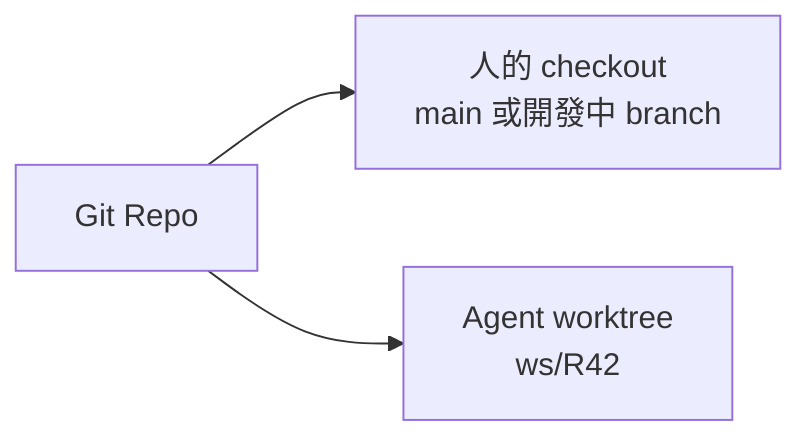
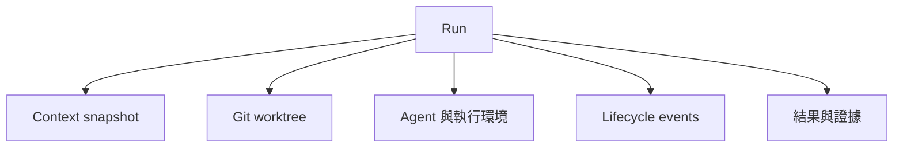
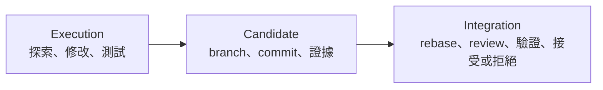
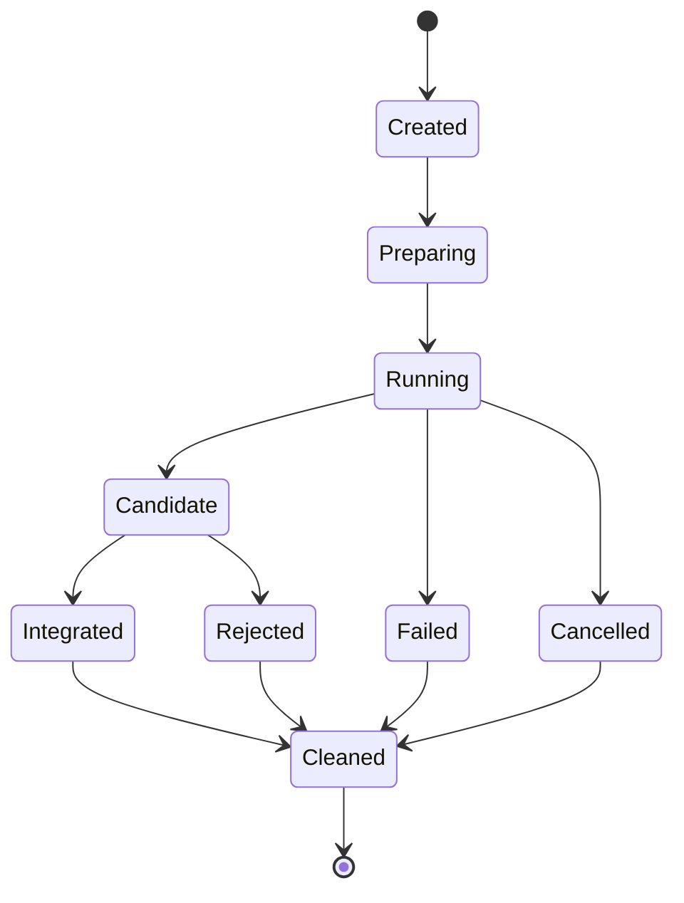

有一次我一邊改程式，一邊把同一個 Repo 裡的另一項任務交給 coding agent。

我以為只要告訴它「不要碰我正在改的檔案」就好。結果 agent 在執行 formatter 時動到共用檔案，我又剛好修改了測試設定。最後 test 是綠的，但我們沒人能確定：它驗證的是 agent 的版本、我的版本，還是兩者碰巧混在一起的狀態？

Git 還沒有出現 merge conflict，我對結果的信任卻已經先消失了。

從那次開始，我不再讓 agent 直接進入我正在工作的 checkout。

> Agent 不修改我的工作區；Agent 交付一個候選變更。

## Branch 不等於隔離

替 agent 建 branch 當然有幫助，但只切 branch 還不夠。同一個目錄一次只能 checkout 一個 branch，uncommitted changes、build output 和 local config 仍然混在一起。

Git worktree 剛好補上這個物理邊界：



兩邊共用 Git objects，卻有各自的 branch、檔案狀態與工作目錄。人可以繼續工作，agent 也可以自由修改、build、test，不必輪流搶同一個 folder。

## 我把一次嘗試叫做 Run

有了 worktree 之後，還需要描述這次 agent 工作的其他部分。我使用 **Run** 這個概念：



「Agent session」容易讓人把焦點放在對話是否延續；Run 的焦點是一次工程嘗試是否有明確輸入、範圍與結果。

一個 Run 可以包含多輪對話，也可能由一個非互動 script 完成。無論 agent 是 Codex、Claude Code、Copilot CLI 或自製工具，Workspace 只需要知道它如何啟動、在哪裡工作，以及最後交回什麼。

## 有邊界，才容易重來

長時間不關的 agent session 看似保留很多 context，也會一起保留過時需求、已放棄的方案與錯誤假設。

我更希望 Run 的契約像這樣：

```text
已知：
  這個目標
  這份 context snapshot
  這個 Repo commit
  這組權限與限制

請交付：
  候選變更
  驗證證據
  風險與未完成事項
  值得長期保存的知識提案
```

需求如果已經大幅改變，開一個新的 Run 通常比硬把舊對話拉到新方向更乾淨。

這和 CI job、reproducible build 的精神很像：我們信任明確輸入與可重建流程，不依賴一個活了三週、沒人敢關掉的 shell session。

## Agent 完成，不代表程式已經整合

隔離 Run 讓 execution 和 integration 變成兩個不同階段：



Agent 說「完成」只代表它產生了一個可以評估的 candidate。Main branch 可能已經前進，另一個 candidate 可能先被整合，或者新的測試證明這個方案不適合。

衝突仍會發生，但它在明確的 integration gate 發生，而不是悄悄污染開發者的 working tree。

## Candidate 不能只有 branch 名稱

我要 review 一次 Run 時，至少希望知道：

- 原始目標是什麼？
- 基於哪個 commit 開始？
- 哪個 branch 或 patch 是候選結果？
- 跑了哪些測試？哪些沒跑？
- 有哪些已知風險與假設？
- 是否提出新的工程知識？

第一版可以只是一份簡單結果：

```yaml
run: R42
status: candidate
branch: ws/R42
base: 91c4b7a
validation:
  - command: pnpm test
    result: passed
  - command: pnpm build
    result: passed
risks:
  - "Refresh timing 仍依賴 client clock。"
```

重點不是 YAML，而是 agent 交付的是一個有證據的 proposal，不是神不知鬼不覺的 filesystem mutation。

## Lifecycle 讓清理變成系統責任

Run 有自己的生命週期：



Worktree 屬於 Run，agent process 也屬於 Run。後面加入 port、database 或 container 時，它們同樣要有 owner。

這讓 `clean` 不再靠記憶：「昨天那個 terminal 到底開了什麼？」Coordinator 應該知道哪些資源可以回收，哪些 candidate 還在等 review。

## 我在工作上學到的事

那次混亂並不是 formatter 的錯，也不只是兩個人碰到同一個檔案。真正的問題是人和 agent 共用了太多隱藏狀態：checkout、未 commit 的修改、產生檔與測試環境。

Worktree 隔離檔案；Run 替整次嘗試建立身分和生命週期；candidate 則把「完成修改」與「接受修改」拆開。

> 一個 agent、一次隔離 Run、一份候選結果。

這個模式只有一個 agent 就值得使用。有了它之後，同時開多個 agent 變得很自然。我原本以為下一步一定需要複雜的 swarm 溝通，實際上大多數 agent 根本不必互相聊天。

下一篇：[不用 Swarm，也能讓多個 Coding Agent 一起工作](/zh-hant/posts/multiple-coding-agents-without-a-swarm/)。
