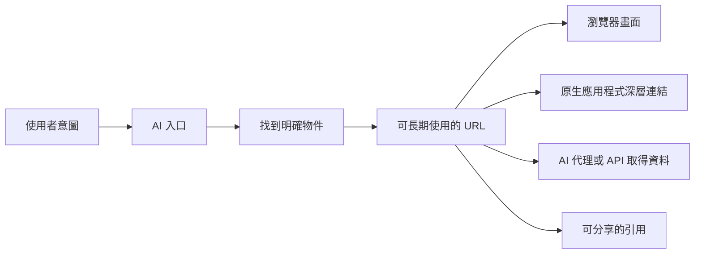

想像一個真的好用的 AI 助理。你不必先打開 CRM、切到亞太區、找出高風險客戶，再逐一翻續約紀錄。你只要說：「整理上季可能流失的客戶，請負責業務補上最新狀況，順便準備明天檢討會要看的資料。」它就能跨系統把事情串起來。

既然人不必再自己點選選單，會不會有一天，應用程式和 URL 都不重要了？

不會。因為「怎麼找到東西」和「那個東西到底是哪一個」，本來就是兩個問題。

本文的主張是：**AI 會大幅改變軟體的入口，但 URL 仍會是數位工作最耐用的共同地址。** 它讓人、AI、瀏覽器、原生應用程式與稽核系統，都能指向同一份報表、同一個版本或同一項決策。AI 可以替我們省下五層選單，卻仍得回答：「你說的是哪一個客戶、哪一季的資料、哪一版決議？」

## 入口可以換，目的地不能只存在對話裡

傳統軟體常把兩件事綁在一起：先讓使用者說明自己想做什麼，再讓使用者一路操作到目標畫面。

AI 很擅長把後面那段操作縮短。原本要走完：

```text
CRM 首頁 -> 客戶 -> 亞太區 -> 高風險 -> Contoso -> 續約 -> 2026 Q4
```

現在可能只要一句：

```text
「顯示 Contoso 在亞太區的 2026 Q4 續約風險。」
```

可是查到結果之後，這份工作通常還要被放進會議議程、寄給業務、寫進決策紀錄，或兩週後再回來確認。這時候，我們需要的不是重播同一段提示詞，而是一個可以再次開啟的目的地：

```text
https://crm.example.com/accounts/contoso/renewals/2026-q4
```

兩者的分工可以畫成這樣：



AI 改善的是「抵達的方法」，URL 保留下來的是「抵達哪裡」。兩者不是互相取代。

## URL 首先是名稱，其次才是網頁

我們很容易把 URL 當成瀏覽器網址列裡的一串文字。但從架構來看，它更重要的功能是替資源命名。

[RFC 3986](https://www.rfc-editor.org/rfc/rfc3986.html) 對 URI 的定義，重點就在「辨識一個抽象或實體資源」，而不是規定資源一定要長成網頁。[W3C 的 Web 架構](https://www.w3.org/TR/webarch/)也把全球一致的識別名稱視為 Web 的基礎：彼此沒有事先協調的系統，仍能用同一個名稱引用同一項資源。

例如：

```text
https://work.example.com/projects/atlas/decisions/42
```

它指的不是某個 React 元件或某一頁版型，而是 Atlas 專案的第 42 號決策。瀏覽器可以顯示完整紀錄；手機 App 可以開啟精簡畫面；AI 代理可以取得結構化資料；Email 軟體也可以顯示預覽。介面會換，資源的身分不必跟著換。

這也是路由設計應該描述領域概念，而不是洩漏目前畫面結構的原因。`/app/v2/pages/left-panel/item?index=7` 只記住某一版實作；`/projects/atlas/decisions/42` 才說得出使用者在意的是什麼。

AI 反而讓這件事更重要。對話裡的「那份報表」只要出現第二份報表就可能有歧義；一個穩定的識別名稱，才能讓系統正確讀取、授權、記錄與引用。

## 知道地址，不代表有權限開啟

URL 用來回答「要找哪個資源」，不是用來證明「你有權查看」。知道薪資報表的網址，不應該就能看到內容；伺服器仍必須確認來訪者身分，並檢查他是否有權對這份報表執行目前的動作。

許多人說「URL 不安全」，實際上常是在談以下幾種設計失誤：

- 把密碼或敏感資料放進查詢參數，結果留在瀏覽紀錄或伺服器日誌。
- 只靠網址很難猜，就把它當成唯一的存取控制。
- 只檢查使用者有沒有登入，卻沒有確認他能不能讀取這一筆資料。
- 分享連結內含長期有效、權限過大的權杖。

這些都是安全設計出了問題，不是「資源不該有地址」。一套清楚的系統會把責任拆開：

```text
URL       -> 要操作哪一個資源？
身分      -> 是誰或哪個程式提出要求？
權限政策  -> 現在可以執行這項動作嗎？
呈現方式  -> 這個情境適合哪一種畫面或格式？
稽核紀錄  -> 誰在什麼時候對資源做了什麼？
```

Web 的 origin（來源）模型也提供了一層邊界。Origin 由通訊協定、主機名稱與連接埠組成，瀏覽器以此隔離內容與權限（[RFC 6454](https://www.rfc-editor.org/rfc/rfc6454.html)）。路徑再指向這個邊界裡更明確的資源，由應用程式判斷目前使用者能讀取、編輯、核准還是分享。

AI 代理一次可以處理的資源比人手動點選多得多，所以物件層級的授權只會更重要。AI 能在回答中提到某個 URL，不代表它有權開啟，更不代表它可以修改內容。每一條路由、每一個工具呼叫，都應在真正執行時重新檢查權限。

少數網址本身確實帶有權限，這類設計稱為 capability URL，例如一次性密碼重設連結或不需登入的特定分享頁。它們應該被當成憑證管理：限制用途和有效期限、需要時可撤銷，也不要不必要地寫進日誌。

## 分享連結，其實是在交付一個明確指向

Web 上最簡單、也最強的協作方式，至今仍是「把連結傳給我」。

比較下面兩種說法：

> 打開營收系統，選 FY2026，再切到澳洲，把客戶類型設成企業客戶，最後點第三個情境。

以及：

> 請看 `https://finance.example.com/scenarios/fy2026-au-enterprise/base`。

第二種不只比較短，也比較能驗證。雙方可以確認自己看到的是不是同一個物件；若收件者沒有權限，系統也能在明確的資源邊界拒絕存取。

連結還能放進行事曆、議題追蹤系統、程式碼註解、文件、QR Code、終端機、通知與 AI 對話。產品不必事先替每一個去處開發專屬整合，因為 URL 本身就是一份很小、卻廣泛通用的互通契約。

同樣的原則也適用於 AI 產出。假設 AI 幫你建立一個定價情境，結果若只剩在私人對話裡，分享時就只能複製文字，原始輸入、版本與擁有者也容易一起遺失。比較好的做法，是把結果存成系統裡的正式物件並回傳 URL。這樣團隊分享的是同一份成果，服務也能保留來源、版本和存取規則。

換句話說：**重要的 AI 工作應產生可定址的成果，而不只是一段寫得很順的回答。**

## 工作會被打斷，所以「回得去」很重要

對話適合一路往下聊，但工作很少一次完成。人會暫停去找資料、等待核准、換一台裝置，或過幾個月重新檢查當時的決策。URL 是讓人回到原處的機制；瀏覽紀錄、書籤、最近開啟、搜尋索引與外部文件，都能替我們保存這個位置。

W3C 的經典文章 [Cool URIs don't change](https://www.w3.org/Provider/Style/URI) 指出，識別名稱會因為被使用而累積價值；任意更動它，會破壞許多你甚至不知道存在的外部引用。背後實作可以從伺服器產生 HTML，換成單頁式應用程式，再換成原生 App 或 AI 產生的畫面；只要保留公開名稱並做好重新導向，舊連結仍然能用。

AI 會讓系統產生更多引用，耐用性也因此更關鍵。研究助理可能一次整理數十份資料；自動化流程可能一個月後才再次執行。如果每次改版或對話結束，識別名稱就失效，那麼看似聰明的自動化，最後只會留下大量脆弱連結。

當然，不是每個查詢參數都要永久保留。臨時預覽、登入回呼與一次性篩選本來就可以短暫存在。真正需要判斷的是：哪些領域概念值得擁有穩定身分？可能是客戶、文件、執行紀錄、資料集、儲存的檢視、決策、留言，或 AI 產生的成果。

## Deep link 證明 URL 不只屬於瀏覽器

原生應用程式沒有淘汰 URL。相反地，目前最完整的手機深層連結（deep link）設計，正是讓經過驗證的 HTTPS 網址開啟原生內容。

Android App Links 會把 HTTPS 網域與簽署過的 App 建立關聯，並透過 `assetlinks.json` 驗證哪些 App 可以處理該網站的連結。安裝 App 時可以直接開啟對應內容；沒有安裝時，同一個 URL 仍能回到 Web 版本（[Android App Links](https://developer.android.com/training/app-links/about)）。

Apple Universal Links 採用類似概念：網站與 App 先建立可信關聯，HTTPS 連結就能進到 App 裡的特定位置；使用者沒有安裝 App 時，仍可使用網頁版本（[Supporting universal links](https://developer.apple.com/documentation/xcode/supporting-universal-links-in-your-app)）。

這個架構的重點是：URL 不需要指定「要用哪一種技術畫畫面」。它只需要指出目的地，再由作業系統、使用者偏好、已安裝軟體和公司政策共同決定用什麼介面開啟。

`myapp://report/42` 這類自訂通訊協定可用於本機整合，但缺乏通用的 Web 備援，也比較難驗證擁有權。經過驗證的 HTTPS 連結，則先給資源一個 Web 身分，再授權原生 App 接手。

未來 AI 介面也可能是另一種解析器。對話中的同一個連結，可以開成內嵌小卡、完整網頁或桌面應用程式。網址不變，呈現方式跟著使用情境改變。

## 不是每一個畫面狀態都值得放進 URL

強調穩定網址，不等於要把所有操作細節都塞進網址列。這樣不只會產生難懂又容易壞的 URL，也可能不小心暴露資料。

可以先區分兩類狀態：

- **資源狀態**：屬於業務領域，例如第 42 號文件、第 7 版內容、核准後的預測，或已儲存的比較結果。
- **操作狀態**：只存在當下操作，例如游標停在哪個圖表點、哪個提示框正打開、尚未儲存的輸入、捲動位置或拖曳到一半。

有些常用操作狀態值得升級成正式資源。例如團隊經常討論同一組篩選條件，就可以把它存成一個有自己 URL 的檢視；但一次性的探索通常不需要。

也不要為了「重現畫面」，把個人資料、密鑰或完整提示詞直接寫進 URL。網址會出現在瀏覽紀錄、日誌、分析工具、referrer、截圖和聊天訊息。敏感內容應存放在伺服器端，以不帶意義的識別碼指向，並在每次讀取時檢查權限。

目標不是「所有東西都放進網址列」，而是「重要的東西都有穩定名稱」。

## 設計 AI 產品時，可以先守住這幾件事

### 把模糊意圖解析成明確物件

使用者說「昨天失敗的那次部署」時，AI 應先對應到明確的部署編號。若接下來要執行高影響動作，更應先顯示名稱與穩定連結，讓歧義有機會被發現。

### 需要分享、核准或稽核的成果，要存成物件

計畫、分析或設定若要離開目前對話，就替它建立正式的領域物件，並在對話摘要旁一起提供 URL。

### 路由描述領域，不描述元件樹

以使用者在意的概念命名路徑，產品改版時用重新導向保留舊名稱。[WHATWG URL Standard](https://url.spec.whatwg.org/)確保瀏覽器能用一致方式解析網址，但語法標準無法補救產品任意改變網址意義。

### 不論從哪個介面進入，都套用同一套權限

同一份資源可能透過 HTML、JSON、MCP 工具、原生 App 或通知預覽呈現。每條路徑都要使用相同的底層存取規則；在某個畫面藏起按鈕，從來不等於完成授權。

### 讓使用者看得懂連結的分享範圍

連結究竟是公開、限組織、限指定收件者，還是拿到網址就具備權限，應清楚標示。AI 不應為了完成任務，悄悄擴大分享範圍。

### 準備好不同介面的備援路徑

沒有安裝 App 就開網頁；內嵌環境無法呈現完整內容就提供標準頁面；物件搬家就重新導向舊網址。介面可以換，穩定識別名稱不該輕易失效。

## AI 讓「怎麼進去」變得可選，卻讓「東西在哪裡」更重要

未來很多人不會從應用程式首頁開始工作。他可能從 AI 助理、作業系統搜尋、通知、指令面板或語音介面直接進入。過去要手動跨越的選單和產品邊界，也可能交給 AI 處理。

改變的是入口，不是「位置」這個需求。

一份工作只要重要，就需要身分；只要牽涉其他人，就需要可傳遞的引用；只要每個人的權限不同，政策就需要明確的資源才能判斷；只要工作跨越時間，就要有回得去的方法；只要能由多種介面呈現，它們就需要共同名稱。

URL 已經提供了這層輕薄、通用，而且大家都懂的基礎。它當然可能被設計得很差、被洩漏、被改壞，或塞進過多暫時狀態；但把操作介面從瀏覽器換成 AI 對話，並沒有消除任何底層需求。

AI 越能替我們省略導覽，穩定地址反而越重要。AI 可以替你選路，URL 則讓人、代理程式、瀏覽器、原生 App 與稽核紀錄都知道：最後抵達的，究竟是哪一個地方。

_系列導覽：[索引](/zh-hant/posts/00-from-apps-to-intent-driven-computing/) · 上一篇：[03 — MCP Apps 與 AI 介面層](/zh-hant/posts/03-mcp-apps-and-the-ai-interface-layer/) · 下一篇：[05 — 分頁爆炸背後的問題](/zh-hant/posts/05-the-tab-problem-and-app-centric-fragmentation/)_

## 資料來源

- [RFC 3986: Uniform Resource Identifier—Generic Syntax](https://www.rfc-editor.org/rfc/rfc3986.html)
- [RFC 6454: The Web Origin Concept](https://www.rfc-editor.org/rfc/rfc6454.html)
- [W3C: Architecture of the World Wide Web](https://www.w3.org/TR/webarch/)
- [W3C: Cool URIs don't change](https://www.w3.org/Provider/Style/URI)
- [WHATWG URL Standard](https://url.spec.whatwg.org/)
- [Android Developers: About App Links](https://developer.android.com/training/app-links/about)
- [Apple Developer: Supporting universal links in your app](https://developer.apple.com/documentation/xcode/supporting-universal-links-in-your-app)
