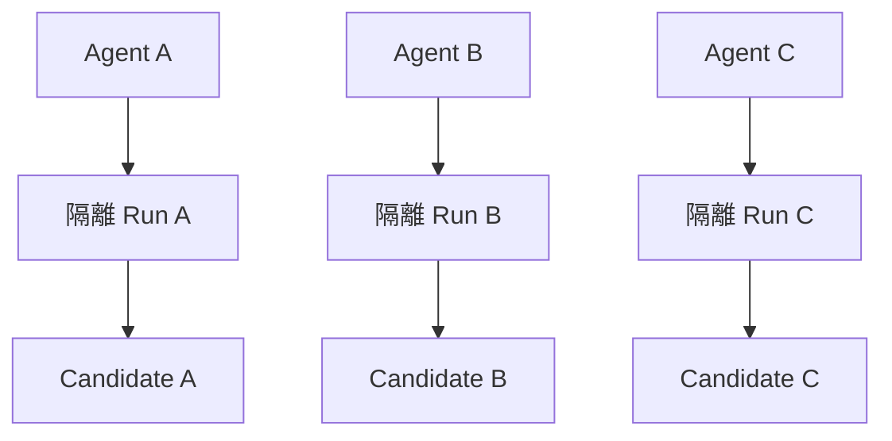
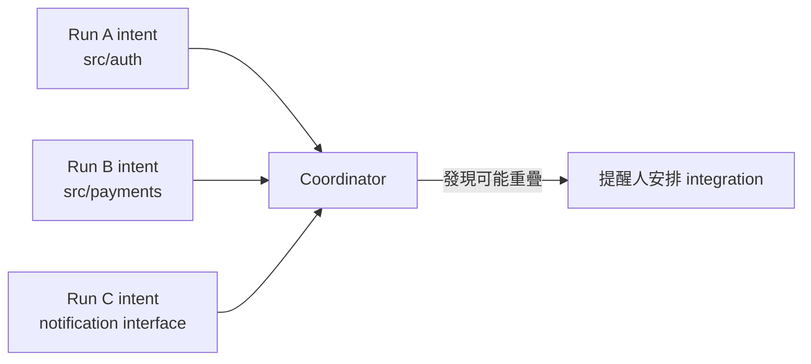
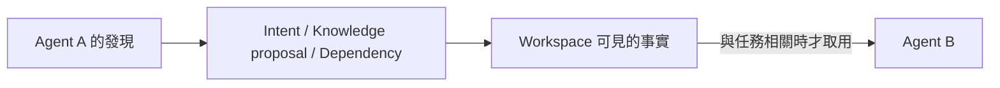
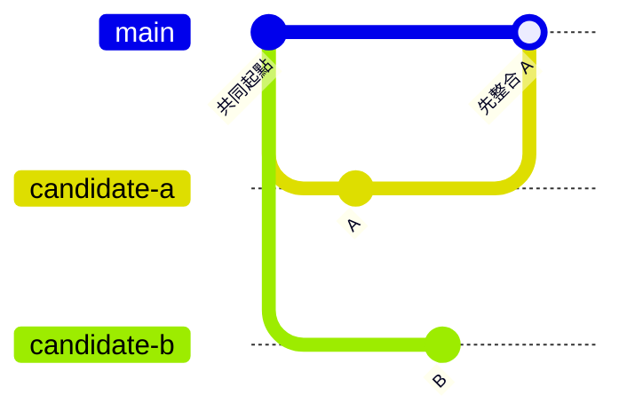
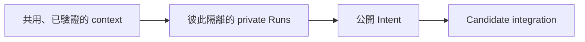

有了 Git worktree 之後，我很自然地開始同時跑多個 coding agent。

一個修登入問題，一個處理 payment error message，另一個調查 flaky test。這些都是 Sprint 尾聲常見的小任務：彼此看似獨立，又都不值得讓整個人停下來等。

三個 agent 各自進入不同 worktree，檔案不再互踩。接著我腦中馬上浮現更大的設計：要不要做 planner agent？Agent 之間是不是需要 message bus？如果其中一個發現重要資訊，怎麼通知另外兩個？

但觀察實際工作後，我發現自己太早開始設計 swarm。

這三個 agent 並不是一起思考同一個問題。它們只是同時進行三次獨立的工程嘗試。



## 該共用的是工程事實，不是腦內草稿

這些 Run 確實需要一些共同基礎：

- coding standard
- 測試與 review policy
- Repo 與服務之間的關係
- 可重用 skills
- 已確認的 durable knowledge
- integration 規則

但它們不需要共享每一步計畫、scratchpad、猜測與完整對話。

我曾試著讓不同 session 寫同一份工作筆記，結果反而更糟。一個 agent 寫下「應該重構這個 component」，稍後它已經放棄該方案，另一個 agent 卻在筆記更新前讀到那句話，誤以為這是團隊共識。

暫時假設只因為放在共用檔案，就穿上了正式決策的外衣。

所以我會用一句話區分：

> Private plan, public intent。計畫留在 Run 裡，意圖讓 Workspace 看得見。

## Intent 是最小但夠用的協調訊號

其他 agent 不必知道 Run R42 準備先讀哪五個檔案，但人和 coordinator 應該知道它大概會碰哪個範圍。

```yaml
run: R42
goal: "修正 authentication refresh timing"
primary_repo: frontend
expected_scope:
  - src/auth/
  - tests/auth/
interfaces:
  - token refresh endpoint
status: running
```

Intent 不是 lock，也不是不能改的承諾。Agent 調查後可能發現問題其實在共用 notification component；這時應更新 intent，讓其他 Run 和人看見新的整合風險。



我們追求的是 awareness，不是假裝所有衝突都能事先算出來。

## Agent 之間可以透過耐久事實溝通

如果 Agent A 發現一件 Agent B 真正需要知道的事，也不一定要直接傳訊息。

它可以：

- 更新自己的 public intent
- 提出 knowledge proposal
- 在 candidate 上宣告 dependency
- 把已驗證的 contract 變更放進可 review 的結果



這種間接協調很適合工程工作：人看得到，未來的 Run 也能使用，而且不會把某個 agent runtime 的私有訊息格式變成整套架構的核心。

對高度耦合任務，直接 handoff 當然仍有價值；它是 extension，不是預設前提。

## Candidate 在 integration 相遇

Worktree 能避免 agent 同時寫壞同一個 working tree，卻不能保證結果彼此相容。



Candidate A 先進 main 之後，Candidate B 就需要 rebase、重跑測試，必要時重新 review。這是正常的 integration 成本，不代表 agent 應該在執行期間逐行協商。

Coordinator 可以協助顯示 active intents、偵測路徑或 interface 重疊、記錄依賴、安排整合順序，但它不必成為一個替所有 agent 思考的中央大腦。

## Agent 開得多，不代表進度比較快

實際工作裡，並行度通常受三件事限制：

1. 任務是否真的可以拆開。
2. 本機資源能不能支撐多組執行環境。
3. 人有沒有能力 review 與整合這麼多 candidate。

如果 agent 產生 candidate 的速度遠超過 review 能力，結果只會從「ticket backlog」變成「AI pull request backlog」。

真正值得看的不是同時跑幾個 agent，而是多少可信任的 candidate 能順利通過 integration。

## 我在工作上學到的事

多 agent 最初讓我想到一個人工組織：要互相報告、分派工作、討論衝突。日常工程需要的模型其實小很多：



Agent 可以各自工作，只在需要時透過 durable facts 協調。這也讓 Workspace 不依賴 Codex、Claude Code 或任何單一 agent protocol。

不過，當兩個隔離 Run 同時啟動 `localhost:3000`，我才發現 worktree 只解決了檔案層的並行。

下一篇：[只有 Worktree 還不夠](/zh-hant/posts/worktrees-are-not-enough/)。
