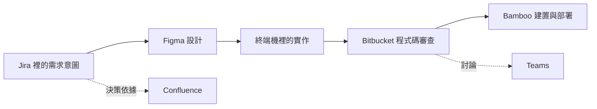

先看一個再平常不過的開發任務：設計檢討結束後，要調整帳號設定流程。

需求單在 Jira，互動稿在 Figma，某項例外處理的決議寫在 Confluence。工程師在本機的編輯器與終端機改程式碼，分支和 Pull Request 放在 Bitbucket，Bamboo 負責建置與部署。檢查到一半，Reviewer 又在 Microsoft Teams 問了一個問題。

這些工具不一定難用。相反地，它們可能都很擅長自己的工作。但只是一項不算大的修改，做起來卻像在接總機：這裡查一段、那裡補一段，腦中還要記得每一段怎麼接。

我們常把這種情況叫做「分頁問題」，好像麻煩都出在瀏覽器上方那排愈來愈小的標籤。關掉幾頁、固定常用頁面，或換一台更寬的螢幕，確實能讓畫面清爽一點，卻沒有消除真正的工作。

本文的主張是：**分頁爆炸只是應用程式中心化所造成的表面症狀。同一個工作流程被不同產品各自切走一部分，使用者只好一再把它們的關係拼回來。** 真正耗費心力的不是切換視窗，而是每跨過一次產品邊界，就得重新確認意圖、身分、先後順序和決策權到底在哪裡。

這一篇只負責把問題說清楚，不急著端出完整解法。因為沒有先釐清失去的是什麼，很容易只做出另一套整合儀表板，卻沒有真的改善工作。

## 同一項修改，散落著七種局部真相

假設這張需求單叫做 `PAY-241`：使用者更換收款帳號前，系統要多一道確認。

從流程圖看起來很直覺：

實際做起來卻完全不是這麼一條線。

Jira 說明為什麼要改、誰提出需求，以及驗收條件是什麼。Figma 畫出每一個狀態和操作，但不一定留下某個方案被否決的原因。Confluence 記錄資安例外的決議，可是頁面標題未必提到 `PAY-241`。真正的實作在 Git 分支裡；Bitbucket 知道 Commit、留言和核准狀態；Bamboo 才知道那份產出有沒有進到測試環境。最後改變審查方向的那句話，可能藏在 Teams 某則訊息下方的回覆裡。

每個系統講的都是真的，卻沒有任何一個系統擁有「這項修改的全貌」。

於是工程師自己成了整合層。他得記得 `feature/payout-confirmation` 就是 `PAY-241`，Figma 裡該看的是「Settings flow v3」，Bamboo 的第 `8127` 次結果建置的是 Commit `4f6d...`，而最新決議不在需求單，是在 Teams 討論串的第三層回覆。

這些記憶工作很少出現在開發效能指標上。它通常表現成幾秒或幾分鐘的遲疑：打開三個看起來差不多的頁面、比對更新時間、搜尋頻道、檢查 Commit Hash，然後再問一次：「現在還是做這一版嗎？」

## 應用程式按照自己的名詞分類，工作卻按照成果前進

這不是單純的操作習慣問題，而是架構上的落差。每套工具都有自己的核心物件：

| 應用程式   | 它主要管理的物件                         | 使用者真正想回答的問題             |
| ---------- | ---------------------------------------- | ---------------------------------- |
| Jira       | Issue、Epic、Sprint                      | 我們承諾要完成什麼？有哪些限制？   |
| Figma      | 檔案、頁面、Frame、留言                  | 到底要實作哪一種體驗？             |
| Confluence | Space、頁面、留言                        | 哪項決策或知識規範這次修改？       |
| Bitbucket  | Repository、Branch、Commit、Pull Request | 改了什麼？可以合併了嗎？           |
| Bamboo     | Plan、建置結果、部署結果                 | 這一版真的通過並送到正確環境了嗎？ |
| Teams      | 團隊、頻道、聊天、訊息                   | 大家最後決定或要求了什麼？         |
| 終端機     | 資料夾、處理程序、指令、檔案             | 我現在正在做什麼，才能讓工作往前？ |

這些模型本身都很合理。Jira 不需要假裝 Figma Frame 是一張 Issue，Figma 也不該變成部署系統。問題出在交界處：使用者面對的是一項要跨越所有工具才能完成的成果，但每次導航時，都必須先按照「東西歸哪個應用程式管」來思考。

這就是以應用程式為中心的運算方式。第一個問題永遠是「下一份資料在哪個 App？」找到產品之後，才開始找物件。真正的工作流程——理解、設計、實作、審查、交付——大多只存在人的腦中。

## 切換成本，其實是重新拼湊脈絡

大家常用 context switching（情境切換）形容這份負擔，聽起來像人類天生不擅長多工。更準確的說法，應該是 **context reconstruction：重新拼湊脈絡**。

從需求單切到設計稿時，工程師要重新確認：

- 這個 Figma 檔案和需求單真的是同一件事嗎？
- 哪一個 Frame 才是目前有效的版本？
- 它是在驗收條件修改之前還是之後更新？
- 留言被標成已解決，代表大家真的做出決定，還是只是整理討論串？

從 Bitbucket 切到 Bamboo，又要再查一次：

- 哪次建置對應目前 Pull Request 的最新 Commit？
- 建置發生在最後一次 Push 之前還是之後？
- Plan 顯示綠燈就夠了，還是也要完成部署？
- Bamboo 裡的 staging，真的是需求單所說的測試環境嗎？

所以成本不在滑鼠從一個分頁移到另一個分頁，而在於證明「兩個不同系統裡的物件，指的是同一時間點的同一項工作」。

穩定識別碼可以減少部分歧義。分支名稱帶有 `PAY-241`、Pull Request 連回 Issue、建置結果記錄 Commit Hash，都能把原本靠記憶維持的關係寫進資料。Atlassian 的 [Jira Software Development Information API](https://developer.atlassian.com/cloud/jira/software/rest/api-group-development-information/) 就能讓整合服務提供 Commit、Branch 與 Pull Request 資訊；更廣的 [Jira Software 整合 API](https://developer.atlassian.com/cloud/jira/software/rest/intro/)也納入建置與部署。

這些整合很有價值，但它們仍未讓工作流程成為完整物件。

## 互相放連結有幫助，卻還是不夠

假設所有工具都把連結做得很好。Jira 顯示相關分支與建置；Pull Request 附上 Figma 和 Confluence 網址；Teams 也能直接開到指定 App、聊天、訊息、團隊、頻道或工作流程（[Microsoft Teams deep links](https://learn.microsoft.com/en-us/microsoftteams/platform/concepts/build-and-test/deep-links)）。

找到東西確實變快了，但意義仍然散落各處。

一條連結通常只能回答「在哪裡」，很難直接回答：

- 這個目的地為什麼和目前工作有關？
- 裡面真正要看的是哪一段？
- 它是最新依據，還是保留下來的舊紀錄？
- 我上次離開後發生了什麼變化？
- 現在輪到我採取什麼行動？
- 兩個來源互相矛盾時，應該相信哪一個？

設計稿是最明顯的例子。Figma REST API 可以提供檔案、版本、元件、留言等資料，也能透過 [Comments endpoints](https://developers.figma.com/docs/rest-api/comments-endpoints/)讀取或新增檔案留言。因此整合服務可以顯示「這裡有一份設計」，甚至同步未解決留言數量。但它不會自然知道 Frame B 才是正式版本，因為設計師和資安 Reviewer 在會議裡談成了一個微妙的折衷方案。

連結建立的是「引用關係」。完整工作流程還需要知道這是什麼關係、資料有多新、目前狀態和原始意圖。單純標示「與 `PAY-241` 有關」，遠不如「Frame B 是 `PAY-241` 已核准的設計，並於週二取代 Frame A」來得有用。

## 看似相同的狀態，在每套工具裡可能完全不同

當不同系統使用相近標籤，卻賦予不同意義時，破碎就不只是麻煩，還可能造成錯誤判斷。

Jira 的「完成」可能指驗收條件已實作；Bitbucket 的「已合併」只代表程式碼進入目標分支；Bamboo 的「成功」可能只代表 Plan 沒有失敗的 Job；「已部署」則描述某個版本進入特定環境。Figma 留言顯示已解決，不等於程式畫面和設計一致；Teams 裡的一個讚，也可能只是「我看到了」，未必代表正式核准。

[Bamboo REST API](https://developer.atlassian.com/server/bamboo/rest/api-group-api/) 對部署結果的描述就很具體：它會區分環境、版本、生命週期與部署狀態。若 Jira 的整合畫面只取回一個綠色圖示，使用者可能以為「已經部署成功」，實際上那個綠燈只代表建置通過，甚至不是最新 Commit。

因此，把資料集中顯示不一定帶來真正一致性。一排綠燈可能看起來很完整，底下卻混合了從未對齊的狀態。

本機終端機還會造成另一種時間差。工程師可能已經有尚未 Commit 的修改、不同的環境設定、一個失敗中的精準測試，或正在改寫分支的 Coding Agent。Bitbucket 認為最後 Push 的 Commit 是最新版本；對工程師來說，那一版早就過去了。兩邊都沒有說謊，只是觀察範圍和時間點不同。

## 對話最難接回正式工作

結構化系統至少有明確識別碼，對話就沒那麼配合。

一串 Teams 討論可能從 `PAY-241` 的連結開始，接著談到驗證流程、修改錯誤文案，最後又請設計師更新畫面。到底哪一句算決策？發言者有權做決定嗎？稍後 Jira 或 Confluence 有沒有取代它？

把整串文字貼到需求單，可以保存內容，卻未必保留意義；只留下連結，可以保存位置，卻不知道結論；整理成摘要，又加入了整理者的判斷。什麼都不做，日後能不能找到則取決於頻道成員資格、保存期限、搜尋用字和某個人的記憶。

Confluence 經常被拿來把對話沉澱成長期知識，但這又增加一次交接：必須有人把短暫討論整理成可持續維護的頁面，並確保這份頁面一直和工作放在一起。[Confluence Cloud REST API](https://developer.atlassian.com/cloud/confluence/rest/v1/intro/) 可以存取頁面、網誌、Space、使用者和群組，因此技術上的整合並不困難。真正困難的是判斷哪一段才是規範這次修改的決策，以及它今天是否仍有效。

AI 摘要可以節省閱讀時間，但不會自動解決決策權問題。語氣流暢的摘要，甚至可能把尚未定案的討論寫得像正式結論。如果 AI 從一個表情符號推論「已核准」，卻沒有保留來源和發言者，反而會把原本看得見的模糊變成看不見的風險。

## 搜尋很必要，但搜尋仍要求人自己組裝

另一個直覺做法是建立全域搜尋：把所有工具都建立索引，輸入 `PAY-241`，一次找出所有相關物件。

這當然實用，但搜尋回傳的是候選結果。使用者仍得判斷哪些東西屬於同一項工作、哪個版本最新，以及接下來該做什麼。一般搜尋排序看重字面符合、時間、熱門程度或過往點閱；工作流程的關聯通常更精確。

設計稿可能完全沒寫需求編號；一頁 Confluence 文件可能同時規範二十項修改；建置結果雖然能靠 Commit Hash 準確連接，標題卻看不出內容；真正影響決策的 Teams 訊息也可能只寫著「那就用第二個方案」。搜尋能找到文字、Metadata 或語意相近內容，卻不能在資料從未記錄關係時，直接假設它們擁有同一個跨系統身分。

真正需要的不是只有更強的檢索，而是在關係產生時就把它保存下來：這份設計滿足哪一條驗收條件、這個 Commit 實作哪項決策、這次建置檢查哪個 Commit、這則訊息阻擋哪一項審查。事後只靠內容反推，永遠比較不確定。

## 把所有工具重做成一套大系統，也不是答案

既然產品邊界讓人痛苦，一個很直覺的結論是：乾脆用一套大平台取代所有工具。這其實把「畫面一致」誤當成「工作連貫」。

專業工具之所以存在，是因為各自領域都有深度。Figma 的畫布、Bitbucket 的版本控制模型、Bamboo 的執行紀錄，以及終端機與本機電腦的直接關係，都不是換幾個通用元件就能取代。在同一個外殼裡重做七套簡化版工具，只會犧牲能力，再造一個擁有自己分頁的新單體系統。

目標不該是消除每套工具的權責，而是不要再把「東西歸哪套工具管」當成使用者理解成果的第一條路徑。

同樣地，把所有資料完整複製進中央資料庫也會有問題：副本會過期、權限可能外洩、來源關係變模糊，修改時也不知道應該寫回哪裡。跨應用程式的整合層必須尊重原始系統的權責：Jira 管需求單，Figma 管設計，Bitbucket 管程式碼版本，Bamboo 管執行結果，Confluence 管長期知識，Teams 管對話，本機環境則保有尚未送出的工作。

真正缺少的，是一層用來維持關係與方向的架構，而不是一個接管所有東西的新主人。

## 現在可以把失敗拆成六種

所謂「分頁問題」，至少包含六種不同的破碎：

1. **身分破碎**：同一項修改同時擁有需求編號、URL、分支名稱、Commit Hash、建置編號和口語稱呼。
2. **狀態破碎**：每個應用程式都提供正確但不完整的狀態，而且更新時間與語意不同。
3. **意圖破碎**：目標、限制、設計與決策分散在不同形式中。
4. **行動破碎**：下一步必須回到擁有該物件的系統執行。
5. **注意力破碎**：通知按照 App 分組，而不是按照目前成果的優先順序排列。
6. **權責破碎**：來源互相矛盾時，使用者得自己判斷哪套系統或哪個人說了算。

瀏覽器分頁只是讓這些問題變得醒目。換成滿桌的原生應用程式視窗，問題仍然存在；換成只會幫你打開同一批連結的聊天助理，也沒有比較完整。

這也解釋了為什麼應用程式之間的兩兩整合總是「有幫助，但不夠」。Jira 可以顯示 Pull Request，Teams 可以打開 Jira 頁籤，Bamboo 可以回報部署。端到端的流程模型，最後仍由使用者背在腦中。

## 在設計答案之前，先把問題問對

所以真正的問題已經不是「怎麼減少分頁數量」，而是：

> 如何讓使用者正在推進的成果，成為穩定的理解單位，同時保留每套專業工具對自己物件的權責？

可信的答案至少要守住幾項條件：

- **來源可追溯**：每個摘要與狀態都能回到原始資料。
- **資料新鮮度**：使用者知道資訊是在什麼時間點取得。
- **關係有明確語意**：不能只有「這裡有一條連結」。
- **權限不被繞過**：整合畫面不能變成存取控制的漏洞。
- **納入本機脈絡**：尚未 Commit 和進行中的工作不能被當成不存在。
- **保留人的判斷**：尚未確定的決策，必須繼續清楚標示為不確定。

下一篇會提出一種可能的做法：以工作流程為中心的 workbench（工作台）。它不會取代 Bamboo、Jira、Bitbucket、Figma、Confluence、Teams 或終端機；它更窄，也更具挑戰性的任務，是讓使用者第一眼看到的單位從「應用程式」改成「正在推進的工作」。

_系列導覽：[索引](/zh-hant/posts/00-from-apps-to-intent-driven-computing/) · 上一篇：[04 — AI 時代為什麼還需要 URL](/zh-hant/posts/04-why-urls-will-survive-ai/) · 下一篇：[06 — 以工作流程為中心的 Workbench](/zh-hant/posts/06-the-workflow-centric-workbench/)_

## 資料來源

- [Jira Software Cloud Development Information API](https://developer.atlassian.com/cloud/jira/software/rest/api-group-development-information/)
- [Jira Software REST API introduction](https://developer.atlassian.com/cloud/jira/software/rest/intro/)
- [Bamboo REST API](https://developer.atlassian.com/server/bamboo/rest/api-group-api/)
- [Figma REST API comments endpoints](https://developers.figma.com/docs/rest-api/comments-endpoints/)
- [Confluence Cloud REST API](https://developer.atlassian.com/cloud/confluence/rest/v1/intro/)
- [Microsoft Teams deep links](https://learn.microsoft.com/en-us/microsoftteams/platform/concepts/build-and-test/deep-links)
