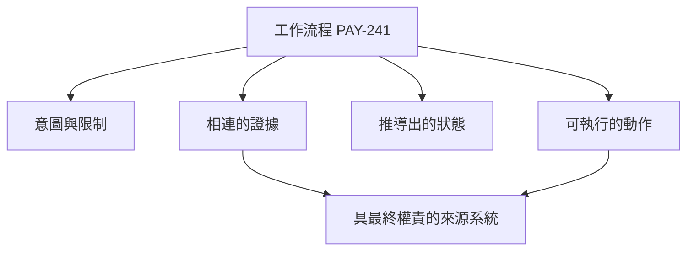

[上一篇](/zh-hant/posts/05-the-tab-problem-and-app-centric-fragmentation/)談到一項散落在 Jira、Figma、Confluence、Bitbucket、Bamboo、Microsoft Teams 與本機終端機的軟體修改。分頁太多只是表面；真正的麻煩，是同一項工作的身分、狀態、意圖、行動、注意力和權責，都被應用程式的邊界切開。

面對這個問題，最不該做的，就是在第八套應用程式裡重做前面七套工具。

更合理的方向，是建立一個 **workflow-centric workbench**。這裡的 workbench 可以理解成「工作台」：第一個出現在使用者眼前的物件，不再是某套應用程式，而是他正在推進的成果。工作台把與這項成果有關的證據、關係、狀態和可執行動作整理在一起；Jira、Figma、Bitbucket 等專業工具仍然保有各自資料的最終權責。

本文的主張是：**Workbench 應把工作流程建模成一張持續變動、生命週期有限的關係圖，裡面包含意圖、證據、決策與行動；它不該成為另一套 system of record（正式資料來源）。** 守住這條界線，才能避免它變成只會顯示燈號的淺層儀表板，也不會膨脹成想取代所有工具的平台。

這項區分也能說明它和 Developer Portal（開發者入口網站）有什麼不同。Portal 通常圍繞組織內相對穩定的服務目錄；Workbench 關心的，則是眼前這項工作現在發生了什麼、卡在哪裡、下一步能做什麼。

## 先選工作，不是先選應用程式

回到上一篇的 `PAY-241`：更換收款帳號前，要多一道確認。

在以應用程式為中心的環境裡，工程師得先判斷該開 Jira、Figma、Bitbucket 還是 Bamboo。使用 Workbench 時，他可以直接從 `PAY-241`，或「收款帳號確認流程」這種自然描述開始。進入後第一個畫面應回答四個問題：

1. 這項工作要達成什麼？
2. 哪些證據構成目前狀態？
3. 現在卡在哪裡，或有哪些事情還不確定？
4. 我接下來可以做什麼？

同一個畫面可能整理出：

- Jira 裡的需求意圖與驗收條件。
- 已核准的 Figma Frame，以及它究竟核准了哪一部分的明確關係。
- 規範這次修改的 Confluence 決議，連同最後取得的版本。
- 本機分支、尚未 Commit 的變更與精準測試結果。
- Bitbucket Pull Request 的最新 Commit、審查討論與核准狀態。
- 對應該 Commit 的 Bamboo Plan 與部署結果。
- 一段可能構成新決策的 Teams 討論，附上來源連結與參與者。

這個單位不是把其他工具資料抄過來組成另一個「專案」。它是一項有起點、持續變化，而且有完成條件的明確工作。



這張圖刻意不是左右對稱。證據從來源系統進入 Workbench，動作則回到擁有該物件的系統執行。Workbench 能顯示所有資訊，不代表它就應該悄悄接管最終權責。

## 一個工作流程物件，不能只是書籤集合

最簡單的版本，是在 `PAY-241` 底下整理一排相關連結。這可以省下搜尋時間，卻無法解決上一篇提到的語意落差。

真正有用的工作流程物件，至少要包含五種資訊。

### 1. 意圖

意圖說明這項工作為什麼存在、要達成什麼成果、受到哪些限制，以及哪些事情不在範圍內。它不只等於 Jira Description，也可能包含一條驗收條件、Confluence 裡的資安限制，或審查過程中正式確認的決策。

意圖應該精簡、可檢查，而且能回到證據。Workbench 可以替使用者整理，但必須分清楚每句話是原文抄錄、系統推論，還是經負責人明確確認。這和[先理解意圖，再進行 Pull Request Review](/zh-hant/posts/pr-review-should-start-with-intent/)採用的是同一個原則：實作是證據，意圖則是拿來判斷證據是否正確的契約。

### 2. 產出物與證據

Issue、Frame、頁面、Branch、Commit、Pull Request、建置、部署、訊息、檔案與測試結果，都屬於原始系統管理的物件。Workbench 保存的是它們的引用與經過挑選的觀察結果，不是擅自建立一份無條件取代原始資料的副本。

每一項觀察都應該附上來源、取得時間、可取得時的來源版本或識別碼，以及當時的權限脈絡。

「Bamboo 是綠燈」幾乎無法檢查；下面這句才夠具體：

```text
部署結果 8127 於 14:32 回報：Commit 4f6d... 已成功部署到 staging。
Workbench 於 14:33 取得此結果。
```

### 3. 有類型的關係

單純放連結只表示「兩者可能相關」，有類型的關係則能說明它們為什麼相關：

```text
Figma frame B --是已核准設計------> PAY-241
commit 4f6d    --實作----------------> PAY-241
Bamboo 8127   --驗證----------------> commit 4f6d
Teams msg 391 --可能取代------------> Confluence 決議 v4
```

箭頭上的動詞非常重要。有些關係可以由來源資料直接確定，例如建置結果帶有 Commit Hash；有些是使用者明確指定；還有一些只是 AI 推論，在人確認之前必須一直標示為暫定，不能假裝已經定案。

### 4. 從證據推導出的工作狀態

Workbench 可以綜合來源，整理出較高層次的狀態，但不能把所有資訊壓成一個綠色勾勾。

例如：

```text
實作：  已 Push；本機仍有尚未 Commit 的變更
審查：  有一則尚未解決的 Blocking 討論
驗證：  最新 Commit 已通過單元測試 Plan
交付：  前一個 Commit 已到 staging；最新版本尚未部署
決策：  錯誤文案已核准；資安例外仍未確定
```

這比「進行中」有用得多，因為每一個面向需要的下一步不同。當來源更新時間不一致，或兩套系統暫時說法不同時，它也能如實保留落差，而不是硬湊成一個看似完整的狀態。

### 5. 可執行的下一步

只能看、不能做的 Workbench，最後會變成另一套報表系統。有效的下一步應該和證據放在一起：開啟 Figma 的指定 Frame、回覆某則 Review 討論、在本機執行精準測試、要求核准、觸發有權限的 Bamboo 部署，或更新 Jira 狀態。

真正的修改仍由來源系統執行，或透過使用者身分授權、範圍明確的 Connector 執行。動作送出前，Workbench 要清楚顯示目標、可能影響和使用的權限；高影響動作要再次確認，完成後則附回原始系統的結果。

## Workbench 是投影，不是資料倉儲

做跨工具整合時，最容易想到的架構是把所有資料匯入一個大型資料庫，然後宣告「現在都串好了」。這可能得到一座資料倉儲，卻未必得到可信的工作台。

比較合適的模型是：**帶著原始權責連結的具體化投影（materialised projection）**。Workbench 可以快取足夠的 Metadata，讓使用者快速掌握全貌與跨來源關係；容易變動或敏感的細節則在需要時才讀取，所有修改仍送回原本的應用程式。

實務上可以拆成四層：

1. **Connectors**：讀取來源物件，並呼叫權限範圍明確的動作。
2. **身分解析**：把需求編號、URL、Branch、Commit 與使用者確認結果，對應成工作流程關係。
3. **工作流程投影**：保存意圖、有類型的連結、觀察結果、資料新鮮度與個人注意力狀態。
4. **使用介面**：用 Web App、桌面程式、IDE 面板、終端機畫面或 AI 介面呈現同一套工作流程。

介面可以改變，不必跟著重做工作流程模型。完整瀏覽器畫面適合並排比較視覺內容；`workbench status PAY-241` 這類終端機指令可以快速回答目前狀態；IDE 面板只顯示目前分支相關資訊；AI 介面則可以查詢證據並提出下一步。只要共用同一個領域層，這些介面是互補，不是競爭。

這種設計也要把失敗明確呈現。Bamboo 暫時無法連線時，部署卡片應顯示「無法更新」，並保留最後取得時間；不能把缺少資料默認成成功或失敗。使用者沒有 Figma 檔案權限時，Workbench 可以顯示有一個無法存取的引用，但不能洩漏快取內容。

## 開發者的本機狀態不能被忽略

很多整合儀表板只連遠端 API，對開發者 Workbench 來說仍少了一半。

本機 Working Tree 往往擁有最新、也最關鍵的狀態：還沒 Commit 的修改、新產生的檔案、仍在執行的測試程序、本機服務，或做到一半的 Coding Agent 任務。若 Workbench 看不到這些狀態，就算跨系統摘要再漂亮，也已經落後真實工作。

這正是 [Local Web App 模式](/zh-hant/posts/02-local-web-apps-are-underrated/)適合發揮的地方。本機輔助程式可以在明確授權下觀察目前 Repository、執行限制好的指令，再提供視覺化介面。它能把遠端證據和本機事實放在同一個脈絡裡，不必把整份 Working Tree 上傳到雲端。

界線必須刻意畫清楚。本機程式可以回報 Branch、Commit、變更路徑與測試結果；不能因此向遠端 Connector 開放任意檔案系統存取，也不該預設把原始碼傳給 AI 模型。使用者需要知道哪些觀察只留在本機、哪些 Metadata 會同步，以及哪些動作會呼叫外部服務。

純雲端 Workbench 仍可能適合其他工作流程；但對軟體交付而言，本機與遠端是同一項成果不可分割的兩半。

## AI 最適合處理那些語意不明的接縫

能用確定規則處理的關係，就不必交給 AI。Bamboo 結果已經寫明 Commit Hash，直接比對即可；Bitbucket Pull Request 明確提到 `PAY-241`，一般文字解析就能建立關係。

真正需要 AI 的，是語意或對話造成的不確定接縫：

- 找出可能改變驗收條件的 Teams 對話段落。
- 比較 Figma 標註與目前實作畫面的說明。
- 按照「等待哪一項決策」整理尚未解決的 Review 討論。
- 解釋為什麼目前部署不包含 Pull Request 的最新 Commit。
- 根據卡住的面向，提出可能的下一步。

這裡的「可能」不能省略。AI 產出應以一項帶有來源、可信程度和確認狀態的主張進入關係圖，而不是悄悄變成事實。摘要要能引用原始物件；準備執行的修改要先預覽；從對話擷取決策時，要保留發言者和前後文。

AI 最有價值的角色，是降低人工整理多套系統的成本，同時讓不確定性仍然看得見。能跨應用程式閱讀，不等於模型自動取得決策權。

## Workbench 不只是 Developer Portal 換名字

Workbench 和 Developer Portal 的功能確實會重疊，因此更需要把差異講清楚。

Backstage 把自己定位為建立 Developer Portal 的開放原始碼框架。它的 Software Catalog 以服務、網站、程式庫、資料管線等相對穩定的實體為中心，記錄擁有者與 Metadata，讓組織內的軟體容易被找到，也讓外掛能以 Catalog Entity 為核心整理基礎設施工具（[Backstage Software Catalog](https://backstage.io/docs/features/software-catalog/)；[Backstage overview](https://backstage.io/docs/overview/generated-index/)）。這是一套很有價值的組織模型。

以工作流程為中心的 Workbench，重心不同：

| Developer Portal                         | Workflow-centric Workbench                     |
| ---------------------------------------- | ---------------------------------------------- |
| 主要識別單位是軟體服務或由團隊擁有的資源 | 主要識別單位是要達成的成果或範圍明確的一項工作 |
| 改善探索、標準化、擁有權和自助服務       | 改善方向感、協調與下一步行動                   |
| 多半描述相對穩定的組織拓樸               | 描述可能每分鐘都在改變的暫時關係圖             |
| 常回答：「這個服務要怎麼操作？」         | 常回答：「這項修改現在還缺什麼？」             |
| 通常從中央登錄的 Metadata 開始           | 通常從需求單、Branch、事故或意圖開始           |

兩者可以共存，也可以互相整合。`PAY-241` 可能涉及 Catalog 裡的 `payments-api`；Portal 提供擁有團隊、文件、Runbook 與範本，Workbench 只要連到這個 Entity，不必重新建立一份。反過來，Developer Portal 的外掛也可以承載 Workbench 畫面。

這是一條概念界線，不代表一定要做成兩套產品。Portal 若把目前成果當成主要物件，並整理即時的跨系統證據，它就在扮演 Workflow Workbench；Workbench 若開始負責全公司的服務目錄、Golden Path 和平台治理，它也已經承擔 Portal 的責任。

保留這條區分，是為了避免範圍失控。Workbench 不必先解決全公司的軟體探索、Scaffolding、文件發布與平台治理，才有資格幫一位工程師完成 `PAY-241`。

## 一個使用 Workbench 的早晨

想像 Reviewer 在你下班後留下回覆。隔天早上，你先打開 Workbench，而不是逐一檢查七套工具。

最上方的 `PAY-241` 仍清楚寫著：「更換收款帳號前加入確認，不改變既有 SSO 流程。」這項意圖已由產品負責人確認，也連回 Jira 的驗收條件。

下面列出你離開後的三項變化：

1. Bitbucket Reviewer 把一則討論標為 Blocking，要求調整錯誤文案。
2. 設計師連上一個新的 Figma Frame，並註明它取代先前的錯誤狀態。
3. Bamboo 完成一次 staging 部署，但部署的 Commit 比最新 Push 更舊。

另一串 Teams 討論被獨立標示為：「可能的決策：保留 24 小時驗證期限。」因為相關負責人尚未確認，它沒有被直接寫成正式意圖。

因此，Workbench 建議的不是一份按 App 分組的通知清單，而是和目前狀態直接相關的下一步：

- 確認 Teams 的說法是否改變驗收條件。
- 把新的 Figma Frame 和 Blocking Review 留言並排開啟。
- 在本機套用文案修改，執行精準測試。
- Push 後等待對應新 Commit 的 Bamboo Plan，再部署那一份產出。

每一項都能回到來源。本機動作留在本機；部署仍受 Bamboo 權限管理；使用者也可以不同意系統建議的順序。

Workbench 沒有替人自動完成工作。它移除的是那筆一直被忽略、卻遮住真正工作的「脈絡重建稅」。

## 第一版最重要的能力，是懂得節制

Workbench 很容易一路長成「什麼都要做」的平台，所以可信的第一版，反而要明確知道哪些事情不做。

它不應該：

- 複製每套應用程式的每一個欄位。
- 取代原始系統專用的編輯器、畫布、Review 畫面或日誌。
- 只看單一狀態就判定工作完成。
- 保存超級使用者憑證，代替所有人執行大範圍動作。
- 顯示無法追溯來源的 AI 摘要。
- 變成把所有事件再抄一次的第二套通知中心。
- 要求整間公司先完成統一建模，單一工作流程才能使用。

一個收斂的第一版，可以只支援「由 Jira 需求單開始的程式碼修改」，整合本機 Git、Bitbucket、Bamboo，以及設計或知識文件連結。它只回答幾個關鍵問題：目前最新 Commit 是哪一個、Review 卡在哪裡、建置與部署是否對應最新版本，以及這項工作的意圖是什麼。

Teams 與 Figma 的語意整合，可以等基本的身分與權限模型值得信任後再加入。

成功標準也不是「所有工具都接好了」，而是工程師被打斷後，能更快恢復工作，正確說出目前狀態與下一項決策，而且少做幾個錯誤假設。

## 從一堆 App，變成一個能回去的工作位置

以工作流程為中心的 Workbench，把第一個問題從「我要開哪個 App？」改成「我現在要推進哪一個成果？」

表面看來只是改善導覽，實際影響更深。它替一項工作建立不依賴任何單一來源的身分，同時不抹除原始系統的最終權責；它讓意圖和實作並排，區分觀察與推論，接上本機和遠端狀態，再把可執行動作放到支持它的證據旁邊。

它的價值不在於把分頁數量降到零。有些動作本來就應該回到 Figma、Bitbucket、Bamboo 或終端機完成。真正的改善是：即使離開再回來，也不必重新從七套工具拼湊方向。

這也是 Workbench 不能只被視為 Developer Portal 新名稱的原因。Portal 告訴我組織有哪些軟體、誰負責，以及建議如何操作；Workbench 告訴我這項持續變動的工作現在代表什麼、為何還沒完成，以及哪個經過授權的動作能讓它前進。

專業應用程式不會消失。改變的是它們的邊界不再主導人的思考方式，而工作流程終於有了一個屬於自己的位置。

_系列導覽：[索引](/zh-hant/posts/00-from-apps-to-intent-driven-computing/) · 上一篇：[05 — 分頁越開越多，真正的問題不是瀏覽器](/zh-hant/posts/05-the-tab-problem-and-app-centric-fragmentation/) · 下一篇：[07 — 可組合工作空間框架](/zh-hant/posts/07-framework-for-composable-workspaces/)_

## 資料來源

- [Backstage Software Catalog](https://backstage.io/docs/features/software-catalog/)
- [Backstage overview](https://backstage.io/docs/overview/generated-index/)
- [Jira Software Cloud Development Information API](https://developer.atlassian.com/cloud/jira/software/rest/api-group-development-information/)
- [Bamboo REST API](https://developer.atlassian.com/server/bamboo/rest/api-group-api/)
- [Microsoft Teams deep links](https://learn.microsoft.com/en-us/microsoftteams/platform/concepts/build-and-test/deep-links)
