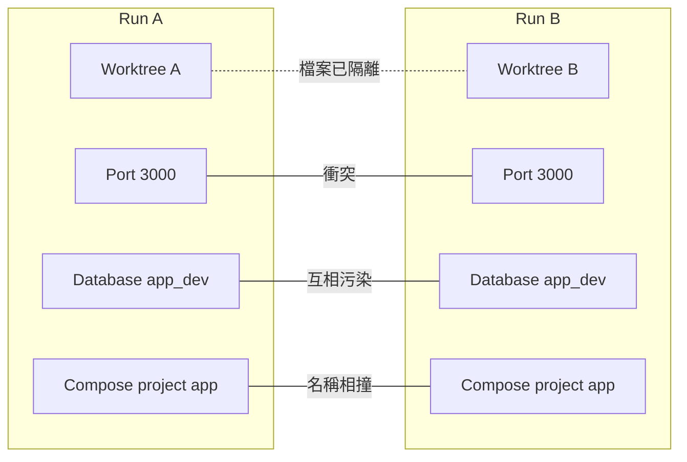
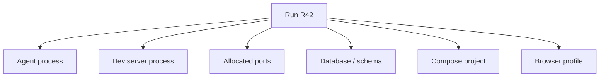
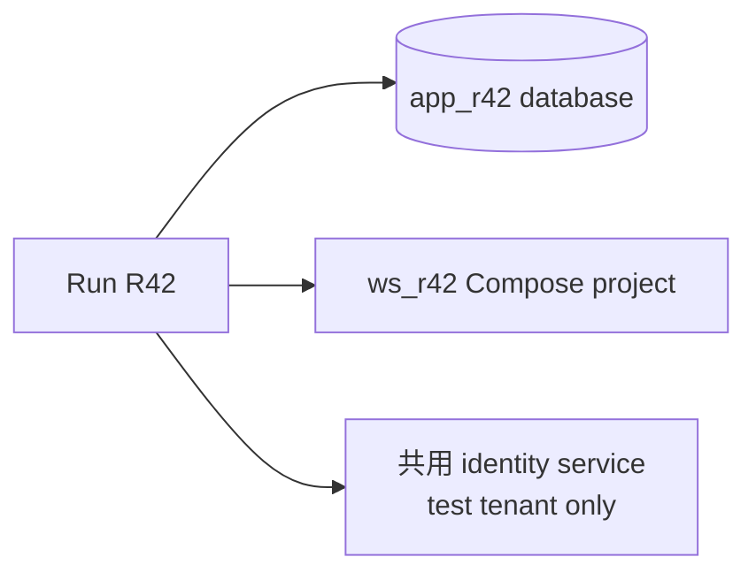
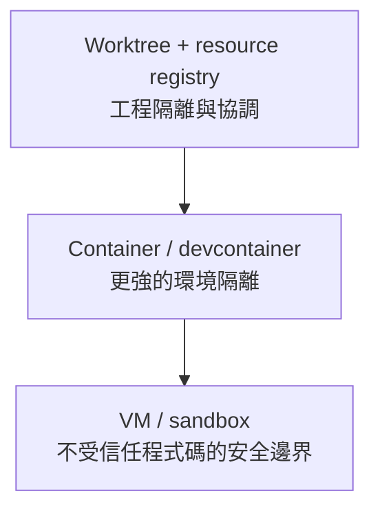

兩個 agent 在不同 branch、不同 worktree，也在做不同功能。理論上應該互不干擾。

直到第二個 agent 執行 `pnpm dev`：

```text
Error: address already in use 0.0.0.0:3000
```

它很合理地找出佔用 port 的 process，準備把它停掉。問題是，那個 process 屬於第一個 agent。

這時我才明白：我做的是 filesystem isolation，不是完整的 execution isolation。

## 還有第二層並行問題

Worktree 讓兩個 Run 擁有不同檔案狀態，作業系統裡的資源仍然共用：



本機只跑一個 agent 時，這些問題還能靠人工處理。同時有人的 dev server、多個 agent、甚至排程維護工作時，「不知道這個資源屬於誰」會變成真正的風險。

## Run 必須擁有自己啟動的東西

我會把 runtime resources 也納入 Run：



有了 ownership，cleanup 才不必靠猜測。

最重要的規則是：

> Run 只能清理由自己建立或租用的資源；其他一律視為外部資源。

因此 agent 遇到 port conflict 時，不應直接 kill 不明 process。Coordinator 可以替它分配另一個 port，或明確告訴人需要處理的衝突。

## Port allocation 是很好的第一步

Port 最容易看見，也最適合當 MVP：

```text
RUN_ID=R42
APP_PORT=43122
API_PORT=43123
```

Registry 記錄這次租用：

```yaml
run: R42
resources:
  ports: [43122, 43123]
  processes: [18422, 18491]
```

應用程式本身必須接受可設定 port。這不只是為 agent 服務；CI、preview environment 與同時開多個開發環境也會因此更可靠。

第一版不用做分散式 lease system。從指定範圍找可用 port，再與 OS 的 listening socket 對照，就足以驗證 resource ownership 這個 pattern。

## Database 的衝突更難察覺

兩個 Run 共用同一個 development database，可能不會立刻報錯。更常見的是測試偶爾失敗、資料被另一個 Run 清掉，或一邊跑 migration，另一邊還假設舊 schema。

依專案成本，可以採用：

- 每個 Run 一個 database 或 schema
- 唯一的 Docker Compose project name
- 每個 Run 一個 temporary data directory
- queue topic 與 cache key 加 namespace
- 明確標示哪些 service 是共用、只讀或只能用 test tenant



不是每個團隊都能為每個 agent 複製整套微服務。重點是把共享與隔離寫清楚，不讓它們成為藏在 localhost 裡的假設。

## Crash 之後還要認得自己的 Process

如果 coordinator 重啟，agent process 可能仍在執行。只把 PID 放在記憶體不夠，也不能因為看到相同 PID 就直接 kill，因為作業系統可能已經重複使用該編號。

Process record 至少需要 owner Run、啟動時間、工作目錄、command identity 與 port。Coordinator 回來後，才能安全地 reconcile 真實 OS 狀態和 registry。

這類 machine-local state 變動頻繁，也只對當前主機有意義，所以我不會把它全部放進 Git。SQLite 或簡單 local store 更自然；真正有工程價值的 event 再另外提升。

## Worktree 不是安全沙盒

這點一定要說清楚。

Worktree 防止一般 Git 操作互相覆蓋，但 agent process 仍然以同一個 OS user 執行。只要權限允許，它可能讀到其他目錄、SSH key、環境變數與本機 service。

Run registry 也只是協調工具，不會真的阻止 agent 綁定未分配的 port。



受信任、有人 review 的本機 coding agent，可以先從 worktree 與 ownership 開始。執行未知程式碼或有合規要求時，就需要 container、受限 OS user、VM 或真正 sandbox。

## 我在工作上學到的事

第二個 agent 想停掉第一個 server，並不是它特別危險，而是 Workspace 只讓它看見 port conflict，沒有讓它看見 resource ownership。

我因此把原則擴充成：

> 一次 Run 不只擁有檔案變更，也擁有自己的 process、port 與 temporary services；清理時只碰自己擁有的資源。

有了清楚的 Run 與 resource boundary，同一套機制也可以處理不由人即時發起的工作，例如每天檢查文件、維護測試與更新相依套件。

下一篇：[從 Coding Agent 到持續運作的工程團隊](/zh-hant/posts/from-coding-agent-to-engineering-team/)。
