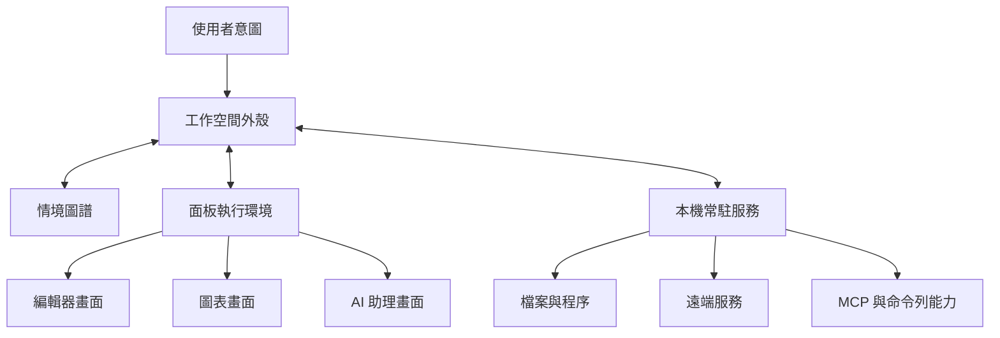

想像線上付款服務突然大量逾時。你在同一個工作空間裡打開失敗的部署、相關的合併請求、即時紀錄與服務拓樸，再請 AI 比對上一個正常版本。當你點到某一行錯誤訊息，程式碼畫面跳到可能出問題的位置，拓樸圖標出受影響的服務，AI 也知道你說的「這個錯誤」是哪一筆。

這些工具今天大多已經存在。真正難的是：如何讓它們合作，而不是把六套彼此不相干的程式塞進同一個視窗。

面板可以拖曳、分割、縮放，頂多代表版面能組合。若要讓工作本身也能接續，系統還得知道大家正在看同一個什麼東西、目前選取了什麼、可以做哪些事、剛才發生什麼變化，以及使用者最後想完成什麼。

因此，我認為可組合工作空間的核心不是更自由的排版，而是一份夠小、各種工具都能採用的**共通語意契約**。它包含六種基本元素：物件、資料、動作、畫面、事件與意圖；再交由工作空間外殼、情境圖譜、面板執行環境與本機常駐服務協調。

## 先分清楚三種「可組合」

這個詞常被用得太寬鬆，實際上至少有三個層次。

第一層是**版面組合**。使用者能把紀錄、編輯器和圖表排在一起，但它們彼此仍是陌生人。

第二層是**資料組合**。在客戶清單點選一家公司，另一張圖表就跟著篩選；工具產生的結果也能直接送進表格。不過，如果每兩套工具都要另外寫一支轉接程式，整合成本仍會快速失控。

第三層才是**工作流程組合**。系統不只搬資料，還理解物件、能力、事件與意圖，因此能建議下一個適合的畫面、把動作交給正確的服務、保留資料來源，在需要時詢問權限，並讓使用者隔天從原處繼續。

第三層建立在前兩層之上，卻不會因為多放幾個 iframe 就自然出現。

## 六個可以重複使用的整合元素

### 1. 物件：先確認大家指的是同一樣東西

物件（entity）是工作領域裡具有穩定識別碼與類型的東西，例如檔案、客戶、發票、合併請求、部署、警示或調查紀錄。

```json
{
  "id": "deploy://payments/prod/2026-08-07.3",
  "type": "deployment",
  "title": "payments prod 2026-08-07.3",
  "source": "deployment-service"
}
```

識別碼不一定要是公開網址，但在它的適用範圍內必須穩定，也要能由有權限的服務解析。這樣紀錄面板、拓樸圖與 AI 才能指向同一次部署，而不必了解彼此的內部資料結構。

### 2. 資料：不只交付內容，也交代從哪裡來

資料是物件或查詢結果的一種呈現。除了內容本身，它還需要格式或結構描述、來源、更新時間與出處。

同一次部署，給人看的可能是連續紀錄，給 AI 的則是含時間戳與服務代碼的結構化事件。兩者指向同一個物件，不代表必須傳遞完全相同的內容。

在 AI 工作空間裡，來源尤其重要。摘要必須知道自己根據哪些版本的檔案產生；推論出的結論也不能冒充原始資料。外殼不必看懂每一種格式，但必須保留這些關係。

### 3. 動作：說清楚能做什麼，以及會造成什麼後果

動作（action）是作用在物件上的明確能力，例如開啟、比較、執行測試、註記、核准或部署。每個動作都應說明可接受的物件類型、輸入格式、可能影響，以及實際負責執行的服務。

這和 MCP 工具的設計很接近：主機能發現具名操作及其輸入結構。這裡重要的是「能力可以被發現」這項設計原則，不是要求所有動作都改用 MCP。選單、快捷鍵、命令列與自動化介面，仍可用各自合適的方式呈現同一項領域動作（[MCP tools specification](https://modelcontextprotocol.io/specification/2025-11-25/server/tools)）。

會改動資料的動作，還要標示能否復原、是否連到外部服務，以及是否需要再次確認。最後執行動作的服務仍必須自行檢查授權，不能只相信前端傳來的指示。

### 4. 畫面：同一個物件可以有不同看法

畫面（view）負責呈現或編輯物件與資料。它可以是樹狀清單、表格、編輯器、終端機、地圖、圖表、表單、對話或小型 MCP App。同一次部署可以同時出現在時間軸、紀錄串流、拓樸節點與摘要卡片裡，但識別仍只有一份。

畫面可以保留游標位置、縮放倍率等操作狀態；真正需要長期保存的變更，則應透過動作交回負責的服務。否則關掉面板，可能連重要工作也一起消失。

### 5. 事件：記錄已經發生的事，不等於要求執行

事件（event）描述完成的事實，例如選取項目已變更、物件已更新、工作已開始或權限被拒絕。它應包含來源、時間、相關物件與追蹤識別碼。

事件讓各元件不必兩兩綁死。當使用者選了一行紀錄，情境圖譜可以更新，相關畫面可以標示對應物件，AI 也能在授權範圍內取得新情境。

但「部署失敗」是事件，「回復上一版」是動作。分開兩者，才能避免系統把收到通知誤認成已獲准採取行動，也更容易稽核事後到底發生了什麼。

### 6. 意圖：保留使用者真正要完成的結果

意圖（intent）位在單一步驟之上，例如調查事故、準備客戶簡報、核對帳款或發布新版。

意圖通常不完整，系統可能需要 AI 規劃或固定流程，把它拆成查詢與動作。拆解過程不能丟掉原始說法、限制條件、已解析的物件與核准紀錄。使用者說「只能讀取正式環境，不要修改」，這句話必須一路約束後續規劃，不能只留在對話紀錄裡。

意圖也不一定從聊天輸入。命令選單、範本、網址與按鈕都可以是入口。「AI 原生」不該等同於「只能聊天」。

## 四個負責把契約跑起來的元件



### 工作空間外殼：協調操作與注意力

外殼負責版面、導覽、焦點、指令、通知、權限提示與工作階段復原。它決定畫面放在哪裡，也維持共同的操作規則。Visual Studio Code 讓擴充功能的畫面能放進既有或自訂容器，並在側欄與面板之間移動，是外殼管理位置的成熟例子（[VS Code Views](https://code.visualstudio.com/api/ux-guidelines/views)）。但跨領域的共通語意，仍需要另外設計。

### 情境圖譜：保存關係，不是傾倒對話紀錄

情境圖譜（context graph）把目前工作的物件、畫面、意圖、工具結果與衍生內容連起來。事故調查中，它可以記住部署對應哪個提交、服務、警示、選取的紀錄與時間軸草稿。當使用者說「拿這個跟上一版比較」，系統才有依據解析「這個」。

圖譜也必須會淡出。不是畫面上出現過的每一筆資訊都該送進模型，也不是提過一次就要永久記住。焦點、最近使用、使用者釘選、敏感程度與內容預算，都應影響目前公開給 AI 的範圍，而且這個範圍必須能檢查。

### 面板執行環境：讓畫面能擴充，也能各自失敗

它負責載入畫面、提供受限介面、轉送事件、套用主題與無障礙設定，並隔離錯誤。常見介面應優先使用範圍明確的元件；只有領域真的需要時，才開放完全自訂的網頁畫面。VS Code 也建議僅在標準介面不足時使用 Webview（[VS Code Webviews](https://code.visualstudio.com/api/ux-guidelines/webviews)）。自由度越高，越需要清楚的隔離與生命週期界線。

### 本機常駐服務：集中處理權限與長時間工作

有些能力不該直接放進面板，例如檔案系統、子程序、憑證、本機資料庫、模型執行環境、遠端 API、MCP 伺服器與長時間工作。常駐服務可以集中管理這些能力與政策，也讓建置工作在關閉面板後繼續執行，等外殼重開再接回來。

這裡的「本機」指靠近使用者裝置與信任邊界，不代表所有資料都必須離線。它可以代為連接遠端服務，但不需要把整台電腦的權限交給每個內嵌畫面。

## 現有系統已經提供哪些積木

不必等待某套「終極工作空間」。今天的系統已經驗證了不少可重用的設計：

- **POSIX shell** 用呼叫方式、管線、重新導向與結束狀態，讓獨立程式互相組合。限制是位元組串流幾乎不帶領域語意（[POSIX Shell Command Language](https://pubs.opengroup.org/onlinepubs/9799919799/utilities/V3_chap02.html)）。
- **Web** 提供全球識別碼、連結、不同內容表示法與來源隔離，適合引用長期存在的物件；但兩個網頁放在一起，不會自動共用選取狀態或動作（[Architecture of the World Wide Web](https://www.w3.org/TR/webarch/)）。
- **IDE 工作台** 已有指令登錄、可移動畫面、目前選取與擴充功能生命週期。VS Code 的 Workspace Trust 也示範如何集中控管未受信任資料夾中的程式碼執行（[VS Code Workspace Trust](https://code.visualstudio.com/api/extension-guides/workspace-trust)）。限制是 IDE 天然以檔案與程式碼為中心。
- **MCP 主機** 能向獨立伺服器協商並發現工具、資源與提示內容，但 MCP 本身不是完整的工作空間介面、狀態儲存或通用事件匯流排（[MCP architecture overview](https://modelcontextprotocol.io/docs/learn/architecture)）。

重點不是選出唯一贏家，而是抽出這些系統已經證明有效的小型契約。

## 用一次事故調查檢驗整套設計

假設使用者輸入：「調查最新 payments 部署為什麼逾時，不要修改正式環境。」

1. 外殼把它記成事故調查意圖，並保存「只能讀取」的限制。
2. 物件服務解析「最新 payments 部署」，畫面先顯示確切版本供使用者確認。
3. 情境圖譜連起部署、提交、服務、警示與操作手冊。
4. 面板執行環境只帶入相關物件，開啟紀錄、拓樸、程式碼與 AI 畫面。
5. 本機常駐服務串流紀錄並執行唯讀診斷。
6. 使用者點選錯誤、AI 提出假設時，事件持續更新圖譜。
7. 即使 AI 建議回復版本，動作所標示的「會修改正式環境」仍與意圖限制衝突，因此外殼不執行。
8. 系統最後保存含來源、時間與固定連結的調查時間軸。

沒有共同物件，各面板可能各自解讀「最新」；沒有動作後果，「不要修改」就只是一句文字；沒有來源，時間軸無法稽核；沒有圖譜，每個畫面又得重新找一次情境。

## 可組合，也要限制錯誤的擴散

整合越深，出錯時影響也越大，因此幾個界線不能省：

- 每個畫面只取得完成工作所需的最低權限，顯示指標的圖表不該順便取得部署權限。
- 信任要有範圍、看得見，也能撤銷；信任一個工作空間不等於核准未來所有動作。
- 意圖中的限制必須能被系統讀取，後續計畫只能縮小權限，不能偷偷放大。
- 事件與衍生內容都要帶來源和追蹤關係，才能除錯、稽核與復原。
- 第三方畫面必須獨立失敗，不能拖垮情境圖譜或正在背景執行的工作。

## 從一個真的會用到的流程開始

這套框架很廣，但實作時應該從窄處開始。挑一個使用者原本就要在多個工具之間切換的流程，例如事故處理、研究整理、版本發布或內容製作。先列出五到十個重要物件、少量動作與事件，再做兩個互補畫面，並保存一項意圖和足以接續工作的情境。

只有在多次遇到相同整合需求後，才把契約抽象化。第一版甚至可以只有：

```text
物件：檔案、部署、警示、調查
動作：開啟、查詢紀錄、比較、建立時間軸
事件：選取已變更、查詢已完成、物件已更新
畫面：編輯器、紀錄、時間軸、AI 助理
意圖：帶有限制條件的事故調查
```

這已經足以測試語意能否真正接起來，不必先打造一套新的作業系統。

## 工作空間的價值，在協調而不是包辦

編輯器可以繼續當編輯器，終端機可以保留精準的文字操作，圖表負責看關係，AI 則負責處理模糊與協調。可組合工作空間不需要把它們磨成同一種介面，而是讓它們對共同物件、資料、動作、畫面、事件與意圖有一致理解。

外殼協調注意力，情境圖譜保存關係，面板執行環境提供擴充與隔離，本機常駐服務銜接權限能力與持續狀態。組合起來，它不只是應用程式啟動器，也不是什麼都塞進聊天框，而是一個能依眼前工作準備合適工具的環境。

_系列導覽：[索引](/zh-hant/posts/00-from-apps-to-intent-driven-computing/) · 上一篇：[06 — 以工作流程為中心的工作台](/zh-hant/posts/06-the-workflow-centric-workbench/) · 下一篇：[08 — 意圖優先，不等於只剩聊天](/zh-hant/posts/08-intent-first-computing-and-future-ui/)_

## 資料來源

- [POSIX.1-2024 Shell Command Language](https://pubs.opengroup.org/onlinepubs/9799919799/utilities/V3_chap02.html)
- [W3C: Architecture of the World Wide Web](https://www.w3.org/TR/webarch/)
- [Visual Studio Code: Views](https://code.visualstudio.com/api/ux-guidelines/views)
- [Visual Studio Code: Webviews](https://code.visualstudio.com/api/ux-guidelines/webviews)
- [Visual Studio Code: Workspace Trust Extension Guide](https://code.visualstudio.com/api/extension-guides/workspace-trust)
- [MCP architecture overview](https://modelcontextprotocol.io/docs/learn/architecture)
- [MCP tools specification](https://modelcontextprotocol.io/specification/2025-11-25/server/tools)
