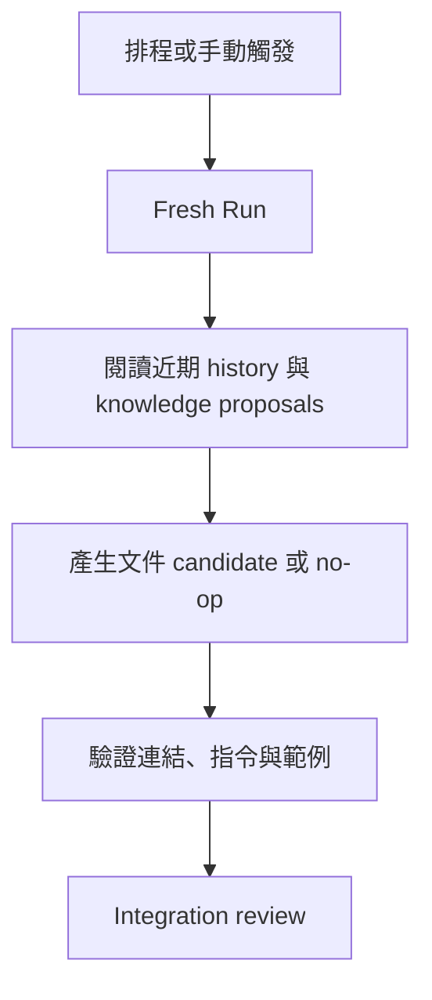
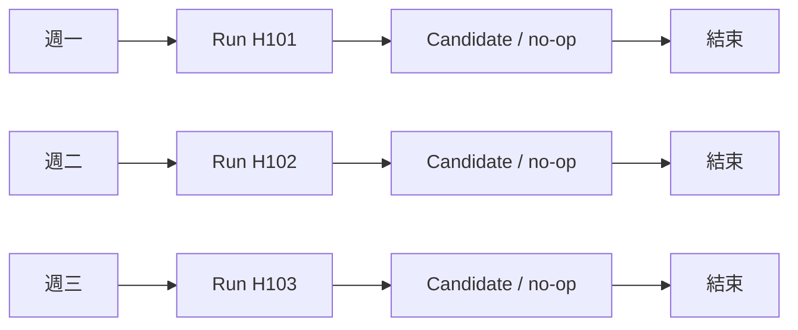
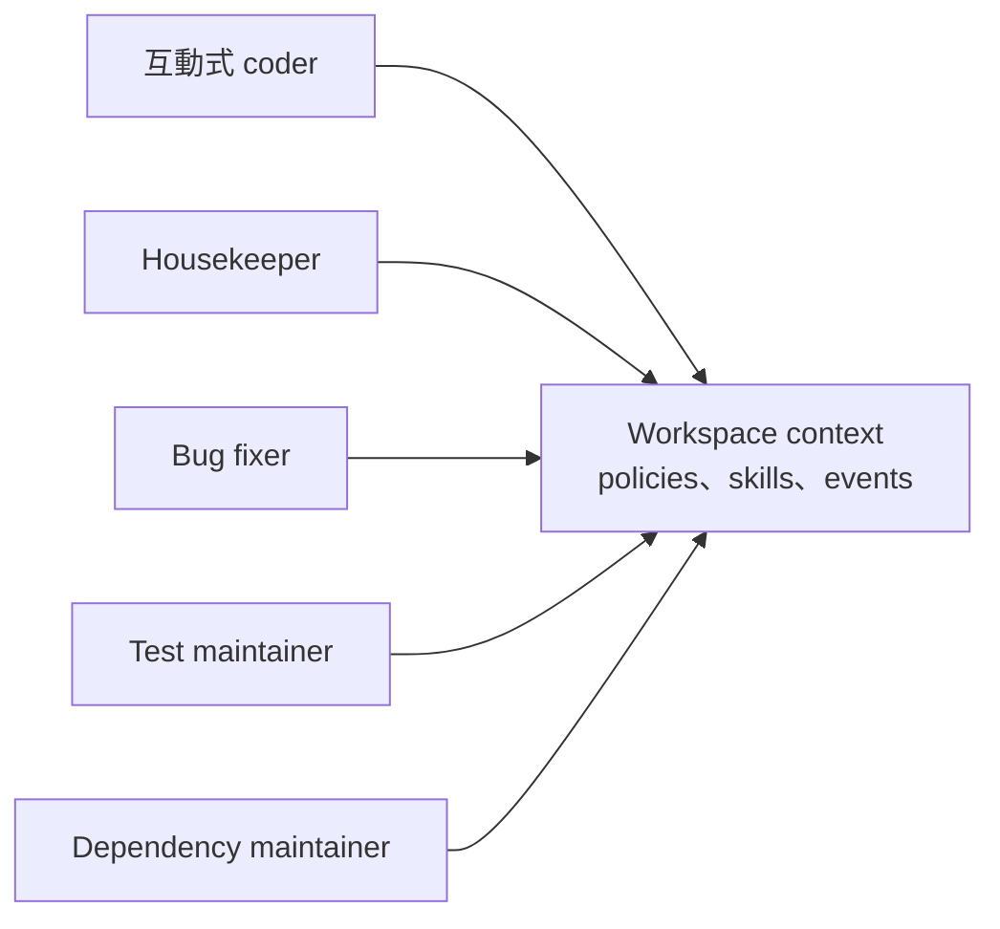
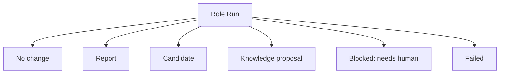

每個團隊都有一張大家心裡知道、卻不太會出現在 Sprint Board 上的清單。

README 裡有兩段已經過期；某組測試最近開始偶爾 retry；相依套件快到停止支援日期；一個重要架構決策還停在 Teams 對話；log 裡那個 warning 已經看了三個月，但每次都沒有急到值得打斷 feature delivery。

這些不是沒價值的工作，只是總被更明確的需求往後擠。

Coding agent 很適合協助這類維護，但我不想養一個永遠不關、權限很大、記憶越來越混亂的「AI 同事」。前面建立的 Run model 提供了更單純的答案：定義可重用的工程角色，每次觸發時仍然建立新的 bounded Run。

## Role 是 profile，不是擬人化員工

我會使用 housekeeper、bug fixer、test maintainer 這類名稱，因為它們容易表達責任；技術上它們只是一份 profile：

```yaml
name: housekeeper
purpose: "讓共享工程脈絡保持正確、精簡、可用。"
mutation_scope:
  - .workspace/context/
  - docs/
allowed_actions:
  - 檢查近期 Git history
  - 比對文件與目前程式行為
  - 提出範圍明確的修正
integration:
  requires_review: true
```

Profile 可以定義 instruction、工具權限、Repo scope、validation、resource limit 與 integration policy。

Role 是長期存在的設定；真正工作的是一次次用完即結束的 Run。

## 我最先想要的是 Housekeeper

Feature task 自然會有人 review。跨任務的工程知識最容易腐化。

Housekeeper 可以定期問：

- 最近 merge 的變更是否讓文件過期？
- 不同 Run 是否重複發現同一項限制？
- 有沒有 knowledge proposal 一直沒處理？
- 指令是否重複、矛盾或已不適用？
- 新的 build/test 流程是否只存在於某個人的記憶？



Housekeeper 不應因為某次 agent 猜過一件事，就自動重寫架構。它的角色是把 evidence 整理成可 review 的小型候選變更。

## Scheduled 不等於永遠不結束

如果每天都要執行，很容易直覺做成一個常駐 agent，讓它每天醒來、保留所有記憶。

我偏好每次都重新開始：



每次 Run 都從目前已確認的 durable context 出發。星期一形成的錯誤假設，不會只因為 session 沒關而一路帶到星期五。更換模型、agent CLI 或 instruction，也不必遷移一顆看不見的長期記憶。

所謂 loop agent，也可以理解成外部機制重複觸發 bounded Runs，而不是同一個對話無限循環。

## 先用 OS 已經有的 Scheduler

想到 scheduled engineering，很容易順手設計 daemon、dashboard、queue、calendar 與 retry system。

對 local-first MVP 而言，作業系統已經會排程：

- `cron`
- `systemd timer`
- macOS `launchd`
- Windows Task Scheduler
- 團隊既有的 CI schedule

Reference CLI 只要提供：

```bash
ws run housekeeper
```

再產生對應 timer 範例即可。等真實使用證明需要常駐 scheduler，再新增 infrastructure。

> 作業系統已經會做的事，不必因為加了 AI 就全部重做一次。

## 多個角色共享 Workspace，不共享一顆腦



Test maintainer 不必每天和 dependency maintainer 對話。它只要看得到目前 dependency、測試 policy、active intents 與已整合結果。

角色發生重疊時，coordinator 可以排順序、宣告 dependency，或讓兩邊都提出 candidate 再比較。規則仍然一樣：private plan、public intent、deliberate integration。

## No change 也可以是成功

自動化維護最容易製造噪音。若每次執行都硬開 PR，團隊很快就不再看它。

Role 應允許多種正常結果：



系統健康時，`no change` 就是成功。文件 typo 可以在驗證後低風險整合；dependency update 需要 CI 與人 review；會改變產品行為的 bug fix 則走完整流程。

Role 不會移除責任，只是把容易被遺忘的工作變成定期、有限、可檢查的嘗試。

## 我在工作上學到的事

我原本只在自己坐在電腦前時使用 coding agent。團隊裡那些反覆被延後的維護工作，讓我看見另一種可能：Workspace 可以承載一組工程角色，讓 stewardship 變成持續但不失控的流程。

我想保留的原則是：

> Durable role、bounded Run、explicit output、deliberate integration。

排程 agent 並不是特殊架構，只是由時間而不是人觸發同一套安全 Run lifecycle。

到這裡，Workspace、Repo、Context、Run、Intent、Resource、Candidate、Event、Role 與 Integration 都出現了。最誘人的下一步是直接開始寫一套大型 orchestration CLI；我後來認為，應該先把 architecture 本身公開。

下一篇：[為 Agentic Engineering 打造一個開放工作區](/zh-hant/posts/open-workspace-for-agentic-engineering/)。
