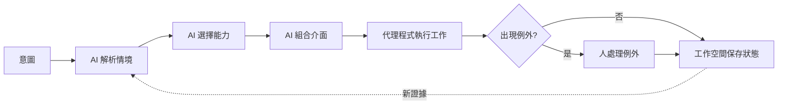

你對電腦說：「幫我準備明天跟客戶的會議。」如果系統最後只吐出一段看似完整的摘要，其實還差得很遠。

真正有用的結果，應該先確認你指的是哪場會議、與會者是誰、上次談到哪裡，再整理專案進度與尚未解決的問題。若合約內容跟團隊承諾互相衝突，系統要把衝突標出來，也要留下每項結論的資料來源。你可以在時間軸查看脈絡，在待辦區決定要不要處理例外；若你更正了客戶名稱，修正也應留在工作資料裡，而不是沉到某一串舊對話中。

這才是「意圖優先」：人先說想達成什麼，電腦再協助釐清情境、挑選能力，並準備完成工作所需的介面。

這個方向常被簡化成「以後所有軟體都會變成聊天機器人」，但我不認同。**自然語言會是很重要的入口，聊天卻不會成為萬用介面。** 對話適合處理模糊需求、來回協商與說明理由；密集比較、精準操作、長時間監控、空間配置與保存正式狀態，仍需要其他工具。

AI 真正改變的，不是讓所有畫面消失，而是幫使用者選擇、串接適合當下工作的畫面。這也延續了[如何選擇合適的應用程式介面](/zh-hant/posts/01-choosing-the-right-application-interface/)的觀點：介面要配合人的思考方式，而不是配合宣傳口號。

## 意圖說的是結果，不是完整規格

「把這張圖片縮成寬 1200 像素」已經很接近可直接執行的指令；「把這批照片整理成下週活動能用的版本」則還只是意圖。什麼叫「能用」？要放官網、Instagram 還是實體海報？有沒有品牌規範、肖像授權、畫質與簽核要求？

意圖優先系統必須逐步把這種模糊，收斂成有清楚邊界的計畫。至少要回答四件事：

1. 依目前情境，使用者真正想要的結果是什麼？
2. 哪些資料與工具有關，而且已獲得使用權限？
3. 哪些步驟可以自動完成，哪些需要人的判斷？
4. 剩下的工作，要用什麼方式呈現才最好理解、最好控制？

這不是生成式 AI 出現後才有的問題。Eric Horvitz 對混合主導介面（mixed-initiative interface）的研究，早已主張把自動推理與直接操作搭配使用，並把不確定性、犯錯代價與使用者注意力納入設計（[Principles of Mixed-Initiative User Interfaces](https://www.microsoft.com/en-us/research/publication/principles-mixed-initiative-user-interfaces/)）。模型變強了，但主導權該在何時交給電腦、何時還給人，仍是同一個核心問題。

自然語言的好處，是人不用先研究選單與欄位，就能從目標開始。然而第一句話只能算線索，不能當成完整授權。「幫我訂跟平常一樣的墨爾本行程」可能還缺日期、預算、同行者、無障礙需求，也不確定「訂」是否代表可以直接刷卡。後果越大，越不能讓流暢回答掩蓋尚未確認的細節。

## 四種介面，解決四種不同問題

意圖優先的環境至少需要四種面向使用者的介面。它們可以在同一套軟體裡，也可以分散到手機、電腦與既有服務；重點是不要把四種工作全丟給聊天框。

### 1. 意圖介面：先說想完成什麼

這是提出或修正目標的地方，可以是文字、語音、命令選單、選取物件後按下一個動作，或「整理並比較」之類的捷徑。目標一開始常不完整，所以對話在這裡特別有用。

好的意圖介面要能快速開始，也要容易改口。當不同解讀會造成不同後果時，系統應把自己的理解攤開來問：「我找到兩場都叫季檢討的會議，你指的是上午十點的客戶場嗎？」但能依目前畫面與既有偏好安全判斷的事，也不必每一步都反問，否則使用者只是換一種方式填表。

### 2. 互動介面：讓人看得出差異，也能精準操作

挑選要付款的發票，用表格勾選比聊五輪快；找租屋範圍要看地圖；審查程式碼需要差異檢視；調整簡報版面則需要畫布。這些工作仰賴視覺密度、位置關係與直接操作，不會因為模型更聰明就消失。

AI 主機中出現互動畫面，也已經不是概念展示。MCP Apps 允許工具宣告互動式 HTML 資源，由相容主機放在隔離的 iframe 中；畫面可接收結構化工具結果，也能透過主機呼叫工具（[MCP Apps overview](https://modelcontextprotocol.io/extensions/apps/overview)）。這不代表每套介面都該做成 MCP App，而是連以對話為主的產品，也需要表單、儀表板、檢視器與多步驟控制。

這些操作必須維持穩定語意。紅色欄位今天代表「超出預算」，明天就不能突然換意思；「核准」也不能每次顯示時有不同後果。AI 可以挑選元件並填入資料，但涉及安全與權限的規則，應由測試過、可預測的程式負責。

### 3. 注意力介面：只提醒現在真的值得看的事

通知、角標、即時狀態、鎖定畫面活動與提醒，都屬於注意力介面。它只需要回答：「現在有什麼值得我注意？」而不是把整個工作空間縮小塞進通知中心。

Apple 的 Live Activities 指南把這類介面定位為追蹤有明確起訖的事件：只放重要資訊，只有必要更新才發出提醒，並提供連回完整內容的路徑（[Live Activities](https://developer.apple.com/design/human-interface-guidelines/live-activities)）。這個原則也適用於 AI 代理程式。每呼叫一次工具就跳通知，不叫透明，只叫打擾。

一般進度應該隨時查得到，但不必一直打斷。真正值得升級提醒的，是需要做決定的例外、已威脅目標的狀況，以及使用者明確要求追蹤的里程碑。

### 4. 持久工作空間：讓成果有正式位置

這是工作留下來的地方，保存文件、來源、版本、決策、待處理例外、權限與稍後接續所需的狀態。它可能長得像文件、看板、程式碼儲存庫、研究筆記或案件系統。

對話紀錄保存「大家說過什麼」；工作空間保存「這件工作目前以什麼為準」。如果 AI 在五十則訊息裡做了三版預算，核准版不應靠搜尋聊天才找得到。它需要固定識別、資料來源、權限規則，以及能讓其他人或工具引用的連結。

對話可以成為工作證據，卻不能取代正式的工作狀態。

## 未來是介面接力，不是介面消失

圖中的「組合介面」不一定是讓模型現場亂寫前端程式碼。對多數產品，更合理的是從受控、測試過的元件庫挑選：比較表、參數表單、地圖、差異檢視、核准卡、進度畫面或文件編輯器。AI 負責把目前資料與可用動作接進去；元件本身負責一致操作、無障礙與可預測行為。

「代理程式執行工作」也不等於所有判斷都交給模型。金額計算、資料格式驗證、簽章檢查、交易處理與權限控管，仍應由確定性程式執行。模型可以判斷需要換算匯率，但正式數字要由可稽核函式計算；模型可以提出存取要求，真正授權仍要交給身分與政策系統。

人也不必核准每一個低風險小步驟，那只會把自動化變成新的行政負擔。人的注意力最適合留給例外：證據互相衝突、動作不可逆、違反政策、身分不確定、成本很高，或系統沒有權限替人做價值判斷。

## 以線上服務事故為例

假設值班工程師輸入：「先讓結帳服務穩定下來，並持續同步團隊。」

意圖介面先確認唯一必要的授權問題：是否可以回復最近一次發布？系統接著找出受影響服務、最近部署、值班規則、監控圖表與事故頻道。

互動介面組成事故時間軸，放入服務指標、相關部署、建議動作與回復版本差異。代理程式收集紀錄，並在安全環境驗證假設。注意力介面只在「錯誤率已下降」或「資料一致性可能受影響」時提醒，而不是連發二十則執行進度。符合既定政策的回復由部署系統執行；超出授權的資料問題則進入人工處理區。

持久工作空間最後保存事故編號、證據、採取過的動作、核准紀錄、負責人與事後檢討。隔天問「我們學到什麼？」時，系統從正式狀態繼續，而不是叫模型從聊天紀錄猜出真相。

聊天仍然很重要。工程師可以追問 AI 為何把資料庫逾時和這次發布連在一起，也能補充監控沒看見的現象。但聊天是事故處理室裡的一項工具，不是事故處理室本身。

## 為什麼聊天無法取代所有軟體

「聊天會取代 App」的說法，通常把軟體想成藏在選單後面的功能集合。若工作只是「把這個檔案轉成 PDF」，自然語言確實可以省掉不少找功能的時間。但軟體還提供聊天做不到的結構：

- **資訊密度：** 行事曆、試算表、波形與系統拓樸能讓人一眼看出關係。
- **精準控制：** 拖動裁切邊界或一次選取十二列，通常比逐項描述更快、更少歧義。
- **穩定提示：** 看得見的控制項會告訴使用者可以做什麼，也讓重複操作可預期。
- **持續狀態：** 監控畫面與編輯器會自己更新，不必每次重新發問。
- **共同參照：** 固定連結、文件版本與選取範圍，讓多人能指著同一樣東西合作。
- **無障礙替代：** 文字與語音能幫助部分使用者，卻不可能以單一對話模式滿足所有感官、動作與認知需求。

WCAG 2.2 對狀態訊息的要求也提醒我們：動態更新必須能被輔助科技偵測，又不能無預警搶走焦點（[WCAG 2.2](https://www.w3.org/TR/WCAG22/)）。介面由 AI 組成，並不會因此免除無障礙責任。

## 新能力也帶來新風險

第一，系統可能**理解錯誤**。看似篤定的畫面，也可能選錯帳戶或誤解「封存」。範圍要看得見，重要動作要有預覽、復原與符合後果程度的確認。

第二，動態組合的介面可能**失去一致性**。每次都產生新版面，會讓使用者無法累積操作經驗，也讓測試組合暴增。受控元件、固定動作語意與確定性驗證，比毫無限制的生成安全。

第三，為了理解情境，系統可能滑向**全面監控**。讀取行事曆、訊息、檔案、位置與歷史確實有幫助，但存取仍要有明確用途、可檢查、可撤銷，而且只拿完成工作所需的最小範圍。

第四，自動化可能反過來**消耗注意力**。問題問太多、每一步都回報、反覆要求核准，只是把協調工作推回給使用者。低風險步驟應批次完成，例外才附上足夠證據請人決定。

最後，持久狀態會帶來**資料治理責任**。保存多久、誰擁有、如何更正與刪除、能分享給誰、資料從哪裡來，都需要明確規則。「AI 會記得」不是資料模型。

## 哪些已經存在，哪些仍是推測

今天已經存在的積木包括：模型能解讀不完整要求並呼叫有結構的工具；MCP 讓主機發現工具與資源，MCP Apps 能在支援的主機應用程式加入互動畫面；作業系統本來就區分完整應用程式、通知、小工具與即時活動；現有軟體也已保存專案狀態、身分、權限、連結與稽核紀錄。混合主導介面更有數十年研究基礎。

本文提出的「意圖、互動、注意力、持久工作空間」四介面，是作者用來思考產品的框架，不是哪個平台已公布的標準。

更具推測性的，是一套可信任的通用系統：它能跨多套軟體理解情境、選對工具、組合無障礙介面、在細緻權限下行動，又能保存一致狀態，而且不要求各家放棄自己的領域模型。現在的代理程式能示範其中幾段，還不能可靠解決整體治理、互通、評估與復原。

支援哪些主機、擴充規格、模型能力與平台介面，都是容易隨時間改變的細節。比較耐久的判準是：系統有沒有替工作提供合適介面，同時讓負責的人看得懂、改得了，也真正擁有結果。

## 從「先開 App」走向「先說要完成什麼」

意圖優先可能改變使用電腦的起點。人不必先判斷要開哪套軟體，再一路找功能；可以先提出結果，由系統整理情境、準備物件與控制項、執行已授權工作，再把成果放進正式位置。

應用程式不會消失。它們的領域模型、確定性邏輯、編輯器、資料儲存、權限與固定連結，反而會成為新工作環境不可缺少的積木。

衡量進步的方式，不是 AI 刪掉了多少畫面，而是使用者多常不必在目標、工具與狀態之間來回翻譯，同時仍能清楚看見、更正並掌握結果。

_系列導覽：[索引](/zh-hant/posts/00-from-apps-to-intent-driven-computing/) · 上一篇：[07 — 可組合工作空間的共通語意](/zh-hant/posts/07-framework-for-composable-workspaces/)_

## 資料來源

- [Eric Horvitz：Principles of Mixed-Initiative User Interfaces](https://www.microsoft.com/en-us/research/publication/principles-mixed-initiative-user-interfaces/)
- [Model Context Protocol：MCP Apps overview](https://modelcontextprotocol.io/extensions/apps/overview)
- [Apple Human Interface Guidelines：Live Activities](https://developer.apple.com/design/human-interface-guidelines/live-activities)
- [W3C：Web Content Accessibility Guidelines 2.2](https://www.w3.org/TR/WCAG22/)
