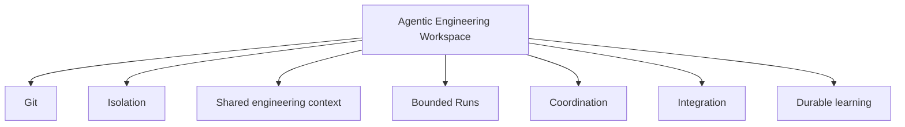
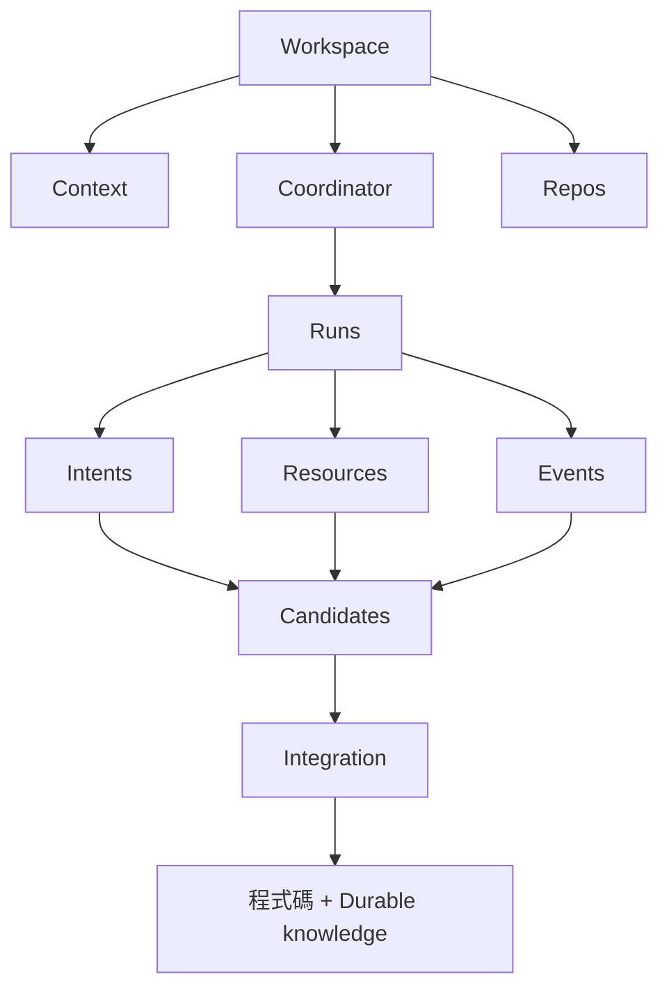
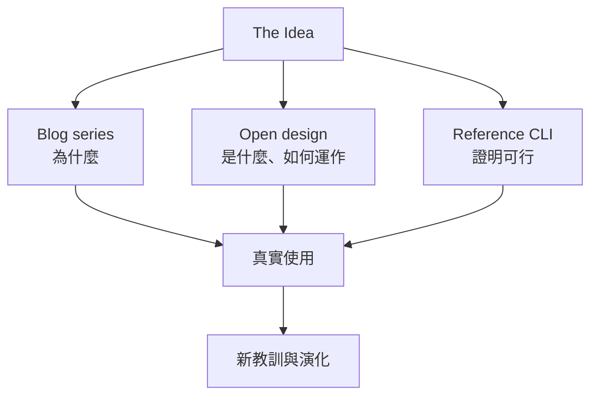
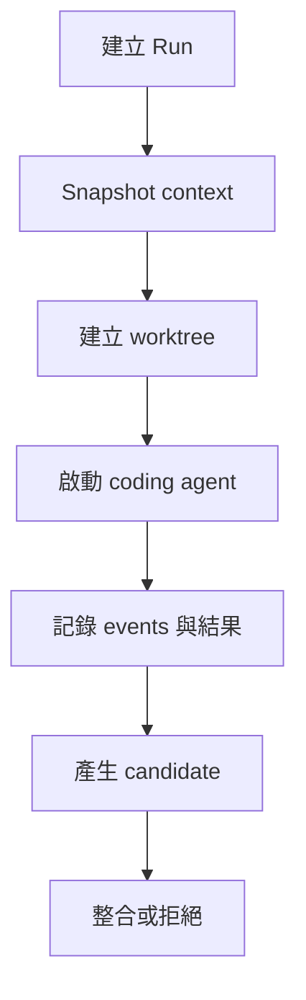
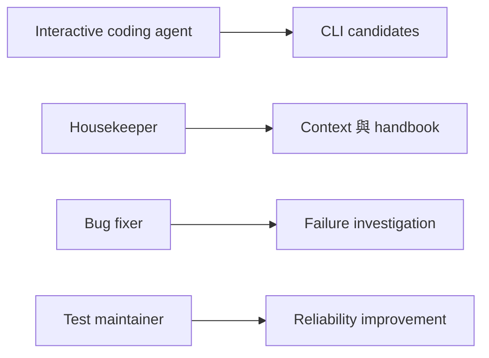

把前面幾次工作經驗整理到這裡，最直覺的下一步就是開始寫 CLI。

我已經可以想像 `ws run` 幫 agent 建 worktree，`ws status` 列出所有 Run 和 port，接著再加 scheduler、dashboard、Docker runtime、knowledge graph。從工程師角度看，直接寫 code 很有吸引力，因為每天都會看見具體進度。

可是如果現在就做，我很可能只是把第一個 implementation 的形狀，誤當成整個 idea 的邊界。

真正值得公開的不是一組 command，而是這一路從實際工作長出來的 patterns、trade-offs 與 failure modes。

> Architecture 是產品；CLI 只是其中一個 reference implementation。

## 這不是 Multi-agent Framework

「Multi-agent framework」很容易讓人想到 planner、subagent、message bus、swarm 與 agent-to-agent protocol。

我真正想處理的問題比較樸素：

> 如何建立一個可以長期使用的本機工程工作區，讓人與 coding agent 能安全地對同一套軟體系統工作？

核心不在 agent 有多聰明，而在它工作的環境是否可靠：



只有一個 agent 也能使用；換成不同 agent CLI 也不該推翻整個設計。

## 從真實問題長出來的架構



每個 concept 都不是為了湊架構圖：

- **Workspace**：Repo 不再包含完成任務所需的全部脈絡與暫時狀態。
- **Context / mutation scope**：Agent 需要廣泛理解，卻只應在清楚範圍內修改。
- **Run**：每次嘗試要有輸入、隔離 worktree、生命週期與輸出。
- **Intent**：並行工作需要可見性，不需要共享每一段內部推理。
- **Resources**：檔案隔離之外，process、port 與 service 也必須有 owner。
- **Candidate**：Agent 完成 execution，不等於系統已接受變更。
- **Events / knowledge proposals**：留下有用經驗，不保存整份 agent transcript。
- **Integration**：rebase、test、review、接受或拒絕都在明確 gate 發生。

## 先定義 principles，再選工具

我會把這套 architecture 的核心原則寫成：

1. Task 建立 Workspace boundary；Repo 保留自己的長期 ownership。
2. Context scope 和 mutation scope 分開。
3. 一次 agent 嘗試是一個 bounded Run。
4. Agent 交付 candidate，不直接把自己的結果當成已整合。
5. Private plan, public intent。
6. Execution 和 integration 是不同階段。
7. Telemetry 先整理驗證，才提升成 durable knowledge。
8. Worktree、SQLite、Markdown 與 local process 都只是可替換 default。

這些原則才是別人不使用我的 CLI 也能帶走的東西。

## Blog、Open Design、CLI 是同一件事的三個視角



Blog 用故事說明問題怎麼出現；technical site 應該是一份 living architecture handbook，不是把 Blog 重新排版；CLI 則是 executable documentation，證明這些 pattern 能用於日常工作。

Technical handbook 可以分成五個主要區域：

- **Concepts**：Workspace、Run、Intent、Candidate、Event、Resource 等概念的 ownership 與 lifecycle。
- **Patterns**：one agent/one repo、read-many/write-one、concurrent runs、scheduled housekeeper、crash recovery。
- **Decisions**：為什麼選 worktree、為什麼不保存完整 telemetry、為什麼 integration 分開。
- **Extensions**：Docker、VM、Redis、外部 scheduler、不同 agent runtime 與 integration policy。
- **Limitations**：第一版刻意不處理什麼。

ADR 改變時用 superseded 保留歷史，正好實踐這個 project 自己主張的 durable reasoning。

## Principle 和 implementation choice 要分開

Default 可以是 worktree，但團隊可以換成 Docker、devcontainer、Nix 或 VM。

Default coordinator state 可以用 SQLite，也可以由另一套 implementation 使用 Redis 或 daemon。

Agent runtime 的最小介面可以只是：

```text
run(prompt, cwd, env)
```

底下接 Codex CLI、Claude Code、Copilot CLI、Gemini CLI、OpenCode 或 custom script 都可以。

Default integration 是 rebase、test、merge；公司團隊也可以要求 PR、CI gate、security scan 與人工核准。Knowledge 預設用 Markdown，規模變大再加 search index、database 或 external KB。

Concept 穩定，mechanism 可替換，architecture 才真正開放。

## 清楚說出第一版不做什麼

第一版要解決的是 local workspace、一個或多個 Repo、一個或多個 agent、worktree isolation、runtime coordination、scheduled role、durable knowledge 與 candidate integration。

它不應宣稱解決：

- 多台機器上的 distributed agents
- global locking
- atomic multi-repo transaction
- production orchestration
- untrusted-agent sandboxing
- universal agent communication protocol

這些可以是 extension path，但不能藏在模糊承諾裡。

## Reference CLI 第一版應該刻意很小

```bash
ws init
ws repo add ../frontend
ws run codex "Fix authentication refresh"
ws status
ws integrate R42
ws clean R42
```

只要先證明最核心的 lifecycle：



一個 Run 穩定後，再做並行、port allocation 與 intent registry。Scheduled engineering 可以再下一階段加入，而且先借用 OS timer，不急著自己做 daemon。

Workspace、Run、Event、Candidate、Agent Profile 的 schemas 也很重要。它們讓 specification 和 CLI implementation 分開，別人可以不用相同程式語言與 command structure，仍然實作同一套概念。

## 用自己的架構維護自己

最有說服力的做法，不是宣布 architecture 已經完美，而是 dogfood：讓 reference CLI 專案本身就在這個 Workspace 裡開發。



真實使用九十天後，我們才有資格回答：衝突多常發生？哪種 context 真正有用？多少 knowledge proposal 被採用？Crash cleanup 哪裡最脆弱？哪些 concept 其實太重？

這些資料可以成為第二季 Blog，而不是一開始就用口號聲稱 multi-agent 未來已經到來。

## 我在工作上學到的事

我一開始只是想替 coding agent 加上更安全的 branch、更多 context、平行執行和可保存的知識。一路遇到的問題，最後都指向同一個缺口：我們缺少一個適合人與 agent 長期合作的 Workspace model。

所以我的目標不是：

> 打造最強的 multi-agent coding orchestrator。

而是：

> 公開一套能組合、能替換、能說明 trade-off 的 agentic engineering workspace patterns，並用一個刻意簡單的 reference implementation 證明它能處理真實軟體工作。

有人只拿走「一個 agent 一個 worktree」就很有用；有人會加 Docker；有人會用公司既有 scheduler 與 knowledge store；也有人完全不碰這套 CLI。

這不是失敗，而是 open design 的目的。

真正有價值的是 architecture。CLI 只負責讓它跑起來。

回到系列起點：[Coding Agent 重新定義了什麼是工作區](/zh-hant/posts/coding-agents-changed-what-a-workspace-means/)。
