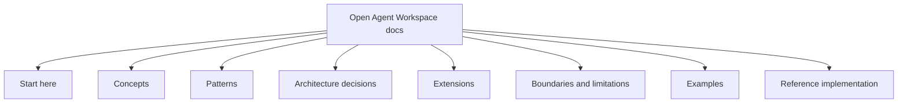
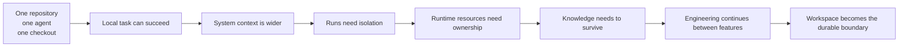
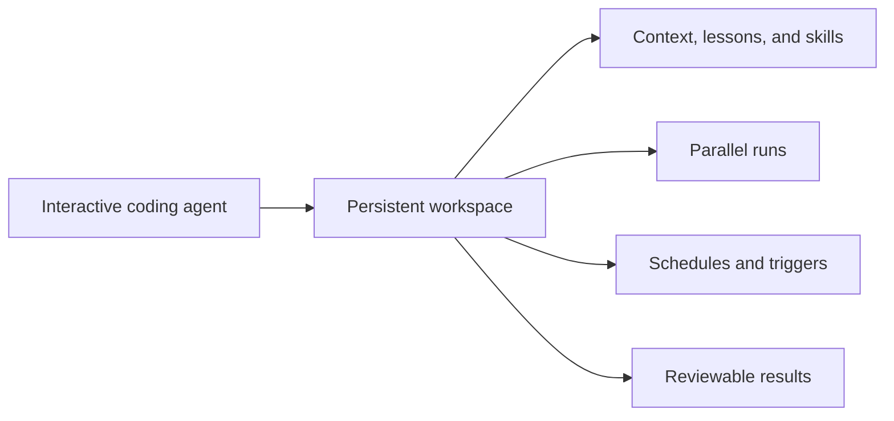
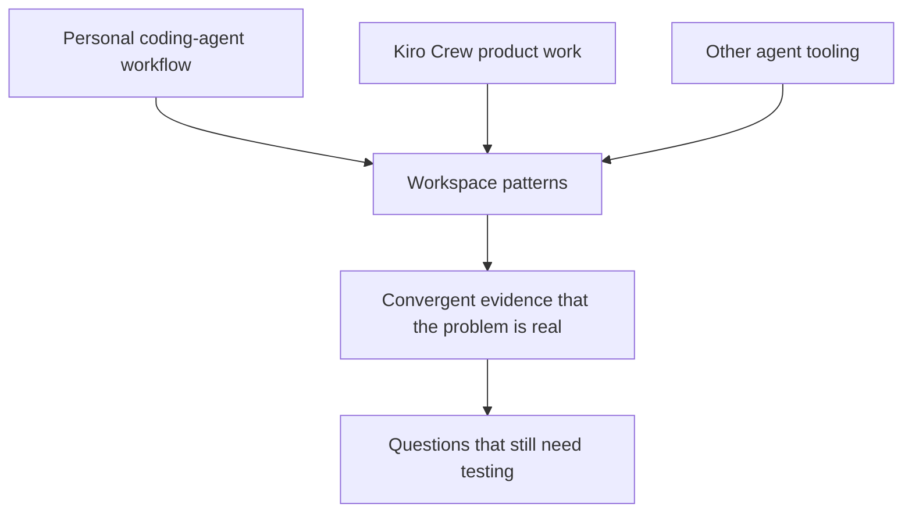
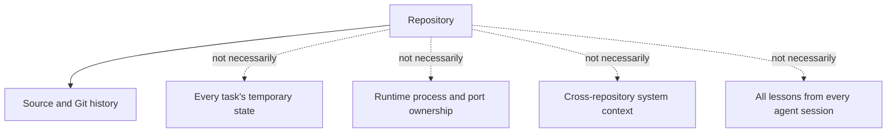
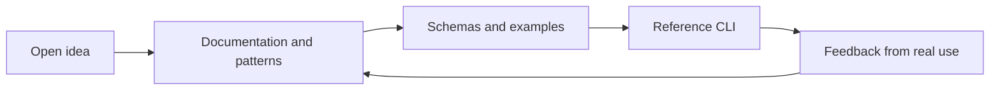

上一篇文章寫完時，我說了一句自己其實還沒有完全做到的話：

> Architecture 是產品；CLI 只是 reference implementation。

這句話很好寫，真正把它做出來就沒那麼容易。

過去一段時間，我把很多東西放在自己的筆記、圖表和對話裡：coding agent 需要的不只是 Repo；每個 task 應該有自己的 Workspace；Run 要隔離；context 可以共用，但 private plan 不必公開；candidate 要經過 integration；真正值得留下的 lesson，要能活過一次 session。

只在自己的筆記本裡相信這些想法，其實很舒服。它們可以很有方向感，卻不必面對別人的追問。

所以這次我做了一件比較正式的事：建立 [Open Agent Workspace GitHub organization](https://github.com/open-agent-workspace)。裡面放了 [documentation 與 field guide](https://open-agent-workspace.github.io/doc-pages/)、[reference implementation](https://github.com/open-agent-workspace/reference-implmentation)，以及一個 [example workspace](https://github.com/open-agent-workspace/example-workspace)。

想法在還沒有完成以前，就先有了公開的家。

## 一公開，概念就必須長出邊界

私人筆記裡的「Workspace」，可以同時指資料夾、dashboard、monorepo、雲端帳號，或 agent 的記憶。公開之後，這些含義不能再全部混在一起。

我做的 documentation site 沒有把自己包裝成 CLI manual，而是整理成一份 field guide：



這個結構把不同層次分開：Concepts 命名需要被討論的東西；Patterns 說明如何組合；Decisions 留下選擇與取捨；Extensions 說明哪些地方可以換；Boundaries 誠實交代第一版不做什麼；Examples 則把抽象概念拉回可操作的情境。

Blog 負責說明「我為什麼走到這裡」，field guide 則希望讓一個沒有參與前面討論的人，也能直接使用這套語言。

## 我現在最小、也最確定的主張

我不是說每個工程師都需要一個很大的 multi-agent 平台。比較小、但我越來越確定的主張是：

> 一個 coding agent 被放進一個 Repo、使用一個沒有清楚邊界的 checkout，通常不足以處理真實系統工作。

原因很實際：它可能要讀相鄰 Repo、service contract、部署設定和操作筆記，但只應該修改一個 primary Repo；它需要自己的 worktree，不能覆蓋人還沒完成的變更；兩個 agent 即使檔案分開，仍可能搶同一個 port 或 database；一次對話裡的發現，也不該只能靠整份 transcript 才能交給下一個 Run。



這不是為了把 Repo 貶低。Repo 依然是保存程式碼與歷史的好地方，只是不是每種工程狀態都適合塞進去。

## 然後我遇到了 Kiro Crew

文件公開後，我看到 [Kiro Crew](https://kiro.dev/crew/)。第一個反應不是「這和我不一樣」，而是「這個形狀好熟悉」。

Kiro Crew 的官方頁面把自己描述成 persistent、open-source 的 development workspace：它會跨 session 保留 context，讓 lessons 和 skills 延續，支援 parallel agents、排程與 triggers，也提供 Apps 與多層防禦的執行安全模型。

這和我前面整理的 Workspace、Run、Context、Intent、Candidate、Event、Resource、Integration，並不是表面上都用了「agent」這個字而已；它們面對的是相近的工程壓力。



但相似不等於相同。

Kiro Crew 是一個有完整產品介面、runtime、預設行為與開源實作的產品；Open Agent Workspace 目前是開放 architecture 加上刻意小型的 reference implementation。我不打算和 Kiro Crew 競爭，也不需要假裝兩個 project 在做同一件事。

我們只是看向相近的方向。

## 收斂是證據，不是勝利宣言

剛把自己的想法公開，就遇到相近的產品，心情多少有點複雜。可以很快陷入「是不是有人抄了」或「那我的想法是不是沒用了」這兩種反應。

我覺得更健康的解讀是 convergence：不同的人從不同工具和工作流程出發，最後都碰到同幾個邊界。



這不代表每個 pattern 都已經正確，也不代表 persistent memory、parallel runs 或某種 security layer 在所有團隊裡都是最佳答案。

它只說明一件很重要的事：

> 「把 agent 丟進 Repo 就好」正在變成一個不完整的 mental model。

這對我來說已經是很有價值的確認。

## Repo 沒有消失，只是它不再獨自承擔全部責任

Repo 很適合保存 source code、Git history，以及團隊決定要長期維護的檔案。它本來就不一定適合保存：



所以 Workspace architecture 的工作，不是把所有東西都塞進另一個超級 Repo，而是把責任分開：

- Repo 保留自己的 boundary 和 history。
- Workspace 組合跨 Repo 的 context。
- Run 擁有一次 bounded attempt。
- Worktree 把 candidate 遠離人的 checkout。
- Coordinator 記錄 intent 與 resource ownership。
- Events 說明發生了什麼。
- Knowledge proposal 只提升已確認的 lesson。
- Integration 決定什麼才進入系統。

Kiro Crew 用更完整的產品面來處理相同的大方向；我的 project 則刻意把設計語言、trade-offs 和可替換的 implementation choice 放在前面。

## Open source 讓「誰擁有什麼」變得更清楚

如果這只是一個私人工具，我很容易把 CLI 說成全部成果。現在公開成 organization，層次反而清楚了：



Organization 不是在宣布 reference implementation 是 canonical implementation。它是一個可以被閱讀、質疑、fork 和重新實作的地方。

這種 portability 很重要。有人習慣 Codex CLI，有人用 Claude Code、Kiro、Copilot CLI、OpenCode 或 custom runtime；有人需要 worktree 和 local process，有人必須使用 container 或 VM。只要 Workspace、Run、Candidate 這些概念仍然清楚，底下的工具就可以不同。

## 下一步不是追產品功能數量

我現在想做的不是追上 Kiro Crew 的 feature list，而是讓 reference path 經得起真實使用。第一個 CLI slice 仍然很小：

```bash
ws init
ws repo add ../frontend
ws run codex "Fix authentication refresh"
ws status
ws integrate R42
ws clean R42
```

Documentation 會隨 implementation 修正，implementation 也會用真實工作檢查 documentation。Coding Run 產生 candidate，housekeeping Run 維護 context，遇到 failure 就留下下一個 architecture decision 的 evidence。

這樣架構才有機會真正學習，而不是只停在好看的 diagram。

## 我從這次比較裡帶走的教訓

Kiro Crew 沒有讓 Open Agent Workspace 變得多餘，反而讓問題更容易被看見。

當兩個 project 獨立走到相近結論時，我不需要急著決定誰是贏家。我更想問：哪些 boundary 都被我們遇到了？哪些 trade-off 不一樣？哪些是 principle，哪些是 product decision？別人能不能只採用 pattern，而不必採用原本那套 code？

目前最清楚的答案是：coding agent 需要一個比 checkout 更大、比 prompt 更有結構的工作場所。

它需要 context、isolation、runtime coordination、integration，以及能被檢查、修改、逐步累積的 memory。

這個地方不必是一個產品。

它可以是一套開放的 pattern language。

我很高興這個 idea 現在有了一個公開的家，也很高興看到其他 builders 朝相同的 horizon 前進。目標不是搶下一個 category，而是讓下一個 category 變得可以被清楚討論。

可以先讀 [Open Agent Workspace field guide](https://open-agent-workspace.github.io/doc-pages/)，再看看 [Kiro Crew](https://kiro.dev/crew/)。當 principles 和 implementations 都攤在陽光下，這場對話才真正有意思。
