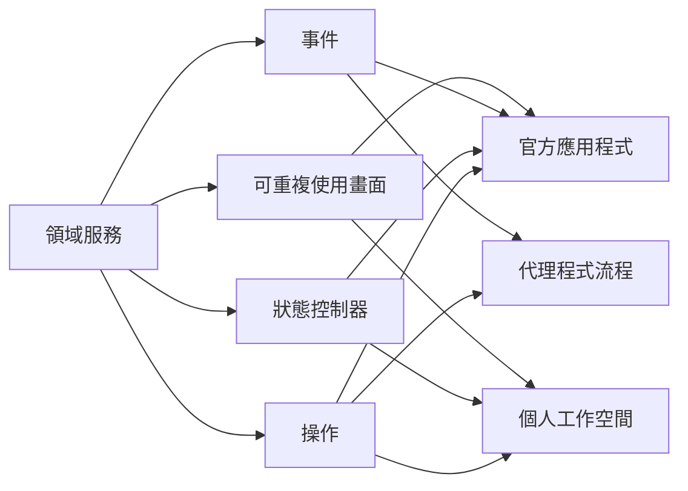

軟體通常以一套完整應用程式的形式交付。

```text
應用程式
├── 使用者介面
├── 商業邏輯
├── 資料
├── 整合
└── 執行環境
```

供應商決定這些部分如何組合。使用者使用做好的產品，或許能安裝一些擴充功能、調整幾項偏好，但應用程式仍是最主要的邊界。

這個邊界方便開發、銷售、保護與支援軟體，卻不太符合人們思考工作的方式。

很少有人一天開始時，心裡想的是「使用 Gmail」、「使用 Calendar」或「使用 GitHub」。人想做的是準備會議、規劃旅行、研究主題、審查軟體變更，或弄清楚有哪些事情需要注意。應用程式只是這些活動裡的工具。

但今天的電腦仍要求使用者，把每一個目標翻譯成一趟穿梭於不同供應商產品之間的旅程。

軟體架構的下一個重大轉變，可能是讓產品不只在內部模組化，也能在**外部被重新組合**。重要能力、狀態、語意與畫面會成為受支援的組合邊界。官方應用程式依然存在，卻不再是唯一正統體驗，而是一套參考組合。

因此，軟體的未來可能不再只有一個標準應用程式。

## 應用程式反映供應端，比反映使用者意圖更多

今天的應用程式邊界，大多跟著組織分工與產品歷史形成。

```text
Chrome
Gmail
Calendar
Slack
GitHub
```

每套產品掌握一個連貫領域，這很有價值。Gmail 理解郵件、討論串、標籤、寄送與垃圾郵件；Calendar 理解活動、重複規則、出席狀態與空閒時段；GitHub 理解儲存庫、提交、合併請求、檢查與審查。

但使用者的目標會跨越這些領域：

```text
準備一場會議
├── 查看行事曆活動
├── 找出相關郵件討論串
├── 審閱連結的文件
├── 確認專案尚未解決的決定
└── 摘要近期團隊討論
```

沒有任何一套應用程式理所當然地擁有「準備這場會議」這件事。這個意圖單位比每項產品都大，卻又比使用者整台電腦小。

在現有模式下，整合工作落到使用者身上。他們得在不同工具裡找到名稱不完全相同的同一個專案、反覆重建情境、在畫面之間複製資訊，還要記得哪一套系統才是每種資料的權威來源。

以意圖為核心的環境，可以保留專業服務的優點，同時圍繞工作來組合它們的能力：

```text
我的工作空間
├── 郵件能力
├── 行事曆能力
├── 瀏覽器能力
├── 團隊通訊能力
├── 原始碼管理能力
└── AI 能力
```

這會把產品關係從：

```text
服務 = 產品 = 應用程式 = UI
```

改變成：

```text
服務
  ↓
能力與語意模型
  ↓
可重複使用的狀態與畫面
  ↓
多種可能的應用程式
```

服務仍然存在，應用程式也仍然存在，只是不再被迫成為同一條邊界。

## 瀏覽器揭露了缺少的那一層

想像你想要一套完全不同的瀏覽器體驗。

你不要分頁，而要用專案整理。每個專案應該收集網頁、PDF、郵件、筆記與研究問題。AI 要保留真正有用的瀏覽情境、捨棄過程中偶然經過的頁面，並顯示還沒釐清的主張。瀏覽記錄應該變成研究軌跡，而不只是一張按時間排列的網址清單。

你想重新設計的是瀏覽工作如何組織，並不想重新實作：

- HTML 與 CSS 畫面呈現。
- JavaScript 執行。
- 網路與 TLS。
- 媒體解碼。
- 沙箱與網站隔離。
- 權限與身分。
- 無障礙基礎設施。
- 經過多年強化的瀏覽器安全機制。

今天可行的選擇很有限。瀏覽器擴充功能可以修改部分體驗，卻仍得活在主程式的模型裡；替代外殼可以嵌入現有引擎，但會繼承龐大的整合與發佈負擔；完整分支雖然控制力最高，維護成本也極為驚人。

想要的產品邊界，與可使用的技術邊界並不吻合。人想替換的是瀏覽器體驗，平台卻往往要求他替換或繞過整套瀏覽器應用程式。

更可組合的瀏覽器，可以提供穩定能力，例如：

```text
導覽
頁面呈現
瀏覽記錄
工作階段
下載
權限
身分
DOM 存取
媒體
```

這些能力可以由不同供應商實作，再由不同外殼排列。官方瀏覽器仍是最完整、測試範圍也最廣的組合；研究工作空間、無障礙優先瀏覽器、兒童安全瀏覽器與專用企業用戶端，則能重複使用困難的引擎，不必從頭打造。

同樣缺少的那一層，也出現在郵件、行事曆、文件編輯器、協作工具、媒體應用程式與作業系統中。我們通常能讀取它們的資料，卻無法重複使用足夠多的行為，打造真正一流的替代體驗。

## API 提供操作，卻沒有提供應用程式

談到可組合性，最常見的答案是：提供 API。

傳統 API 可能提供這些操作：

```text
listEmails()
sendEmail()
getEvents()
createEvent()
```

這些能力不可或缺，卻遠遠不夠。

一套真正好用的郵件或行事曆體驗，還需要驗證身分、同步、快取、預先更新畫面、分頁、搜尋行為、草稿狀態、衝突處理、資料驗證、權限、離線行為、通知、錯誤復原與無障礙互動模式。

API 交給開發者一批食材，卻沒有充分降低蓋廚房的成本。

要讓軟體能從外部組合，可能需要提供多層可重複使用的能力：

```text
第 1 層 — 原始資料 API
第 2 層 — 語意操作
第 3 層 — 無頭控制器與狀態
第 4 層 — 可嵌入 UI 元件
第 5 層 — 完整參考應用程式
```

每一層支援不同程度的控制。

在第 1 層，開發者擁有最大的彈性，也得承擔大部分產品責任。第 2 層讓操作反映領域概念與影響，而不是長得像資料庫端點。第 3 層提供生命週期與狀態，卻不規定像素如何排列。第 4 層讓困難的互動可以安全重複使用。第 5 層則提供多數使用者一套完整、連貫的產品。

這個階梯不是成熟度評分。有些能力不應該開放全部五層。涉及安全的確認流程，可能刻意要求使用供應商提供的元件；一項本機文字轉換，或許只需要一個函式。重點是不要假設只有原始端點和完整應用程式兩種有用選擇。

## 無頭應用程式應該提供什麼

「無頭」這個詞已常用來描述內容管理與電商系統：後端能力不再和固定商店或網站綁在一起。同一個觀念也可以延伸到日常應用程式。

無頭行事曆不只會回傳活動資料，也可以提供：

- 活動與參與者的領域模型。
- 搜尋、空閒時段、重複活動與排程操作。
- 具備快取與衝突處理的同步狀態控制器。
- 權限與確認中繼資料。
- 可重複使用的議程、活動編輯器與空閒時段畫面。
- 回報權威狀態變更的事件。
- 一套完整行事曆，作為參考組合。

無頭郵件服務可以提供討論串狀態、草稿、搜尋、寄送生命週期、附件、身分、垃圾郵件判定，以及可信任的撰寫或收件者元件。無頭協作服務則可以提供頻道、對話、上線狀態、提及與通知政策，而不要求每項互動都發生在官方用戶端裡。

「無頭」可能有點誤導，因為供應商仍然可以提供大量 UI。重要的特性，是產品在能力與體驗之間有一條受支援的接縫。



官方應用程式證明這些層次足以組成完整體驗，其他組合則能依需求，決定要重複使用多少。

## 外部可組合性需要明確契約

軟體在內部模組化，是為了幫助開發團隊改變實作。外部可組合性，則是讓其他人不必依賴私有程式碼或偶然形成的行為，也能打造不同體驗。

這需要比多數內部模組更強的契約。

### 能力契約

操作需要穩定名稱、明確型別的輸入、已宣告的輸出，以及有意義的錯誤。更重要的是，契約要描述操作的影響：它會讀取還是變更狀態、是否跨越網路或組織邊界、能否復原、是否花錢，以及是否需要確認。

### 語意契約

資料需要超越語法的意義。單位、關係、敏感性、權威性、新鮮度與出處，可以幫助人、代理程式和介面一致解讀同一份資訊。

### 狀態契約

可組合用戶端需要狀態快照、訂閱、預先更新、衝突語意與復原能力。缺少這些機制，每個用戶端都會發明一套略有不同的現實。

### 畫面契約

可重複使用元件需要宣告輸入、輸出、支援動作、無障礙行為、尺寸限制、主題邊界與可序列化狀態。小工具能放進 iframe，不代表它真的可以重複使用。

### 信任契約

無論哪一套介面要求執行動作，服務都必須自行檢查身分與授權。主機應清楚顯示能力或畫面由哪個供應商提供。權限必須範圍小、看得見，而且可以撤銷。

### 生命週期契約

版本會變，工作可能比視窗活得更久，連線可能失敗，供應商也可能消失。組合平台需要取消、重試、相容性協商、移轉與漸進式降級機制。

這些契約，是生態系與一群展示作品之間的差別。外部使用者無法依靠設計會議、內部部署協調與共同假設，像同一套產品程式碼那樣把所有東西黏在一起。

## AI 改變了整合的經濟條件

可組合軟體並不是新的技術可能。數十年來，Web、命令列管線、外掛、自動化平台、元件系統與服務 API，都提供了各種組合方式。

真正的限制經常是成本。

仍然需要有人理解多套系統、管理憑證、對應資料結構、撰寫轉接程式、協調狀態、建立 UI、處理錯誤，並長期維護成果。對熱門商業整合來說，這些工作可能值得；若只是某一個人偏好的工作空間，通常就不划算。

程式代理可以降低這項成本。

使用者或許只要說：

> 幫我做一個工作空間，左邊顯示今天的會議，中間顯示相關郵件，右邊則放相關團隊討論。

代理程式可以完成大部分機械式組合作業：

```text
探索能力
↓
檢查語意契約
↓
選擇可信任元件
↓
產生轉接程式與黏合程式碼
↓
測試組合後的工作流程
↓
封裝個人應用程式
```

這是 AI 比在現有產品上加一個聊天機器人更深遠的角色。代理程式不只是一種新介面，也讓過去成本不合理的介面與工作流程，變得有可能實現。

結果可能是一種個人軟體：應用程式的範圍窄到只為一個人或團隊服務，卻由持續維護的服務組成，而不是全部從零開始打造。

AI 不會消除契約的重要性，反而會讓契約更加必要。產生黏合程式碼很容易，要信任它卻很難。如果代理程式要安全組合服務，就需要機器可讀的影響、權限、測試案例、相容性規則與出處。

## 為什麼供應商可能抗拒這個未來

最大的阻礙也許不是技術。

標準應用程式讓供應商掌握品牌、營利方式、功能探索、遙測、支援與產品差異。如果客戶能把體驗移到別處，服務就可能變成可互換的後端。

可組合產品也會擴大支援問題。當第三方介面錯誤呈現狀態，該由誰負責？使用者自備用戶端時，使用量該如何計價？誰可以呈現帶有商標的流程？如何辨識不安全或品質低落的元件？如果供應商修改了幾千套個人生成工具都在使用的契約，又該怎麼辦？

保留緊密邊界也有正當理由。詐騙防制、法規揭露、隱私、內容完整性與高影響操作，可能需要由供應商控制互動。不是每一條接縫都應該公開。

因此，現實的未來不太可能是完全拆散，而會是選擇性可組合：

- 服務廣泛開放低風險的讀取與整理能力。
- 高影響動作帶有更嚴格的影響與確認契約。
- 部分流程採用供應商提供的可信任元件。
- 官方應用程式仍是支援工作的基準。
- 商業模式針對有價值的能力收費，而不只對畫面存取收費。

如果供應商把可組合性當成一個真正的產品介面，而不是勉強維護的 API，即使使用者沒有開啟完整應用程式，它的能力仍有機會出現在更多工作流程裡。

## 從應用程式走向能力平台的實際路徑

多數產品不應一開始就把整套內部架構公開。可以從更小的範圍起步。

先挑一個明顯跨越應用程式邊界的流程。會議準備、事故處理、客戶檢討、旅行規劃與研究整理都是好選擇，因為使用者本來就得手動整合。

接著找出一小組領域能力與物件，給它們穩定身分，描述動作效果與權限需求，並在資料新鮮度重要時，提供變更事件或訂閱。

下一步，抽出一個連官方應用程式本身也使用的無頭控制器。這會替狀態、載入、快取與錯誤建立真正受支援的邊界，而不是讓每個用戶端各自重新探索。

再來，為最困難的互動提供一兩個可重複使用畫面。它們的範圍要小，語意要豐富。第一步不需要建立完整設計系統。

最後，打造第二種組合。它可以是小型嵌入式工具、命令介面、無障礙優先用戶端或代理程式流程。第二個真正的使用者會暴露哪些契約可以重複使用，哪些只是複製官方應用程式裡的假設。

架構應該回應真實的組合壓力後才逐步通用化，而不是一開始就妄想成為包辦所有事情的作業系統。

## 讓軟體容易重新組合

傳統軟體工程重視模組化，因為它讓開發者更容易修改程式碼：

```text
內部模組化
→ 開發團隊可以改變產品
```

下一步，是把這項特質延伸到程式碼之外：

```text
外部可組合性
→ 使用者與其他軟體可以改變體驗
```

一套系統的內部邊界可以設計得非常漂亮，對外卻仍像一套無法拆開的應用程式。外部可組合性需要團隊決定：哪些內部概念值得成為穩定的公開能力，並接受隨之而來的工程與產品責任。

這不會讓應用程式失去價值。一套優秀的參考應用程式仍然不可或缺。它提供多數使用者精心設計的體驗、示範預期語意、提供復原管道，也把服務能力組成連貫的整體。

但供應商能提供的，不必只有一套「接受或離開」的產品：

> 這裡有我們的能力、語意模型、可重複使用元件與參考應用程式。你可以使用我們的體驗、把部分功能嵌入其他地方、讓代理程式操作，或自行組合。

這比客製化更深一層，因為改變的是最終體驗由誰擁有。

今天，應用程式大多屬於供應商，因此使用者如何與它互動也由供應商掌握。在更可組合的軟體世界裡，服務保留可信任的能力，使用者則逐漸擁有這些能力如何結合。

軟體的未來不是沒有應用程式，而是不再只有一個標準應用程式。

_兩篇系列：第 2 篇，共 2 篇 · 上一篇：[未來的 UI：不再只有一個標準介面](/zh-hant/posts/the-future-of-ui-is-no-single-canonical-ui/)_

## 延伸閱讀

- [分頁越開越多，真正的問題不是瀏覽器](/zh-hant/posts/05-the-tab-problem-and-app-centric-fragmentation/)
- [以工作流程為中心的 Workbench：讓一項工作有自己的位置](/zh-hant/posts/06-the-workflow-centric-workbench/)
- [讓工作空間真的能組合：一套共通語意框架](/zh-hant/posts/07-framework-for-composable-workspaces/)
