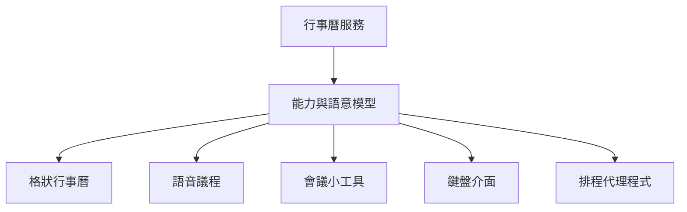

大多數軟體一開始，都默默接受一個假設：產品應該有一套正確的介面。

產品團隊決定導覽方式、資訊密度、互動模式與視覺層級。使用者或許可以換主題、重排儀表板或隱藏側邊欄，但整體體驗仍然固定。應用程式有一套標準 UI，所有人都得學著適應。

這一直都只是一種妥協。

視障使用者可能偏好有清楚結構、附帶精簡摘要的語音導覽；熟練使用者可能想要鍵盤優先的命令介面；分析師需要高密度表格與互相連動的圖表；外勤人員需要大型觸控區域，以及在網路不穩時仍能使用的精簡流程；管理者關心的則是例外與趨勢，而不是每一項作業細節。

要用同一套介面同時服務好所有人，幾乎不可能。

AI 帶來另一種可能。服務不必再把官方畫面當成產品本身，而可以提供能力、語意資訊與可信任的互動元件。不同介面再圍繞同一項底層服務自由組合。

我的論點不是 UI 會消失，而是：**未來的 UI，不再只有一個標準介面。**

## 同一項產品，不代表只能有一種體驗

以行事曆為例。傳統介面是一張格狀時間表，因為時間具有空間關係，也經常需要比較。想查看星期二下午是否排得太滿，或把會議挪動三十分鐘，格狀畫面非常有效率。

但同一套行事曆也能支援其他有用的體驗：

- 用語音唸出下一場約會和交通時間。
- 把精簡議程嵌在會議筆記旁邊。
- 不離開鍵盤，直接從命令選單建立活動。
- 在牆上螢幕只顯示會議室使用狀況。
- 由代理程式替多位參與者協調時間。
- 提供線性、低視覺密度的無障礙檢視。

這些都不是放諸四海皆準的行事曆 UI。它們只是同一組底層物件、動作、權限與狀態的不同投影。

今天，我們通常把這些投影看成次要整合。官方應用程式才算產品，其他都只是 API 用戶端、小工具、自動化，或為無障礙需求提供的替代方案。

可組合模式會反轉這個層級。行事曆服務仍掌握權威資料，但官方應用程式只是眾多受支援體驗中，一套完整而優秀的參考實作。



服務負責行事曆的真實狀態，卻不必擁有每一種接觸這些資料的方式。

## 無障礙與個人化正在匯流

無障礙功能經常以「調整預設視覺介面」的方式實作：為螢幕閱讀器加入標籤、支援鍵盤導覽、正確保留焦點、提供足夠對比，並確保狀態變化不只用顏色表達。

這些做法仍然不可或缺。走向可組合的未來，並不代表官方應用程式可以不做無障礙設計。

但這些做法背後還有一個更廣泛的原則：**服務的資訊與動作，不應被困在單一呈現方式裡。**

螢幕閱讀器本身就體現了這種分離。它把語意結構轉換成另一種感官體驗；語音控制則把口語意圖轉成操作。開關控制器、點字顯示器、畫面放大、字幕、減少動態效果與簡化版面，都是讓軟體適應人，而不是要求人適應預設介面。

當軟體能提供更豐富的語意結構，無障礙與個人化之間的界線就會逐漸模糊。

讓視障使用者用結構化語音瀏覽發票的同一項能力，也能讓駕駛只聽見緊急例外；支援輔助科技的語意標題，也能讓 AI 產生精簡的手機畫面；支援語音控制的命令描述，也能驅動鍵盤選單或自動化。

這並不代表每一項偏好都是無障礙需求，而是兩者都屬於更大的架構觀念：

> 服務提供意義與能力，使用者選擇合適的互動方式。

因此，無障礙不再只是對單一介面事後補強，也是軟體從一開始就應支援多種真正可用介面的理由。

## GUI 不會因為 AI 而消失

對話式 AI 興起後，一種簡單預測也跟著出現：也許聊天會取代應用程式。

當意圖比操作步驟更容易描述時，聊天確實很強大。「把明天的專案檢討移到下週所有人都有空的第一個時段」，就是很自然的要求。對話系統可以釐清模糊之處、蒐集情境，再協調多個操作。

但語言不是所有思考活動的最佳表達方式。

表格可以同時呈現二十個可比較數值；圖表能在使用者知道該問什麼之前，就顯示出趨勢；地圖保留空間關係；時間軸讓順序和持續時間一目了然；畫布適合直接排列物件；差異檢視可以精確呈現變更；表單則能在送出前顯示可選項目與限制。

若把這些全轉成文字，資訊密度會下降，記憶負擔卻會增加。使用者得連續提出多個問題，才能重新拼出視覺版面原本一眼就能表達的關係。

因此，未來不太可能是「沒有 UI」，更可能是不同互動方式之間的連續合作：

```text
描述想達成的結果
↓
查看相關物件
↓
直接調整細節
↓
要求系統說明
↓
核准或修改結果
```

AI 可以讓這些介面之間的轉換更流暢。它能選擇起始畫面、填入相關情境、解釋發生了什麼變化，也能在目前呈現方式不適合時，提供另一種表示方法。

圖形介面會繼續存在，因為人的認知仍包含視覺、空間、比較與身體操作，而不只有語言。

## 自備介面：Bring Your Own Interface

如果服務不再假設只有一種標準呈現方式，就可能出現一種新的產品模式：**自備介面（Bring Your Own Interface）**。

使用者可以選擇官方應用程式、安裝第三方用戶端、在其他工作空間嵌入小型畫面、使用輔助介面，或請代理程式組裝一套私人專用體驗。同一個人在不同時刻，也可能採用其中好幾種方式。

更小的版本是「自備小工具」（Bring Your Own Widget）。使用者不必替換整套應用程式，而是圍繞一個目標，組合有明確邊界的畫面：

```text
早晨工作空間
├── 今天的會議
├── 重要郵件
├── 等待審查的合併請求
├── 相關團隊討論
├── 財務摘要
└── 與進行中專案相關的新聞
```

沒有任何一家供應商理所當然地擁有這個工作空間，因為使用者的一個早晨，本來就不會落在單一廠商的邊界裡。郵件、行事曆、原始碼管理、通訊、財務與新聞仍是不同服務，但它們的畫面可以共同參與同一種體驗。

這不只是一張由彼此隔離的小方塊組成的儀表板。當使用者選取一場會議，郵件與討論小工具應該理解相關參與者和專案；當某個合併請求變得緊急，注意力安排也應跟著改變；當使用者執行動作，原始服務仍應保有該領域的最終權威。

工作空間屬於使用者，而每一項服務繼續負責自己領域的完整性。

## 生成式 UI 應該組合意義，而不是即興排列像素

AI 很容易讓人產生一種衝動：每次收到要求，就生成一套全新的介面。展示時很驚艷，日常使用卻會令人筋疲力盡。

如果控制項的位置、文字和後果持續改變，使用者就無法建立可靠習慣；無障礙測試也會失去確定性；牽涉安全的動作可能在沒有適當警告時出現；生成的按鈕看起來熟悉，實際執行的卻可能是意料之外的高影響操作。

更安全也更實用的生成式 UI，通常是**從受治理的基礎元件組合而成**。

服務或可信任的元件庫可以提供：

- 已宣告欄位、選取行為與無障礙導覽方式的資料表格。
- 理解幣別、格式、敏感性與驗證規則的金額欄位。
- 穩定顯示範圍、後果與可復原性的核准卡片。
- 保留事件出處的時間軸。
- 具有穩定互動語意的地圖、編輯器、差異檢視器或圖表。

AI 負責選擇和排列元件、綁定資料，並依任務調整資訊密度；元件則保留經過測試的行為，也清楚傳達資料與動作的意義。

這就是「生成 HTML」與「組合體驗」之間的差別。HTML 描述元素；語意元件描述元素代表什麼、保存哪些狀態、可以要求哪些動作，以及這些動作帶有什麼風險。

## 介面需要語意契約

如果要讓多種介面都維持可信，服務提供的就不能只有欄位名稱和 API 端點。

想像一個名為 `amount` 的數值。從資料型別幾乎看不出它的用途。介面還需要知道它代表澳幣、包含財務資訊、接受兩位小數，而且在轉帳變更金額前必須再次確認。

```json
{
  "name": "amount",
  "type": "number",
  "semanticType": "money",
  "currency": "AUD",
  "sensitivity": "financial",
  "confirmationRequired": true
}
```

重點不在這份結構的確切格式，而是組合需要在不同參與者之間共享意義：

```text
人 ↔ GUI ↔ 語音 ↔ 代理程式 ↔ 自動化
```

這份契約可以包含物件身分、標籤、單位、關係、可用動作、變更效果、權限需求、驗證、出處與呈現提示。有些資訊是維持正確性的必要條件，有些則協助主機選擇更有用的呈現方式。

AI 代理程式因此能理解「轉出全部金額」會造成財務後果；視覺介面能正確格式化數字；語音介面能把幣別唸出來；自動化則能套用相同驗證。介面不同，意義一致。

## 使用者擁有介面，也會帶來新的風險

把體驗的所有權移向使用者，不會自動帶來自由，反而會產生困難的產品與治理問題。

**一致性可能破碎。** 如果每個工作空間都完全不同，使用者可能失去熟悉的導覽方式，支援文件也難以適用。共通元件慣例與可隨時復原的預設介面仍然重要。

**惡意介面可能欺騙使用者。** 第三方小工具可以錯誤標示動作、隱藏關鍵情境，或索取過多權限。服務本身必須執行授權檢查，主機則要清楚顯示能力或畫面由誰提供，以及它要求哪些權限。

**生成的體驗也可能排除部分使用者。** 未經測試的個人化介面，可能產生混亂的鍵盤順序、難以理解的語音通知、對比不足或認知負擔過高的版面。語意輸入能改善問題，品質仍需要實際評估。

**可攜性可能暴露敏感情境。** 把郵件、行事曆、程式碼與財務放在同一個工作空間，可能透露比任何單一應用程式更多的資訊。存取權應限於明確目的，可以撤銷，也要按元件隔離。

**供應商仍需要一套連貫的預設體驗。** 多數使用者不會自己設計介面。官方應用程式依然是重要的無障礙、可靠參考組合，也是在自訂體驗故障時的復原管道。

所以，「沒有唯一標準 UI」不等於「不需要設計」。正因為多種體驗都要安全地投影同一項服務，反而需要更強的設計契約。

## 為多種可能而設計

軟體團隊不必先打造萬用介面平台，也能朝這個方向前進。

第一，把領域意義和呈現方式分開。為重要物件提供穩定身分，用領域語言描述動作，並把權限與驗證放在 UI 層之下。

第二，在可行之處，讓官方介面也使用相同能力。這能驗證組合邊界究竟是真正的產品邊界，還是只在享有特權的內部產品外圍，加上一套功能有限的公開 API。

第三，為難以安全重做的互動提供少量可重複使用畫面。付款服務可以提供可信任的確認元件，行事曆可以提供活動編輯器，原始碼平台可以提供差異檢視器。

第四，至少用兩種真正不同的互動方式測試。如果同一項能力能同時支援視覺工作空間，以及鍵盤或語音流程，而不必各自發明一套商業規則，這條語意邊界就可能真的有用。

最後，讓使用者改變體驗，卻不能讓介面悄悄改變事實。來源服務仍應保留身分、政策、出處與權威狀態。

## 從供應商擁有畫面，走向使用者擁有體驗

幾十年來，交付軟體通常代表交付一套介面，再要求使用者把工作整理進去。客製化雖然存在，範圍卻由供應商決定。

可組合 UI 會改變這種所有權模式。供應商提供可靠的應用程式，也提供足夠的能力與意義，讓其他體驗得以存在。使用者可以選擇高密度或平靜、視覺或語音、持久或短暫、官方或個人化的介面，而且常會在同一項工作中來回切換。

最後得到的不是無限多套隨意產生的畫面，而是建立在共享能力之上，多種可信任的投影。

未來的 UI 不是沒有 UI，而是不再只有一個標準 UI。

_兩篇系列：第 1 篇，共 2 篇 · 下一篇：[未來的軟體：不再只有一個標準應用程式](/zh-hant/posts/the-future-of-software-is-no-single-canonical-application/)_

## 延伸閱讀

- [如何選擇合適的應用程式介面](/zh-hant/posts/01-choosing-the-right-application-interface/)
- [MCP Apps 與 AI 介面層](/zh-hant/posts/03-mcp-apps-and-the-ai-interface-layer/)
- [意圖優先，不等於未來只剩聊天視窗](/zh-hant/posts/08-intent-first-computing-and-future-ui/)
